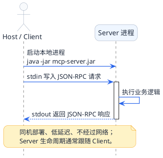
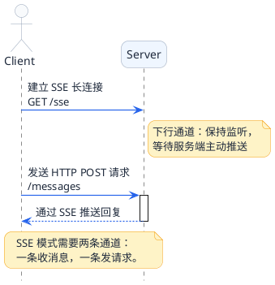
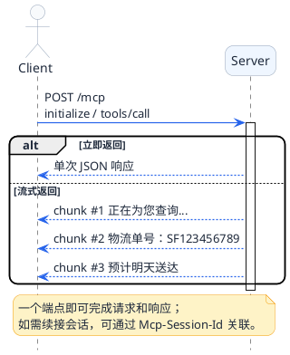
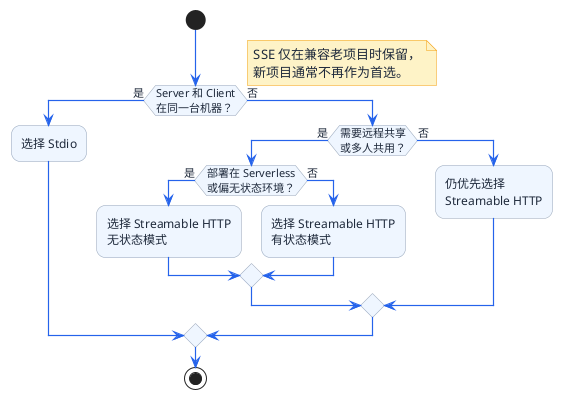

# 三种传输模式全面解读

上一篇讲的JSON-RPC解决了"说什么话"的问题——统一的数据格式。但光有话术还不够，还需要解决"怎么把话传过去"的问题。

这就像人类通讯方式的演进：
- 最早是**面对面交流**：两个人坐一起，说话直接听到
- 后来有了**电话**：隔着距离也能通话，但一次只能和一个人聊
- 再后来有了**即时通讯软件**：不仅能通话，还能发消息、发文件、建群聊

MCP的三种传输模式，正好对应这三个阶段的通讯方式。

## Stdio模式：面对面的高效协作

### 工作原理

Stdio是Standard Input/Output的缩写，就是标准输入输出。这是操作系统最基础的进程间通信方式。

还记得你在命令行里运行程序的场景吗？

```bash
$ echo "Hello World"
Hello World
```

你输入的命令是"标准输入"（stdin），程序打印出来的结果是"标准输出"（stdout）。

MCP的Stdio模式就是利用这个原理：
1. Client启动一个Server进程（比如运行一个jar包）
2. Client往Server的stdin写入JSON-RPC请求
3. Server从stdin读取请求，处理后把JSON-RPC响应写入stdout
4. Client从Server的stdout读取响应

整个过程不经过网络，数据直接在两个进程之间的管道里流转。

### 用同一办公室协作来理解

想象两个同事坐在同一个办公室里工作：

**传话筒场景**：小李需要小王帮忙查个数据



特点是：
- **距离近**：就在同一个房间，传递便签很快
- **一对一**：小李只能跟坐旁边的小王协作，不能跟其他办公室的人
- **生命周期绑定**：小王下班了，小李就没人可以请教了

### 配置方式

在支持MCP的客户端（比如Cursor）里配置Stdio类型的Server：

```json
{
  "mcpServers": {
    "office-tools": {
      "command": "java",
      "args": ["-jar", "/path/to/mcp-server.jar"]
    }
  }
}
```

Client启动时会自动运行这个命令，启动Server进程。

### 优势与局限

| 维度 | 说明 |
|------|------|
| 延迟 | 极低，不经过网络 |
| 安全性 | 天然安全，数据不出本机 |
| 配置复杂度 | 简单，不需要网络配置 |
| 部署方式 | 必须和Client在同一台机器 |
| 多Client支持 | 不支持，一个Server进程只能服务一个Client |
| 适用场景 | 本地开发、个人工具、Claude Desktop/Cursor插件 |

## SSE模式：客服热线式的远程通讯

### 工作原理

SSE是Server-Sent Events的缩写，是一种HTTP长连接技术，允许服务器主动向客户端推送消息。

但这里有个麻烦：SSE是单向的，只能服务器往客户端推，客户端没法通过同一个连接往回发。

所以MCP的SSE模式需要两条通道：
- **上行通道**：Client通过普通HTTP POST请求发送消息给Server
- **下行通道**：Server通过SSE长连接推送消息给Client

### 用客服热线来理解

想象你打电话给客服热线：



特点是：
- **两个渠道**：打电话接进去（SSE），发短信提问（HTTP POST）
- **保持在线**：电话不挂断，一直等着客服回复
- **可远程**：不需要去客服中心，在家就能咨询

### 配置方式

Server需要暴露两个HTTP端点：

```yaml
spring:
  ai:
    mcp:
      server:
        sse-endpoint: /sse              # 客户端建立SSE连接的地址
        sse-message-endpoint: /messages  # 客户端发送请求的地址
```

Client配置：

```json
{
  "mcpServers": {
    "remote-tools": {
      "type": "sse",
      "url": "http://server-host:8080/sse"
    }
  }
}
```

### SSE模式的痛点

虽然SSE实现了远程访问，但它有几个明显的问题：

**1. 双端点管理麻烦**

两个地址要分别配置和维护，容易配错。

**2. 连接不稳定**

SSE的长连接容易断。网络稍微抖一下、代理服务器清理空闲连接、服务端重启......连接就断了。而且没有自动重连机制，断了就要手动处理。

**3. 状态不好维护**

Client需要同时维护一个SSE连接（听消息）和一个HTTP客户端（发消息），两边的状态要协调好。

### 优势与局限

| 维度 | 说明 |
|------|------|
| 延迟 | 有网络开销，比Stdio慢 |
| 安全性 | 需要配置HTTPS |
| 配置复杂度 | 中等，需要管理两个端点 |
| 部署方式 | 可远程，Server可以部署在服务器上 |
| 多Client支持 | 支持 |
| 连接稳定性 | 较差，容易断连 |
| 适用场景 | 远程访问，但已被Streamable HTTP取代 |

## Streamable HTTP模式：现代化的智能客服系统

### 诞生背景

MCP团队意识到SSE模式的种种问题后，在2025年3月推出了Streamable HTTP模式。这是目前官方推荐的远程传输方案。

### 工作原理

Streamable HTTP的核心思想是"化繁为简"：**一个端点解决所有问题**。

Client向Server发送HTTP POST请求，Server可以选择：
- 立即返回完整响应（普通HTTP）
- 返回流式响应（分块传输，Chunked Encoding）
- 返回SSE流（需要持续推送的场景）

不再需要分开的上行和下行通道，一个POST请求搞定一切。

### 用智能客服系统来理解

想象一个现代化的智能客服系统：



特点是：
- **统一入口**：一个接口处理所有请求
- **灵活响应**：可以立即回复，也可以边处理边回复
- **会话管理**：系统记住你的会话ID，断了还能接上

### 会话ID机制

Streamable HTTP引入了一个重要特性：**Mcp-Session-Id**。

Client第一次请求时没有Session ID，Server会在响应头返回一个：

```http
HTTP/1.1 200 OK
Mcp-Session-Id: sess_abc123xyz
Content-Type: application/json

{...响应内容...}
```

Client收到后保存这个ID，后续请求都带上：

```http
POST /mcp HTTP/1.1
Mcp-Session-Id: sess_abc123xyz
Content-Type: application/json

{...请求内容...}
```

这样即使网络断了重连，Server也能根据Session ID找回之前的会话状态。

### 配置方式

Server端配置：

```yaml
spring:
  ai:
    mcp:
      server:
        protocol: STREAMABLE
        streamable-http:
          mcp-endpoint: /mcp
          keep-alive-interval: 30s
```

Client配置：

```json
{
  "mcpServers": {
    "smart-tools": {
      "type": "streamableHttp",
      "url": "http://server-host:8080/mcp"
    }
  }
}
```

### 有状态 vs 无状态模式

Streamable HTTP支持两种运行模式：

**有状态模式（默认）**

Server在内存中保持会话状态，通过Session ID关联。适合需要多轮交互的场景。

**无状态模式**

```yaml
spring:
  ai:
    mcp:
      server:
        protocol: STATELESS
```

每个请求独立处理，不保存会话。适合简单的单次调用场景，比如部署在Serverless环境中。

### 优势与局限

| 维度 | 说明 |
|------|------|
| 延迟 | 和普通HTTP一样 |
| 安全性 | 支持标准HTTP安全机制 |
| 配置复杂度 | 简单，单一端点 |
| 部署方式 | 可远程，兼容各种HTTP基础设施 |
| 多Client支持 | 支持 |
| 连接稳定性 | 好，支持会话恢复 |
| 适用场景 | 生产环境、团队共享、企业级应用 |

## 三种模式全面对比

### 特性对比表

| 对比维度 | Stdio | SSE | Streamable HTTP |
|----------|-------|-----|-----------------|
| 通信方式 | 进程管道 | HTTP长连接+POST | HTTP POST（可流式） |
| 网络要求 | 不需要 | 需要 | 需要 |
| 部署位置 | 必须本地 | 可远程 | 可远程 |
| 端点数量 | 无 | 2个 | 1个 |
| 多Client | 不支持 | 支持 | 支持 |
| 会话恢复 | 不支持 | 不支持 | 支持 |
| 流式响应 | 支持 | 支持 | 支持 |
| 配置难度 | 简单 | 中等 | 简单 |
| 推荐程度 | 本地首选 | 不推荐（已过时） | 远程首选 |

### 决策流程图



简单总结：
- **本地场景 → Stdio**
- **远程场景 → Streamable HTTP**
- **SSE基本可以忽略了**（除非你维护老项目）

### 典型场景推荐

| 场景 | 推荐模式 | 理由 |
|------|----------|------|
| Claude Desktop本地插件 | Stdio | 本地运行，最简单最快 |
| Cursor/VSCode插件 | Stdio | 同上 |
| 企业内部工具平台 | Streamable HTTP | 多人共用，需要远程访问 |
| 微服务架构集成 | Streamable HTTP | 适配现有HTTP基础设施 |
| Serverless函数 | Streamable HTTP (无状态) | 无状态，按需启动 |
| 开发调试 | Stdio | 简单，好排查问题 |
| 生产部署 | Streamable HTTP | 稳定，可扩展 |

## 从SSE迁移到Streamable HTTP

如果你现有项目用的是SSE模式，迁移到Streamable HTTP很简单：

### Server端改动

修改配置文件：

```yaml
# 旧配置（SSE）
spring:
  ai:
    mcp:
      server:
        sse-endpoint: /sse
        sse-message-endpoint: /messages

# 新配置（Streamable HTTP）
spring:
  ai:
    mcp:
      server:
        protocol: STREAMABLE
        streamable-http:
          mcp-endpoint: /mcp
```

### Client端改动

修改Server配置：

```json
// 旧配置（SSE）
{
  "mcpServers": {
    "my-server": {
      "type": "sse",
      "url": "http://server:8080/sse"
    }
  }
}

// 新配置（Streamable HTTP）
{
  "mcpServers": {
    "my-server": {
      "type": "streamableHttp",
      "url": "http://server:8080/mcp"
    }
  }
}
```

工具代码完全不用改，传输层的切换是透明的。

## 小结

这一篇我们深入了解了MCP的三种传输模式：

1. **Stdio**：基于进程管道的本地通信，简单高效，适合本地场景
2. **SSE**：基于HTTP长连接的远程通信，有双端点的设计缺陷，已不推荐使用
3. **Streamable HTTP**：统一端点的现代方案，支持会话恢复，是远程场景的首选

记住选型口诀：**本地用Stdio，远程用Streamable HTTP**。

下一篇我们进入实战环节，用Spring AI手把手搭建一个MCP Server，实际感受一下三种模式的配置和使用。
