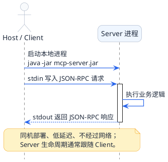

import VipInline from '@site/src/components/VipInline';

# 三种传输模式全面解读

上一篇讲的JSON-RPC解决了"说什么话"的问题——统一的数据格式。但光有话术还不够，还需要解决"怎么把话传过去"的问题。

这就像人类通讯方式的演进：
- 最早是**面对面交流**：两个人坐一起，说话直接听到
- 后来有了**电话**：隔着距离也能通话，但一次只能和一个人聊
- 再后来有了**即时通讯软件**：不仅能通话，还能发消息、发文件、建群聊

MCP的三种传输模式，正好对应这三个阶段的通讯方式。

## Stdio模式：面对面的高效协作

### 工作原理

Stdio是Standard Input/Output的缩写，就是标准输入输出。这是操作系统最基础的进程间通信方式。

还记得你在命令行里运行程序的场景吗？

```bash
$ echo "Hello World"
Hello World
```

你输入的命令是"标准输入"（stdin），程序打印出来的结果是"标准输出"（stdout）。

MCP的Stdio模式就是利用这个原理：
1. Client启动一个Server进程（比如运行一个jar包）
2. Client往Server的stdin写入JSON-RPC请求
3. Server从stdin读取请求，处理后把JSON-RPC响应写入stdout
4. Client从Server的stdout读取响应

整个过程不经过网络，数据直接在两个进程之间的管道里流转。

### 用同一办公室协作来理解

想象两个同事坐在同一个办公室里工作：

**传话筒场景**：小李需要小王帮忙查个数据



特点是：
- **距离近**：就在同一个房间，传递便签很快
- **一对一**：小李只能跟坐旁边的小王协作，不能跟其他办公室的人
- **生命周期绑定**：小王下班了，小李就没人可以请教了

:::info Stdio 模式的核心特征
Stdio 模式数据通过进程管道直接传输，不经过网络。一个 Server 进程只能服务一个 Client，且 Server 的生命周期与 Client 进程绑定。这使它成为本地工具（如 Claude Desktop、Cursor 插件）的首选方案。
:::

### 配置方式

在支持MCP的客户端（比如Cursor）里配置Stdio类型的Server：

```json
{
  "mcpServers": {
    "office-tools": {
      "command": "java",
      "args": ["-jar", "/path/to/mcp-server.jar"]
    }
  }
}
```

Client启动时会自动运行这个命令，启动Server进程。

### 优势与局限

| 维度 | 说明 |
|------|------|
| 延迟 | 极低，不经过网络 |
| 安全性 | 天然安全，数据不出本机 |
| 配置复杂度 | 简单，不需要网络配置 |
| 部署方式 | 必须和Client在同一台机器 |
| 多Client支持 | 不支持，一个Server进程只能服务一个Client |
| 适用场景 | 本地开发、个人工具、Claude Desktop/Cursor插件 |

<VipInline />
