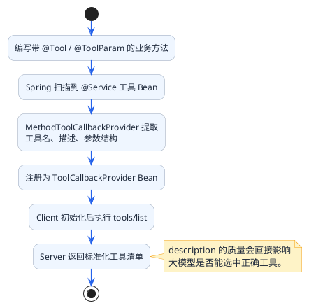

# Spring AI构建MCP服务端实战

## 实战目标

这一篇我们动手搭建一个真实可用的MCP Server。为了让示例更有实际意义，我们以"智能办公助手"为场景，开发以下工具：

| 工具名称 | 功能描述 |
|----------|----------|
| checkAttendance | 查询员工考勤记录 |
| bookMeetingRoom | 预订会议室 |
| queryRoomSchedule | 查询会议室排期 |

我们会分别用Stdio、SSE、Streamable HTTP三种模式来部署这个Server，让你对比体会它们的差异。

## 技术栈选择

Spring AI从1.0版本开始提供MCP Server的Boot Starter，主要有三个：

| Starter | 传输模式 | 适用场景 |
|---------|----------|----------|
| spring-ai-starter-mcp-server | Stdio | 本地工具，Claude Desktop/Cursor插件 |
| spring-ai-starter-mcp-server-webmvc | Streamable HTTP | 远程服务，基于Spring MVC |
| spring-ai-starter-mcp-server-webflux | Streamable HTTP | 远程服务，基于响应式WebFlux |

本文使用webmvc版本演示（用得最多），Stdio模式只需换依赖和配置即可。

## 项目搭建

### Maven依赖

```xml
<?xml version="1.0" encoding="UTF-8"?>
<project xmlns="http://maven.apache.org/POM/4.0.0"
         xmlns:xsi="http://www.w3.org/2001/XMLSchema-instance"
         xsi:schemaLocation="http://maven.apache.org/POM/4.0.0
         https://maven.apache.org/xsd/maven-4.0.0.xsd">
    <modelVersion>4.0.0</modelVersion>

    <parent>
        <groupId>org.springframework.boot</groupId>
        <artifactId>spring-boot-starter-parent</artifactId>
        <version>3.5.3</version>
    </parent>

    <groupId>com.example</groupId>
    <artifactId>office-mcp-server</artifactId>
    <version>1.0.0</version>

    <properties>
        <java.version>17</java.version>
        <spring-ai.version>1.0.0</spring-ai.version>
    </properties>

    <dependencies>
        <!-- Spring AI MCP Server (WebMVC版本，支持HTTP) -->
        <dependency>
            <groupId>org.springframework.ai</groupId>
            <artifactId>spring-ai-starter-mcp-server-webmvc</artifactId>
            <version>${spring-ai.version}</version>
        </dependency>
    </dependencies>

    <build>
        <plugins>
            <plugin>
                <groupId>org.springframework.boot</groupId>
                <artifactId>spring-boot-maven-plugin</artifactId>
            </plugin>
        </plugins>
    </build>
</project>
```

### 项目结构

```
office-mcp-server/
├── pom.xml
└── src/main/
    ├── java/com/example/office/
    │   ├── OfficeMcpServerApplication.java
    │   ├── config/
    │   │   └── McpServerConfig.java
    │   ├── tools/
    │   │   ├── AttendanceTools.java
    │   │   └── MeetingRoomTools.java
    │   └── model/
    │       ├── AttendanceRecord.java
    │       └── RoomBooking.java
    └── resources/
        └── application.yml
```



```plantuml title="Spring AI MCP Server 运行结构" width="100%" align="left"
@startuml
left to right direction
skinparam backgroundColor transparent
skinparam shadowing false
skinparam defaultFontColor #1E293B
skinparam ArrowColor #2563EB
skinparam ArrowThickness 1.2
skinparam packageStyle rectangle
skinparam packageBorderColor #CBD5E1
skinparam packageBackgroundColor #F8FAFC
skinparam rectangleBorderColor #94A3B8
skinparam rectangleBackgroundColor #FFFFFF
skinparam RectangleFontColor #1E293B
skinparam databaseBorderColor #94A3B8
skinparam databaseBackgroundColor #FEFCE8
skinparam RoundCorner 18

actor "Cursor / Inspector /\n自建 Host" as Host
rectangle "Transport Layer\nStdio / SSE / Streamable HTTP" as Transport #DBEAFE

package "Spring AI MCP Server" as Server #EFF6FF {
  rectangle "MethodToolCallbackProvider" as Provider #FFFFFF
  rectangle "AttendanceTools" as Attendance #ECFCCB
  rectangle "MeetingRoomTools" as Meeting #FEF3C7
}

database "HR 系统 / 数据库" as HR
database "会议室系统 / 日程服务" as Room

Host --> Transport : JSON-RPC / MCP 请求
Transport --> Provider : 工具发现与调用分发
Provider --> Attendance : 暴露 checkAttendance / clockIn
Provider --> Meeting : 暴露 queryRoomSchedule / bookMeetingRoom
Attendance --> HR : 查询考勤 / 打卡
Meeting --> Room : 查询排期 / 预订会议室
@enduml
```

## 开发工具类

### 考勤查询工具

```java
package com.example.office.tools;

import org.springframework.ai.tool.annotation.Tool;
import org.springframework.ai.tool.annotation.ToolParam;
import org.springframework.stereotype.Service;

@Service
public class AttendanceTools {

    /**
     * 查询员工考勤记录
     * 大模型会根据description判断何时使用此工具
     */
    @Tool(description = "查询员工的考勤记录，包括出勤天数、迟到次数、早退次数、请假天数。" +
                        "当用户询问考勤、打卡、出勤等相关问题时使用此工具。")
    public String checkAttendance(
            @ToolParam(description = "员工工号，如E10086") String employeeId,
            @ToolParam(description = "查询月份，格式YYYY-MM，如2025-03") String month) {
        
        // 实际项目中这里调用HR系统API
        // 这里用模拟数据演示
        return String.format("""
            {
                "employeeId": "%s",
                "month": "%s",
                "workDays": 22,
                "actualDays": 21,
                "lateTimes": 2,
                "earlyLeaveTimes": 0,
                "leaveDays": 1,
                "overtimeHours": 8.5
            }
            """, employeeId, month);
    }
    
    /**
     * 员工签到打卡
     */
    @Tool(description = "员工进行签到打卡操作。当用户说要打卡、签到时使用此工具。")
    public String clockIn(
            @ToolParam(description = "员工工号") String employeeId,
            @ToolParam(description = "打卡类型：IN表示上班签到，OUT表示下班签退") String type) {
        
        String currentTime = java.time.LocalDateTime.now()
                .format(java.time.format.DateTimeFormatter.ofPattern("yyyy-MM-dd HH:mm:ss"));
        
        String status = "IN".equalsIgnoreCase(type) ? "上班签到" : "下班签退";
        
        return String.format("""
            {
                "success": true,
                "employeeId": "%s",
                "clockType": "%s",
                "clockTime": "%s",
                "message": "%s成功"
            }
            """, employeeId, type, currentTime, status);
    }
}
```

### 会议室管理工具

```java
package com.example.office.tools;

import org.springframework.ai.tool.annotation.Tool;
import org.springframework.ai.tool.annotation.ToolParam;
import org.springframework.stereotype.Service;

@Service
public class MeetingRoomTools {

    /**
     * 查询会议室排期
     */
    @Tool(description = "查询指定会议室在某天的预订情况和空闲时段。" +
                        "当用户想知道会议室是否有空、什么时候可以用时，使用此工具。")
    public String queryRoomSchedule(
            @ToolParam(description = "会议室编号，如A301、B502") String roomId,
            @ToolParam(description = "查询日期，格式YYYY-MM-DD") String date) {
        
        // 模拟返回会议室排期
        return String.format("""
            {
                "roomId": "%s",
                "roomName": "第%s会议室",
                "date": "%s",
                "capacity": 10,
                "bookedSlots": [
                    {"start": "09:00", "end": "10:30", "subject": "产品需求评审", "organizer": "张经理"},
                    {"start": "14:00", "end": "15:00", "subject": "技术方案讨论", "organizer": "李工"}
                ],
                "availableSlots": [
                    {"start": "10:30", "end": "12:00"},
                    {"start": "13:00", "end": "14:00"},
                    {"start": "15:00", "end": "18:00"}
                ]
            }
            """, roomId, roomId, date);
    }

    /**
     * 预订会议室
     */
    @Tool(description = "预订会议室。当用户说要订会议室、约会议室时使用此工具。")
    public String bookMeetingRoom(
            @ToolParam(description = "会议室编号") String roomId,
            @ToolParam(description = "预订日期，格式YYYY-MM-DD") String date,
            @ToolParam(description = "开始时间，格式HH:mm") String startTime,
            @ToolParam(description = "结束时间，格式HH:mm") String endTime,
            @ToolParam(description = "会议主题") String subject,
            @ToolParam(description = "预订人姓名") String organizer) {
        
        // 模拟预订成功
        String bookingId = "BK" + System.currentTimeMillis();
        
        return String.format("""
            {
                "success": true,
                "bookingId": "%s",
                "roomId": "%s",
                "date": "%s",
                "timeSlot": "%s - %s",
                "subject": "%s",
                "organizer": "%s",
                "message": "会议室预订成功"
            }
            """, bookingId, roomId, date, startTime, endTime, subject, organizer);
    }
    
    /**
     * 取消会议室预订
     */
    @Tool(description = "取消已预订的会议室。当用户说要取消会议、退订会议室时使用此工具。")
    public String cancelBooking(
            @ToolParam(description = "预订单号") String bookingId) {
        
        return String.format("""
            {
                "success": true,
                "bookingId": "%s",
                "message": "预订已取消"
            }
            """, bookingId);
    }
}
```

### 注册工具到MCP Server

```java
package com.example.office.config;

import com.example.office.tools.AttendanceTools;
import com.example.office.tools.MeetingRoomTools;
import org.springframework.ai.tool.ToolCallbackProvider;
import org.springframework.ai.tool.method.MethodToolCallbackProvider;
import org.springframework.context.annotation.Bean;
import org.springframework.context.annotation.Configuration;

@Configuration
public class McpServerConfig {

    /**
     * 注册考勤工具
     */
    @Bean
    public ToolCallbackProvider attendanceToolProvider(AttendanceTools attendanceTools) {
        return MethodToolCallbackProvider.builder()
                .toolObjects(attendanceTools)
                .build();
    }

    /**
     * 注册会议室工具
     */
    @Bean
    public ToolCallbackProvider meetingRoomToolProvider(MeetingRoomTools meetingRoomTools) {
        return MethodToolCallbackProvider.builder()
                .toolObjects(meetingRoomTools)
                .build();
    }
}
```

`MethodToolCallbackProvider`会自动扫描工具类中的`@Tool`注解方法，提取方法名作为工具名、description作为工具描述、方法参数和`@ToolParam`作为参数定义。



### 启动类

```java
package com.example.office;

import org.springframework.boot.SpringApplication;
import org.springframework.boot.autoconfigure.SpringBootApplication;

@SpringBootApplication
public class OfficeMcpServerApplication {

    public static void main(String[] args) {
        SpringApplication.run(OfficeMcpServerApplication.class, args);
    }
}
```

## 配置三种传输模式

### Streamable HTTP模式（推荐）

这是远程部署的推荐方式：

```yaml
server:
  port: 8080

spring:
  ai:
    mcp:
      server:
        name: office-tools-server
        version: 1.0.0
        type: SYNC
        protocol: STREAMABLE
        streamable-http:
          mcp-endpoint: /mcp
          keep-alive-interval: 30s
```

配置说明：

| 配置项 | 说明 |
|--------|------|
| server.port | HTTP服务端口 |
| spring.ai.mcp.server.name | Server名称，Client连接时可见 |
| spring.ai.mcp.server.version | Server版本号 |
| spring.ai.mcp.server.type | 执行模式，SYNC同步/ASYNC异步 |
| spring.ai.mcp.server.protocol | 传输协议，STREAMABLE表示Streamable HTTP |
| streamable-http.mcp-endpoint | MCP服务端点路径 |
| streamable-http.keep-alive-interval | 心跳间隔，保持连接活跃 |

启动后，MCP服务地址为：`http://localhost:8080/mcp`

### SSE模式（了解即可）

如果需要兼容老版本Client：

```yaml
server:
  port: 8080

spring:
  ai:
    mcp:
      server:
        name: office-tools-server
        version: 1.0.0
        type: SYNC
        sse-endpoint: /sse
        sse-message-endpoint: /messages
```

SSE模式有两个端点：
- `/sse`：Client建立长连接监听消息
- `/messages`：Client发送请求

### Stdio模式

Stdio模式需要换依赖：

```xml
<!-- 把webmvc换成这个 -->
<dependency>
    <groupId>org.springframework.ai</groupId>
    <artifactId>spring-ai-starter-mcp-server</artifactId>
    <version>${spring-ai.version}</version>
</dependency>
```

配置文件也要调整：

```yaml
spring:
  main:
    web-application-type: none  # 关闭Web容器
    banner-mode: off            # 关闭Banner，避免干扰通信
  ai:
    mcp:
      server:
        name: office-tools-server
        version: 1.0.0
        type: SYNC
        stdio: true

# 关闭所有日志输出到控制台
logging:
  level:
    root: OFF
  file:
    name: ./logs/mcp-server.log  # 日志写入文件
```

**重要提示**：Stdio模式下，stdout是MCP通信通道，任何非协议内容（日志、Banner）都会导致通信失败。必须关闭控制台输出。

打包后的使用方式：

```bash
# 打包
mvn clean package -DskipTests

# Client配置里这样引用
java -jar office-mcp-server-1.0.0.jar
```

## 测试验证

### 使用MCP Inspector测试

MCP官方提供了一个可视化调试工具——MCP Inspector。

安装和启动：

```bash
# 需要Node.js环境
npx @modelcontextprotocol/inspector@latest
```

启动后访问 `http://localhost:6274`，会看到一个Web界面。

> **[截图提示]** 此处可添加MCP Inspector界面截图，显示连接配置区域

**测试Streamable HTTP模式**：

1. Transport Type选择"Streamable"
2. URL填入：`http://localhost:8080/mcp`
3. 点击Connect

> **[截图提示]** 此处可添加连接成功后的工具列表截图

连接成功后，点击Tools标签页，可以看到我们注册的所有工具。选择一个工具，填入参数，点击Run Tool即可测试。

**测试Stdio模式**：

1. Transport Type选择"Stdio"
2. Command填入Java路径
3. Args填入：`-jar /path/to/office-mcp-server-1.0.0.jar`

### 使用Cursor/Cline测试

在Cursor的MCP配置中添加：

```json
{
  "mcpServers": {
    "office-tools": {
      "type": "streamableHttp",
      "url": "http://localhost:8080/mcp"
    }
  }
}
```

> **[截图提示]** 此处可添加Cursor配置界面截图

配置成功后，在Cursor中对话：

```
用户：帮我查一下工号E10086这个月的考勤
```

Cursor会自动调用`checkAttendance`工具并返回结果。

## 进阶：复杂参数处理

上面的例子参数都是简单的String类型。实际项目中，经常需要处理复杂的对象参数。

### 使用POJO作为参数

定义请求对象：

```java
package com.example.office.model;

import org.springframework.ai.tool.annotation.ToolParam;

public class BookingRequest {
    
    @ToolParam(description = "会议室编号")
    private String roomId;
    
    @ToolParam(description = "预订日期，格式YYYY-MM-DD")
    private String date;
    
    @ToolParam(description = "开始时间，格式HH:mm")
    private String startTime;
    
    @ToolParam(description = "结束时间，格式HH:mm")
    private String endTime;
    
    @ToolParam(description = "会议主题")
    private String subject;
    
    @ToolParam(description = "参会人员列表")
    private List<String> attendees;
    
    // getter/setter省略
}
```

工具方法改为：

```java
@Tool(description = "预订会议室，支持指定参会人员")
public String bookMeetingRoomAdvanced(BookingRequest request) {
    // 处理逻辑
    return "预订成功";
}
```

这样大模型在调用时，会根据`@ToolParam`的描述来填充各个字段。

### 使用POJO作为返回值

返回值也可以是对象，框架会自动序列化成JSON：

```java
@Tool(description = "查询会议室信息")
public RoomInfo getRoomInfo(String roomId) {
    RoomInfo info = new RoomInfo();
    info.setRoomId(roomId);
    info.setCapacity(10);
    info.setFacilities(Arrays.asList("投影仪", "白板", "视频会议设备"));
    return info;
}
```

## 常见问题排查

### 问题一：Stdio模式连接失败

**现象**：Client报JSON解析错误

**原因**：控制台有非JSON内容输出

**解决**：
1. 确保`banner-mode: off`
2. 确保`logging.level.root: OFF`
3. 检查代码里有没有`System.out.println`

### 问题二：工具没有被注册

**现象**：Client连接成功但看不到工具

**原因**：工具类没有被Spring扫描到，或者`@Tool`注解漏写

**解决**：
1. 确保工具类有`@Service`或`@Component`注解
2. 确保工具方法有`@Tool`注解
3. 确保`McpServerConfig`中注册了工具Provider

### 问题三：Streamable HTTP返回404

**现象**：访问`/mcp`返回404

**原因**：配置的endpoint路径和实际访问的不一致

**解决**：检查`streamable-http.mcp-endpoint`配置，确保访问路径正确

### 问题四：中文乱码

**现象**：返回的中文显示为乱码

**原因**：字符编码不是UTF-8

**解决**：添加配置

```yaml
server:
  servlet:
    encoding:
      charset: UTF-8
      force: true
      enabled: true
```

## 小结

这一篇我们完成了MCP Server的实战开发：

1. **项目搭建**：使用Spring AI的MCP Server Starter
2. **工具开发**：用`@Tool`和`@ToolParam`注解定义工具
3. **工具注册**：通过`MethodToolCallbackProvider`注册到MCP Server
4. **三种模式配置**：Streamable HTTP（推荐）、SSE、Stdio
5. **测试验证**：使用MCP Inspector和Cursor测试

记住几个关键点：
- 远程部署用Streamable HTTP
- 本地插件用Stdio
- Stdio模式必须关闭控制台输出
- 工具的description要写清楚，这是大模型判断的依据

下一篇我们来看MCP Client端的开发，学习如何在自己的应用中集成MCP工具能力。
