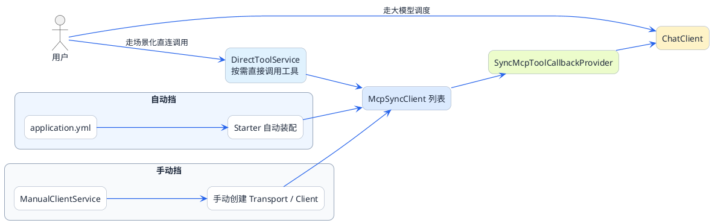
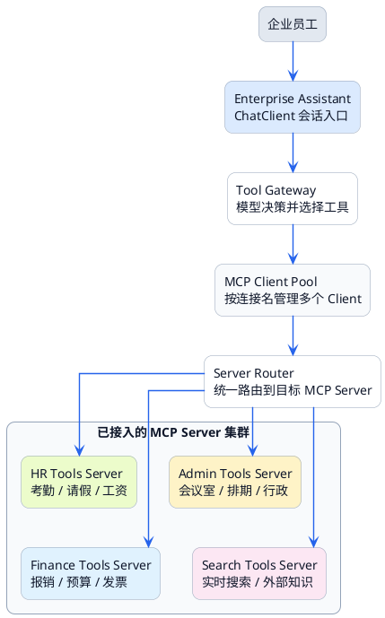

# Spring AI MCP客户端开发指南


上一篇我们开发了MCP Server，现在来做另一半——MCP Client。

想象你要打造一个企业智能助手，它需要具备多种能力：
- 对接HR系统查考勤、查工资
- 对接行政系统订会议室、查排期
- 对接搜索引擎查询实时信息

每种能力来自不同的MCP Server。你的智能助手作为MCP Client，需要同时连接多个Server，把它们的工具能力整合起来。

这一篇我们就来实现这个场景。

## 两种集成方式：自动挡与手动挡

Spring AI提供了两种方式来集成MCP Client：

| 方式 | 特点 | 适用场景 |
|------|------|----------|
| 配置文件注入（自动挡） | 在application.yml配置Server信息，框架自动初始化 | Server相对固定，配置简单 |
| 手动构建（手动挡） | 在代码中显式创建Client | 需要动态控制、特殊配置 |

### 自动挡：配置文件驱动

就像开自动挡的车，你只需要告诉它目的地（配置Server地址），剩下的换挡、油门控制它自己搞定。

### 手动挡：代码完全掌控

像开手动挡的车，每一次换挡、每一脚油门都由你控制。虽然麻烦，但更灵活。



## 示例中项目地址

- 项目地址：[https://github.com/java-up-up/super-agent](https://github.com/java-up-up/super-agent)
- 项目模块：`ai-example-spring-ai-office-mcp-client`

### Maven依赖

```xml
<?xml version="1.0" encoding="UTF-8"?>
<project xmlns="http://maven.apache.org/POM/4.0.0"
         xmlns:xsi="http://www.w3.org/2001/XMLSchema-instance"
         xsi:schemaLocation="http://maven.apache.org/POM/4.0.0
         https://maven.apache.org/xsd/maven-4.0.0.xsd">
    <modelVersion>4.0.0</modelVersion>
    <!-- 其他部分省略... -->
    
        <dependency>
            <groupId>org.springframework.ai</groupId>
            <artifactId>spring-ai-starter-mcp-client</artifactId>
            <version>${spring-ai.version}</version>
        </dependency>

    <!-- 其他部分省略... -->
</project>
```

## 方式一：配置文件注入（自动挡）

### 配置application.yml

```yaml
server:
  port: 8001

spring:
  ai:
    # 大模型配置（以通义千问为例）
    openai:
      base-url: https://dashscope.aliyuncs.com/compatible-mode/v1
      api-key: ${DASHSCOPE_API_KEY}
      chat:
        options:
          model: qwen-plus
    
    # MCP Client配置
    mcp:
      client:
        enabled: true
        name: smart-assistant
        version: 1.0.0
        request-timeout: 60s
        type: SYNC  # 同步模式
        
        # Stdio方式连接的Server
        stdio:
          connections:
            local-tools:
              command: java
              args:
                - "-jar"
                - "/path/to/local-mcp-server.jar"
        
        # Streamable HTTP方式连接的Server
        streamable-http:
          connections:
            office-tools:
              url: http://localhost:8080
              endpoint: /mcp
            search-tools:
              url: http://search-service:8090
              endpoint: /mcp
```

**配置详解：**

| 配置项 | 说明 |
|--------|------|
| mcp.client.enabled | 是否启用MCP Client |
| mcp.client.type | 执行模式，SYNC同步或ASYNC异步 |
| mcp.client.request-timeout | 请求超时时间 |
| stdio.connections | Stdio方式的Server列表 |
| streamable-http.connections | HTTP方式的Server列表 |

每个connection下的配置：
- Stdio需要`command`和`args`，指定启动命令
- HTTP需要`url`和`endpoint`，指定服务地址

:::info 注意：
application.yml 配置中的 stdio 和 streamable-http，这两种方式不能共存，只能选择其中一种
:::


### 使用自动注入的Client

框架会自动初始化所有配置的MCP Client，并提供两个关键Bean：

- `List<McpSyncClient>`：所有已连接的MCP Client列表
- `SyncMcpToolCallbackProvider`：工具回调提供者，可以获取所有工具

```java
@Service
public class AssistantService {

    private final ChatModel chatModel;
    private final SyncMcpToolCallbackProvider toolCallbackProvider;
    
    private ChatClient chatClient;
    
    public AssistantService(ChatModel chatModel, 
                           SyncMcpToolCallbackProvider toolCallbackProvider) {
        this.chatModel = chatModel;
        this.toolCallbackProvider = toolCallbackProvider;
    }
    
    @PostConstruct
    public void init() {
        // 获取所有MCP工具
        ToolCallback[] toolCallbacks = toolCallbackProvider.getToolCallbacks();
        
        // 构建ChatClient，注入MCP工具
        this.chatClient = ChatClient.builder(chatModel)
                .defaultToolCallbacks(toolCallbacks)
                .build();
    }
    
    /**
     * 智能助手对话
     */
    public String chat(String userMessage) {
        return chatClient.prompt()
                .user(userMessage)
                .call()
                .content();
    }
}
```

### 直接调用MCP工具

有时候你可能想直接调用某个MCP工具，而不是通过大模型决策：

```java
@Service
public class DirectToolService {

    private final List<McpSyncClient> mcpClients;
    
    public DirectToolService(List<McpSyncClient> mcpClients) {
        this.mcpClients = mcpClients;
    }
    
    /**
     * 直接调用指定Server的工具
     */
    public String callTool(String serverName, String toolName, Map<String, Object> params) {
        for (McpSyncClient client : mcpClients) {
            // 通过clientInfo或serverInfo判断是哪个Server
            McpSchema.Implementation clientInfo = client.getClientInfo();
            
            if (clientInfo.name().contains(serverName)) {
                // 构建调用请求
                McpSchema.CallToolRequest request = McpSchema.CallToolRequest.builder()
                        .name(toolName)
                        .arguments(params)
                        .build();
                
                // 执行调用
                McpSchema.CallToolResult result = client.callTool(request);
                
                // 返回结果
                return result.content().toString();
            }
        }
        
        throw new RuntimeException("未找到Server: " + serverName);
    }
    
    /**
     * 查询员工考勤的便捷方法
     */
    public String checkAttendance(String employeeId, String month) {
        Map<String, Object> params = new HashMap<>();
        params.put("employeeId", employeeId);
        params.put("month", month);
        
        return callTool("office", "checkAttendance", params);
    }
}
```

## 方式二：手动构建（手动挡）

当你需要更灵活的控制时，可以手动创建MCP Client。

### 手动创建三种类型的Client

```java
@Service
public class ManualClientService {

    private final ChatModel chatModel;
    private ChatClient chatClient;
    
    public ManualClientService(ChatModel chatModel) {
        this.chatModel = chatModel;
    }
    
    @PostConstruct
    public void init() {
        // 创建Stdio Client
        //McpSyncClient stdioClient = createStdioClient();
        
        // 创建Streamable HTTP Client
        McpSyncClient httpClient = createStreamableHttpClient();
        
        // 汇总所有Client
        //List<McpSyncClient> clients = List.of(stdioClient, httpClient);
        List<McpSyncClient> clients = List.of(httpClient);
        
        // 构建工具回调
        SyncMcpToolCallbackProvider provider = SyncMcpToolCallbackProvider.builder()
                .mcpClients(clients)
                .build();
        
        ToolCallback[] callbacks = provider.getToolCallbacks();
        
        // 构建ChatClient
        this.chatClient = ChatClient.builder(chatModel)
                .defaultToolCallbacks(callbacks)
                .build();
    }
    
    /**
     * 创建Stdio类型的Client
     */
    private McpSyncClient createStdioClient() {
        ServerParameters params = ServerParameters.builder("java")
                .args("-jar", "/path/to/local-server.jar")
                .build();
        
        StdioClientTransport transport = new StdioClientTransport(
                params, 
                McpJsonMapper.createDefault()
        );
        
        McpSyncClient client = McpClient.sync(transport)
                .clientInfo(new McpSchema.Implementation("local-client", "1.0.0"))
                .requestTimeout(Duration.ofSeconds(30))
                .build();
        
        // 初始化连接
        client.initialize();
        
        return client;
    }
    
    /**
     * 创建Streamable HTTP类型的Client
     */
    private McpSyncClient createStreamableHttpClient() {
        HttpClientStreamableHttpTransport transport = HttpClientStreamableHttpTransport
                .builder("http://localhost:7090")
                .endpoint("/mcp")
                .build();
        
        McpSyncClient client = McpClient.sync(transport)
                .clientInfo(new McpSchema.Implementation("http-client", "1.0.0"))
                .requestTimeout(Duration.ofSeconds(60))
                .build();
        
        client.initialize();
        
        return client;
    }
    
    /**
     * 创建SSE类型的Client（了解即可）
     */
    private McpSyncClient createSseClient() {
        HttpClientSseClientTransport transport = HttpClientSseClientTransport
                .builder("http://localhost:7090")
                .sseEndpoint("/sse")
                .build();
        
        McpSyncClient client = McpClient.sync(transport)
                .clientInfo(new McpSchema.Implementation("sse-client", "1.0.0"))
                .requestTimeout(Duration.ofSeconds(60))
                .build();
        
        client.initialize();
        
        return client;
    }
    
    public String chat(String userMessage) {
        return chatClient.prompt()
                .user(userMessage)
                .call()
                .content();
    }
}
```

### 关键注意点

**1. endpoint和baseUrl要分开写**

这是一个常见的坑。HTTP Client的配置中，baseUrl和endpoint必须分开：

:::warning 常见配置错误：baseUrl 混入 path
`builder("http://localhost:7090/mcp")` 会导致请求路径拼接错误，最终返回 404。必须把 path 单独通过 `.endpoint("/mcp")` 配置，`builder()` 只接受 host 和 port 部分。
:::

```java
// 正确写法
HttpClientStreamableHttpTransport transport = HttpClientStreamableHttpTransport
        .builder("http://localhost:7090")  // 只有host和port
        .endpoint("/mcp")                   // 路径单独配置
        .build();

// 错误写法（会导致404）
HttpClientStreamableHttpTransport transport = HttpClientStreamableHttpTransport
        .builder("http://localhost:7090/mcp")  // 不要把path放在这里
        .build();
```

**2. 必须调用initialize()**

创建Client后，一定要调用`initialize()`方法。这会触发与Server的初始化握手，否则后续的工具调用会失败。

:::danger 手动创建 Client 必须调用 initialize()
使用配置文件自动注入时框架会自动完成握手。但**手动创建 `McpSyncClient` 后必须显式调用 `client.initialize()`**，否则 Client 不会执行 MCP 握手流程，后续所有工具调用都会失败。
:::

**3. 超时设置要合理**

`requestTimeout`设置工具调用的超时时间。如果你的工具执行耗时较长（比如查询大量数据），要相应调大这个值。

## 多Server场景实战

一个实际的企业智能助手可能需要对接很多Server。下面是一个多Server集成的完整示例：

### 配置多个Server

```yaml
spring:
  ai:
    mcp:
      client:
        enabled: true
        name: enterprise-assistant
        version: 1.0.0
        request-timeout: 60s
        type: SYNC
        
        streamable-http:
          connections:
            # HR系统工具
            hr-tools:
              url: http://hr-service:8080
              endpoint: /mcp
            
            # 行政系统工具
            admin-tools:
              url: http://admin-service:8080
              endpoint: /mcp
            
            # 财务系统工具
            finance-tools:
              url: http://finance-service:8080
              endpoint: /mcp
            
            # 搜索引擎工具
            search-tools:
              url: http://search-service:8080
              endpoint: /mcp
```



> 提示：可以统一接入所有 Server，也可以按业务场景只挂载部分连接。

:::tip 按需加载工具
工具数量过多时，可以通过过滤 `McpSyncClient` 列表，只给 `ChatClient` 注入当前场景所需的工具。工具越少，大模型选择工具的准确率越高，响应速度也越快。
:::

### 按需加载工具

有时候你不想把所有Server的工具都加载进来，可以手动选择：

```java
@Service
public class SelectiveToolService {

    private final List<McpSyncClient> mcpClients;
    private final ChatModel chatModel;
    
    public SelectiveToolService(List<McpSyncClient> mcpClients,
                                ChatModel chatModel) {
        this.mcpClients = mcpClients;
        this.chatModel = chatModel;
    }
    
    /**
     * 创建只包含指定Server工具的ChatClient
     */
    public ChatClient createClientWithServers(String... serverNames) {
        List<McpSyncClient> selectedClients = mcpClients.stream()
                .filter(client -> {
                    String name = client.getClientInfo().name();
                    for (String serverName : serverNames) {
                        if (name.contains(serverName)) {
                            return true;
                        }
                    }
                    return false;
                })
                .toList();
        
        SyncMcpToolCallbackProvider provider = SyncMcpToolCallbackProvider.builder()
                .mcpClients(selectedClients)
                .build();
        
        return ChatClient.builder(chatModel)
                .defaultToolCallbacks(provider.getToolCallbacks())
                .build();
    }
    
    /**
     * HR相关问题专用的ChatClient
     */
    public String chatWithHR(String message) {
        ChatClient hrClient = createClientWithServers("hr");
        return hrClient.prompt()
                .user(message)
                .call()
                .content();
    }
}
```

## Controller层示例

```java
package com.example.assistant.controller;

import com.example.assistant.service.AssistantService;
import org.springframework.web.bind.annotation.*;

@RestController
@RequestMapping("/api/assistant")
public class AssistantController {

    private final AssistantService assistantService;
    
    public AssistantController(AssistantService assistantService) {
        this.assistantService = assistantService;
    }
    
    @PostMapping("/chat")
    public ChatResponse chat(@RequestBody ChatRequest request) {
        String response = assistantService.chat(request.getMessage());
        return new ChatResponse(response);
    }
    
    public record ChatRequest(String message) {}
    public record ChatResponse(String reply) {}
}
```

## 常见问题排查

### 问题一：连接超时

**现象**：启动时报连接超时错误

**可能原因**：
- Server没有启动
- 地址配置错误
- 网络不通

**排查步骤**：
1. 确认Server已启动且端口监听正常
2. 用curl或浏览器测试能否访问Server
3. 检查防火墙设置

### 问题二：工具列表为空

**现象**：Client连接成功但获取不到工具

**可能原因**：
- Server端工具没有正确注册
- 初始化流程没有完成

**排查步骤**：
1. 用MCP Inspector直接连Server，看能否获取工具列表
2. 检查Server端的`@Tool`注解和`ToolCallbackProvider`配置

### 问题三：工具调用返回错误

**现象**：大模型选择了工具但调用失败

**可能原因**：
- 参数类型不匹配
- Server端执行异常
- 超时

**排查步骤**：
1. 查看Server端日志，看具体报什么错
2. 检查大模型传的参数是否符合工具定义
3. 调大`request-timeout`试试

### 问题四：Stdio Client启动失败

**现象**：Stdio类型的Client无法启动

**可能原因**：
- Java路径不对
- jar包路径不对
- jar包有控制台输出干扰

**排查步骤**：
1. 手动执行command和args，看能否正常启动
2. 确保Stdio模式的Server关闭了所有控制台输出

## 小结

这一篇我们学习了MCP Client的开发：

1. **两种集成方式**：配置文件自动注入（自动挡）和代码手动构建（手动挡）
2. **多Server集成**：一个Client可以同时连接多个Server
3. **灵活使用**：可以通过ChatClient让大模型调用工具，也可以直接调用
4. **常见问题**：连接、超时、工具加载等问题的排查方法

关键记忆点：
- 配置简单场景用自动注入
- 需要灵活控制用手动构建
- baseUrl和endpoint要分开配置
- 记得调用initialize()

:::tip 两种集成方式选型建议
- **配置文件注入（自动挡）**：Server 地址相对固定、不需要动态切换，推荐使用，代码量最少
- **手动构建（手动挡）**：需要动态加减 Server、定制超时或连接参数、多租户场景下按需连接不同 Server，使用手动方式
:::

下一篇我们深入源码，看看Spring AI内部是怎么把MCP Client和ChatClient串联起来的。
