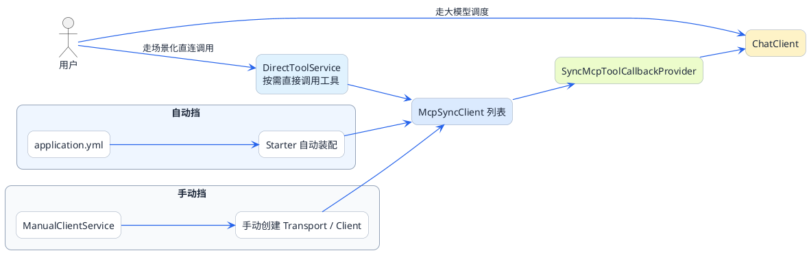

import VipInline from '@site/src/components/VipInline';

# Spring AI MCP客户端开发指南

上一篇我们开发了MCP Server，现在来做另一半——MCP Client。

想象你要打造一个企业智能助手，它需要具备多种能力：
- 对接HR系统查考勤、查工资
- 对接行政系统订会议室、查排期
- 对接搜索引擎查询实时信息

每种能力来自不同的MCP Server。你的智能助手作为MCP Client，需要同时连接多个Server，把它们的工具能力整合起来。

这一篇我们就来实现这个场景。

## 两种集成方式：自动挡与手动挡

Spring AI提供了两种方式来集成MCP Client：

| 方式 | 特点 | 适用场景 |
|------|------|----------|
| 配置文件注入（自动挡） | 在application.yml配置Server信息，框架自动初始化 | Server相对固定，配置简单 |
| 手动构建（手动挡） | 在代码中显式创建Client | 需要动态控制、特殊配置 |

### 自动挡：配置文件驱动

就像开自动挡的车，你只需要告诉它目的地（配置Server地址），剩下的换挡、油门控制它自己搞定。

### 手动挡：代码完全掌控

像开手动挡的车，每一次换挡、每一脚油门都由你控制。虽然麻烦，但更灵活。

<VipInline />
