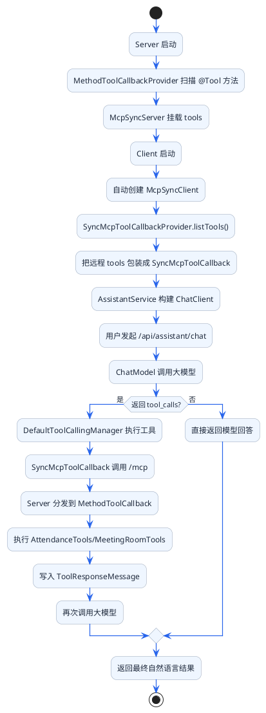
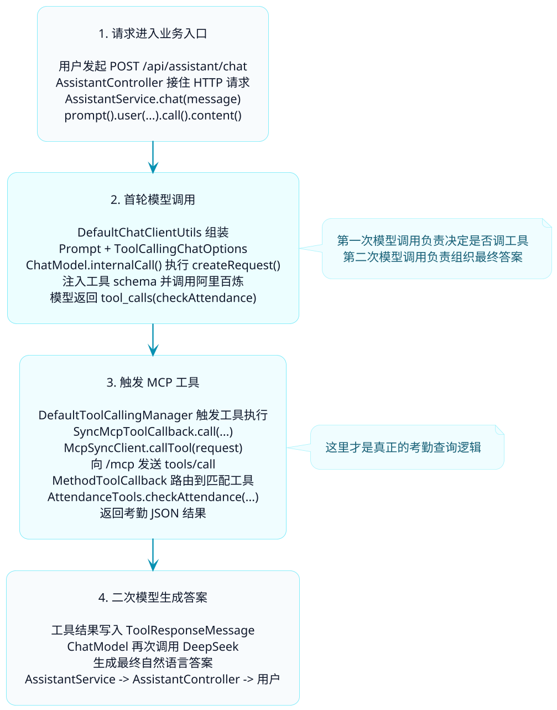

# MCP调用链路源码解密

前面几篇我们已经把 MCP Server 和 Client 跑起来了，但上一篇对“源码调用链路”的描述还是偏通用，容易把 Spring AI 的公共机制和本项目的真实实现混在一起。

这一篇不泛讲概念了，以之前的项目里的这两个模块为准，把链路重新梳理一遍：

- `ai-example-spring-ai-office-mcp-client`
- `ai-example-spring-ai-office-mcp-server`

我们要回答的问题也很具体：

- 用户发一句“帮我查下 E10086 2025-03 的考勤”，请求先落到哪里？
- Client 端的 MCP 工具是什么时候发现的？是在模型返回 `tool_calls` 之后，还是更早？
- Server 端的 `@Tool` 方法，是怎样变成 `/mcp` 接口可调用工具的？
- 工具执行完以后，结果是怎么回到大模型，再生成最终自然语言回答的？

## 从对话入口端来入手

### Client 端：`office-mcp-client`

```java
@RestController
@RequestMapping("/api/assistant")
public class AssistantController {

    private final AssistantService assistantService;

    @PostMapping("/chat")
    public ChatResponse chat(@RequestBody ChatRequest request) {
        String response = assistantService.chat(request.message());
        return new ChatResponse(response);
    }
}
```

```java
@Service
public class AssistantService {

    private final ChatModel chatModel;
    private final SyncMcpToolCallbackProvider toolCallbackProvider;

    private ChatClient chatClient;

    @PostConstruct
    public void init() {
        ToolCallback[] toolCallbacks = toolCallbackProvider.getToolCallbacks();

        this.chatClient = ChatClient.builder(chatModel)
                .defaultToolCallbacks(toolCallbacks)
                .build();
    }

    public String chat(String userMessage) {
        return chatClient.prompt()
                .user(userMessage)
                .call()
                .content();
    }
}
```

所以这套示例的真实入口是：

`AssistantController -> AssistantService -> ChatClient`

### Server 端：`office-mcp-server`

这个模块不是手写一个 `/mcp` Controller，而是交给 Spring AI Starter 自动暴露。

```java
@Configuration
public class McpServerConfig {

    @Bean
    public ToolCallbackProvider attendanceToolProvider(AttendanceTools attendanceTools) {
        return MethodToolCallbackProvider.builder()
                .toolObjects(attendanceTools)
                .build();
    }

    @Bean
    public ToolCallbackProvider meetingRoomToolProvider(MeetingRoomTools meetingRoomTools) {
        return MethodToolCallbackProvider.builder()
                .toolObjects(meetingRoomTools)
                .build();
    }
}
```

以及具体的 `@Tool` 方法：

```java
@Service
public class AttendanceTools {

    @Tool(description = "查询员工的考勤记录，包括出勤天数、迟到次数、早退次数、请假天数。")
    public String checkAttendance(String employeeId, String month) {
        ...
    }
}
```

```java
@Service
public class MeetingRoomTools {

    @Tool(description = "查询指定会议室在某天的预订情况和空闲时段。")
    public String queryRoomSchedule(String roomId, String date) {
        ...
    }
}
```

所以 Server 侧真正暴露出去的工具，来自：

- `AttendanceTools.checkAttendance`
- `AttendanceTools.clockIn`
- `MeetingRoomTools.queryRoomSchedule`
- `MeetingRoomTools.bookMeetingRoom`
- `MeetingRoomTools.cancelBooking`

## 先看全貌：这套示例其实分成两条链

一条是启动期链路，一条是运行期链路。



下面我们把这两条链分开看。

:::info 两条链的核心分工
- **启动期链路**：完成工具注册与发现——Server 暴露工具，Client 拉取工具列表并包装成 `ToolCallback` 注入 `ChatClient`
- **运行期链路**：完成工具调用与结果回传——大模型决定调用哪个工具，`SyncMcpToolCallback` 发起远程调用，结果写回对话历史后再次调用模型生成自然语言
:::

## 一、启动期链路：工具是怎样从 Server 暴露到 Client 的

### 1. Server 端：`@Tool` 方法先被包装成 `MethodToolCallback`

在 `office-mcp-server` 里，`McpServerConfig` 注册的是 `ToolCallbackProvider` Bean，而不是直接注册 HTTP 接口。

```java
@Bean
public ToolCallbackProvider attendanceToolProvider(AttendanceTools attendanceTools) {
    return MethodToolCallbackProvider.builder()
            .toolObjects(attendanceTools)
            .build();
}
```

`MethodToolCallbackProvider.getToolCallbacks()` 会做两件事：

1. 扫描 `toolObjects(...)` 里的对象
2. 找出所有带 `@Tool` 的方法，构造 `MethodToolCallback`

源码里这一步的核心是：

```java
.map(toolMethod -> MethodToolCallback.builder()
        .toolDefinition(ToolDefinitions.from(toolMethod))
        .toolMetadata(ToolMetadata.from(toolMethod))
        .toolMethod(toolMethod)
        .toolObject(toolObject)
        .build())
```

这意味着：

- `@Tool` 注解里的 `description` 会变成工具描述
- 方法名会变成工具名
- 方法参数和 `@ToolParam` 描述会变成输入 JSON Schema

:::note 工具名默认为方法名
`@Tool` 不显式指定 `name` 时，工具名默认就是 Java 方法名。当前示例中暴露的工具名为 `checkAttendance`、`clockIn`、`queryRoomSchedule`、`bookMeetingRoom`、`cancelBooking`，与业务方法名完全一致。
:::

在当前示例里，由于 `@Tool` 没显式写 `name`，所以工具名默认就是方法名：

- `checkAttendance`
- `clockIn`
- `queryRoomSchedule`
- `bookMeetingRoom`
- `cancelBooking`

### 2. Server 自动装配：把 `ToolCallback` 转成 MCP Server 可用的 ToolSpecification

真正把 Spring AI 工具接入 MCP Server 的，不是 `McpServerConfig` 本身，而是 Starter 里的自动装配。

关键类是：

- `ToolCallbackConverterAutoConfiguration`
- `McpServerAutoConfiguration`
- `McpServerStreamableHttpWebMvcAutoConfiguration`

它们做的事情依次是：

1. `ToolCallbackConverterAutoConfiguration.syncTools(...)`
   - 聚合所有 `ToolCallback` / `ToolCallbackProvider`
   - 调用 `McpToolUtils.toSyncToolSpecification(...)`
   - 把 Spring AI 工具转换成 MCP 协议层的 `SyncToolSpecification`

2. `McpServerAutoConfiguration.mcpSyncServer(...)`
   - 创建 `McpSyncServer`
   - 把前面得到的 `SyncToolSpecification` 挂进去

3. `McpServerStreamableHttpWebMvcAutoConfiguration`
   - 创建 `WebMvcStreamableServerTransportProvider`
   - 根据配置把路由暴露到 `/mcp`

所以 Server 启动完成后，`office-mcp-server` 实际上已经在 `http://localhost:7090/mcp` 上提供了标准 MCP 服务。

### 3. Client 端：根据 `application.yaml` 自动创建 `McpSyncClient`

client 端的配置是：

```yaml
spring:
  ai:
    mcp:
      client:
        enabled: true
        name: office-tools-client
        version: 1.0.0
        type: SYNC
        request-timeout: 60s
        streamable-http:
          connections:
            office-tools:
              url: http://localhost:7090
              endpoint: /mcp
```

这段配置会进入两层自动装配：

#### 第一层：构建传输层

`StreamableHttpHttpClientTransportAutoConfiguration.streamableHttpHttpClientTransports(...)`
会读取 `streamable-http.connections.office-tools`，并创建：

```java
HttpClientStreamableHttpTransport.builder("http://localhost:7090")
        .endpoint("/mcp")
        .build();
```

#### 第二层：构建 MCP Client

`McpClientAutoConfiguration.mcpSyncClients(...)` 会基于 transport 创建：

```java
McpClient.sync(transport)
        .clientInfo(...)
        .requestTimeout(...)
        .build();
```

而且 `McpClientCommonProperties` 的 `initialized` 默认值就是 `true`，所以自动装配完成后会自动执行：

```java
client.initialize();
```

也就是说，`office-mcp-client` 启动时，和 `office-mcp-server` 的 MCP 握手已经完成了。

### 4. Client 端：`SyncMcpToolCallbackProvider` 把远程工具列表转成 `ToolCallback`

接下来，`McpToolCallbackAutoConfiguration.mcpToolCallbacks(...)` 会创建 `SyncMcpToolCallbackProvider`。

而你自己的 `AssistantService.init()` 又会主动触发：

```java
ToolCallback[] toolCallbacks = toolCallbackProvider.getToolCallbacks();
```

`SyncMcpToolCallbackProvider.getToolCallbacks()` 内部最关键的一段逻辑就是：

```java
mcpClient.listTools()
```

它会：

1. 遍历所有 `McpSyncClient`
2. 调用每个 client 的 `listTools()`
3. 拿到远程 server 的工具描述
4. 为每个工具创建一个 `SyncMcpToolCallback`

可以把它理解成：

“把远程 MCP 工具，翻译成 Spring AI 本地可调用的工具回调对象”

这一层做完之后，`ChatClient.builder(chatModel).defaultToolCallbacks(toolCallbacks)` 才真正把 MCP 工具注入给大模型。

### 5. 当前示例里，工具名大概率就是原始方法名

`McpToolCallbackAutoConfiguration` 默认会提供 `DefaultMcpToolNamePrefixGenerator`。

它的行为不是“永远加前缀”，而是：

- 默认尽量保持原工具名
- 只有在多个连接出现同名工具冲突时，才生成唯一名称

当前示例只有一个 `office-tools` 连接，所以给模型暴露出去的工具名，通常还是：

- `checkAttendance`
- `clockIn`
- `queryRoomSchedule`
- `bookMeetingRoom`
- `cancelBooking`

## 二、运行期链路：一次“查考勤”的请求究竟是怎么来执行的？

现在再看用户真正发请求时的链路。



### 第 1 步：Controller 接住用户请求

业务起点很简单：

```java
@PostMapping("/chat")
public ChatResponse chat(@RequestBody ChatRequest request) {
    String response = assistantService.chat(request.message());
    return new ChatResponse(response);
}
```

所以用户输入先进入：

`AssistantController.chat() -> AssistantService.chat()`

### 第 2 步：`ChatClient` 把消息和工具一起装进 `Prompt`

`AssistantService.chat()` 里只有一行核心代码：

```java
return chatClient.prompt()
        .user(userMessage)
        .call()
        .content();
```

这里真正关键的不是 `.user(userMessage)`，而是这个 `chatClient` 在 `init()` 阶段已经被注入了 `defaultToolCallbacks(toolCallbacks)`。

因此，当 `DefaultChatClientUtils.toChatClientRequest(...)` 组装请求时，会把：

- 用户消息
- 默认 `ToolCallback`
- ToolContext

一起塞进 `ToolCallingChatOptions`。

这一步决定了后面大模型发请求时，工具 schema 会被一起带上。

### 第 3 步：`ChatModelCallAdvisor` 真正调用 `ChatModel`

`DefaultChatClient` 在执行 `.call()` 时，会构造 Advisor 链，最底层的调用者是：

```java
ChatModelCallAdvisor
```

它最终会执行：

```java
chatModel.call(prompt)
```

在当前示例里，这里的 `chatModel` 就是 `OpenAiChatModel`。

### 第 4 步：`OpenAiChatModel.createRequest()` 把工具定义注入模型请求

`OpenAiChatModel.call(prompt)` 内部会走到：

```java
OpenAiChatModel.internalCall(prompt, null)
```

这个方法里的关键流程是：

1. `buildRequestPrompt(prompt)` 合并运行期 options 和默认 options
2. `createRequest(prompt, false)` 组装 DeepSeek 请求
3. `toolCallingManager.resolveToolDefinitions(requestOptions)` 解析工具定义
4. 把工具定义转成 DeepSeek `tools` 参数
5. 调 DeepSeek 接口

源码里最关键的一段是：

```java
List<ToolDefinition> toolDefinitions = this.toolCallingManager.resolveToolDefinitions(requestOptions);
if (!CollectionUtils.isEmpty(toolDefinitions)) {
    request = ModelOptionsUtils.merge(
            DeepSeekChatOptions.builder().tools(this.getFunctionTools(toolDefinitions)).build(),
            request,
            ChatCompletionRequest.class);
}
```

这说明此时发给 DeepSeek 的请求里，已经带上了：

- `checkAttendance` 的描述
- `clockIn` 的描述
- `queryRoomSchedule` 的描述
- `bookMeetingRoom` 的描述
- `cancelBooking` 的描述
- 每个工具各自的输入参数 schema

也正因为有这些定义，大模型才知道“我现在可以调用哪个工具”。

### 第 5 步：大模型返回 `tool_calls`

如果用户问的是：

“帮我查下 E10086 在 2025-03 的考勤”

DeepSeek 很可能不会直接生成自然语言，而是先返回一个带 `tool_calls` 的 assistant message，里面类似于：

```json
{
  "name": "checkAttendance",
  "arguments": {
    "employeeId": "E10086",
    "month": "2025-03"
  }
}
```

这时 `OpenAiChatModel.internalCall()` 里的判断会命中：

```java
if (this.toolExecutionEligibilityPredicate.isToolExecutionRequired(prompt.getOptions(), response)) {
    ...
}
```

默认实现 `DefaultToolExecutionEligibilityPredicate` 的判断原则很简单：

- 响应里有没有 `tool_calls`
- 有就进入工具执行流程

### 第 6 步：`DefaultToolCallingManager.executeToolCalls()` 执行工具

然后进入 Spring AI 工具执行中枢：

```java
DefaultToolCallingManager.executeToolCalls(prompt, chatResponse)
```

这里要注意两个细节：

#### 细节一：它先找到包含 `tool_calls` 的那条 `AssistantMessage`

源码里是：

```java
Optional<Generation> toolCallGeneration = chatResponse.getResults()
        .stream()
        .filter(g -> !CollectionUtils.isEmpty(g.getOutput().getToolCalls()))
        .findFirst();
```

#### 细节二：工具执行结果会被封装成 `ToolResponseMessage`

不是 `ToolResultMessage`，而是：

```java
ToolResponseMessage.builder().responses(toolResponses).build()
```

这是后面再次调用模型时要写回对话历史的核心消息对象。

### 第 7 步：根据工具名找到 `SyncMcpToolCallback`

`DefaultToolCallingManager` 会依次遍历 `assistantMessage.getToolCalls()`，再从当前 prompt options 里的 tool callbacks 中按名字匹配：

```java
ToolCallback toolCallback = toolCallbacks.stream()
        .filter(tool -> toolName.equals(tool.getToolDefinition().name()))
        .findFirst()
        .orElseGet(() -> this.toolCallbackResolver.resolve(toolName));
```

在当前示例里，匹配到的就是某个 `SyncMcpToolCallback`。

比如当工具名是 `checkAttendance` 时，对应的 callback 就代表了远端 MCP Server 上的考勤查询工具。

### 第 8 步：`SyncMcpToolCallback.call()` 远程调用 MCP Server

这一步是 MCP Client 真正发起远程调用的地方。

`SyncMcpToolCallback.call(arguments, toolContext)` 大致会做这几件事：

1. 把模型返回的 JSON 参数转成 `Map<String, Object>`
2. 构造 `McpSchema.CallToolRequest`
3. 调用 `mcpClient.callTool(request)`
4. 把返回内容转成 JSON 字符串再交还给 Spring AI

核心代码路径是：

```java
Map<String, Object> arguments = ModelOptionsUtils.jsonToMap(toolInput);

McpSchema.CallToolRequest request = McpSchema.CallToolRequest.builder()
        .name(this.tool.name())
        .arguments(arguments)
        .meta(meta)
        .build();

McpSchema.CallToolResult result = this.mcpClient.callTool(request);
```

这里要特别注意一点：

- 发给 MCP Server 的是原始工具名 `this.tool.name()`
- 不是 LLM 展示层随便拼出来的别名

:::tip 工具名的透传机制
`SyncMcpToolCallback` 发往 MCP Server 的工具名严格使用 `this.tool.name()` 原始值，不做任何转换。Server 端的 `McpSyncServer` 按工具名精确匹配对应的 `SyncToolSpecification`，再通过反射调用 `@Tool` 方法。
:::

所以最后 MCP Server 收到的调用，仍然是：

`checkAttendance(employeeId=E10086, month=2025-03)`

### 第 9 步：Server 端 `/mcp` 把请求分发给 `MethodToolCallback`

请求到达 `http://localhost:7090/mcp` 后，不会进入你手写的 Controller，而是进入 Starter 自动配置好的 `McpSyncServer`。

而这个 `McpSyncServer` 在启动时已经挂上了每个工具的 `SyncToolSpecification`。

这些 `SyncToolSpecification` 来自：

```java
McpToolUtils.toSyncToolSpecification(toolCallback)
```

它的本质可以理解成：

- 把 MCP 协议的 `CallToolRequest`
- 转成 Spring AI `ToolCallback.call(String toolInput, ToolContext toolContext)`

在当前示例里，真正被执行的本地 callback 是 `MethodToolCallback`。

### 第 10 步：`MethodToolCallback.call()` 反射调用真实业务方法

Server 端落地执行的关键类是：

```java
MethodToolCallback
```

它的工作流程是：

1. 把 `toolInput` JSON 反序列化成参数 Map
2. 按方法参数顺序组装 Java 参数
3. 通过反射调用目标方法
4. 把返回值转成字符串

对于这次“查考勤”请求，最终执行到的是：

```java
AttendanceTools.checkAttendance(String employeeId, String month)
```

也就是：

```java
return String.format("""
    {
        "employeeId": "%s",
        "month": "%s",
        "workDays": 22,
        "actualDays": 21,
        "lateTimes": 2,
        "earlyLeaveTimes": 0,
        "leaveDays": 1,
        "overtimeHours": 8.5
    }
    """, employeeId, month);
```

如果用户问的是会议室相关问题，那么同样的链路只会把最终落点换成：

- `MeetingRoomTools.queryRoomSchedule(...)`
- `MeetingRoomTools.bookMeetingRoom(...)`
- `MeetingRoomTools.cancelBooking(...)`

### 第 11 步：工具结果返回 Client，并写回 `ToolResponseMessage`

Server 返回 `CallToolResult` 后，`SyncMcpToolCallback.call()` 会把 `result.content()` 转成 JSON 字符串返回。

随后 `DefaultToolCallingManager.executeToolCalls()` 会构造：

1. 原始用户历史消息
2. 含 `tool_calls` 的 `AssistantMessage`
3. 新生成的 `ToolResponseMessage`

也就是新的对话历史：

`历史消息 + assistant(tool_calls) + tool(response)`

### 第 12 步：`OpenAiChatModel.internalCall()` 递归再调一次模型

如果工具不是 `returnDirect=true`，那么 `OpenAiChatModel.internalCall()` 会继续执行：

```java
return this.internalCall(
        new Prompt(toolExecutionResult.conversationHistory(), prompt.getOptions()),
        response);
```

这就是为什么一次完整工具调用通常要经历两次大模型调用：

1. 第一次：让模型决定要不要调用工具
2. 第二次：把工具结果喂回去，让模型组织成自然语言

:::info 一次完整工具调用 = 两次模型请求
这是 MCP 工具调用的核心机制：第一次模型请求用于决策（返回 `tool_calls`），第二次用于生成最终自然语言回答。如果工具设置了 `returnDirect = true`，则跳过第二次调用，工具结果直接作为最终输出返回。
:::

当前示例里的 `@Tool` 没有设置 `returnDirect = true`，所以会走“再次调用模型生成最终答案”这条路径。

## 三、把本例中的核心类串起来

为了避免类名太多看的太乱，我把这篇文章真正涉及的关键类按照职责来进行分类汇总：

| 类 | 在本例中的职责 | 所处阶段 |
|----|----------------|----------|
| `AssistantController` | 接收 `/api/assistant/chat` 请求 | 运行期入口 |
| `AssistantService` | 启动时拉取 MCP 工具，运行时发起 ChatClient 对话 | 启动期 + 运行期 |
| `StreamableHttpHttpClientTransportAutoConfiguration` | 根据 `application.yaml` 创建 HTTP MCP transport | Client 启动期 |
| `McpClientAutoConfiguration` | 创建并初始化 `McpSyncClient` | Client 启动期 |
| `SyncMcpToolCallbackProvider` | `listTools()` 拉取远程工具并包装成 `ToolCallback` | Client 启动期 |
| `DefaultChatClientUtils` | 把消息和工具回调组装成 `Prompt + ToolCallingChatOptions` | 运行期 |
| `ChatModelCallAdvisor` | 真正调用 `OpenAiChatModel` | 运行期 |
| `OpenAiChatModel` | 构造模型请求、判断是否有 `tool_calls`、递归调用 | 运行期 |
| `DefaultToolCallingManager` | 按工具名执行 `ToolCallback`，构造 `ToolResponseMessage` | 运行期 |
| `SyncMcpToolCallback` | 把工具调用转成 MCP `tools/call` 请求 | 运行期 |
| `ToolCallbackConverterAutoConfiguration` | 把 Spring AI 工具转换成 MCP Server ToolSpecification | Server 启动期 |
| `McpServerAutoConfiguration` | 创建 `McpSyncServer` 并挂载工具 | Server 启动期 |
| `MethodToolCallback` | 在 Server 端反射调用 `@Tool` 方法 | 运行期 |
| `AttendanceTools` / `MeetingRoomTools` | 真实业务实现 | 运行期最终落点 |

## 四、调试这套示例时，断点该打在哪里

如果小伙伴也想跟一下这两个模块的真实调用链的话，下面这些断点最有价值的，可以参考下。

### Client 启动期断点

| 类 | 方法 | 看什么 |
|----|------|--------|
| `McpClientAutoConfiguration` | `mcpSyncClients()` | `McpSyncClient` 是怎么创建和 initialize 的 |
| `SyncMcpToolCallbackProvider` | `getToolCallbacks()` | `listTools()` 返回了哪些远程工具 |
| `AssistantService` | `init()` | 最终注入 `ChatClient` 的工具有哪些 |

### 运行期断点

| 类 | 方法 | 看什么 |
|----|------|--------|
| `AssistantController` | `chat()` | 用户原始请求 |
| `DefaultChatClientUtils` | `toChatClientRequest()` | 工具回调是否真的被塞进 `Prompt` |
| `OpenAiChatModel` | `internalCall()` | 第一次模型调用和第二次模型调用的差异 |
| `DefaultToolCallingManager` | `executeToolCalls()` | `tool_calls` 被解析成了什么 |
| `SyncMcpToolCallback` | `call()` | 发给 `/mcp` 的工具名和参数 |
| `MethodToolCallback` | `call()` | Server 端最终调用了哪个本地方法 |
| `AttendanceTools` / `MeetingRoomTools` | 对应方法 | 真实业务入参和返回值 |

### 日志建议

这两个模块的 `application.yaml` 都已经把 `org.springframework.ai` 设成了 `DEBUG`：

```yaml
logging:
  level:
    org.springframework.ai: DEBUG
```

如果你还想更细一点，可以再补上 MCP SDK 的日志：

```yaml
logging:
  level:
    org.springframework.ai: DEBUG
    io.modelcontextprotocol: DEBUG
```

这样更容易看清：

- `initialize`
- `tools/list`
- `tools/call`

这几个关键 MCP 报文阶段。

## 小结

以 `office-mcp-client` 和 `office-mcp-server` 这两个模块为准，一次完整 MCP 工具调用其实分成两段：

### 第一段：启动期装配

1. Server 端把 `@Tool` 方法包装成 `MethodToolCallback`
2. 自动装配把它们转成 `SyncToolSpecification`
3. `/mcp` 端点被自动暴露
4. Client 端自动创建 `McpSyncClient`
5. `SyncMcpToolCallbackProvider.listTools()` 拉取远程工具
6. `AssistantService` 用这些工具构建 `ChatClient`

### 第二段：运行期执行

1. 用户请求进入 `AssistantController`
2. `ChatClient` 把消息和工具定义一起交给 `OpenAiChatModel`
3. DeepSeek 决定是否返回 `tool_calls`
4. `DefaultToolCallingManager` 找到对应的 `SyncMcpToolCallback`
5. `SyncMcpToolCallback` 调用 MCP Server 的 `tools/call`
6. Server 端通过 `MethodToolCallback` 落到 `AttendanceTools` 或 `MeetingRoomTools`
7. 结果写回 `ToolResponseMessage`
8. `OpenAiChatModel.internalCall()` 再次调用模型，生成最终自然语言

这篇文章所讲的主线流程可以总结成一句话，那就是：

**启动期负责”把远程 MCP 工具装进 ChatClient”，运行期负责”让模型决定何时调用工具，并把结果再喂回模型”。**

:::tip 调试入手点
调试这套链路时，启动期重点看 `SyncMcpToolCallbackProvider.getToolCallbacks()` 中 `listTools()` 拿到了哪些工具；运行期重点看 `DefaultToolCallingManager.executeToolCalls()` 里 `tool_calls` 的解析，以及 `SyncMcpToolCallback.call()` 发出的工具名和参数是否正确。
:::

下一篇我们继续往上走一步，看看 MCP 在企业级项目里还要补哪些能力：鉴权、重试、过滤、观测和多工具治理。
