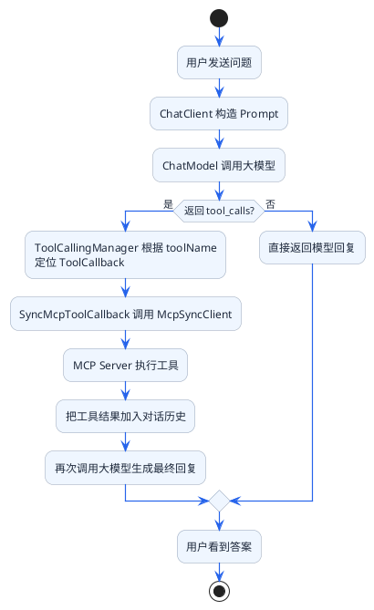
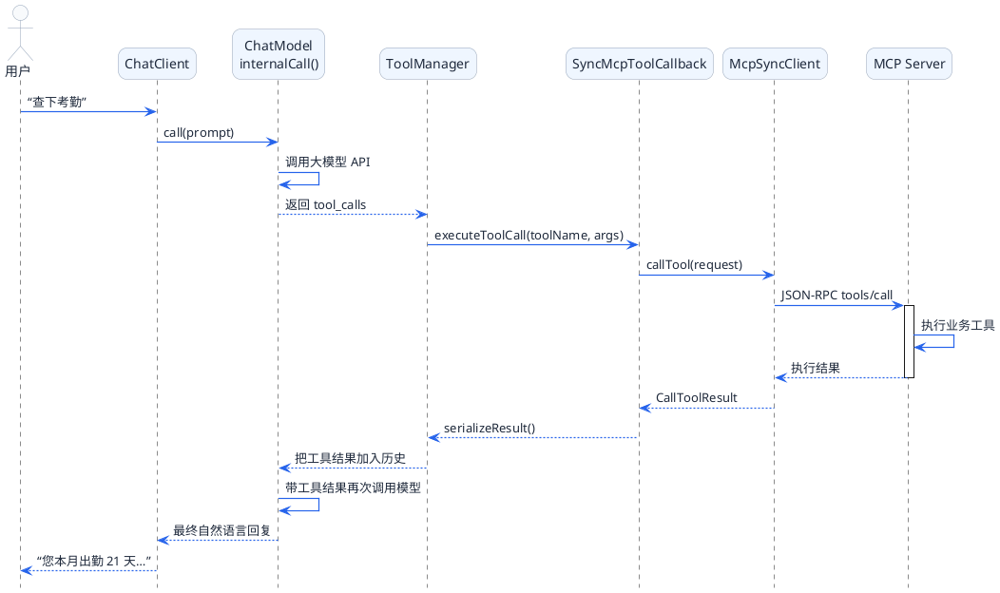

# MCP调用链路源码解密

前面几篇我们学会了怎么用Spring AI开发MCP Server和Client。但你有没有想过：

- 当用户说"帮我查下考勤"，这句话是怎么变成MCP工具调用的？
- ChatClient和MCP Client是怎么串联起来的？
- 大模型返回的`tool_calls`是怎么被执行的？

这一篇我们深入Spring AI源码，把整个链路搞清楚。

## 用信件投递理解调用链路

在看代码之前，先用一个比喻把整体流程串起来。

想象一次信件投递的过程：

```
用户写信 → 投到邮筒 → 邮局分拣 → 
派送员送信 → 收件人处理 → 写回信 → 
回信送回 → 用户收到回信
```

对应到MCP调用链路：



## 核心类关系图

先看看涉及的核心类：

```plantuml title="MCP 调用链核心类关系图" width="100%" align="left"
@startuml
left to right direction
skinparam backgroundColor transparent
skinparam shadowing false
skinparam defaultFontColor #1E293B
skinparam ArrowColor #2563EB
skinparam ArrowThickness 1.2
skinparam rectangleBorderColor #94A3B8
skinparam rectangleBackgroundColor #FFFFFF
skinparam RectangleFontColor #1E293B
skinparam cloudBorderColor #94A3B8
skinparam cloudBackgroundColor #EFF6FF
skinparam RoundCorner 18

rectangle "ChatClient" as ChatClient #DBEAFE
rectangle "ChatModel\nOpenAiChatModel.internalCall()" as ChatModel #EFF6FF
rectangle "DefaultToolCallingManager" as ToolManager #F8FAFC
rectangle "SyncMcpToolCallback" as Callback #ECFCCB
rectangle "McpSyncClient" as McpClient #FEF3C7
rectangle "SyncMcpToolCallbackProvider" as Provider #E0F2FE
cloud "MCP Server" as Server

ChatClient --> ChatModel : call()
ChatModel --> ToolManager : executeToolCalls()
ToolManager --> Callback : 根据 toolName 调用
Callback --> McpClient : callTool()
McpClient --> Server : JSON-RPC 请求
Provider ..> Callback : 创建回调实例
Provider ..> McpClient : 枚举已连接 Client 的 tools
@enduml
```



## 阶段一：从ChatClient到大模型

### 入口：ChatClient.call()

当你调用`chatClient.prompt().user(message).call().content()`时，触发了整个链路。

```java
// DefaultChatClient.java
public ChatResponse call() {
    // 1. 构建请求
    ChatClientRequest request = buildRequest();
    
    // 2. 构建Advisor链（类似拦截器链）
    CallResponseAdvisorChain chain = buildAdvisorChain();
    
    // 3. 执行调用
    return chain.nextCall(request);
}
```

这里有个Advisor链的概念。Spring AI用Advisor模式来组织处理流程，最核心的一个是`ChatModelCallAdvisor`——它负责真正调用大模型。

### ChatModelCallAdvisor：调用大模型

```java
// ChatModelCallAdvisor.java
public ChatResponse call(ChatClientRequest request) {
    // 把请求转换成Prompt
    Prompt prompt = toPrompt(request);
    
    // 调用ChatModel
    return chatModel.call(prompt);
}
```

### OpenAiChatModel.internalCall()：核心调用逻辑

这个方法是整个链路的关键枢纽：

```java
// OpenAiChatModel.java（简化版）
public ChatResponse internalCall(Prompt prompt, ChatResponse previousResponse) {
    
    // 1. 构造发给大模型的请求
    ChatCompletionRequest request = createRequest(prompt, false);
    
    // 2. 调用大模型API
    ChatCompletion completion = openAiApi.chatCompletionEntity(request);
    
    // 3. 解析大模型返回
    List<Generation> generations = parseGenerations(completion);
    ChatResponse response = new ChatResponse(generations, ...);
    
    // 4. 判断是否需要调用工具 ← 关键点！
    if (toolExecutionEligibilityPredicate.isToolExecutionRequired(prompt.getOptions(), response)) {
        
        // 5. 执行工具调用
        ToolExecutionResult toolResult = toolCallingManager.executeToolCalls(prompt, response);
        
        // 6. 如果工具要求直接返回（returnDirect=true），不再调用大模型
        if (toolResult.returnDirect()) {
            return buildDirectResponse(response, toolResult);
        }
        
        // 7. 否则，把工具结果加入对话历史，再次调用大模型
        Prompt newPrompt = new Prompt(toolResult.conversationHistory(), prompt.getOptions());
        return this.internalCall(newPrompt, response);  // 递归调用
    }
    
    // 8. 不需要调用工具，直接返回
    return response;
}
```

注意第7步的递归调用——大模型可能多次调用工具，每次都会循环这个过程，直到模型不再输出`tool_calls`。

## 阶段二：工具调用判断

### isToolExecutionRequired：要不要调用工具？

```java
// DefaultToolExecutionEligibilityPredicate.java
public boolean isToolExecutionRequired(ChatOptions options, ChatResponse response) {
    // 检查response中是否有tool_calls
    return response.getResults().stream()
            .anyMatch(generation -> {
                AssistantMessage msg = generation.getOutput();
                return msg.hasToolCalls();
            });
}
```

逻辑很简单：看大模型的返回里有没有`toolCalls`字段。有就说明模型决定要调用工具。

## 阶段三：工具执行

### DefaultToolCallingManager.executeToolCalls()

```java
// DefaultToolCallingManager.java（简化版）
public ToolExecutionResult executeToolCalls(Prompt prompt, ChatResponse response) {
    
    List<Message> conversationHistory = new ArrayList<>(prompt.getInstructions());
    boolean returnDirect = false;
    
    // 遍历所有tool_calls
    for (Generation generation : response.getResults()) {
        AssistantMessage assistantMessage = generation.getOutput();
        
        // 把assistant消息（包含tool_calls）加入历史
        conversationHistory.add(assistantMessage);
        
        // 逐个执行工具
        for (ToolCall toolCall : assistantMessage.getToolCalls()) {
            
            // 执行单个工具
            ToolCallResult result = executeToolCall(toolCall);
            
            // 把工具结果作为ToolResultMessage加入历史
            conversationHistory.add(new ToolResultMessage(toolCall.id(), result.output()));
            
            // 检查是否直接返回
            if (result.returnDirect()) {
                returnDirect = true;
            }
        }
    }
    
    return new ToolExecutionResult(conversationHistory, returnDirect);
}
```

### executeToolCall：执行单个工具

```java
// DefaultToolCallingManager.java
private ToolCallResult executeToolCall(ToolCall toolCall) {
    String toolName = toolCall.name();
    String arguments = toolCall.arguments();
    
    // 从已注册的工具中找到对应的ToolCallback
    ToolCallback toolCallback = findToolCallback(toolName);
    
    if (toolCallback == null) {
        throw new ToolExecutionException("Tool not found: " + toolName);
    }
    
    // 调用ToolCallback的call方法
    String result = toolCallback.call(arguments, toolContext);
    
    // 获取工具元数据，判断是否returnDirect
    boolean returnDirect = toolCallback.getToolMetadata().returnDirect();
    
    return new ToolCallResult(result, returnDirect);
}
```

关键点：`findToolCallback(toolName)`根据工具名找到对应的`ToolCallback`实例。

## 阶段四：MCP工具执行

### SyncMcpToolCallback.call()

对于MCP工具，`ToolCallback`的实现类是`SyncMcpToolCallback`：

```java
// SyncMcpToolCallback.java（简化版）
public class SyncMcpToolCallback implements ToolCallback {
    
    private final McpSyncClient mcpClient;
    private final McpSchema.Tool tool;
    
    @Override
    public String call(String toolCallInput, ToolContext toolContext) {
        // 1. 解析参数JSON
        Map<String, Object> arguments = parseArguments(toolCallInput);
        
        // 2. 构建MCP调用请求
        CallToolRequest request = CallToolRequest.builder()
                .name(this.tool.name())
                .arguments(arguments)
                .build();
        
        // 3. 调用MCP Server
        CallToolResult response = this.mcpClient.callTool(request);
        
        // 4. 处理错误
        if (Boolean.TRUE.equals(response.isError())) {
            throw new ToolExecutionException("Tool execution failed: " + response.content());
        }
        
        // 5. 返回结果
        return serializeResult(response.content());
    }
    
    @Override
    public ToolMetadata getToolMetadata() {
        // 默认实现返回returnDirect=false
        return ToolMetadata.builder()
                .returnDirect(false)
                .build();
    }
}
```

### McpSyncClient.callTool()

最终通过McpSyncClient发送JSON-RPC请求：

```java
// McpSyncClient.java（概念性代码）
public CallToolResult callTool(CallToolRequest request) {
    // 构建JSON-RPC请求
    JsonRpcRequest jsonRpcRequest = JsonRpcRequest.builder()
            .method("tools/call")
            .params(request)
            .id(generateId())
            .build();
    
    // 通过传输层发送请求
    JsonRpcResponse response = transport.sendRequest(jsonRpcRequest);
    
    // 解析响应
    return parseCallToolResult(response);
}
```

## 工具注册流程

### SyncMcpToolCallbackProvider

工具是怎么注册进去的？关键是`SyncMcpToolCallbackProvider`：

```java
// SyncMcpToolCallbackProvider.java（简化版）
public class SyncMcpToolCallbackProvider implements ToolCallbackProvider {
    
    private final List<McpSyncClient> mcpClients;
    private final McpToolFilter toolFilter;
    
    @Override
    public ToolCallback[] getToolCallbacks() {
        List<ToolCallback> callbacks = new ArrayList<>();
        
        // 遍历所有MCP Client
        for (McpSyncClient client : mcpClients) {
            
            // 从Server获取工具列表
            ListToolsResult result = client.listTools();
            
            for (McpSchema.Tool tool : result.tools()) {
                
                // 应用过滤器
                if (toolFilter.test(getConnectionInfo(client), tool)) {
                    // 为每个工具创建SyncMcpToolCallback
                    callbacks.add(new SyncMcpToolCallback(client, tool));
                }
            }
        }
        
        return callbacks.toArray(new ToolCallback[0]);
    }
}
```

流程是：
1. 遍历所有已连接的McpSyncClient
2. 调用`listTools()`从Server获取工具列表
3. 对每个工具创建一个`SyncMcpToolCallback`
4. 可选地应用过滤器筛选工具

## 完整调用时序图



## 调试技巧

### 推荐断点位置

当你需要排查MCP调用问题时，可以在这些位置打断点：

| 类名 | 方法 | 观察什么 |
|------|------|----------|
| OpenAiChatModel | internalCall | 大模型请求和响应内容 |
| DefaultToolCallingManager | executeToolCalls | tool_calls的解析结果 |
| DefaultToolCallingManager | executeToolCall | 单个工具的调用过程 |
| SyncMcpToolCallback | call | MCP工具的参数和返回值 |
| McpSyncClient | callTool | JSON-RPC请求内容 |

### 开启日志

在`application.yml`中添加：

```yaml
logging:
  level:
    org.springframework.ai: DEBUG
    io.modelcontextprotocol: DEBUG
```

这样可以看到完整的请求响应日志。

### 常见排查场景

**场景一：大模型没有选择调用工具**

断点位置：`OpenAiChatModel.internalCall()`的第4步判断

检查：
- 工具的description是否清晰描述了使用场景
- 用户的问题是否明确需要该工具

**场景二：工具调用了但参数不对**

断点位置：`SyncMcpToolCallback.call()`

检查：
- `toolCallInput`参数内容
- 大模型生成的参数是否符合工具定义

**场景三：MCP Server返回错误**

断点位置：`McpSyncClient.callTool()`返回处

检查：
- JSON-RPC响应的error字段
- Server端日志

## 小结

这一篇我们通过源码分析，理清了MCP调用的完整链路：

1. **入口**：ChatClient → ChatModel.internalCall()
2. **判断**：检查大模型返回是否包含tool_calls
3. **执行**：ToolCallingManager找到ToolCallback并执行
4. **MCP调用**：SyncMcpToolCallback → McpSyncClient → MCP Server
5. **结果处理**：工具结果加入对话历史，可能再次调用大模型

关键类记忆点：
- `ChatModel.internalCall()`：核心调度枢纽
- `DefaultToolCallingManager`：工具调用管理器
- `SyncMcpToolCallback`：MCP工具的包装器
- `SyncMcpToolCallbackProvider`：工具注册的源头

下一篇是最后一篇，我们会讲MCP在企业级开发中的一些进阶技巧：认证鉴权、连接重试、工具过滤、跳过模型总结等。
