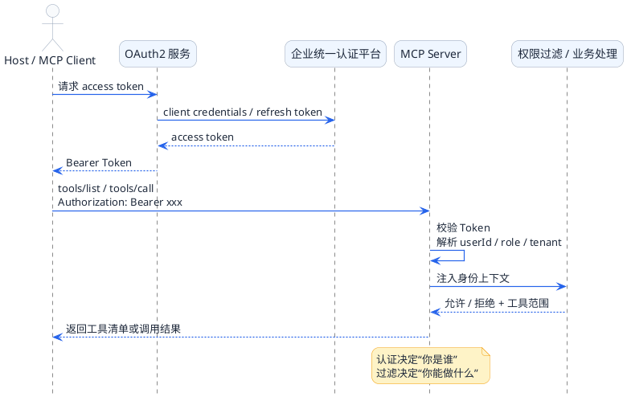

import VipInline from '@site/src/components/VipInline';

# MCP企业级开发进阶技巧

当你在本地调试MCP时，一切都很顺利。但真正推向生产环境时，肯定会有各种的问题：远程服务怎么做认证？网络断了如何自动恢复？不同用户能调用的工具不一样怎么办？这篇文章就来聊聊这些企业级开发中的进阶技巧。

## 认证鉴权：给你的MCP服务装上门禁系统

想象一下你公司的办公楼门禁系统。普通员工刷工卡只能进入自己所在楼层，管理层可以进入更多区域，而访客则需要在前台登记换取临时卡。MCP的认证鉴权机制也是类似的思路。

### 本地服务的"内部通道"

如果MCP Server和Client在同一台机器上（比如使用Stdio模式），这就相当于在公司内部走动，不需要额外的身份验证。此时认证方式通常是通过环境变量传递敏感信息：

```java
@Configuration
public class LocalMcpConfig {
    
    @Bean
    public McpSyncClient localMcpClient() {
        // 本地模式下，通过环境变量传递API密钥
        // 这些密钥用于Server内部调用第三方服务
        return McpClient.sync(
            StdioClientTransport.builder()
                .command("java")
                .args("-jar", "hr-assistant-server.jar")
                .environment(Map.of(
                    "DINGTALK_APP_KEY", System.getenv("DINGTALK_APP_KEY"),
                    "DINGTALK_APP_SECRET", System.getenv("DINGTALK_APP_SECRET"),
                    "DATABASE_PASSWORD", System.getenv("DATABASE_PASSWORD")
                ))
                .build()
        ).build();
    }
}
```

这种方式的好处是敏感信息不会在网络上传输，安全性有保障。密钥从Host环境传递给Server进程，整个过程都在本地内存中完成。

:::tip 本地模式的安全最佳实践
Stdio 模式下，通过环境变量向子进程传递敏感信息（API Key、数据库密码）是最安全的做法。密钥不会出现在配置文件里，也不会在网络上传输，整个生命周期在本机内存中完成。
:::

### 远程服务的"访客登记"

当MCP Server部署在远程服务器上时，情况就不同了。这时候每次请求都需要携带身份凭证，就像访客每次进入都要出示临时卡一样。

最常用的方式是Bearer Token认证：

```java
@Configuration
public class RemoteMcpConfig {
    
    @Value("${mcp.server.token}")
    private String accessToken;
    
    @Bean
    public McpSyncClient remoteMcpClient() {
        // 构建带认证头的HTTP客户端
        HttpClient authenticatedClient = HttpClient.newBuilder()
            .connectTimeout(Duration.ofSeconds(10))
            .build();
        
        return McpClient.sync(
            HttpClientSseClientTransport.builder()
                .sseUrl("https://mcp.company.com/sse")
                .httpClient(authenticatedClient)
                .customizeRequest(builder -> {
                    // 每次请求都携带Token
                    builder.header("Authorization", "Bearer " + accessToken);
                })
                .build()
        ).build();
    }
}
```

**服务端的验证逻辑**也需要配套实现：

```java
@Component
public class McpAuthenticationFilter implements WebFilter {
    
    @Value("${mcp.valid-tokens}")
    private Set<String> validTokens;
    
    @Override
    public Mono<Void> filter(ServerWebExchange exchange, WebFilterChain chain) {
        String authHeader = exchange.getRequest().getHeaders()
            .getFirst(HttpHeaders.AUTHORIZATION);
        
        if (authHeader == null || !authHeader.startsWith("Bearer ")) {
            exchange.getResponse().setStatusCode(HttpStatus.UNAUTHORIZED);
            return exchange.getResponse().setComplete();
        }
        
        String token = authHeader.substring(7);
        if (!validTokens.contains(token)) {
            exchange.getResponse().setStatusCode(HttpStatus.FORBIDDEN);
            return exchange.getResponse().setComplete();
        }
        
        // 可以把用户信息放入上下文，后续工具过滤会用到
        return chain.filter(exchange)
            .contextWrite(ctx -> ctx.put("userId", extractUserId(token)));
    }
}
```

### 更复杂的场景：OAuth2集成

企业环境中可能需要与现有的身份认证系统集成，比如接入公司的统一认证平台：

```java
@Service
public class OAuth2McpAuthService {
    
    private final OAuth2AuthorizedClientManager clientManager;
    
    public String obtainAccessToken() {
        OAuth2AuthorizeRequest request = OAuth2AuthorizeRequest
            .withClientRegistrationId("mcp-server")
            .principal("system")
            .build();
            
        OAuth2AuthorizedClient client = clientManager.authorize(request);
        return client.getAccessToken().getTokenValue();
    }
}
```



<VipInline />
