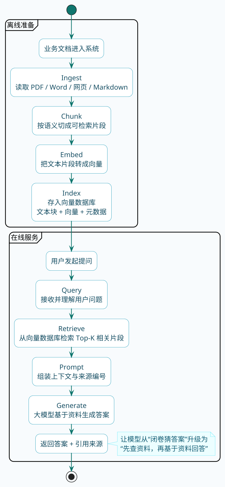

# RAG入门与核心原理概述

先来看个真实的场景。

某公司花了大价钱接入了某知名大模型，想做一个智能客服。产品经理信心满满地上线了，结果第一天就翻车了——

用户问："你们家XX-3000型号打印机的墨盒怎么换？"

AI客服回答得头头是道："首先打开打印机前盖，取出旧墨盒，将新墨盒按照箭头方向插入卡槽，听到咔哒声即可..."

听起来很专业对吧？问题是，这家公司根本就没有XX-3000这个型号。AI编了个不存在的产品，还煞有介事地教人换墨盒。

为什么会这样呢？因为大模型还有个致命的毛病——**它只会"闭卷地考试"**。

## 闭卷考试 vs 开卷考试

我们先搞清楚大模型到底是怎么工作的。

### 大模型的"学习"过程

简单说，大模型的训练就像让一个学生疯狂读书。它把互联网上能找到的文本资料都读了一遍，从中学会了三样东西：

- **语言规律**：怎么组织句子才通顺
- **常识知识**：历史事件、地理常识、科学原理这些
- **推理能力**：因果关系、逻辑推断

训练完成后，这些知识就"冻结"在模型参数里了。

### 大模型的"答题"过程

当你跟大模型对话时，它其实就在做一件事：根据你说的话，一个字一个字地往后猜。

```
你的输入：今天北京的天气
模型预测：怎 → 么 → 样 → ？ → 今 → 天 → ...
```

有点像文字接龙——根据学过的规律，每次猜一个最可能的字，串起来就成了完整的回答。

关键点来了：**模型的所有知识都是训练时塞进去的，推理的时候它没法获取新信息。**

这就是"闭卷考试"——考试的时候不能翻书，只能靠脑子里记住的东西答题。

## 闭卷考试的五个很严重的硬伤问题

:::warning 大模型局限性
搞懂了工作原理，就能理解大模型在实际应用中为什么总是翻车。
:::

### 硬伤一：编故事的本事一流

这是最让人头疼的问题，业内管它叫"幻觉"。

大模型有时候会**生成看起来很合理、但实际上纯属瞎编的内容**。就像开头那个例子，它不会说"不知道"，而是会编一个听起来像那么回事的答案。

为什么会这样？因为模型的本质是预测概率最高的下一个词，它并不真正"理解"什么是事实。当遇到不确定的问题时，它会基于语言规律生成一个"看起来像答案"的内容。

**比如我问：阿星不是程序员在抖音发布的讲解Mysql索引是什么时候？**


其实我就只讲过Mysql的分页查询，根本没讲过索引。模型却能编出一大段关于索引的内容来。🤣

### 硬伤二：知识停留在过去

大模型的知识是**训练时就冻结了的**。

你问它"2025年奥斯卡最佳导演奖得主是谁"，如果它的训练数据截止到2024年，那它要么说不知道，要么瞎编一个。

对企业应用来说，这个问题更严重——产品在更新、政策在变化、价格在调整，而大模型对这些一无所知。

### 硬伤三：专业领域一知半解

虽然训练数据是海量的，但在**某些垂直领域往往深度不够**。

比如你问："我们公司内部ERP系统的审批流程怎么走？"

大模型只能摊手——训练数据里可没有你们公司的内部系统文档。

### 硬伤四：私有数据看不见

大模型是在公开数据上训练的，它**压根接触不到**：

- 公司内部文档
- 客户资料
- 未公开的研究成果
- 个人隐私信息

所以"公司的年假制度是什么"、"我上个月的绩效得分多少"这类问题，大模型永远答不上来。

### 硬伤五：答案来源不可追溯

大模型的回答是**说不清出处的**。

```
用户：这个医疗建议的依据是什么？
模型：这是基于一般医学知识...（说不出具体引用哪篇文献）
```

**在医疗、法律、金融这些领域，"你凭什么这么说"很重要。答案得有出处，出了问题才能追责。大模型做不到这一点。**

## 开卷考试：给大模型发一本参考书

既然闭卷考试有这么多问题，那就让它开卷呗。

这个思路其实早在2020年就有人提出来了。Meta（当时还叫Facebook AI）的研究团队发表了一篇论文，核心观点很简单：**与其让模型把所有东西都记在脑子里，不如教它"先查资料，再回答"。**

这就是 **RAG（Retrieval-Augmented Generation，检索增强生成）** 的由来。

名字听着唬人，原理其实很朴素：

1. 把你的私有数据（产品文档、内部知识库等）存到一个专门的地方
2. 用户提问时，先去这个地方检索相关内容
3. 把检索到的内容和用户问题一起发给大模型
4. 大模型参考这些"资料"来回答

就这么简单。本质上就是给大模型发了一本开卷考试的参考书。

## 图书管理员的工作流程

为了更好地理解RAG，我们换个视角——把RAG系统想象成一个图书管理员。

### 管理员的日常工作

**第一件事：整理图书**（离线准备阶段）

图书管理员收到一堆新书（原始文档），需要做几件事：

1. **登记入库（Ingest）**：把各种格式的书（PDF、Word、网页等）统一登记
2. **拆分章节（Chunk）**：书太厚了，把每本书拆成一个个小章节，方便查找
3. **制作索引卡（Embed）**：给每个章节写一张索引卡，上面标注这章讲的是什么内容
4. **放入书架（Index）**：把章节和索引卡一起存放到书架上

**第二件事：帮读者找书**（在线服务阶段）

有读者来问问题了："打印机墨盒怎么换？"

1. **理解问题（Query）**：管理员先搞清楚读者想找什么
2. **检索相关章节（Retrieve）**：根据索引卡快速找到相关的章节
3. **交给专家解读（Generate）**：把找到的章节和读者的问题一起交给专家（大模型），让专家基于这些资料回答

### 技术语言版本

用技术术语来说，RAG的完整流程是：

| 阶段 | 步骤 | 干什么 |
| :--- | :--- | :--- |
| 离线准备 | Ingest | 导入原始文档，解析成文本 |
|  | Chunk | 把长文档切成小块 |
|  | Embed | 把文本块转成向量（数字表示） |
|  | Index | 存进向量数据库 |
| 在线服务 | Retrieve | 根据用户问题检索相关文档块 |
|  | Generate | 大模型基于检索结果生成回答 |

离线准备阶段跑一次就行，有新文档时增量更新；在线服务阶段每次用户提问都走一遍。



## 为什么不直接用关键词搜索？

可能有人会问：我直接用关键词搜索，像MySQL里写`LIKE '%打印机%'`，不行吗？

大部分情况下真不行。看这个对比：

| 用户怎么问 | 文档里怎么写 | 关键词搜索结果 |
| :--- | :--- | :--- |
| 这玩意儿怎么用 | 产品使用方法 | 匹配不上 |
| 价格多少钱 | 产品售价：299元 | 匹配不上 |
| 墨水没了咋办 | 更换墨盒步骤 | 匹配不上 |

问题的本质是：**关键词搜索只能匹配字面，理解不了语义。**

人能理解"这玩意儿怎么用"和"产品使用方法"是一回事，但传统数据库做不到。

RAG的检索环节用的是**语义检索**——把文字转成向量，语义相近的内容在向量空间中距离也近。所以"墨水没了咋办"和"更换墨盒步骤"能匹配上。

这个后面会详细讲。

## RAG的优势与局限

### 好处说三点

:::tip RAG 优势

**成本低，上手快**

想让大模型懂你的业务知识，有两条路：一是拿你的数据去微调模型，二是用RAG。

微调要准备训练数据、要GPU算力、要好几天时间。RAG就简单多了，把文档灌进向量库，当天就能跑起来。

**知识更新方便**

微调完的模型，知识就固化了。要更新？再微调一轮。

RAG不一样，文档有变动，重新处理一下就行，甚至可以做到实时检索最新数据。

**答案可追溯**

大模型回答的时候，你能看到它参考了哪些文档。用户觉得答案有问题，可以去查原文验证。这在医疗、金融、法务等领域很关键——出了问题能查到底。

:::

### 坑也说三点

:::caution 注意事项
**效果取决于知识库质量**

垃圾进，垃圾出。知识库里的文档质量差、组织乱，检索出来的内容也不会好到哪去。

**系统复杂度上来了**

原本直接调大模型就完事，现在多了文档处理、向量存储、检索排序这些环节。任何一个环节出问题，最终效果都会打折扣。

**检索耗时得考虑**

多了检索这一步，响应时间必然变长。有研究说检索环节能占整个RAG流程耗时的60%以上。如果业务对延迟敏感，这块得重点优化。
:::

## RAG能用在哪些场景？

### 企业内部知识库

这是RAG最经典的场景。

员工想查公司的报销制度、请假流程、技术规范，以前要么翻Wiki翻半天，要么直接问同事。现在接个RAG系统，用自然语言问一句就能得到答案，还能告诉你出处在哪个文档。

更进一步，如果把RAG和工具调用（比如MCP）结合起来，还能查实时数据：

- "这个月我有几天考勤异常？"——对接HR系统
- "华东区上个月销售额多少？"——对接BI数据
- "帮我查一下订单#12345的物流状态"——对接订单系统

这时候就不只是知识库助手了，而是真正的企业智能助手。

### 智能客服

传统客服机器人靠关键词匹配和预设问答对，覆盖不到的问题肯定就抓瞎了。

接入RAG后，可以把产品文档、FAQ、历史工单都灌进去，回答的范围和灵活度都能够上升了一个台阶。

### 专业领域助手

法律、金融、医疗这些行业，对准确性会要求特别的高。

- **法律**：检索相关法条、判例，辅助写诉状
- **金融**：基于研报、财报回答投资问题
- **医疗**：检索医学文献、用药指南，辅助诊断

这些场景不仅需要答案准确，还需要可追溯——RAG天然支持这点。

### 代码与技术文档助手

把公司的代码仓库、技术文档、API文档接进去，新人问"这个接口怎么调用"、"这块业务逻辑在哪个模块"，系统能直接检索到相关代码和文档给出回答。

GitHub Copilot、Cursor这类工具，背后也大量用到了类似的思路。

## 做好RAG其实也没那么简单

看到这里，你可能觉得RAG原理也不复杂，搭一个demo似乎很快啊。

确实，跑通一个能用的RAG原型，可能一下午就够了。但从"能用"到"好用"，中间可是隔着一堆坑。

**文档处理的坑**

PDF里的表格、扫描件、双栏排版，每一个都是坑。文档怎么切块也有讲究——切太大检索不精准，切太小上下文丢失。

**问题理解的坑**

用户说"报销咋整"，你拿这四个字去检索，效果能好吗？得把它展开成"公司报销流程是什么，需要准备哪些材料"。

多轮对话更麻烦——用户第一轮问"年假有多少天"，第二轮接着问"怎么申请"。这个"怎么申请"单独拿去检索，系统根本不知道在问啥。

**检索优化的坑**

纯向量检索对"BRD-2024-0312这个需求"这种精确编号匹配很弱，需要和关键词检索结合。检索返回多少条？选少了漏信息，选多了大模型被干扰。

**还有更多**

意图识别、结果重排、会话记忆、幻觉抑制... 每个点单独拎出来都不算特别难，但组合在一起就是指数级的复杂度。

## 小结

这篇文章带你搞清楚了三件事：

1. **大模型为什么需要RAG**：闭卷考试有硬伤，开卷考试才靠谱
2. **RAG的核心流程**：离线建索引，在线做检索，最后让大模型基于检索结果回答
3. **RAG的应用场景**：知识库、客服、专业领域助手等

后面的文章会把RAG的每个环节拆开，聊聊实际落地时的做法和踩坑经验。包括：

- 文档怎么预处理和切块
- 向量是什么，怎么做语义检索
- 向量数据库怎么选
- 检索效果怎么优化
- 怎么让大模型的回答更靠谱

一步步来，保证你能真正上手，而不是只停留在概念层面。
