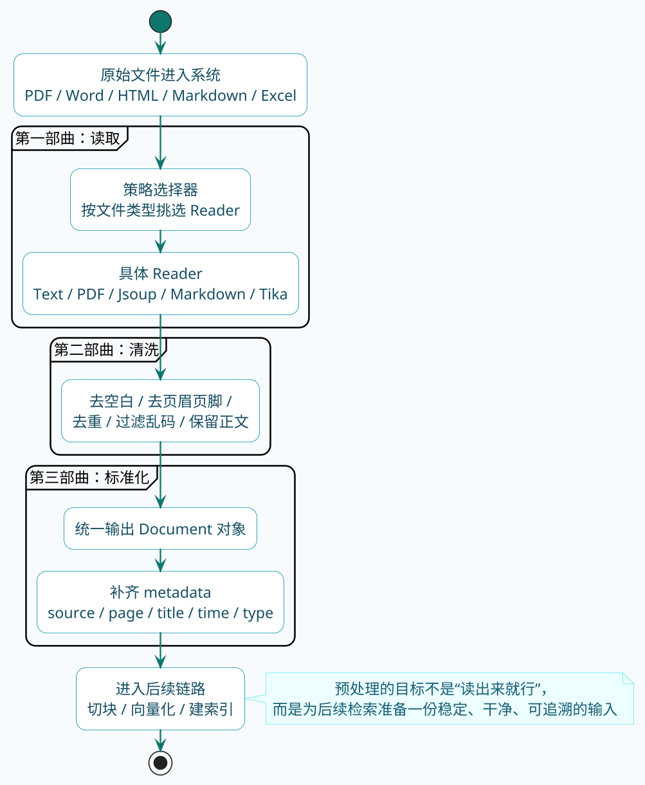

# 知识入库前的"洗澡三部曲"

下厨房做饭，第一步是什么？

不是开火，不是切菜，而是**洗菜**。

买回来的青菜上面有泥土、虫子、农药残留，不洗干净直接下锅，做出来的菜能好吃吗？

RAG也是一样的道理。

企业里的文档五花八门——PDF里混着图片和表格，Word里有批注和修订记录，网页上有广告和导航栏，Markdown里有各种格式标记。

这些"脏东西"不清理干净，后面的切块、向量化、检索全都会受影响。

**垃圾进，垃圾出**——这是RAG领域最经典的一句话。

:::info 核心原则
**垃圾进，垃圾出（Garbage In, Garbage Out）** 是RAG最重要的工程原则。文档预处理是整个RAG链路的地基，这一步做不好，后面的切块、向量化、检索再怎么优化也是在烂地基上盖楼。
:::

## 三部曲概览

文档预处理这个活儿，我把它给总结成了三部曲：

1. **读取**：把各种格式的文档加载进来
2. **清洗**：去掉无用的内容和干扰字符
3. **标准化**：统一成后续流程能处理的格式

听起来简单，实际做起来坑是不少的。下面来一个个讲。



## 第一部曲：读取——把文档加载进来

### 不同格式，不同读法

企业里的文档格式可是非常的多了：

- **纯文本**：TXT、LOG
- **办公文档**：PDF、Word、PPT、Excel
- **网页**：HTML
- **标记语言**：Markdown、XML、JSON
- **富文本**：RTF

每种格式的解析方式都不一样。PDF要用专门的库提取文字，Word要解析XML结构，HTML要处理DOM树。

如果每种格式都手写解析逻辑，代码会变得又臭又长。

### Spring AI的DocumentReader

好消息是，Spring AI已经帮我们封装好了一套DocumentReader体系。

核心接口是`DocumentReader`，不同格式对应不同的实现类：

| 读取器 | 支持格式 | 所在包 |
| :--- | :--- | :--- |
| TextReader | txt、tex | spring-ai-commons |
| PagePdfDocumentReader | PDF（按页） | spring-ai-pdf-document-reader |
| ParagraphPdfDocumentReader | PDF（按段落） | spring-ai-pdf-document-reader |
| JsoupDocumentReader | HTML | spring-ai-jsoup-document-reader |
| MarkdownDocumentReader | Markdown | spring-ai-markdown-document-reader |
| TikaDocumentReader | 多种格式（通用） | spring-ai-tika-document-reader |

用法都很统一：创建Reader，调用`get()`方法，拿到`Document`列表。

### 策略模式：让代码更优雅

实际项目中，用户上传的文件格式是不确定的。今天传个PDF，明天传个Word，后天传个Markdown。

如果用一堆if-else来判断，代码会很难看：

```java
// 不推荐的写法
if (filename.endsWith(".pdf")) {
    // PDF处理逻辑
} else if (filename.endsWith(".docx")) {
    // Word处理逻辑
} else if (filename.endsWith(".md")) {
    // Markdown处理逻辑
}
// ... 越写越长
```

更优雅的做法是用**策略模式**——定义一个接口，不同格式各自实现。

先定义策略接口：

```java
public interface ReaderHandler {
    /**
     * 是否可以处理该文件
     */
    boolean canHandle(File file);

    /**
     * 读取文件并返回Document列表
     */
    List<Document> readhandle(File file) throws IOException;
}
```

然后为每种格式实现一个策略类。

## 示例中项目地址

- 项目地址：[https://gitee.com/shining-stars-l/super-ai-hub](https://gitee.com/shining-stars-l/super-ai-hub)
- 项目模块：`ai-example-spring-ai-rag`
- 测试文档位置：`项目根目录/document/Java语言特性与核心概念.md`

### 各种格式的读取示例

**纯文本读取**

最简单的情况，直接读就完事：

```java
@Component
public class TextReaderHandler implements ReaderHandler {

    @Override
    public boolean canHandle(File file) {
        String name = file.getName().toLowerCase();
        return name.endsWith(".txt") || name.endsWith(".log");
    }

    @Override
    public List<Document> readhandle(File file) throws IOException {
        Resource resource = new FileSystemResource(file);
        return new TextReader(resource).get();
    }
}
```

**PDF读取**

PDF要复杂一些，有两种读取方式：

- `PagePdfDocumentReader`：按页读取，每一页生成一个Document
- `ParagraphPdfDocumentReader`：按段落读取，保留段落完整性

按页读取更简单，按段落读取语义更完整。我一般推荐**先试按段落，不行再换按页**。

:::tip PDF读取策略
优先尝试`ParagraphPdfDocumentReader`（按段落），它能保留完整的段落语义，切块效果更好。只有当PDF格式不规范（扫描件转文字、表格混排等）导致按段落读取效果差时，再换成`PagePdfDocumentReader`（按页）。
:::

```java
@Component
public class PdfReaderHandler implements ReaderHandler {

    @Override
    public boolean canHandle(File file) {
        return file.getName().toLowerCase().endsWith(".pdf");
    }

    @Override
    public List<Document> readhandle(File file) throws IOException {
        PdfDocumentReaderConfig config = PdfDocumentReaderConfig.builder()
                // 忽略顶部50单位（跳过页眉）
                .withPageTopMargin(50)
                // 忽略底部50单位（跳过页脚）
                .withPageBottomMargin(50)
                // 每页一个Document
                .withPagesPerDocument(1)
                .withPageExtractedTextFormatter(new ExtractedTextFormatter.Builder()
                        // 每页额外忽略前0行
                        .withNumberOfTopTextLinesToDelete(0) 
                        .build())
                .build();

        Resource resource = new FileSystemResource(file);
        return new PagePdfDocumentReader(resource, config).get();
    }
}
```

需要先加依赖：

```xml
<dependency>
    <groupId>org.springframework.ai</groupId>
    <artifactId>spring-ai-pdf-document-reader</artifactId>
    <version>1.1.0</version>
</dependency>
```

**HTML读取**

HTML最麻烦的是那些乱七八糟的标签——导航栏、广告、脚本。我们只要正文内容。

JsoupDocumentReader支持用CSS选择器指定要提取的内容：

```java
@Component
public class HtmlReaderHandler implements ReaderHandler {

    @Override
    public boolean canHandle(File file) {
        String name = file.getName().toLowerCase();
        return name.endsWith(".html") || name.endsWith(".htm");
    }

    @Override
    public List<Document> readhandle(File file) throws IOException {
        JsoupDocumentReaderConfig config = JsoupDocumentReaderConfig.builder()
                // 只提取正文区域
                .selector("article, .content, main")  
                .charset("UTF-8")
                // 不包含链接
                .includeLinkUrls(false)
                // 元数据
                .metadataTags(List.of("author", "date"))
                // 自定义元数据
                .additionalMetadata("filename", file.getName())
                .build();
        return new JsoupDocumentReader(new FileSystemResource(file), config).get();
    }
}
```

依赖：

```xml
<dependency>
    <groupId>org.springframework.ai</groupId>
    <artifactId>spring-ai-jsoup-document-reader</artifactId>
    <version>1.1.0</version>
</dependency>
```

**Markdown读取**

Markdown比较规整，读取起来相对简单：

```java
@Component
public class MarkdownReaderHandler implements ReaderHandler {

    @Override
    public boolean canHandle(File file) {
        return file.getName().toLowerCase().endsWith(".md");
    }

    @Override
    public List<Document> readhandle(File file) throws IOException {
        MarkdownDocumentReaderConfig config = 
                MarkdownDocumentReaderConfig.builder()
                // 遇到分割线创建新Document
                .withHorizontalRuleCreateDocument(true)
                // 包含代码块        
                .withIncludeCodeBlock(true)
                // 包含引用块        
                .withIncludeBlockquote(true)  
                // 添加文件名元数据
                .withAdditionalMetadata("filename", file.getName())
                .build();
        
        Resource resource = new FileSystemResource(file);
        return new MarkdownDocumentReader(resource, config).get();
    }
}
```

依赖：

```xml
<dependency>
    <groupId>org.springframework.ai</groupId>
    <artifactId>spring-ai-markdown-document-reader</artifactId>
    <version>1.1.0</version>
</dependency>
```

**万能读取器：Tika**

如果你懒得为每种格式写一个Reader，可以用Tika。

Tika是Apache出品的文档解析神器，支持上千种文件格式。它会自动识别文件类型并提取文本。

```java
@Component
public class TikaReaderHandler implements ReaderHandler {

    @Override
    public boolean canHandle(File file) {
        // 作为兜底策略，支持所有格式
        String name = file.getName().toLowerCase();
        return name.endsWith(".doc") || name.endsWith(".docx") 
            || name.endsWith(".ppt") || name.endsWith(".pptx")
            || name.endsWith(".xls") || name.endsWith(".xlsx");
    }

    @Override
    public List<Document> readhandle(File file) throws IOException {
        Resource resource = new FileSystemResource(file);
        return new TikaDocumentReader(resource).get();
    }
}
```

依赖：

```xml
<dependency>
    <groupId>org.springframework.ai</groupId>
    <artifactId>spring-ai-tika-document-reader</artifactId>
    <version>1.1.0</version>
</dependency>
```

### 策略选择器

有了各种策略实现，还需要一个策略上下文来根据文件类型选择合适的对应策略实现：

```java
@Component
public class ReaderHandlerContext {

    private final List<ReaderHandler> readerHandlerList;

    public ReaderHandlerContext(List<ReaderHandler> readerHandlerList) {
        this.readerHandlerList = readerHandlerList;
    }

    public List<Document> read(File file) throws IOException {
        ReaderHandler readerHandler = readerHandlerList.stream()
                .filter(handler -> handler.canHandle(file))
                .findFirst()
                .orElseThrow(() -> new RuntimeException("此文件类型不支持，文件类型: " 
                        + file.getName()));
        return readerHandler.readhandle(file);
    }
}
```

Spring会自动注入所有实现了`ReaderHandler`接口的Bean，遍历找到能处理的就行。

## 第二部曲：清洗——去掉脏东西

### 读取出来的文本长什么样

以PDF为例，读取出来的文本可能长这样：

```
   第 1 页

产品使用手册

   版本 2.0


一、产品概述

  本产品是...

  本产品是...

<<< 页眉：XX公司内部文档 >>>

--- 第 2 页 ---
```

问题一大堆：
- 多余的空行和空格
- 重复的内容
- 页眉页脚的干扰信息
- 页码标记
- 乱码和特殊字符

这些东西如果不清理，会影响后面的切块和检索效果。

### 常见的清洗操作

**去除多余空白**

```java
// 多个空白字符（空格、制表符、换行）合并成一个空格
text = text.replaceAll("\\s+", " ").trim();
```

**去除无意义字符**

```java
// 只保留字母、数字、标点、空白和换行
text = text.replaceAll("[^\\p{L}\\p{N}\\p{P}\\p{Z}\\n]", "");
```

**去除重复段落**

有些文档会有重复的内容（比如每页都有的页眉），需要去重：

```java
String[] paragraphs = text.split("\\n+");
Set<String> seen = new LinkedHashSet<>();  // 保持顺序的去重
for (String para : paragraphs) {
    String trimmed = para.trim();
    if (!trimmed.isEmpty()) {
        seen.add(trimmed);
    }
}
text = String.join("\n", seen);
```

### 完整的清洗方法

把上面的操作整合起来：

```java
public class DocumentClearHandler {
    
    
    public static List<Document> clearDocuments(List<Document> documents) {
        if (CollectionUtils.isEmpty(documents)) {
            return documents;
        }
        
        return documents.stream()
                .map(doc -> {
                    if (doc == null || doc.getText() == null) {
                        return doc;
                    }
                    
                    String text = doc.getText();
                    
                    // 1. 去掉多余空白字符
                    text = text.replaceAll("\\s+", " ").trim();
                    
                    // 2. 去掉无意义的乱码或特殊符号
                    text = text.replaceAll("[^\\p{L}\\p{N}\\p{P}\\p{Z}\\n]", "");
                    
                    // 3. 去除重复段落
                    String[] paragraphs = text.split("\\n+");
                    Set<String> seen = new LinkedHashSet<>();
                    for (String para : paragraphs) {
                        String trimmed = para.trim();
                        if (!trimmed.isEmpty()) {
                            seen.add(trimmed);
                        }
                    }
                    text = String.join("\n", seen);
                    
                    // 4. 重新创建Document，保留原有的元数据
                    return new Document(text, doc.getMetadata());
                })
                .collect(Collectors.toList());
    }
}
```

### 针对特定场景的清洗

上面是通用的清洗逻辑，实际项目中可能还需要针对具体场景做定制化清洗。

**场景一：技术文档**

技术文档里经常有代码块，代码块里的空白和特殊字符是有意义的，不能随便删。

```java
// 保护代码块，先用占位符替换
Pattern codePattern = Pattern.compile("```[\\s\\S]*?```");
Matcher matcher = codePattern.matcher(text);
List<String> codeBlocks = new ArrayList<>();
while (matcher.find()) {
    codeBlocks.add(matcher.group());
}
text = matcher.replaceAll("__CODE_BLOCK__");

// 清洗其他部分
text = cleanNormalText(text);

// 还原代码块
for (String block : codeBlocks) {
    text = text.replaceFirst("__CODE_BLOCK__", Matcher.quoteReplacement(block));
}
```

**场景二：法律文档**

法律文档里的条款编号（如"第一条"、"（一）"）是有意义的，不能删。

```java
// 不要删除条款编号
text = text.replaceAll("(?<!第|（)[^\\p{L}\\p{N}\\p{P}\\p{Z}\\n]", "");
```

**场景三：财务报表**

财务报表里的数字和表格格式很重要，清洗时要小心。

这种情况我建议**少清洗，甚至不清洗**，保留原始格式，后面用专门的表格处理逻辑。

## 第三部曲：标准化——统一输出格式

### Document对象结构

清洗完之后，所有内容都应该封装成标准的`Document`对象：

```java
public class Document {
    private String text;            // 文本内容
    private Map<String, Object> metadata;  // 元数据
    
    // ...
}
```

`text`是正文内容，`metadata`是元数据——记录这段文本的附加信息。

### 元数据的作用

元数据很重要，但经常被忽视。

常见的元数据包括：
- **文件名**：这段内容来自哪个文件
- **页码**：在第几页
- **章节**：属于哪个章节
- **创建时间**：文档什么时候创建的
- **来源URL**：如果是网页，原始链接是什么

元数据在后面检索的时候很有用：
- 可以过滤："只搜索2024年之后的文档"
- 可以溯源："这个回答来自《产品手册.pdf》第3页"
- 可以分权："只搜索用户有权限访问的文档"

:::info 元数据的三大价值
元数据在RAG系统里承担三个关键职责：**过滤**（按时间、类型、权限缩小检索范围）、**溯源**（告诉用户答案来自哪里）、**分权**（控制不同用户只能访问其有权限的内容）。这三个功能在企业级RAG系统中尤为重要，从一开始就要设计好。
:::

### 添加元数据的示例

```java
@Override
public List<Document> read(File file) throws IOException {
    Resource resource = new FileSystemResource(file);
    List<Document> docs = new TikaDocumentReader(resource).get();
    
    // 为每个Document添加元数据
    for (Document doc : docs) {
        doc.getMetadata().put("filename", file.getName());
        doc.getMetadata().put("filepath", file.getAbsolutePath());
        doc.getMetadata().put("importTime", System.currentTimeMillis());
        doc.getMetadata().put("fileSize", file.length());
    }
    
    return docs;
}
```

## 踩坑指南

做了这么多项目，我总结了一些常见的坑：

:::warning 常见坑点速览
文档预处理有五大高频坑：**PDF扫描件**无法直接提取文字、**表格结构**读取后丢失、**编码问题**导致乱码、**大文件**一次性加载OOM、**特殊格式**无法处理。提前了解这些坑，能节省大量排查时间。
:::

### 坑一：PDF扫描件

很多企业的PDF是扫描件——就是把纸质文档扫描成图片，然后打包成PDF。

这种PDF用普通的Reader是提取不出文字的，因为里面根本没有文字，只有图片。

**解决方案**：用OCR（光学字符识别）先把图片里的文字提取出来。推荐用Tesseract或者云厂商的OCR服务。

### 坑二：表格数据丢失

PDF和Word里的表格，读取出来经常会变成一堆乱序的文字，表格结构全丢了。

```
原始表格：
| 产品 | 价格 |
| A    | 100  |
| B    | 200  |

读取结果：
产品 价格 A 100 B 200
```

**解决方案**：
1. 用专门的表格提取工具（如Tabula for PDF）
2. 把表格转成Markdown格式存储
3. 对于重要表格，考虑单独存储和检索

### 坑三：编码问题

不同来源的文档编码可能不一样——有的UTF-8，有的GBK，有的甚至是古老的GB2312。

编码不对，读出来就是乱码。

**解决方案**：
1. 尝试自动检测编码（可以用juniversalchardet库）
2. 明确指定编码
3. 统一转换为UTF-8

### 坑四：大文件内存爆炸

几百MB的PDF，一次性加载到内存里，分分钟OOM。

**解决方案**：
1. 分页读取，每次只处理几页
2. 用流式处理，边读边处理
3. 限制上传文件的大小

:::caution 大文件处理
处理大文件时，务必采用分页或流式方式，切勿一次性加载到内存。建议在系统入口处设置文件大小限制（如最大50MB），超出限制要求用户拆分后再上传，或者在后台用异步任务分批处理。
:::

### 坑五：特殊格式处理不了

总会遇到一些奇葩格式——老版本的Word（.doc）、WPS特有格式、CAD图纸...

**解决方案**：
1. 能转换的先转换成通用格式（如转PDF）
2. 实在不行就跳过，记录日志，人工处理

## 完整示例

把前面的内容整合起来，一个完整的文档预处理服务长这样：

### 调用入口

**位置：** `org.javaup.ai.controller.DocumentController#readDocument`
```java
@RequestMapping("/read")
public List<Document> readDocument(@RequestParam("filePath") String filePath) {
    File file = new File(filePath);
    if (!file.exists() || !file.isFile()) {
        throw new RuntimeException("文件不存在或不是有效文件: " + filePath);
    }
    return documentPreprocessService.process(file);
}
```

```java
@Slf4j
@Service
public class DocumentPreprocessService {

    private final ReaderHandlerContext readerHandlerContext;

    public DocumentPreprocessService(ReaderHandlerContext readerHandlerContext) {
        this.readerHandlerContext = readerHandlerContext;
    }

    /**
     * 处理单个文件
     */
    public List<Document> process(File file) {
        try {
            // 1. 读取文档
            log.info("开始读取文档: {}", file.getName());
            List<Document> docs = readerHandlerContext.read(file);
            log.info("读取完成，共 {} 个Document", docs.size());

            // 2. 清洗文档
            log.info("开始清洗文档");
            docs = DocumentClearHandler.clearDocuments(docs);
            log.info("清洗完成");

            // 3. 添加元数据
            log.info("添加元数据");
            for (Document doc : docs) {
                doc.getMetadata().put("filename", file.getName());
                doc.getMetadata().put("processTime", System.currentTimeMillis());
            }
            return docs;
        } catch (Exception e) {
            log.error("处理文档失败: {}", file.getName(), e);
            throw new RuntimeException("文档处理失败: " + e.getMessage(), e);
        }
    }
}
```

### 结果


## 小结

这篇文章讲了文档预处理的三部曲：

1. **读取**：用DocumentReader把各种格式的文档加载进来，策略模式让代码更优雅
2. **清洗**：去除空白、乱码、重复内容，针对不同场景定制清洗逻辑
3. **标准化**：统一封装成Document对象，别忘了添加元数据

记住那句话：**垃圾进，垃圾出**。文档预处理是RAG的第一步，这一步做不好，后面再怎么优化也白搭。

下一篇讲文档切块——如何把长文档切成合适大小的片段。
