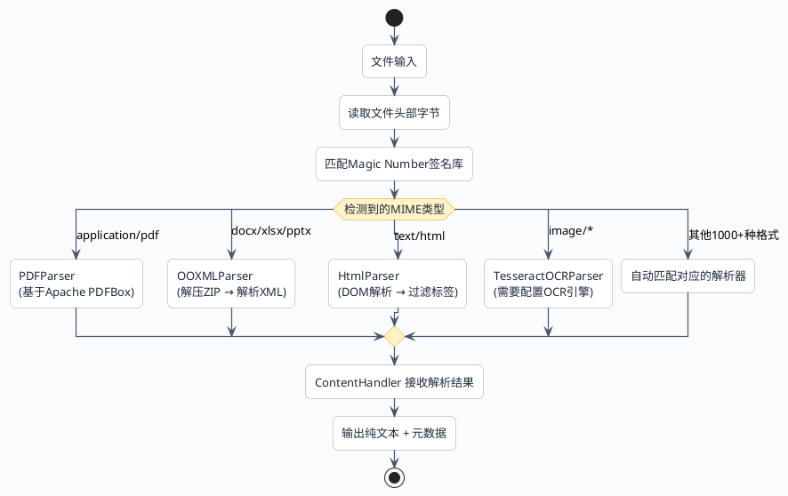
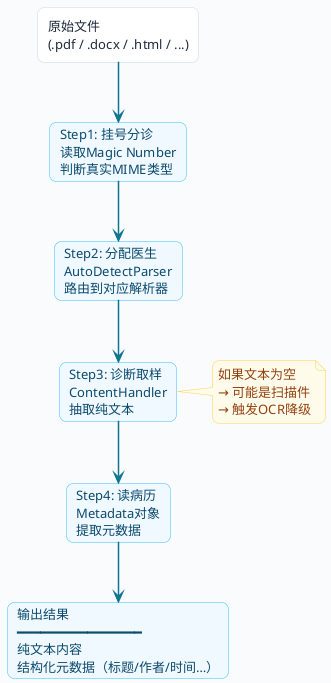

# 搞懂Tika才能做好RAG文档解析

先来个例子。

朋友小陈做了一个内部知识库系统——员工上传各种产品手册和技术文档，然后通过AI问答来检索。系统上线当天，领导试了一下：

> "我们XX-200系列的安装步骤是什么？"

AI回答得特别自信：

> "XX-200系列的安装步骤如下：1. 打开包装箱取出主机……2. 连接电源线……"

乍一看挺像那么回事。但问题来了——**整个回答跟实际手册上写的完全不一样**，AI在一本正经地编。

小陈开始排查。先查向量检索，没问题；再查Embedding模型，也正常；最后把解析出来的文本一看——愣住了。

有三份产品手册上传后的解析结果：

- 第一份PDF：解析出来**全是空的**。后来才发现这份PDF是扫描件，里面没有文字层。
- 第二份Word：解析出来一堆`PK`开头的乱码。
- 第三份PDF：倒是解析出东西了，但中文全变成了`浜у搧璇存槑`这种天书。

**三份文档，三种翻车方式。** 解析这一步出了问题，后面的切块、向量化、检索全白搭。

这个故事引出了一个很多人忽视的事实：**文档解析是RAG流水线上最容易翻车的环节**，而且翻车方式千奇百怪。

:::danger 铁律
**垃圾进，垃圾出。** 文档没解析好，后面再怎么调优Embedding、向量库、Prompt，都是在沙子上盖楼。
:::

## 文件不是你以为的那样

在讲怎么解决之前，得先搞清楚：为什么"读文件"这件事这么难？

来打个比方。文件就像快递包裹——你拿到一个包裹，得经过三步才能用上里面的东西：

1. **看标签**：包裹外面贴着"易碎品"标签——但有没有可能贴错了？
2. **拆包装**：有的用纸箱，有的用泡沫，有的用真空袋——拆法完全不同
3. **看内容**：拆开之后，里面可能是中文说明书，也可能是日文说明书——你得看得懂才行

文件也是这三层关系：**后缀名是标签，文件格式是包装，内容编码是语言**。

### 标签会贴错——后缀名靠不住

文件后缀就是个名字，谁都可以改。实际工作中你会遇到各种奇葩情况：

- 行政同事把`.xlsx`报表改成`.txt`再发邮件，因为公司邮件系统拦Excel附件
- 某个上游系统吐出来的文件压根没后缀，就叫`upload_20240801_001`
- 更离谱的——有人把一个HTML网页另存为`.pdf`后缀发过来

所以如果你的代码里有这样的逻辑：

```java
if (fileName.endsWith(".pdf")) {
    // 按PDF处理
}
```

那只是在**看标签拆包裹**，迟早要翻车啊。

### 包装方式天差地别——文件格式的本质

不同格式的文件，底层结构完全不一样。我们挑最常见的三类来看看它们的"内部"。

**第一类：素颜出镜型（纯文本）**

`.txt`、`.csv`、`.log`这些文件最老实，打开就是文字本身，没有任何包装。`Files.readString()`就能直接读。

**第二类：俄罗斯套娃型（Office文档）**

`.docx`文件的真实身份是——**一个ZIP压缩包**。不信的话，你现在就可以做个实验：随便找个Word文档，把后缀改成`.zip`，然后解压。

你会看到这样的目录结构：

```
解压后的.docx/
├── [Content_Types].xml
├── _rels/
├── docProps/
│   ├── app.xml        ← 文档属性
│   └── core.xml       ← 作者、创建时间等
└── word/
    ├── document.xml   ← 正文藏在这里
    ├── styles.xml     ← 样式
    └── media/         ← 图片
```

正文内容被一层层XML标签裹着：

```xml
<w:body>
  <w:p>
    <w:r>
      <w:rPr><w:b/></w:rPr>
      <w:t>产品概述</w:t>
    </w:r>
  </w:p>
</w:body>
```

你直接用`new String(bytes)`去读一个`.docx`，读到的是ZIP的二进制数据，自然是一堆乱码。

`.xlsx`、`.pptx`也是同样的套娃结构，区别只在于XML的schema不同。

**第三类：密码本型（PDF）**

PDF是最复杂的。它的文本不是"存"在文件里的，而是**画**在页面上的。

PDF内部用自己的一套指令来描述页面内容：

```
BT
/F1 12 Tf
100 700 Td
(Hello World) Tj
ET
```

这段指令的意思是："用F1字体、12号字，在坐标(100,700)的位置，画出Hello World这几个字。"

所以PDF的文字是"渲染指令"，不是你理解的"文本数据"。更麻烦的是，有些PDF的文字干脆就不是指令，而是**一张图片**——扫描件就是这种情况。

:::info 来小总结一下
- TXT像明信片，内容写在表面，一眼就能看到
- DOCX像快递箱，得拆开好几层包装才能拿到东西
- PDF像保险柜，得用专门的钥匙（解析器）才能打开
:::

### 内容可能是"外语"——编码问题

包裹拆开了，但里面的说明书是外语写的——这就是编码问题。

同一段中文"产品使用说明"，用不同编码存储，字节序列完全不同。如果你用错误的编码去解读，就会出现乱码。

最常见的两种编码冲突：

**UTF-8文件被当成GBK读**：
```
正确内容：使用说明
乱码结果：浣跨敤璇存槑
```

**GBK文件被当成UTF-8读**：
```
正确内容：使用说明
乱码结果：ʹ��˵��（或者直接报错）
```

更头疼的情况是，有些历史遗留系统生成的文档，**同一个文件里混用了多种编码**。前半段是UTF-8，后半段变成了GBK，这种你手动处理都费劲。

## Tika登场：RAG的文件翻译官

了解了文件格式的这些"坑"，你就知道为什么需要一个专业的文档解析工具了。自己手写解析逻辑？那得对每种格式都了如指掌，光PDF的规范文档就有几百页。

Apache Tika就是干这个活的。它是Apache基金会的开源项目，一句话概括它的能力：

> **不管你给它什么格式的文件，它都能还你干净的纯文本和结构化的元数据。**

支持的格式超过**1000种MIME类型**，日常遇到的PDF、Word、Excel、PPT、HTML、邮件、图片、压缩包全都覆盖。

但Tika到底是怎么做到的？很多教程直接扔一段代码就完事了，不讲原理。星哥带你来换个思路——可以把Tika给比喻成一家**专科医院**，文件是"病人"，来看看完整的"诊疗流程"。

### 第一步：挂号分诊——MIME类型检测

"病人"（文件）进了医院，第一步不是直接治疗，而是**分诊**——搞清楚你到底得了什么病（文件到底是什么格式）。

Tika不看后缀名。它用的是**魔数检测（Magic Number Detection）** 技术——直接翻开文件的"病历本"（前几个字节），看里面的"体检指标"。

每种文件格式的开头几个字节都有固定的"指纹"：

| 文件格式 | 开头字节（十六进制） | 可读形式 |
| :--- | :--- | :--- |
| PDF | `25 50 44 46` | `%PDF` |
| ZIP/DOCX/XLSX | `50 4B 03 04` | `PK` |
| PNG | `89 50 4E 47` | `‰PNG` |
| JPEG | `FF D8 FF` | 不可读 |
| GIF | `47 49 46 38` | `GIF8` |

Tika把文件头部字节和内置的签名库进行匹配，就能精准判断出真实类型。比如一个后缀是`.txt`的文件，如果开头字节是`PK`，Tika会告诉你："这其实是个ZIP压缩包。"

```java
Tika tika = new Tika();
// 不管后缀是什么，都能识别真实类型
String realType = tika.detect(new File("可疑文件.txt"));
// 输出可能是：application/zip
```

:::tip 小知识
"Magic Number"这个叫法来源于早期Unix系统。那时候就是靠文件头部的几个"魔法数字"来判断文件类型的，这个传统一直沿用到了今天。
:::

### 第二步：分配专科医生——Parser自动路由

知道了文件是什么类型，下一步就是分配对口的"专科医生"（解析器）来处理。

Tika内部有个核心组件叫`AutoDetectParser`，它就是"导诊台"。根据MIME类型，它会自动选择对应的解析器：



这个路由过程对开发者完全透明，你只需要调用一行代码，剩下的Tika全搞定。

### 第三步：诊断取样——文本抽取

"专科医生"开始工作了。不管原始文件的"病情"多复杂——PDF里的渲染指令、Word里的XML标签、HTML里的DOM节点——解析器的任务就一个：**把里面有价值的文字全捞出来**。

这一步的核心角色是`ContentHandler`（内容处理器），Tika最常用的实现是`BodyContentHandler`。它像一个"记录员"，把解析器吐出来的文字一段段记下来，最后拼成一个完整的纯文本字符串。

有个需要注意的地方：`BodyContentHandler`可以设置最大字符数限制。如果不设限制，遇到一个几百兆的文件，解析出来的文本可能直接把内存撑爆。

```java
// 限制最多接收5MB文本，超出会抛异常
BodyContentHandler handler = new BodyContentHandler(5 * 1024 * 1024);

// 如果传-1，不限制——小心OOM
BodyContentHandler noLimit = new BodyContentHandler(-1);
```

### 第四步：读取病历——元数据提取

文字内容拿到了，但还有一类信息同样重要——**元数据（Metadata）**。

元数据就是"关于文件本身的描述信息"。打个比方：一本书的正文是"文本内容"，而封面上的书名、作者、出版社、出版日期就是"元数据"。

Tika在解析文本的同时，会顺带把元数据也提取出来。常见的元数据包括：

- **标题**：文档的title属性
- **作者**：谁创建/最后编辑的
- **创建和修改时间**：什么时候写的、什么时候改过
- **页数和字数**：文档规模
- **MIME类型**：文件的真实格式

你可能会问：拿到元数据有啥用？**在RAG场景里用处特别大。**

举几个例子：

**场景一：用户要追溯来源。** 用户问"你刚才说的这段内容出自哪份文档？"。如果你保存了元数据，可以回答"出自《2024年度报告》，作者：产品部李明，更新于2024年8月"——比直接说"来自某文档"有说服力多了。

**场景二：用户要按条件筛选。** 用户说"只看今年的文档"。如果你有`created`字段，在向量检索的时候加个时间过滤就行。

**场景三：做权限控制。** 文档带有`department`元数据，就可以控制只有对应部门的人能查到这份文档。

### 第五步：特殊病例——OCR处理

前面四步能搞定大多数文件。但有一类"病人"比较特殊——**扫描件和图片**。

扫描件PDF的本质是什么？就是有人把纸质文件放到扫描仪上，扫了一遍，生成了一个"每页都是图片"的PDF。它的后缀虽然是`.pdf`，但里面没有任何文字数据，只有一张张图片。

对这种文件，常规的文本抽取完全无效——解析结果是空的。

要处理这类文件，就需要**OCR（光学字符识别）**——让机器"看"图片上的文字，然后识别成可编辑的文本。

Tika自身**不带OCR引擎**，但它设计了对接口：当检测到某一页是图片而非文字时，会自动调用你配置好的OCR工具。最常用的是开源的**Tesseract**。

不过OCR不是万能药：

- **慢**：一页扫描件的OCR时间可能是正常文本提取的50~100倍
- **不准**：手写体、模糊图、艺术字体的识别率堪忧
- **吃资源**：CPU和内存占用都很高

:::warning 实用建议
不要默认对所有文件都开OCR。推荐策略是：**先走正常解析，如果结果为空或内容过少，再降级走OCR**。这样既保证了覆盖面，又不浪费资源。
:::

### 完整流水线一览

把五个步骤串起来，Tika的完整处理流程长这样：



## 三种方式把Tika接入项目

了解了原理，接下来看怎么用。Tika的集成方式有三种，适用于不同的场景。我拿一个**在线教育平台的课件管理**场景来演示——老师上传PPT、PDF课件，系统需要解析内容建立知识索引。

### 示例中项目地址

- 项目地址：[https://github.com/java-up-up/super-agent](https://github.com/java-up-up/super-agent)
- 项目模块：`ai-example-spring-ai-rag`

### 方式一：Spring AI一键集成

如果你的项目已经用了Spring AI，这是最省事的方式：

```xml
<dependency>
    <groupId>org.springframework.ai</groupId>
    <artifactId>spring-ai-tika-document-reader</artifactId>
    <version>1.1.0</version>
</dependency>
```

```java
@Slf4j
@RestController
@RequestMapping("/rag/tika/spring-ai")
public class SpringAiTikaDemoController {

    /**
     * 用Spring AI的TikaDocumentReader解析文件
     * 一行代码搞定：自动检测格式 → 解析内容 → 封装成Document对象
     */
    @GetMapping("/parse")
    public Map<String, Object> parse(@RequestParam("filePath") String filePath) {
        File file = new File(filePath);
        log.info("Spring AI方式解析文件: {}", filePath);

        // 核心就这一行：TikaDocumentReader自动完成检测+解析+封装
        TikaDocumentReader reader = new TikaDocumentReader(new FileSystemResource(file));
        List<Document> documents = reader.get();

        log.info("解析完成，得到 {} 个Document", documents.size());

        Map<String, Object> result = new LinkedHashMap<>();
        result.put("filename", file.getName());
        result.put("documentCount", documents.size());
        result.put("documents", documents.stream().map(doc -> {
            Map<String, Object> docMap = new LinkedHashMap<>();
            docMap.put("charCount", doc.getText().length());
            docMap.put("content", doc.getText());
            docMap.put("metadata", doc.getMetadata());
            return docMap;
        }).collect(Collectors.toList()));
        return result;
    }
}
```

就这么几行代码，Tika的检测、解析、文本提取全帮你做了，返回的`Document`对象可以直接传给Spring AI的切块器和Embedding模型。

**好处**：代码简洁，跟Spring AI生态无缝衔接。

**局限**：封装太深了。你拿不到详细的元数据，也没法自定义解析行为。如果解析出了问题，很难排查到底哪个环节有毛病。

### 方式二：原生Tika——完全掌控

需要精细控制的时候，直接用原生Tika API。

加依赖——如果你已经引入了`spring-ai-tika-document-reader`，它会传递依赖`tika-core`和`tika-parsers`，不用额外加。如果是纯Spring Boot项目，手动加：

```xml
<!-- Tika核心包 -->
<dependency>
    <groupId>org.apache.tika</groupId>
    <artifactId>tika-core</artifactId>
    <version>3.2.0</version>
</dependency>

<!-- 标准解析器集合：包含PDF、Office、HTML等常见格式的解析能力 -->
<dependency>
    <groupId>org.apache.tika</groupId>
    <artifactId>tika-parsers-standard-package</artifactId>
    <version>3.2.0</version>
</dependency>
```

:::info 关于tika-parsers-standard-package
这个包会引入大量传递依赖（几十个jar），因为每种格式背后都有对应的解析库。比如解析PDF依赖Apache PDFBox，解析Office依赖Apache POI。打出来的fat jar会比较大，但这是支持多格式的代价。
:::

```java
@Slf4j
@RestController
@RequestMapping("/rag/tika")
public class TikaDemoController {

    private final Tika tika = new Tika();
    private final Parser parser = new AutoDetectParser();

    /**
     * 传入文件路径，用原生Tika解析出文本内容和元数据
     */
    @GetMapping("/parse")
    public Map<String, Object> parse(@RequestParam("filePath") String filePath) throws Exception {
        File file = new File(filePath);
        String filename = file.getName();
        log.info("开始解析文件: {}, 大小: {} KB", filePath, file.length() / 1024);

        // 1. 检测真实MIME类型
        String mimeType;
        try (InputStream stream = new FileInputStream(file)) {
            mimeType = tika.detect(stream, filename);
        }
        log.info("检测到MIME类型: {}", mimeType);

        // 2. 解析文本和元数据
        BodyContentHandler handler = new BodyContentHandler(-1);
        Metadata metadata = new Metadata();
        metadata.set(TikaCoreProperties.RESOURCE_NAME_KEY, filename);

        try (InputStream stream = new FileInputStream(file)) {
            parser.parse(stream, handler, metadata, new ParseContext());
        }

        String text = handler.toString().trim();
        log.info("解析完成，文本长度: {} 字符", text.length());

        // 3. 收集元数据
        Map<String, String> metaMap = new LinkedHashMap<>();
        for (String name : metadata.names()) {
            String value = metadata.get(name);
            if (value != null && !value.isBlank()) {
                metaMap.put(name, value);
            }
        }

        // 4. 组装返回结果
        Map<String, Object> result = new LinkedHashMap<>();
        result.put("filename", filename);
        result.put("mimeType", mimeType);
        result.put("charCount", text.length());
        result.put("content", text);
        result.put("metadata", metaMap);
        return result;
    }

    /**
     * 只检测文件的真实MIME类型，不做完整解析（轻量操作）
     */
    @GetMapping("/detect")
    public Map<String, Object> detect(@RequestParam("filePath") String filePath) throws Exception {
        File file = new File(filePath);
        String mimeType;
        try (InputStream stream = new FileInputStream(file)) {
            mimeType = tika.detect(stream, file.getName());
        }

        Map<String, Object> result = new LinkedHashMap<>();
        result.put("filename", file.getName());
        result.put("mimeType", mimeType);
        result.put("sizeKB", file.length() / 1024);
        return result;
    }
}
```

代码的核心就四步：`detect`检测类型 → `BodyContentHandler`接收文本 → `parser.parse`执行解析 → 收集元数据。

### 验证一下

启动项目后，用同一份PDF分别调用三个接口，对比两种方式的差异：

**接口一：Spring AI方式——解析文档**

```bash
curl "http://localhost:7092/rag/tika/spring-ai/parse?filePath=/tmp/产品手册.pdf"
```

**返回结果：**

```json
{
    "filename": "产品手册.pdf",
    "documentCount": 1,
    "documents": [
        {
            "charCount": 3476,
            "content": "\nXX-200 智能网关产品技术手册\n版本 V2.1 | 产品部 · 2025年1月\n\n本手册详细介绍了XX-200系列智能网关的产品架构、安装部署、配置管理及故障排查方法。适用于系\n统管理员、网络工程师及技术支持人员。请在安装和使用前仔细阅读本手册。\n\n第一章 产品概述\n\n1.1 产品简介\n\nXX-200智能网关是新一代企业级边缘计算网关，集成了协议转换、数据采集、边缘计算和安全防护四\n大核心能力。产品采用国产飞腾FT-2000/4处理器，搭载自研的EdgeOS实时操作系统，支持工业级宽\n温工作环境（-40°C至85°C），满足智慧工厂、智慧能源、智慧交通等多种工业物联网场景的需求\n。\n\n产品自2023年发布以来，已在超过200家企业客户中部署，累计接入设备超过50万台，日均处理数据\n量达到120TB，系统可用性达到99.97%。\n\n1.2 核心特性\n\n特性 说明 技术指标\n\n多协议支持 支持Modbus、OPC UA、MQTT、HTTP等20+工业协议协议转换延迟 < 5ms\n\n边缘计算 内置规则引擎和轻量级AI推理框架 支持TensorFlow Lite模型，推理延迟 < 50ms\n\n安全防护 国密SM2/SM3/SM4全套算法，支持零信任架构 通过等保三级认证\n\n高可用 支持双机热备、断点续传、本地缓存 故障切换时间 < 3秒\n\n远程管理 Web管理界面 + RESTful API + SNMP v3 支持同时管理500+设备\n\n数据压缩 自研LZ-Edge压缩算法，针对时序数据优化 压缩比最高可达 15:1\n\n1.3 技术规格\n\n项目 参数\n\n处理器 飞腾FT-2000/4 四核 ARM v8 @ 2.6GHz\n\n内存 8GB DDR4 ECC（可选16GB）\n\n存储 64GB eMMC + 256GB NVMe SSD\n\n网络接口 4 × 千兆以太网（2×LAN + 2×WAN），2 × SFP+万兆光口\n\n串口 2 × RS-485，2 × RS-232，1 × CAN 2.0B\n\n无线 Wi-Fi 6（可选）、5G模组（可选）、蓝牙5.2\n\nUSB 2 × USB 3.0，1 × USB Type-C（调试用）\n\n电源 DC 12~48V宽压输入，支持PoE+供电，功耗 ≤ 25W\n\n工作温度 -40°C ~ 85°C（工业级）\n\n防护等级 IP40，EMC Class B\n\n尺寸 200mm × 130mm × 45mm（不含DIN导轨卡扣）\n\n重量 1.2 kg\n\n认证 CCC、CE、FCC、RoHS、等保三级\n\n第二章 安装部署\n\n2.1 安装前准备\n\n在安装XX-200智能网关之前，请确认以下准备工作已完成：\n\n• 确认机柜或安装位置有足够空间（至少预留250mm × 180mm的安装面积）\n\n• 准备DC 12~48V电源适配器或PoE+交换机\n\n• 准备至少一根CAT6以太网线用于管理口连接\n\n• 确认网络环境：管理网段IP地址、子网掩码、网关地址\n\n• 下载最新版EdgeOS固件和配置工具（从官网技术支持页面获取）\n\n• 准备一台笔记本电脑用于初始配置（建议使用Chrome或Firefox浏览器）\n\n注意：首次上电前，请务必检查电源电压是否在12~48V范围内。超出此范围可能导致设备永久性损坏，且不\n在保修范围内。\n\n2.2 硬件安装步骤\n\n第一步：将DIN导轨卡扣安装到设备背面。如果是桌面放置，可跳过此步骤，直接使用附带的橡胶脚垫\n。\n\n第二步：将设备固定到35mm标准DIN导轨上，确认卡扣锁定到位（会听到“咔嗒”声）。\n\n第三步：连接天线（如果使用Wi-Fi或5G模组）。注意：天线接口为SMA公头，请勿使用蛮力拧紧，\n扭矩不超过1.1N·m。\n\n第四步：使用CAT6网线将LAN1口连接到管理电脑。LAN1口默认IP为192.168.1.1/24。\n\n第五步：连接电源。如使用DC电源，注意正负极（左正右负）。如使用PoE+，将WAN1口连接到PoE\n+交换机。\n\n第六步：观察指示灯。上电后，PWR灯常亮绿色，SYS灯闪烁绿色表示系统正在启动。约90秒后SYS灯\n变为常亮，表示启动完成。\n\n第七步：在管理电脑上将网卡IP设置为192.168.1.x网段（如192.168.1.100），打开浏览器访问\nhttps://192.168.1.1:8443 进入管理界面。\n\n第八步：使用默认账号admin/admin@2025登录，系统会强制要求修改密码。新密码需满足：长度\n≥12位，包含大小写字母、数字和特殊字符。\n\n第三章 配置管理\n\n3.1 网络配置\n\nXX-200支持灵活的网络配置模式。LAN口用于下行设备连接，WAN口用于上行网络出口。支持静态IP\n、DHCP客户端、PPPoE三种WAN口接入方式。以下是典型的双WAN负载均衡配置示例：\n\n配置项 WAN1 WAN2\n\n接入方式 静态IP DHCP\n\nIP地址 10.0.1.100/24 自动获取\n\n网关 10.0.1.1 自动获取\n\nDNS 114.114.114.114 223.5.5.5\n\n权重 70% 30%\n\n健康检查 Ping 114.114.114.114 间隔5s Ping 223.5.5.5 间隔5s\n\n故障切换 连续3次失败后切换 连续3次失败后切换\n\n3.2 协议配置\n\n设备采集的数据通过协议适配层进行统一转换。以Modbus\nRTU采集温湿度传感器为例，配置流程如下：\n\n首先在“设备管理→通道配置”中添加串口通道：选择RS-485端口，波特率9600，数据位8，停止位1\n，校验位None。然后在“设备管理→设备模板”中创建温湿度传感器模板，定义两个采集点位：\n\n点位名称 功能码 寄存器地址 数据类型 系数 单位\n\n温度 03（读保持寄存器） 0x0001 INT16 0.1 °C\n\n湿度 03（读保持寄存器） 0x0002 UINT16 0.1 %RH\n\n设备状态 02（读离散输入） 0x0010 BOOL 1 -\n\n报警标志 02（读离散输入） 0x0011 BOOL 1 -\n\n采集周期建议设置为1000ms~5000ms。过短的采集周期会增加总线负载，可能导致通信超时；过长则影响数\n据实时性。对于温湿度这类缓变量，推荐3000ms。\n\n第四章 故障排查\n\n4.1 常见故障与解决方案\n\n故障现象 可能原因 解决方案\n\nPWR灯不亮 电源未接通或电压不在范围内 检查电源连接，确认电压在12~48V范围内\n\nSYS灯持续闪烁超过3分钟 系统启动异常或固件损坏 尝试恢复出厂设置：长按RESET键10秒\n\n无法访问管理界面 IP地址不在同一网段 确认电脑IP设置为192.168.1.x网段\n\nModbus采集超时 波特率或校验位配置错误 核对传感器铭牌上的通信参数\n\n数据上报中断 WAN口网络故障或云平台地址变更检查网络连通性，确认MQTT Broker地址\n\nCPU占用率持续>90% 规则引擎配置过于复杂或AI模型过大优化规则条件，或升级到16GB内存版本\n\n设备频繁重启 电源不稳定或散热不良 更换稳压电源，检查安装环境通风情况\n\n5G模组无法注册网络 SIM卡未激活或APN配置错误 联系运营商确认SIM卡状态，检查APN设置\n\n4.2 日志查看\n\n系统日志是排查问题的关键依据。XX-200提供三级日志体系：\n\n日志级别 存储位置 保留策略 查看方式\n\n系统日志（syslog） /var/log/edgeos/system.log 最近7天，单文件最大100MB Web界面→系统→日志\n\n应用日志 /var/log/edgeos/app/ 最近30天，按模块分文件 Web界面→应用→日志\n\n审计日志 /var/log/edgeos/audit.log 最近90天，不可删除 Web界面→安全→审计\n\n通信日志 /var/log/edgeos/comm/ 最近3天（数据量大） CLI: edgeos log comm\n\n如需远程技术支持，请通过管理界面导出诊断包（系统→维护→导出诊断信息），并将诊断包发送至\n技术支持邮箱 support@xx-gateway.com，同时附上故障现象描述和设备序列号。\n\nXX-200智能网关产品技术手册 V2.1 | 版权所有 © 2025 XX科技有限公司 | 未经授权禁止复制和传播\n\n\n",
            "metadata": {
                "source": "产品手册.pdf"
            }
        }
    ]
}
```

**接口二：原生Tika方式——完整解析（文本+元数据）**

```bash
curl "http://localhost:7092/rag/tika/parse?filePath=/tmp/产品手册.pdf"
```

**返回结果：**

```json
{
    "filename": "产品手册.pdf",
    "mimeType": "application/pdf",
    "charCount": 3482,
    "content": "XX-200 智能网关产品技术手册\n版本 V2.1 | 产品部 · 2025年1月\n\n本手册详细介绍了XX-200系列智能网关的产品架构、安装部署、配置管理及故障排查方法。适用于系\n统管理员、网络工程师及技术支持人员。请在安装和使用前仔细阅读本手册。\n\n\n\n第一章 产品概述\n\n1.1 产品简介\n\nXX-200智能网关是新一代企业级边缘计算网关，集成了协议转换、数据采集、边缘计算和安全防护四\n大核心能力。产品采用国产飞腾FT-2000/4处理器，搭载自研的EdgeOS实时操作系统，支持工业级宽\n温工作环境（-40°C至85°C），满足智慧工厂、智慧能源、智慧交通等多种工业物联网场景的需求\n。\n\n产品自2023年发布以来，已在超过200家企业客户中部署，累计接入设备超过50万台，日均处理数据\n量达到120TB，系统可用性达到99.97%。\n\n1.2 核心特性\n\n特性 说明 技术指标\n\n多协议支持 支持Modbus、OPC UA、MQTT、HTTP等20+工业协议协议转换延迟 < 5ms\n\n边缘计算 内置规则引擎和轻量级AI推理框架 支持TensorFlow Lite模型，推理延迟 < 50ms\n\n安全防护 国密SM2/SM3/SM4全套算法，支持零信任架构 通过等保三级认证\n\n高可用 支持双机热备、断点续传、本地缓存 故障切换时间 < 3秒\n\n远程管理 Web管理界面 + RESTful API + SNMP v3 支持同时管理500+设备\n\n数据压缩 自研LZ-Edge压缩算法，针对时序数据优化 压缩比最高可达 15:1\n\n1.3 技术规格\n\n项目 参数\n\n处理器 飞腾FT-2000/4 四核 ARM v8 @ 2.6GHz\n\n内存 8GB DDR4 ECC（可选16GB）\n\n存储 64GB eMMC + 256GB NVMe SSD\n\n网络接口 4 × 千兆以太网（2×LAN + 2×WAN），2 × SFP+万兆光口\n\n串口 2 × RS-485，2 × RS-232，1 × CAN 2.0B\n\n无线 Wi-Fi 6（可选）、5G模组（可选）、蓝牙5.2\n\nUSB 2 × USB 3.0，1 × USB Type-C（调试用）\n\n电源 DC 12~48V宽压输入，支持PoE+供电，功耗 ≤ 25W\n\n工作温度 -40°C ~ 85°C（工业级）\n\n防护等级 IP40，EMC Class B\n\n\n\n尺寸 200mm × 130mm × 45mm（不含DIN导轨卡扣）\n\n重量 1.2 kg\n\n认证 CCC、CE、FCC、RoHS、等保三级\n\n\n\n第二章 安装部署\n\n2.1 安装前准备\n\n在安装XX-200智能网关之前，请确认以下准备工作已完成：\n\n• 确认机柜或安装位置有足够空间（至少预留250mm × 180mm的安装面积）\n\n• 准备DC 12~48V电源适配器或PoE+交换机\n\n• 准备至少一根CAT6以太网线用于管理口连接\n\n• 确认网络环境：管理网段IP地址、子网掩码、网关地址\n\n• 下载最新版EdgeOS固件和配置工具（从官网技术支持页面获取）\n\n• 准备一台笔记本电脑用于初始配置（建议使用Chrome或Firefox浏览器）\n\n注意：首次上电前，请务必检查电源电压是否在12~48V范围内。超出此范围可能导致设备永久性损坏，且不\n在保修范围内。\n\n2.2 硬件安装步骤\n\n第一步：将DIN导轨卡扣安装到设备背面。如果是桌面放置，可跳过此步骤，直接使用附带的橡胶脚垫\n。\n\n第二步：将设备固定到35mm标准DIN导轨上，确认卡扣锁定到位（会听到“咔嗒”声）。\n\n第三步：连接天线（如果使用Wi-Fi或5G模组）。注意：天线接口为SMA公头，请勿使用蛮力拧紧，\n扭矩不超过1.1N·m。\n\n第四步：使用CAT6网线将LAN1口连接到管理电脑。LAN1口默认IP为192.168.1.1/24。\n\n第五步：连接电源。如使用DC电源，注意正负极（左正右负）。如使用PoE+，将WAN1口连接到PoE\n+交换机。\n\n第六步：观察指示灯。上电后，PWR灯常亮绿色，SYS灯闪烁绿色表示系统正在启动。约90秒后SYS灯\n变为常亮，表示启动完成。\n\n第七步：在管理电脑上将网卡IP设置为192.168.1.x网段（如192.168.1.100），打开浏览器访问\nhttps://192.168.1.1:8443 进入管理界面。\n\n第八步：使用默认账号admin/admin@2025登录，系统会强制要求修改密码。新密码需满足：长度\n≥12位，包含大小写字母、数字和特殊字符。\n\n\n\n第三章 配置管理\n\n3.1 网络配置\n\nXX-200支持灵活的网络配置模式。LAN口用于下行设备连接，WAN口用于上行网络出口。支持静态IP\n、DHCP客户端、PPPoE三种WAN口接入方式。以下是典型的双WAN负载均衡配置示例：\n\n配置项 WAN1 WAN2\n\n接入方式 静态IP DHCP\n\nIP地址 10.0.1.100/24 自动获取\n\n网关 10.0.1.1 自动获取\n\nDNS 114.114.114.114 223.5.5.5\n\n权重 70% 30%\n\n健康检查 Ping 114.114.114.114 间隔5s Ping 223.5.5.5 间隔5s\n\n故障切换 连续3次失败后切换 连续3次失败后切换\n\n3.2 协议配置\n\n设备采集的数据通过协议适配层进行统一转换。以Modbus\nRTU采集温湿度传感器为例，配置流程如下：\n\n首先在“设备管理→通道配置”中添加串口通道：选择RS-485端口，波特率9600，数据位8，停止位1\n，校验位None。然后在“设备管理→设备模板”中创建温湿度传感器模板，定义两个采集点位：\n\n点位名称 功能码 寄存器地址 数据类型 系数 单位\n\n温度 03（读保持寄存器） 0x0001 INT16 0.1 °C\n\n湿度 03（读保持寄存器） 0x0002 UINT16 0.1 %RH\n\n设备状态 02（读离散输入） 0x0010 BOOL 1 -\n\n报警标志 02（读离散输入） 0x0011 BOOL 1 -\n\n采集周期建议设置为1000ms~5000ms。过短的采集周期会增加总线负载，可能导致通信超时；过长则影响数\n据实时性。对于温湿度这类缓变量，推荐3000ms。\n\n\n\n第四章 故障排查\n\n4.1 常见故障与解决方案\n\n故障现象 可能原因 解决方案\n\nPWR灯不亮 电源未接通或电压不在范围内 检查电源连接，确认电压在12~48V范围内\n\nSYS灯持续闪烁超过3分钟 系统启动异常或固件损坏 尝试恢复出厂设置：长按RESET键10秒\n\n无法访问管理界面 IP地址不在同一网段 确认电脑IP设置为192.168.1.x网段\n\nModbus采集超时 波特率或校验位配置错误 核对传感器铭牌上的通信参数\n\n数据上报中断 WAN口网络故障或云平台地址变更检查网络连通性，确认MQTT Broker地址\n\nCPU占用率持续>90% 规则引擎配置过于复杂或AI模型过大优化规则条件，或升级到16GB内存版本\n\n设备频繁重启 电源不稳定或散热不良 更换稳压电源，检查安装环境通风情况\n\n5G模组无法注册网络 SIM卡未激活或APN配置错误 联系运营商确认SIM卡状态，检查APN设置\n\n4.2 日志查看\n\n系统日志是排查问题的关键依据。XX-200提供三级日志体系：\n\n日志级别 存储位置 保留策略 查看方式\n\n系统日志（syslog） /var/log/edgeos/system.log 最近7天，单文件最大100MB Web界面→系统→日志\n\n应用日志 /var/log/edgeos/app/ 最近30天，按模块分文件 Web界面→应用→日志\n\n审计日志 /var/log/edgeos/audit.log 最近90天，不可删除 Web界面→安全→审计\n\n通信日志 /var/log/edgeos/comm/ 最近3天（数据量大） CLI: edgeos log comm\n\n如需远程技术支持，请通过管理界面导出诊断包（系统→维护→导出诊断信息），并将诊断包发送至\n技术支持邮箱 support@xx-gateway.com，同时附上故障现象描述和设备序列号。\n\nXX-200智能网关产品技术手册 V2.1 | 版权所有 © 2025 XX科技有限公司 | 未经授权禁止复制和传播",
    "metadata": {
        "pdf:unmappedUnicodeCharsPerPage": "0",
        "pdf:PDFVersion": "1.4",
        "pdf:docinfo:title": "XX-200 智能网关产品技术手册",
        "xmp:CreatorTool": "JavaUp Test Generator",
        "pdf:hasXFA": "false",
        "access_permission:modify_annotations": "true",
        "X-TIKA:Parsed-By-Full-Set": "org.apache.tika.parser.DefaultParser",
        "dc:creator": "XX科技有限公司 产品部",
        "pdf:num3DAnnotations": "0",
        "dcterms:created": "2026-03-25T11:31:56Z",
        "dcterms:modified": "2026-03-25T11:31:56Z",
        "dc:format": "application/pdf; version=1.4",
        "pdf:docinfo:creator_tool": "JavaUp Test Generator",
        "pdf:overallPercentageUnmappedUnicodeChars": "0.0",
        "access_permission:fill_in_form": "true",
        "pdf:docinfo:modified": "2026-03-25T11:31:56Z",
        "pdf:hasCollection": "false",
        "pdf:encrypted": "false",
        "dc:title": "XX-200 智能网关产品技术手册",
        "pdf:containsNonEmbeddedFont": "true",
        "pdf:docinfo:subject": "产品安装与配置指南",
        "pdf:hasMarkedContent": "false",
        "pdf:ocrPageCount": "0",
        "Content-Type": "application/pdf",
        "access_permission:can_print_faithful": "true",
        "pdf:docinfo:creator": "XX科技有限公司 产品部",
        "pdf:producer": "ReportLab PDF Library - (opensource)",
        "dc:subject": "产品安装与配置指南",
        "pdf:totalUnmappedUnicodeChars": "0",
        "access_permission:extract_for_accessibility": "true",
        "access_permission:assemble_document": "true",
        "xmpTPg:NPages": "6",
        "resourceName": "产品手册.pdf",
        "pdf:hasXMP": "false",
        "pdf:charsPerPage": "121",
        "access_permission:extract_content": "true",
        "access_permission:can_print": "true",
        "pdf:docinfo:trapped": "False",
        "X-TIKA:Parsed-By": "org.apache.tika.parser.DefaultParser",
        "access_permission:can_modify": "true",
        "pdf:docinfo:producer": "ReportLab PDF Library - (opensource)",
        "pdf:docinfo:created": "2026-03-25T11:31:56Z",
        "pdf:containsDamagedFont": "false"
    }
}
```

**接口三：原生Tika方式——仅检测MIME类型（轻量操作）**

```bash
curl "http://localhost:7092/rag/tika/detect?filePath=/tmp/产品手册.pdf"
```

**返回结果：**

```json
{
    "filename": "产品手册.pdf",
    "mimeType": "application/pdf",
    "sizeKB": 236
}
```

对比一下就能看出来：Spring AI方式代码最少，但返回的元数据有限；原生Tika方式代码多一些，但你能拿到完整的MIME类型和所有元数据字段，排查问题也更方便。

**核心API解读**

上面代码里用到了Tika的三个关键组件，单独拎出来说说：

| 组件 | 角色 | 总结                                                     |
| :--- | :--- |:-------------------------------------------------------|
| `AutoDetectParser` | 智能路由器 | 根据MIME类型自动选择底层解析器，你不用关心PDF用PDFParser还是Word用OOXMLParser |
| `BodyContentHandler` | 文本记录员 | 接收解析器输出的文本内容，参数是最大字符数（传`-1`不限制，生产环境建议设上限防OOM）          |
| `Metadata` | 元数据收集器 | 解析过程中会被自动填入各种属性，解析完直接遍历读取即可                            |

这三个组件配合`ParseContext`（解析上下文，可配置OCR等选项），构成了Tika的"四件套"。

### 选择建议

| 场景 | 推荐方式 |
| :--- | :--- |
| 快速原型、Demo验证 | Spring AI TikaDocumentReader |
| 需要详细元数据或自定义逻辑 | 原生Tika API |
| 对接已有Spring AI流程 | Spring AI TikaDocumentReader |

### 方式三：独立部署Tika Server

当解析量大、文件类型复杂、或者你不希望解析进程拖垮业务时，可以把Tika独立部署。

用Docker方式：

```bash
docker run -d --name tika-server -p 9998:9998 apache/tika:latest
```

调用方式变成HTTP请求：

```bash
# 解析文本
curl -X PUT --data-binary @课件.pdf \
     http://localhost:9998/tika \
     --header "Accept: text/plain"

# 获取元数据
curl -X PUT --data-binary @课件.pdf \
     http://localhost:9998/meta \
     --header "Accept: application/json"

# 检测MIME类型
curl -X PUT --data-binary @课件.pdf \
     http://localhost:9998/detect/stream
```

在Java项目中就变成了发HTTP请求，跟调用任何一个外部API没什么区别。

### 三种方式怎么选

不用太过于纠结，看你的场景走一个决策流程就可以：

```plantuml title="Tika集成方式选型决策" width="50%" align="left"
@startuml
skinparam backgroundColor #FAFBFC
skinparam roundcorner 10
skinparam shadowing false
skinparam defaultFontName Microsoft YaHei
skinparam defaultFontSize 13
skinparam ArrowColor #475569
skinparam ArrowThickness 1.2

skinparam activity {
  BackgroundColor #FFFFFF
  BorderColor #94A3B8
  FontColor #1E293B
  DiamondBackgroundColor #E0F2FE
  DiamondBorderColor #0284C7
  DiamondFontColor #0C4A6E
}

start

if (项目已用Spring AI？) then (是)
  if (需要自定义解析逻辑？) then (不需要)
    :Spring AI\nTikaDocumentReader;<<#DCFCE7>>
    stop
  else (需要)
  endif
endif

if (日均解析量超过1000份\n或有多语言服务调用？) then (是)
  :独立部署\nTika Server (Docker);<<#DBEAFE>>
  stop
else (否)
  :原生Tika API\n嵌入Spring Boot;<<#FEF3C7>>
  stop
endif

@enduml
```

简单讲：
- **做Demo、跑原型** → Spring AI封装，最快上手
- **正经项目、需要控制细节** → 原生Tika API
- **大规模处理、微服务架构** → Docker部署Tika Server

## 踩坑备忘录

最后整理一份排障手册，碰到问题可以方便排查

### 解析出来全是空的

**现象**：
1. 扫描件PDF——里面只有图片没有文字层
2. 加密或受保护文档——需要密码才能读取
3. 文件本身就是空的或已损坏

**方案**：
- 扫描件 → 配置Tesseract OCR，让Tika自动调用
- 加密文档 → 在ParseContext中配置密码
- 损坏文件 → 换一个文件试，或用其他工具修复后再解析

### 中文变成乱码

**现象**：
1. 编码不匹配——文件是GBK，系统默认用UTF-8去读
2. 字体缺失——PDF里引用了系统没安装的中文字体

**方案**：
- 编码问题 → Tika内置了编码自动检测（基于ICU4J），大多数情况能自动处理。如果还是乱码，尝试手动在Metadata中指定编码
- 字体问题 → 在部署环境安装中文字体包

### 跑着跑着内存爆了

**现象**：
1. 解析超大文件，文本内容撑爆了BodyContentHandler
2. 文件结构复杂（比如嵌套了大量图片的Word），解析过程消耗大量内存

**方案**：
- 给BodyContentHandler设置合理的字符数上限
- 限制上传文件大小（在application.yml中配置）
- 如果是生产环境，考虑把解析剥离到独立服务，避免影响主业务

### 表格内容全乱了

**现象**：
Tika提取文本时会丢失表格结构。一个3行4列的表格，提取出来可能变成12行纯文本，行列关系全没了。

**方案**：
- 对于关键表格数据，考虑用专门的库（如Apache POI读Excel、Tabula读PDF表格）单独处理
- 如果精度要求不高，可以把Tika的输出格式改成HTML（`ToHTMLContentHandler`），这样表格至少还保留着`<table>`标签结构

## 回到开头那个故事

还记得开头小陈的RAG知识库翻车事件吗？

用Tika重新处理那三份问题文档：
- 扫描件PDF → 配置了Tesseract OCR后成功识别出文字
- Word乱码 → 不再直接读字节，Tika自动处理了ZIP解压+XML解析
- 中文天书 → Tika的编码自动检测搞定了GBK编码的问题

三份文档全部正确解析，知识库的回答质量立刻上了一个台阶。

**文档解析就是RAG的地基**。Tika不是唯一的选择，但它是Java生态里最成熟、覆盖面最广的开源方案。把这一步做扎实了，后面的切块、向量化、检索才有意义。
