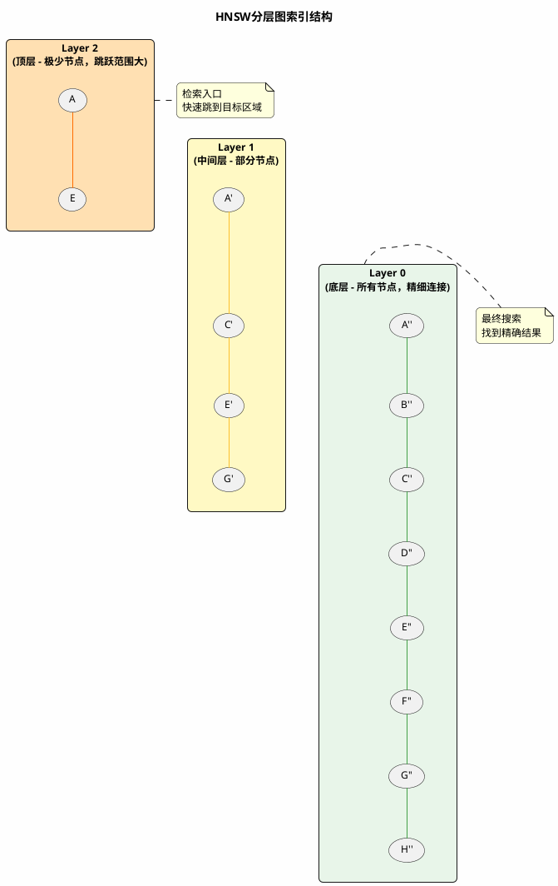

# 向量检索核心算法深度剖析

文本变成了向量，向量也存进了数据库。接下来用户一提问，系统就要从成千上万个向量里找出最相关的那几个。

问题来了：怎么找？

最直接的方法当然是一个个比——把用户问题的向量和库里的每一个向量都算一遍相似度，然后排序取前几名。

听起来很简单对吧？

但当你的知识库膨胀到几十万、上百万条记录时，这种"笨办法"就会让你的系统慢到用户想砸键盘。🙄

## 那个听起来很美好却跑不动的方案

### 最朴素的想法：全部比一遍

假设你做了个企业知识库，里面有80万条文档片段。每个片段经过Embedding之后变成了一个1536维的向量。

用户问了个问题："上季度华东区销售冠军是谁？"

系统需要做什么？

1. 把问题转成1536维向量
2. 拿这个向量和80万个向量**挨个计算**余弦相似度
3. 按相似度排序，取最高的5个
4. 把这5条内容丢给大模型

第2步是问题所在。

每次计算余弦相似度要做什么运算？两个1536维向量相乘再求和，再做个归一化。一次计算大约需要3000多次浮点运算。

80万条 × 3000次 = 24亿次运算。

在普通服务器上，这个过程大概需要**3-8秒**。

:::caution 这个延迟是致命的

- RAG的响应链路还有很多其他环节（问题改写、大模型推理等）
- 如果同时有10个用户在问问题呢？100个呢？
- 数据量还会持续增长，500万、1000万呢？

一个响应时间超过5秒的问答系统，用户会直接放弃使用。
:::

### 用数字感受一下差距

让我们把暴力搜索和后面要讲的智能算法放一起对比：

| 指标 | 暴力搜索 | 智能算法 |
| :--- | :--- | :--- |
| 80万向量检索耗时 | 3-8秒 | 5-15毫秒 |
| 能保证找到最优解？ | 100%保证 | 95%-99%概率 |
| 需要额外数据结构？ | 不需要 | 需要建索引 |
| 适合多大数据量 | 10万以内 | 百万到十亿 |

快了几百倍，代价是可能会漏掉极少数"最佳匹配"。

但仔细想想，我们做RAG的时候取的是Top5或Top10，真正影响最终回答的通常就是前2-3条。排名第37的那条内容，有没有被精确召回其实也无所谓。

这就是**近似最近邻搜索**（ANN, Approximate Nearest Neighbor）存在的意义——用可接受的精度损失，换取几百倍的速度提升。

## 先理解核心思路：怎么不比较全部却能找到答案

在深入具体算法之前，先建立一个直觉。

### 来个生活场景类比

想象你是一个房产中介，手里有北京市80万套房源。

有个客户来了，说："我想在朝阳区找一套800万左右的三居室，最好有学区。"

你会怎么找？

**傻瓜做法**：把80万套房源的资料全翻一遍，一个个对比。

**正常做法**：
1. 先按区域筛选 → 朝阳区大概10万套
2. 再按户型筛选 → 三居室大概3万套
3. 再按价格筛选 → 800万左右大概5000套
4. 最后精挑细选几套最匹配的

从80万缩小到5000，工作量直接砍掉了99%。

向量检索的智能算法思路和这个一模一样——**先用某种方法快速缩小范围，再在小范围内精确搜索**。

不同的算法，区别只在于"缩小范围"的具体策略不同。

### 两种主流的"缩小范围"策略

接下来要讲的两种算法，其实就是两种不同的缩小策略：

**IVF（倒排文件索引）** → 按"社区"划分
- 提前把80万向量分成若干个"社区"
- 每个社区有一个"社区中心"
- 查询时先找最近的几个社区中心
- 只在这几个社区里精确搜索

**HNSW（分层可导航小世界图）** → 按"社交网络"导航
- 把80万向量组织成一张"人脉网"
- 每个向量都和附近的几个向量相连
- 查询时像找人一样，朋友介绍朋友
- 几步跳转就能到达目标附近

两种策略各有优劣，后面会详细讲它们的实现原理和适用场景。

## IVF：先分小区再找房子

IVF全称是Inverted File Index（倒排文件索引），名字听起来很学术，但原理非常接地气。

### 核心思想就一句话

**把所有向量按位置分成若干个组，查询时只在最近的几个组里找**。

就像你找房子不会翻遍全北京，而是先确定区域再找一样。

### 建索引：给向量分组

IVF建索引的过程分两步：

**第一步：确定"社区中心"**

用聚类算法（通常是K-Means）把所有向量分成N个簇（cluster）。每个簇会产生一个"中心点"（centroid），代表这群向量的"平均位置"。

假设你有80万个向量，分成1024个簇。那么每个簇平均有大约780个向量。

**第二步：把向量分配到社区**

遍历所有向量，计算每个向量和1024个中心点的距离，把它分配到最近的那个簇里。

这样，80万个向量就被分成了1024个"社区"，每个社区大约有780个"居民"（实际分布不会这么均匀）。

```plantuml title="IVF建索引过程：聚类分区" width="100%" maxWidth="800px" align="left"
@startuml
skinparam backgroundColor #FEFEFE
skinparam roundcorner 12
skinparam shadowing false
skinparam defaultFontName Microsoft YaHei
skinparam defaultFontSize 13

title IVF聚类分区示意

rectangle "原始向量空间\n(80万个向量散落其中)" as raw #E8F5E9

rectangle "聚类后的分区" as clustered {
  rectangle "簇1\n中心点C1\n~800个向量" as c1 #BBDEFB
  rectangle "簇2\n中心点C2\n~750个向量" as c2 #BBDEFB
  rectangle "...\n...\n..." as dots #E0E0E0
  rectangle "簇1024\n中心点C1024\n~820个向量" as c1024 #BBDEFB
}

raw -down-> clustered : K-Means聚类

note right of clustered
  每个向量被分配到
  离它最近的那个簇
end note

@enduml
```

### 检索：先找社区再敲门

当用户提问时，检索过程是这样的：

**第一步：定位最近的社区**

拿查询向量和1024个社区中心比较，找出最近的K个社区（这个K叫`nprobe`，是个可调参数）。

假设nprobe=10，意味着我们只关心最近的10个社区。

**第二步：在选中的社区里精确搜索**

在这10个社区里的向量中，逐个计算相似度，取最高的几个。

10个社区大约有7800个向量（10×780），只需要比较7800次，而不是80万次。

**速度提升了多少？**

80万 ÷ 7800 ≈ **102倍**。

原本需要5秒的查询，现在只要50毫秒。

### 两个关键参数

IVF有两个核心参数需要调整：

| 参数 | 含义 | 调大了会怎样 | 调小了会怎样 |
| :--- | :--- | :--- | :--- |
| nlist | 划分成多少个簇 | 每个簇更小，搜索更快，但训练时间更长 | 每个簇更大，搜索变慢 |
| nprobe | 检索时搜索多少个簇 | 召回率更高，但更慢 | 更快，但可能漏掉相关结果 |

**nlist怎么设？**

一般建议是数据量的平方根。80万数据的话，$\sqrt{800000} ≈ 894$，取个整数1024挺合适。

**nprobe怎么设？**

一般是nlist的5%-10%。nlist=1024的话，nprobe设50-100比较合理。

### IVF的优缺点

**优点：**
- 原理简单，容易理解和调参
- 内存占用相对较低
- 适合数据量特别大的场景

**缺点：**
- 需要提前训练聚类模型（数据更新后可能需要重新聚类）
- 如果向量恰好落在两个簇的边界，可能被漏掉
- 数据分布不均匀时效果会打折扣

:::info IVF的几个变体
- **IVF_FLAT**：在簇内做精确搜索，准确率最高
- **IVF_SQ8**：对簇内向量做量化压缩，省内存但精度略降
- **IVF_PQ**：用乘积量化进一步压缩，更省内存

Milvus、Faiss这些工具都支持这几种变体，根据你对精度和内存的要求选择。
:::

## HNSW：像找人一样找向量

HNSW全称是Hierarchical Navigable Small World Graph（分层可导航小世界图）。名字很长，但它现在是**最主流、效果最好**的向量索引算法。

几乎所有主流向量数据库——Milvus、Qdrant、Weaviate、PGVector——都把它作为默认或推荐的索引类型。

### 从"六度分隔理论"说起

你听过"六度分隔理论"吗？

它说的是：地球上任意两个人之间，最多只需要通过6个中间人就能建立联系。

你想认识埃隆·马斯克？

1. 你 → 你的大学同学（搞AI创业的）
2. 同学 → 某个投资人
3. 投资人 → 硅谷某CEO
4. CEO → SpaceX某高管
5. 高管 → 马斯克

六步搞定，不需要挨个问地球上80亿人。

HNSW就是把这个思想用在了向量检索上——**把向量组织成一张"社交网络"，通过"朋友介绍朋友"的方式快速定位到目标**。

### HNSW的核心结构：多层"朋友圈"

HNSW的索引是一个**多层图结构**：

**最底层（Layer 0）**：包含所有向量。每个向量和它附近的若干个"邻居"相连。
**中间层（Layer 1, 2, ...）**：从下层随机抽取一部分向量构成。向量更少，但每个向量连接的"跨度"更大。
**最顶层**：只有极少的几个向量，但它们的连接几乎覆盖整个空间。

你可以把它想象成：

- 最底层是"普通朋友圈"——认识的都是附近的人
- 中间层是"商业人脉圈"——认识的人分布更广
- 最顶层是"顶级大佬圈"——寥寥几人但通天达地



### 检索过程：一步步逼近目标

假设我们要在8个向量（A到H）中找到和查询向量Q最相似的那个。

**第一步：从顶层开始**

顶层只有A和E两个向量。计算Q和A的距离、Q和E的距离，发现E更近。记住E，准备往下走。

**第二步：下到中间层**

从E在中间层的位置出发，看E的邻居有谁（C和G）。计算Q和C、Q和G的距离，发现G更近。记住G，继续往下。

**第三步：下到最底层**

从G在底层的位置出发，看G的邻居（F和H）。计算距离，发现H更近。再看H的邻居，没有比H更近的了。

**结果：H就是最相似的向量。**

整个过程只计算了6次距离（A、E、C、G、F、H），而不是8次。

数据量小时差距不明显。但如果有100万个向量，HNSW通常只需要计算**几百到几千次**距离，而暴力搜索要算100万次。

### 为什么HNSW这么快

两个关键原因：

**原因一：多层结构实现"粗到细"**

顶层帮你快速"跳"到目标附近的大区域，中间层缩小范围，底层精确定位。

就像你找一个住在北京朝阳区的人：
- 先看地图确定北京在哪（顶层）
- 再缩小到朝阳区（中间层）
- 最后找具体小区和楼栋（底层）

**原因二：小世界特性保证连通**

在HNSW的图里，任意两个向量之间只需要"跳转"很少几步就能到达。

这意味着搜索不会陷入死胡同，总能沿着图的边快速逼近目标。

### HNSW的关键参数

| 参数 | 含义 | 推荐值 | 调大了会怎样 |
| :--- | :--- | :--- | :--- |
| M | 每个向量的最大连接数 | 8-32，通常16 | 召回率↑，内存↑，建索引更慢 |
| efConstruction | 建索引时的搜索宽度 | 128-512，通常256 | 索引质量↑，建索引更慢 |
| ef | 检索时的搜索宽度 | TopK的4-16倍 | 召回率↑，检索更慢 |

**参数调优的简单原则：**

- 对召回率要求高 → 把M和ef调大
- 内存紧张 → 把M调小
- 建索引太慢 → 把efConstruction调小

一般情况下用默认值（M=16, efConstruction=256, ef=TopK×8）就够用了。

### HNSW的代价：内存

HNSW效果好，但它有个明显的缺点——**内存占用大**。

因为它需要在内存里维护整个图结构：
- 所有向量本身
- 向量之间的所有连接关系（边）
- 多层结构的信息

举个例子：100万个1536维向量，用HNSW索引（M=16），大约需要**10-15GB内存**。

如果你的服务器内存有限，可能需要考虑IVF系列，或者用Milvus的DISKANN把索引放到磁盘上。

## 两种算法怎么选

说了这么多，IVF和HNSW到底选哪个？

### 快速对比

| 维度 | IVF | HNSW |
| :--- | :--- | :--- |
| 检索速度 | 快 | 最快 |
| 召回率 | 95%-98% | 97%-99.5% |
| 内存占用 | 较低 | 较高 |
| 建索引速度 | 较快 | 较慢 |
| 支持增量插入 | 支持（但可能需定期重聚类） | 原生支持 |
| 实现复杂度 | 简单 | 复杂 |

### 选择建议

**选HNSW的情况**（绝大多数场景推荐）：
- 数据量在百万到千万级
- 对检索延迟和召回率都有要求
- 内存够用（可以按每百万向量预估10-15GB）
- 数据会频繁增量更新

**选IVF的情况**：
- 数据量特别大（亿级以上）
- 内存预算有限
- 能接受略低的召回率
- 数据相对稳定，不会频繁更新

**选FLAT（暴力搜索）的情况**：
- 数据量很小（10万以内）
- 对精度要求100%
- 懒得折腾索引配置

:::tip 一句话总结
如果你拿不准选哪个，就选HNSW。它在绝大多数RAG场景下都是最优解。
:::

## 把原理落地到Milvus

理论讲完了，来看看在实际的向量数据库里怎么配置这些索引。

### 在Milvus中创建HNSW索引

```java
// 为向量字段创建HNSW索引
IndexParam vectorIndex = IndexParam.builder()
        .fieldName("embedding")          // 向量字段名
        .indexType(IndexParam.IndexType.HNSW)
        .metricType(IndexParam.MetricType.COSINE)  // 余弦相似度
        .extraParams(Map.of(
                "M", 16,              // 每个向量的最大连接数
                "efConstruction", 256 // 建索引时的搜索宽度
        ))
        .build();

CreateIndexReq createIndexReq = CreateIndexReq.builder()
        .collectionName("knowledge_base")
        .indexParams(List.of(vectorIndex))
        .build();
client.createIndex(createIndexReq);
```

检索时指定搜索参数：

```java
SearchReq searchReq = SearchReq.builder()
        .collectionName("knowledge_base")
        .data(queryVectors)
        .topK(5)
        .outputFields(List.of("content", "title"))
        .annsField("embedding")
        .searchParams(Map.of("ef", 64))  // 检索时的搜索宽度
        .build();

SearchResp searchResp = client.search(searchReq);
```

### 在Milvus中创建IVF索引

```java
// 为向量字段创建IVF_FLAT索引
IndexParam vectorIndex = IndexParam.builder()
        .fieldName("embedding")
        .indexType(IndexParam.IndexType.IVF_FLAT)
        .metricType(IndexParam.MetricType.COSINE)
        .extraParams(Map.of(
                "nlist", 1024         // 划分成1024个簇
        ))
        .build();

CreateIndexReq createIndexReq = CreateIndexReq.builder()
        .collectionName("knowledge_base")
        .indexParams(List.of(vectorIndex))
        .build();
client.createIndex(createIndexReq);
```

检索时指定nprobe：

```java
SearchReq searchReq = SearchReq.builder()
        .collectionName("knowledge_base")
        .data(queryVectors)
        .topK(5)
        .outputFields(List.of("content", "title"))
        .annsField("embedding")
        .searchParams(Map.of("nprobe", 64))  // 搜索64个簇
        .build();
```

### 索引类型选择参考表

Milvus支持多种索引类型，根据场景选择：

| 索引类型 | 核心思想 | 检索速度 | 召回率 | 内存占用 | 适用场景 |
| :--- | :--- | :--- | :--- | :--- | :--- |
| FLAT | 暴力搜索 | 最慢 | 100% | 低 | 10万以内，要求绝对精确 |
| IVF_FLAT | 聚类+簇内精确搜索 | 快 | 95%-99% | 较低 | 百万-千万，内存有限 |
| IVF_SQ8 | 聚类+量化压缩 | 快 | 93%-97% | 低 | 千万-亿级，省内存 |
| HNSW | 多层图结构 | 最快 | 97%-99.5% | 高 | 百万-千万，追求效果 |
| DISKANN | 基于磁盘的图索引 | 较快 | 95%-98% | 低 | 亿级，内存不够用 |

## 小结

这篇文章讲了向量检索的核心原理：

1. **暴力搜索的瓶颈**：数据量一大就慢得不能用，必须用更聪明的方法
2. **ANN的核心思想**：用可接受的精度损失换取百倍的速度提升
3. **IVF算法**：先按"社区"分组，查询时只在最近的几个社区里找
4. **HNSW算法**：把向量组织成"社交网络"，像找人一样几步就能定位到目标
5. **选型建议**：绝大多数场景选HNSW；数据量超大或内存紧张时考虑IVF

理解了这些原理，你就知道为什么向量数据库能做到毫秒级检索，也能更好地进行参数调优。

下一篇讲向量数据库的选型——市面上那么多产品（Milvus、Qdrant、PGVector...），到底选哪个？