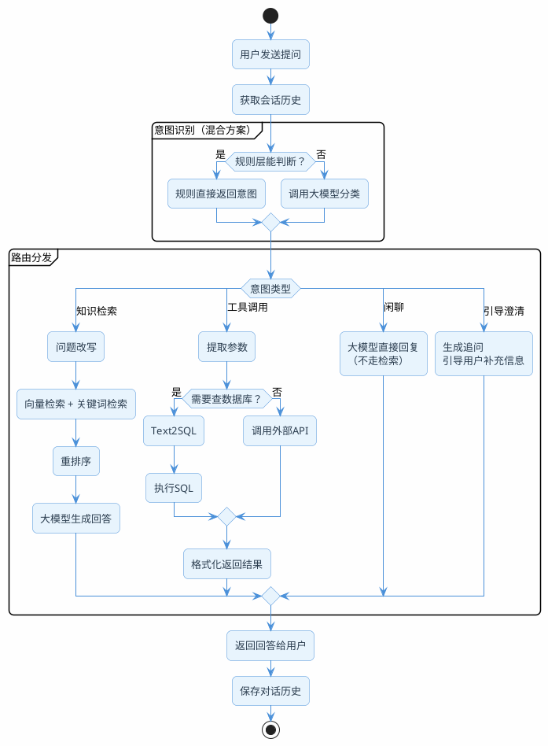

# 别什么问题都往知识库里查

你有没有想过一个问题：用户发了一句"你好"，你的RAG系统会怎么处理？

如果没做任何分流，它会老老实实地把"你好"丢进向量库做相似度检索，然后可能匹配到"你好，欢迎使用XX产品"之类的文档片段，最后大模型基于这个片段生成一段莫名其妙的回复。

再比如用户问"我的订单到哪了"——这个问题的答案根本不在知识库里，它需要调用物流API查实时数据。但如果系统不区分，照样去知识库里搜，搜出来的可能是"物流配送说明"之类的通用文档，答非所问。

这就好比去医院看病，不管你是感冒还是骨折，都直接塞进同一个科室——效率低不说，还容易误诊。

**意图识别就是RAG系统的"分诊台"**：先判断用户想干什么，再决定走哪条处理通道。

## 四条通道，各司其职

根据实际项目经验，用户的提问基本可以归为四类意图，每类对应不同的处理方式。

### 通道一：知识检索

用户问的是通用性、知识性的问题，答案存在于你的文档库中。

典型场景：
- "Spring Boot的自动配置原理是什么？"
- "退货政策是怎样的？"
- "MySQL索引失效的常见原因有哪些？"

处理方式：走完整的RAG流程——问题改写 → 向量检索 → 重排序 → 大模型生成。

### 通道二：工具调用

用户需要的是实时数据或个人数据，这些信息不在静态知识库里，需要调用外部接口获取。

典型场景：
- "我的订单2026031500123到哪了？"（调物流API）
- "帮我查一下研发部有多少人"（查数据库）
- "今天北京天气怎么样？"（调天气API）

处理方式：识别出需要调用的工具/API，提取参数，执行调用，返回结果。这里面又分两种情况：
- 直接调API（Function Call / MCP）
- 先把自然语言转成SQL再查数据库（Text2SQL，后面会详细讲）

### 通道三：闲聊寒暄

用户只是打个招呼、说声谢谢、聊几句无关的话。

典型场景：
- "你好"
- "谢谢你的帮助"
- "今天心情不错"
- "你是谁？"

处理方式：直接让大模型回复，不需要检索任何知识库。这类问题如果走检索，反而会因为匹配到不相关的文档而让回答变得奇怪。

### 通道四：引导澄清

用户的问题太模糊、太宽泛，系统没法直接给出有价值的回答，需要反问用户获取更多信息。

典型场景：
- "帮我推荐一个课程"（什么方向？什么水平？预算多少？）
- "数据库有问题"（什么数据库？什么问题？报错信息？）
- "部署"（部署什么？部署到哪里？）

处理方式：不急着回答，而是生成一个引导性的追问，帮用户把需求说清楚。

:::info 四条通道的判断标准
- 答案在文档里 → 知识检索
- 答案需要实时查询 → 工具调用
- 不需要答案，只是社交互动 → 闲聊
- 问题本身不完整，无法给出有效回答 → 引导澄清
:::

## 怎么判断用户意图？三种方案

知道了有哪些通道，接下来的问题是：怎么判断一句话该走哪条通道？

### 方案一：规则匹配——快但粗

最简单的方式，用关键词和正则表达式做匹配。

```java
public class RuleBasedClassifier {

    private static final Set<String> CHITCHAT_WORDS = Set.of(
            "你好", "您好", "嗨", "hi", "hello", "谢谢", "感谢",
            "再见", "拜拜", "哈哈", "你是谁", "在吗");

    private static final Set<String> TOOL_PATTERNS = Set.of(
            "我的订单", "查一下", "帮我查", "物流", "余额",
            "帮我退", "帮我取消");

    public String classify(String query) {
        String q = query.trim().toLowerCase();

        // 短消息 + 命中闲聊关键词 → 闲聊
        if (q.length() <= 8) {
            for (String word : CHITCHAT_WORDS) {
                if (q.contains(word)) return "chitchat";
            }
        }

        // 命中工具关键词 → 工具调用
        for (String pattern : TOOL_PATTERNS) {
            if (q.contains(pattern)) return "tool";
        }

        // 兜底 → 知识检索
        return "knowledge";
    }
}
```

优点：延迟几乎为零（微秒级），不花钱。
缺点：准确率大概60-70%，维护成本高（每发现一个漏判就要加规则），完全不理解语义。

### 方案二：大模型分类——准但慢

让大模型来判断意图，准确率能到90%以上。

```java
@Service
public class LlmIntentClassifier {

    private final ChatClient chatClient;

    private static final String CLASSIFY_PROMPT = """
        你是一个意图分类器。根据用户的提问和对话历史，判断用户意图属于以下哪一类：

        1. knowledge —— 用户在询问知识性、概念性问题，答案可以从文档资料中找到
           示例：技术原理、产品功能说明、政策规定、操作指南
        2. tool —— 用户需要查询实时数据或执行操作，需要调用外部系统
           示例：查订单状态、查天气、查库存、提交申请、执行退款
        3. chitchat —— 用户在闲聊、打招呼、表达感谢等社交性对话
           示例：你好、谢谢、再见、你是谁、今天开心吗
        4. clarify —— 用户的问题过于模糊或缺少关键信息，无法给出有效回答
           示例：只说了"数据库"、"帮我推荐"、"有问题"等没有具体指向的表述

        判断规则：
        - 优先根据语义判断，不要只看关键词
        - 如果对话历史中有相关上下文，要结合上下文判断
        - 如果不确定，默认归为 knowledge

        对话历史：
        {history}

        用户提问：{question}

        请只输出JSON格式：{"intent": "xxx", "confidence": 0.xx}
        """;

    public LlmIntentClassifier(ChatClient.Builder builder) {
        this.chatClient = builder.build();
    }

    public IntentResult classify(String question, List<Message> history) {
        String historyText = formatHistory(history);
        String response = chatClient.prompt()
                .user(u -> u.text(CLASSIFY_PROMPT)
                        .param("history", historyText)
                        .param("question", question))
                .call()
                .content();
        return parseResult(response);
    }

    private IntentResult parseResult(String json) {
        try {
            // 简单的JSON解析，生产环境建议用Jackson
            String intent = json.replaceAll(".*\"intent\"\\s*:\\s*\"(\\w+)\".*", "$1");
            String conf = json.replaceAll(".*\"confidence\"\\s*:\\s*(\\d+\\.?\\d*).*", "$1");

            Set<String> validIntents = Set.of("knowledge", "tool", "chitchat", "clarify");
            if (!validIntents.contains(intent)) {
                return new IntentResult("knowledge", 0.5);
            }
            return new IntentResult(intent, Double.parseDouble(conf));
        } catch (Exception e) {
            return new IntentResult("knowledge", 0.5); // 解析失败，兜底走知识检索
        }
    }

    public record IntentResult(String intent, double confidence) {}
}
```

优点：准确率高，能理解语义和上下文，维护成本低。
缺点：每次分类要调一次LLM，延迟500-2000ms，有API成本。

### 方案三：混合方案——推荐

把规则和大模型结合起来：规则层处理高置信度的简单case，大模型处理剩下的。

```java
@Service
public class HybridIntentClassifier {

    private final LlmIntentClassifier llmClassifier;

    // 规则层：处理明确的case
    public IntentResult classify(String question, List<Message> history) {
        String q = question.trim();

        // 规则1：极短的打招呼，直接判闲聊
        if (q.length() <= 5 && isGreeting(q)) {
            return new IntentResult("chitchat", 0.95);
        }

        // 规则2：包含明确的订单号/手机号等，大概率是工具调用
        if (q.matches(".*\\d{10,}.*") && containsToolKeyword(q)) {
            return new IntentResult("tool", 0.9);
        }

        // 规则3：问题太短且没有实质内容
        if (q.length() <= 3 && !q.contains("?") && !q.contains("？")) {
            return new IntentResult("clarify", 0.8);
        }

        // 其他情况：交给大模型判断
        return llmClassifier.classify(question, history);
    }

    private boolean isGreeting(String q) {
        return Set.of("你好", "您好", "嗨", "hi", "hello", "谢谢", "再见")
                .stream().anyMatch(q::contains);
    }

    private boolean containsToolKeyword(String q) {
        return Set.of("订单", "物流", "快递", "查一下", "帮我查")
                .stream().anyMatch(q::contains);
    }
}
```

这个方案能省掉30-40%的LLM调用（那些一眼就能判断的case不需要调大模型），同时保证复杂case的准确率。


## 路由器：根据意图分发到不同通道

意图识别完成后，需要一个路由器把请求分发到对应的处理逻辑。

```java
@Service
public class IntentRouter {

    private final KnowledgeService knowledgeService;
    private final ToolService toolService;
    private final ChatClient chatClient;
    private final ClarifyService clarifyService;

    public String route(String question, IntentResult intent,
                        List<Message> history) {
        return switch (intent.intent()) {
            case "knowledge" -> knowledgeService.answer(question, history);
            case "tool"      -> toolService.execute(question, history);
            case "chitchat"  -> directChat(question);
            case "clarify"   -> clarifyService.guide(question, history);
            default          -> knowledgeService.answer(question, history);
        };
    }

    /**
     * 闲聊通道：直接让大模型回复，不走检索
     */
    private String directChat(String question) {
        return chatClient.prompt()
                .system("你是一个友好的助手，请自然地回应用户的对话。")
                .user(question)
                .call()
                .content();
    }
}
```

整个流程串起来就是：

```java
@RestController
@RequestMapping("/api/chat")
public class SmartChatController {

    private final HybridIntentClassifier classifier;
    private final IntentRouter router;
    private final SessionStore sessionStore;

    @GetMapping
    public String chat(@RequestParam String question,
                       @RequestParam String sessionId) {
        // 1. 获取对话历史
        List<Message> history = sessionStore.getHistory(sessionId);

        // 2. 意图识别
        IntentResult intent = classifier.classify(question, history);
        log.info("意图识别 | question={} | intent={} | confidence={}",
                question, intent.intent(), intent.confidence());

        // 3. 路由分发
        String answer = router.route(question, intent, history);

        // 4. 保存对话历史
        sessionStore.save(sessionId, question, answer);

        return answer;
    }
}
```



## 工具调用通道之Text2SQL

当用户的问题需要查数据库时，不能直接把自然语言丢给数据库。需要先把自然语言转成SQL，这就是Text2SQL。

### 思路很简单

1. 把表结构信息告诉大模型
2. 把用户的问题告诉大模型
3. 让大模型生成SQL
4. 执行SQL，返回结果

关键在于：**表结构的描述要足够清晰**，字段注释要用业务语言写，不能只写技术名称。

### 完整实现

```java
@Service
public class Text2SqlService {

    private final ChatClient chatClient;
    private final JdbcTemplate jdbcTemplate;

    private static final String TEXT2SQL_PROMPT = """
        你是一个SQL专家。根据用户的自然语言问题，生成对应的SQL查询语句。

        数据库表结构：
        {table_schemas}

        规则：
        1. 只生成SELECT查询，禁止生成INSERT、UPDATE、DELETE等修改语句
        2. 只输出SQL语句本身，不要加任何解释或markdown格式
        3. 如果用户问题涉及时间（如"最近""今天""上个月"），当前日期是 {today}
        4. 如果无法根据表结构回答用户问题，输出空字符串

        用户问题：{question}
        """;

    // 表结构定义——注释用业务语言，这很关键
    private static final String TABLE_SCHEMAS = """
        CREATE TABLE course_info (
            id BIGINT PRIMARY KEY COMMENT '课程ID',
            title VARCHAR(200) COMMENT '课程标题，如Java实战营、Python入门课',
            category VARCHAR(50) COMMENT '课程分类：编程语言/框架/数据库/运维/AI',
            price DECIMAL(10,2) COMMENT '课程售价，单位元',
            teacher VARCHAR(50) COMMENT '讲师姓名',
            student_count INT COMMENT '已报名学生数',
            rating DECIMAL(2,1) COMMENT '课程评分，1.0-5.0',
            status VARCHAR(20) COMMENT '课程状态：上架/下架/预售',
            created_at DATETIME COMMENT '课程创建时间',
            updated_at DATETIME COMMENT '最后更新时间'
        );

        CREATE TABLE order_info (
            id BIGINT PRIMARY KEY COMMENT '订单ID',
            user_id BIGINT COMMENT '用户ID',
            course_id BIGINT COMMENT '课程ID，关联course_info.id',
            amount DECIMAL(10,2) COMMENT '实付金额，单位元',
            status VARCHAR(20) COMMENT '订单状态：待支付/已支付/已退款/已取消',
            created_at DATETIME COMMENT '下单时间',
            paid_at DATETIME COMMENT '支付时间'
        );
        """;

    public Text2SqlService(ChatClient.Builder builder, JdbcTemplate jdbcTemplate) {
        this.chatClient = builder.build();
        this.jdbcTemplate = jdbcTemplate;
    }

    /**
     * 自然语言 → SQL
     */
    public String toSql(String question) {
        String today = LocalDate.now().toString();
        return chatClient.prompt()
                .user(u -> u.text(TEXT2SQL_PROMPT)
                        .param("table_schemas", TABLE_SCHEMAS)
                        .param("today", today)
                        .param("question", question))
                .call()
                .content()
                .trim();
    }

    /**
     * 自然语言 → SQL → 执行 → 返回结果
     */
    public String query(String question) {
        String sql = toSql(question);
        if (sql == null || sql.isBlank()) {
            return "抱歉，这个问题我没法通过数据库查询来回答。";
        }

        // 安全校验：确保只有SELECT
        if (!sql.toUpperCase().startsWith("SELECT")) {
            log.warn("Text2SQL生成了非SELECT语句: {}", sql);
            return "抱歉，查询生成异常，请稍后重试。";
        }

        log.info("Text2SQL | question={} | sql={}", question, sql);

        try {
            List<Map<String, Object>> results = jdbcTemplate.queryForList(sql);
            return formatResults(results);
        } catch (Exception e) {
            log.error("SQL执行失败: {}", sql, e);
            return "查询执行出错，请换个方式描述您的问题。";
        }
    }

    private String formatResults(List<Map<String, Object>> results) {
        if (results.isEmpty()) return "没有查到相关数据。";
        // 简单格式化，实际项目中可以让大模型来组织语言
        StringBuilder sb = new StringBuilder();
        for (Map<String, Object> row : results) {
            sb.append(row.toString()).append("\n");
        }
        return sb.toString();
    }
}
```

:::warning Text2SQL的安全红线
1. 生成的SQL必须校验，只允许SELECT，绝对不能执行写操作
2. 建议用只读数据库账号连接
3. 加上查询超时限制，防止生成的SQL导致慢查询
4. 表结构信息不要暴露敏感字段（如密码、密钥等）
:::

### 用LangChain4j实现数据源路由

如果你的项目用的是LangChain4j，可以用`@AiService`注解更优雅地实现路由。

```java
public interface DataSourceRouter {

    @SystemMessage("""
        你是一个查询路由器。根据用户的问题，判断应该从哪个数据源获取答案。

        可选的数据源：
        - VECTOR：适合知识性问题、概念解释、操作指南等，从文档库中检索
        - RELATIONAL：适合数据统计、精确查询、涉及具体数字的问题，从关系数据库查询
        - GRAPH：适合关系查询、关联分析、路径查找等，从图数据库查询

        只输出数据源名称，不要解释。如果不确定，输出VECTOR。
        """)
    String route(@UserMessage String question);
}
```

```java
@RestController
public class MultiSourceController {

    private final DataSourceRouter router;
    private final VectorSearchService vectorService;
    private final Text2SqlService sqlService;
    private final GraphService graphService;

    @GetMapping("/smart-query")
    public String query(@RequestParam String question) {
        String source = router.route(question).trim().toUpperCase();
        log.info("路由决策 | question={} | source={}", question, source);

        return switch (source) {
            case "RELATIONAL" -> sqlService.query(question);
            case "GRAPH"      -> graphService.query(question);
            default           -> vectorService.search(question);
        };
    }
}
```

## Prompt路由：同一个数据源，不同的回答风格

除了数据源路由，还有一种场景：数据源是同一个，但需要根据用户意图选择不同的系统提示词。

举个例子，一个健康咨询系统，用户可能问的是症状相关的问题，也可能问的是用药相关的问题。虽然都是从同一个医学知识库检索，但回答的角色和风格应该不同：

```java
public interface HealthConsultRouter {

    @SystemMessage("""
        判断用户的健康咨询属于哪个类别：
        - SYMPTOM：症状描述、疾病咨询、诊断相关
        - MEDICATION：用药咨询、药物副作用、剂量相关
        - LIFESTYLE：饮食建议、运动方案、生活习惯
        只输出类别名称。
        """)
    String classify(@UserMessage String question);
}
```

```java
private static final Map<String, String> SYSTEM_PROMPTS = Map.of(
    "SYMPTOM", """
        你是一位经验丰富的全科医生。请根据参考资料，用专业但易懂的语言
        分析用户描述的症状，给出可能的原因和建议。
        注意：始终建议用户就医确认，不要做最终诊断。
        """,
    "MEDICATION", """
        你是一位临床药师。请根据参考资料，准确回答用户的用药问题。
        重点关注：适应症、用法用量、常见副作用、药物相互作用。
        注意：提醒用户遵医嘱用药。
        """,
    "LIFESTYLE", """
        你是一位健康管理师。请根据参考资料，给出实用的生活方式建议。
        风格要亲切、鼓励性的，给出具体可执行的方案。
        """
);
```

这样同一个检索结果，经过不同的系统提示词，生成的回答风格和侧重点完全不同。

## 引导澄清：问题太模糊时主动追问

有些问题不是改写能解决的——用户自己都没想清楚要什么。这时候最好的策略不是硬答，而是引导用户把需求说清楚。

### 什么时候该澄清

- 问题只有1-3个字，没有具体指向："缓存""部署""优化"
- 缺少关键约束条件："帮我推荐一个课程"（什么方向？什么水平？）
- 存在多种理解方式："数据库连接问题"（连不上？连接池满了？超时？）

### 实现思路

澄清不是简单地回一句"请说详细点"，而是要根据问题的领域，给出有针对性的追问。

```java
@Service
public class ClarifyService {

    private final ChatClient chatClient;

    private static final String CLARIFY_PROMPT = """
        用户提了一个比较模糊的问题，你需要通过追问来帮助用户明确需求。

        追问原则：
        1. 一次只问1-2个问题，不要连珠炮式提问
        2. 给出选项或示例，降低用户的回答成本
        3. 语气友好自然，不要让用户觉得被审问
        4. 追问的内容要和用户的问题领域相关

        用户的问题：{question}

        对话历史：
        {history}

        请生成一段友好的追问回复：
        """;

    public ClarifyService(ChatClient.Builder builder) {
        this.chatClient = builder.build();
    }

    public String guide(String question, List<Message> history) {
        String historyText = history.isEmpty() ? "无" :
                history.stream()
                    .map(m -> (m instanceof UserMessage ? "用户" : "助手")
                            + "：" + m.getText())
                    .collect(Collectors.joining("\n"));

        return chatClient.prompt()
                .user(u -> u.text(CLARIFY_PROMPT)
                        .param("question", question)
                        .param("history", historyText))
                .call()
                .content();
    }
}
```

实际效果：

| 用户说 | 系统追问 |
|-------|---------|
| 帮我推荐一个课程 | 好的，我来帮你挑选。你目前对哪个方向比较感兴趣？比如Java后端、Python数据分析、前端开发？另外你是零基础还是有一定经验了？ |
| 数据库有问题 | 能具体说说是什么情况吗？比如是连接不上、查询很慢、还是数据出现了异常？用的是MySQL还是其他数据库？ |
| 部署 | 你是想了解怎么部署应用吗？可以告诉我一些细节：部署什么类型的应用（Spring Boot、前端项目）？部署到哪里（服务器、Docker、K8s）？ |

## 意图识别放在RAG链路的哪个位置

意图识别应该在**获取会话历史之后、问题改写之前**。

为什么要在问题改写之前？因为不是所有意图都需要改写：
- 闲聊不需要改写
- 工具调用不需要改写（需要的是参数提取）
- 只有知识检索通道才需要问题改写

为什么要在获取会话历史之后？因为有些意图需要结合上下文才能判断。比如用户说"好的，帮我退了吧"——单看这句话可能是闲聊，但如果上文在讨论退货，这就是一个工具调用。

## 生产环境踩坑经验

### 兜底策略：分类失败就走知识检索

大模型分类可能失败（返回格式异常、超时、置信度太低）。失败时默认走知识检索通道，因为：
- 知识检索是最安全的通道，最坏情况就是"没找到相关信息"
- 闲聊走知识检索虽然不完美，但不会出大问题
- 工具调用走知识检索会答非所问，但不会造成数据修改等副作用

```java
public IntentResult safeClassify(String question, List<Message> history) {
    try {
        IntentResult result = classify(question, history);
        // 置信度太低，不信任分类结果
        if (result.confidence() < 0.5) {
            log.warn("意图分类置信度过低: {} -> {}", question, result);
            return new IntentResult("knowledge", 0.5);
        }
        return result;
    } catch (Exception e) {
        log.error("意图分类异常，兜底走知识检索", e);
        return new IntentResult("knowledge", 0.5);
    }
}
```

### 分类结果要记日志

上线后一定要记录每次分类的结果，方便后续分析和优化。

```java
log.info("IntentClassify | session={} | question={} | intent={} | "
        + "confidence={} | method={} | latency={}ms",
        sessionId, question, result.intent(), result.confidence(),
        usedRule ? "rule" : "llm", elapsed);
```

定期从日志中抽样，人工review分类是否准确。如果某类问题经常被误分，就针对性地调整Prompt或补充规则。

### 新意图的扩展

业务发展后可能需要新增意图类型（比如"投诉"通道）。建议把意图定义做成配置化：

```java
@Data
public class IntentDefinition {
    private String name;        // 意图名称
    private String description; // 意图描述（给大模型看的）
    private List<String> examples; // 示例问题
    private String handler;     // 处理器bean名称
}
```

新增意图时只需要加配置和对应的处理器，不需要改分类逻辑的代码。

:::tip 小结
意图识别是RAG系统从"能用"到"好用"的关键一步。不做意图识别，所有问题一股脑走检索，闲聊会匹配到无关文档，工具类问题会答非所问。推荐用混合方案（规则+大模型），规则处理简单case省成本，大模型处理复杂case保准确率。四条通道各司其职：知识检索走RAG全流程，工具调用走API/Text2SQL，闲聊直接回复，模糊问题主动追问。
:::
