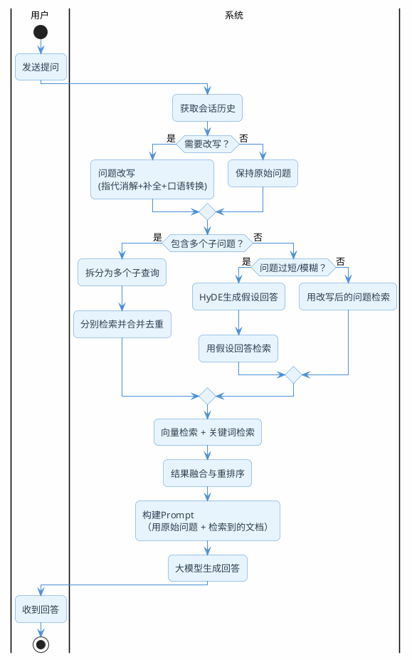

# 用户说的话，检索听不懂怎么办

你有没有遇到过这种情况：用户问了一个很正常的问题，RAG系统返回的结果却牛头不对马嘴？

比如在一个在线教育的客服系统里，用户先问了"Python入门课多少钱"，助手回答了价格，然后用户接着问"那它有没有证书"——这个"它"指的是Python入门课，人一看就懂。但向量检索拿到的是"那它有没有证书"这几个字，去知识库里一搜，大概率匹配到的是"证书查询流程"或者"考试认证说明"之类的内容，完全跑偏了。

问题出在哪？**检索系统没有记忆，也不会联系上下文。**

大模型能看到整个对话历史，所以它知道"它"是什么。但检索模块只拿到当前这一句话，它不知道前面聊了什么，自然也就无法理解指代关系。

这就是问题改写要解决的核心矛盾：**把用户那句"人能听懂但机器听不懂"的话，翻译成检索系统能精准匹配的查询语句。**

## 不改写会怎样？五个典型翻车场景

在动手写代码之前，先看看不做问题改写到底会出什么问题。这些场景在实际项目中非常高频。

### 场景一：代词满天飞

多轮对话中最常见的问题。用户说"这个怎么退款""它支持分期吗""那个课程还在吗"，这些代词对检索来说就是噪音。

| 用户原话 | 检索实际拿到的 | 期望检索的 |
|---------|-------------|----------|
| 那它有没有证书 | 那它有没有证书 | Python入门课是否提供结业证书 |
| 这个怎么退款 | 这个怎么退款 | Java实战营课程退款流程 |
| 上面说的那个能试听吗 | 上面说的那个能试听吗 | 数据分析课程是否支持免费试听 |

### 场景二：省略太多信息

中文对话习惯省略主语和宾语。用户问完"Spring Boot和Spring Cloud有什么区别"之后，接着问"哪个更适合微服务"——省略了主语，检索系统不知道在比较什么。

### 场景三：口语和知识库的表达鸿沟

用户说"服务挂了咋整"，知识库里写的是"服务异常排查与恢复流程"。语义上是一回事，但词汇完全不搭边，向量相似度可能很低。

### 场景四：一句话塞了好几个问题

"Redis的持久化方式有哪些，RDB和AOF的区别是什么，生产环境推荐用哪个？"——这一句话其实包含三个独立问题，如果不拆开，检索只能碰运气匹配到其中一个。

### 场景五：问题太短太模糊

用户就打了两个字"缓存"或者"怎么部署"，信息量太少，向量检索很难找到精准的匹配。

:::tip 一句话总结
问题改写的本质：在用户提问和向量检索之间加一个"翻译层"，把人话翻译成检索能听懂的话。
:::

## 五种改写策略逐个拆解

针对上面的五类问题，对应有五种改写策略。不是每种都要用，根据你的业务场景挑着来。

### 策略一：指代消解——把"它"变成真名

这是多轮对话场景下的刚需，不做这个基本没法用。

核心思路：结合对话历史，把代词替换成它实际指代的实体。

```
对话历史：
用户：Python入门课多少钱？
助手：Python入门课目前售价299元。

当前提问：那它有没有证书？

改写后：Python入门课是否提供结业证书？
```

这个改写看起来简单，但手写规则几乎不可能覆盖所有情况。"它""这个""那个""上面的""刚才说的"……指代形式太多了，而且同一个代词在不同上下文里指代的东西完全不同。所以实际项目中，都是交给大模型来做。

### 策略二：上下文补全——把省略的信息补回来

和指代消解类似，但处理的不是代词，而是省略。

```
对话历史：
用户：Spring Boot和Spring Cloud有什么区别？
助手：Spring Boot是快速构建单体应用的框架……

当前提问：哪个更适合微服务？

改写后：Spring Boot和Spring Cloud哪个更适合微服务架构？
```

用户省略了比较对象，改写后把它补回来。这两种策略（指代消解+上下文补全）在多轮对话中是必做项，缺一不可。

### 策略三：口语转书面——拉近表达距离

用户说话随意，知识库用词正式。这个策略就是把口语化的表达转成知识库更可能使用的书面表达。

| 用户原话 | 改写后 |
|---------|-------|
| 服务挂了咋整 | 服务异常的排查与恢复方法 |
| ES查询太慢了怎么搞 | Elasticsearch查询性能优化方案 |
| K8s老是OOM怎么办 | Kubernetes Pod内存溢出(OOM)的排查与解决 |

注意这个策略不依赖对话历史，单轮对话也能用。它解决的是"用户词汇"和"知识库词汇"之间的gap。

### 策略四：多问题拆分——一个变多个

把包含多个意图的复杂问题拆成独立的子问题，分别检索后合并结果。

```
原始问题：Redis的持久化方式有哪些，RDB和AOF的区别是什么，生产环境推荐用哪个？

拆分后：
Q1：Redis支持哪些持久化方式？
Q2：Redis RDB和AOF持久化的区别是什么？
Q3：Redis生产环境推荐使用哪种持久化方式？
```

每个子问题单独去检索，召回的文档块会更精准。最后把三次检索的结果去重合并，一起喂给大模型生成最终答案。

:::warning 注意
拆分不是越细越好。拆太细会增加检索次数（每次都要调embedding接口+向量库查询），延迟会明显上升。一般拆成2-4个子问题就够了。
:::

### 策略五：假设性回答检索（HyDE）——反其道而行

这个策略思路比较独特：不改写问题本身，而是先让大模型"脑补"一个可能的答案，然后用这个假设答案去检索。

为什么这样做有效？因为假设答案的文本风格和知识库文档更接近。

举个例子，用户问"微服务之间怎么通信"，这是一个简短的问题。但如果让大模型先生成一段假设性回答：

> 微服务之间的通信方式主要分为同步和异步两种。同步通信常用HTTP REST和gRPC，适合实时性要求高的场景。异步通信常用消息队列如RabbitMQ、Kafka，适合解耦和削峰。选择时需要考虑延迟、可靠性、吞吐量等因素……

这段假设回答虽然不一定完全准确，但它包含了大量领域术语（REST、gRPC、RabbitMQ、Kafka、解耦、削峰），这些词和知识库文档的用词高度重合。用这段文本的向量去检索，命中率会比用原始短问题高很多。

```
传统RAG：用户问题 → 检索 → 生成答案
HyDE：  用户问题 → 生成假设答案 → 用假设答案检索 → 生成最终答案
```

:::info HyDE的适用场景
HyDE特别适合用户提问很短、很模糊的场景。如果用户的问题本身就很具体、很完整，HyDE反而可能引入噪音。另外HyDE会多一次LLM调用，延迟会增加300-800ms。
:::

### 五种策略怎么选？

不是所有策略都要上，根据你的场景挑选：

| 策略 | 解决的问题 | 是否依赖对话历史 | 优先级 | 额外延迟 |
|------|----------|---------------|-------|---------|
| 指代消解 | 代词指代不明 | 是 | 必做（多轮场景） | 低 |
| 上下文补全 | 信息省略 | 是 | 必做（多轮场景） | 低 |
| 口语转书面 | 表达风格差异 | 否 | 推荐 | 低 |
| 多问题拆分 | 复合问题 | 否 | 按需 | 中（多次检索） |
| HyDE | 问题过短/模糊 | 否 | 按需 | 中（多一次LLM调用） |

实际项目中，前三种可以用一个Prompt一次性搞定（让大模型同时做指代消解、补全和口语转换），不需要分三次调用。

## 改写Prompt怎么写

改写的核心就是一个Prompt。写好这个Prompt，改写质量就有保障。

### 基础版：处理指代和省略

```
你是一个查询改写助手。你的任务是将用户的当前提问改写为一个独立、完整、适合检索的查询语句。

改写规则：
1. 结合对话历史，将代词（它、这个、那个等）替换为具体实体
2. 补全省略的主语、宾语等信息，使查询语句脱离对话上下文也能被理解
3. 将口语化表达转为更正式的书面表达
4. 如果当前提问已经足够完整和清晰，直接原样输出，不要过度改写
5. 只输出改写后的查询语句，不要输出任何解释

对话历史：
{chat_history}

当前提问：{question}

改写后的查询：
```

这个Prompt把前三种策略合在一起了。第4条规则很关键——防止大模型过度改写，把本来就很好的问题改得面目全非。

### 进阶版：加入多问题拆分

```
你是一个智能查询改写助手。请根据对话历史和当前提问，完成以下任务：

第一步：理解用户意图
- 结合对话历史理解代词指代和省略信息
- 判断当前提问包含几个独立的问题

第二步：改写输出
- 如果是单个问题：输出一个完整、清晰、适合检索的查询语句
- 如果包含多个问题：拆分为多个独立查询，每个查询都是完整的

输出格式（JSON数组）：
["改写后的查询1", "改写后的查询2"]

如果只有一个问题，数组中只放一个元素。

对话历史：
{chat_history}

当前提问：{question}
```

## Java 实战：Query 改写的实现与效果

概念讲完了，看看怎么用Spring AI把这些策略落地。下面的代码是**完整可运行**的示例，配置好apiKey后直接启动就能测试每种改写策略的效果。

### 示例中项目地址

- 项目地址：[https://gitee.com/shining-stars-l/super-ai-hub](https://gitee.com/shining-stars-l/super-ai-hub)
- 项目模块：`ai-example-spring-ai-rag`

### 项目配置

先在`application.yaml`中配置好chat模型和embedding模型（改写只需要chat模型）：

```yaml
spring:
  ai:
    openai:
      base-url: https://api.siliconflow.cn
      api-key: ${SILICONFLOW_API_KEY}
      chat:
        options:
          model: Qwen/Qwen2.5-7B-Instruct
      embedding:
        options:
          model: Qwen/Qwen3-Embedding-8B
          dimensions: 1024
```

### 方式一：自定义改写服务（QueryRewriteService）

这是最灵活的方式，完全自己控制改写逻辑。包含三个关键设计：启发式前置判断、结果缓存、安全兜底。

```java
@Slf4j
@Service
public class QueryRewriteService {

    private final ChatClient chatClient;

    /**
     * 改写Prompt —— 把前三种策略（指代消解、上下文补全、口语转书面）合在一个Prompt里
     * 第4条规则很关键：防止大模型过度改写，把本来就很好的问题改得面目全非
     */
    private static final String REWRITE_PROMPT = """
        你是一个查询改写助手。将用户的当前提问改写为独立、完整、适合检索的查询语句。

        改写规则：
        1. 将代词替换为具体实体
        2. 补全省略的信息
        3. 口语化表达转为书面表达
        4. 如果提问已经完整清晰，原样输出
        5. 只输出改写后的查询，不要解释

        对话历史：
        {chat_history}

        当前提问：{question}
        """;

    /**
     * 改写结果缓存
     * 同一session内，相同的问题+相同的历史，改写结果可以缓存，避免重复调用LLM
     */
    private final Map<String, String> rewriteCache = new ConcurrentHashMap<>();

    public QueryRewriteService(ChatClient.Builder builder) {
        this.chatClient = builder.build();
    }

    /**
     * 带缓存的改写入口
     */
    public String rewriteWithCache(String sessionId, String question, List<Message> history) {
        String cacheKey = sessionId + ":" + question.hashCode();
        return rewriteCache.computeIfAbsent(cacheKey, k -> safeRewrite(question, history));
    }

    /**
     * 核心改写方法：指代消解 + 上下文补全 + 口语转书面
     */
    public String rewrite(String question, List<Message> history) {
        // 先判断是否需要改写，节省不必要的LLM调用
        if (!needsRewrite(question, history)) {
            return question;
        }

        String historyText = formatHistory(history);
        String result = chatClient.prompt()
                .user(u -> u.text(REWRITE_PROMPT)
                        .param("chat_history", historyText)
                        .param("question", question))
                .call()
                .content();

        return validateResult(result, question);
    }

    /**
     * 带兜底的安全改写
     * LLM调用可能超时、返回空、返回格式异常，改写失败时回退到原始问题
     */
    public String safeRewrite(String question, List<Message> history) {
        try {
            String result = rewrite(question, history);
            if (result != null && !result.isBlank()
                    && result.length() < 500
                    && !result.equals(question)) {
                return result;
            }
            return question;
        } catch (Exception e) {
            log.warn("问题改写失败，回退到原始问题: {}", e.getMessage());
            return question;
        }
    }

    /**
     * 启发式前置判断：是否需要改写
     * 用简单规则快速过滤，能省掉30-40%的无效LLM调用
     */
    private boolean needsRewrite(String question, List<Message> history) {
        if (history == null || history.isEmpty()) {
            return question.length() < 6; // 太短的问题可能需要补全
        }
        // 包含代词，大概率需要改写
        String[] pronouns = {"它", "这个", "那个", "他", "她", "上面", "刚才", "之前"};
        for (String p : pronouns) {
            if (question.contains(p)) return true;
        }
        return question.length() < 10; // 问题很短，可能省略了信息
    }

    private String validateResult(String result, String original) {
        if (result == null || result.isBlank() || result.length() > 500) {
            return original;
        }
        return result.strip();
    }

    private String formatHistory(List<Message> history) {
        if (history == null || history.isEmpty()) return "无";
        StringBuilder sb = new StringBuilder();
        for (Message msg : history) {
            String role = msg instanceof UserMessage ? "用户" : "助手";
            sb.append(role).append("：").append(msg.getText()).append("\n");
        }
        return sb.toString();
    }
}
```

### 方式二：HyDE 假设性回答服务（HydeService）

HyDE的流程和普通改写不一样：不改写问题本身，而是先让大模型"脑补"一个可能的答案，然后用这个假设答案去检索。

```java
@Slf4j
@Service
public class HydeService {

    private final ChatClient chatClient;

    /**
     * HyDE Prompt
     * 要求大模型生成包含专业术语和概念的假设性回答，不需要完全准确
     */
    private static final String HYDE_PROMPT = """
        请根据以下问题，生成一段可能的回答。
        这段回答不需要完全准确，但应该包含相关的专业术语和概念。
        直接输出回答内容，不要加任何前缀或解释。

        问题：{question}
        """;

    public HydeService(ChatClient.Builder builder) {
        this.chatClient = builder.build();
    }

    /**
     * 生成假设性回答
     * 实际项目中：用这个假设回答（而不是原始问题）去向量库做 similaritySearch
     */
    public String generateHypothetical(String question) {
        String hypothetical = chatClient.prompt()
                .user(u -> u.text(HYDE_PROMPT).param("question", question))
                .call()
                .content();

        log.info("HyDE假设回答: {}", hypothetical);
        return hypothetical;
    }
}
```

### 方式三：五种改写策略的完整演示（QueryRewriteController）

Controller中集成了五种改写策略，每个接口都内置了模拟对话数据，配置好apiKey后直接调用即可测试。

```java
@Slf4j
@RestController
@RequestMapping("/rag/rewrite")
public class QueryRewriteController {

    private final ChatClient chatClient;
    private final ChatClient.Builder chatClientBuilder;
    private final QueryRewriteService queryRewriteService;

    /**
     * 模拟的对话历史 —— 演示指代消解和上下文补全
     * 场景：用户先问了"Python入门课多少钱"，助手回答了价格，
     * 然后用户接着问"那它有没有证书"——这个"它"指的是Python入门课。
     */
    private static final List<Message> MOCK_HISTORY = List.of(
            new UserMessage("Python入门课多少钱？"),
            new AssistantMessage("Python入门课目前售价299元，包含60课时的视频教程和3个实战项目。")
    );

    public QueryRewriteController(ChatClient.Builder chatClientBuilder,
                                  QueryRewriteService queryRewriteService) {
        this.chatClientBuilder = chatClientBuilder;
        this.chatClient = chatClientBuilder.build();
        this.queryRewriteService = queryRewriteService;
    }

    // ==================== 方式一：自定义改写服务 ====================

    /**
     * 自定义改写 —— 启发式判断 + LLM改写 + 安全兜底
     */
    @GetMapping("/custom")
    public Map<String, Object> custom(@RequestParam("question") String question) {
        long start = System.currentTimeMillis();
        String rewritten = queryRewriteService.safeRewrite(question, MOCK_HISTORY);
        long latency = System.currentTimeMillis() - start;

        Map<String, Object> result = new HashMap<>();
        result.put("original", question);
        result.put("rewritten", rewritten);
        result.put("history", formatHistory(MOCK_HISTORY));
        result.put("latencyMs", latency);
        return result;
    }

    // ==================== 方式二：CompressionQueryTransformer ====================

    /**
     * Spring AI 内置 CompressionQueryTransformer —— 处理多轮对话中的指代和省略
     * 注意：Query构造需要三个参数（text, history, context），context传 Collections.emptyMap()
     */
    @GetMapping("/compression")
    public Map<String, Object> compression(@RequestParam("question") String question) {
        CompressionQueryTransformer compression = CompressionQueryTransformer.builder()
                .chatClientBuilder(chatClientBuilder)
                .build();

        // 构造带对话历史的 Query（三参数：问题文本、历史消息、上下文Map）
        Query query = new Query(question, MOCK_HISTORY, Collections.emptyMap());
        long start = System.currentTimeMillis();
        Query rewritten = compression.transform(query);
        long latency = System.currentTimeMillis() - start;

        Map<String, Object> result = new HashMap<>();
        result.put("original", question);
        result.put("rewritten", rewritten.text());
        result.put("history", formatHistory(MOCK_HISTORY));
        result.put("latencyMs", latency);
        return result;
    }

    // ==================== 方式三：RewriteQueryTransformer ====================

    /**
     * Spring AI 内置 RewriteQueryTransformer —— 口语转书面
     * 注意：它不能处理指代消解，只做表达优化
     */
    @GetMapping("/rewriter")
    public Map<String, Object> rewriter(@RequestParam("question") String question) {
        RewriteQueryTransformer rewriter = RewriteQueryTransformer.builder()
                .chatClientBuilder(chatClientBuilder)
                .build();

        Query query = new Query(question);
        long start = System.currentTimeMillis();
        Query rewritten = rewriter.transform(query);
        long latency = System.currentTimeMillis() - start;

        Map<String, Object> result = new HashMap<>();
        result.put("original", question);
        result.put("rewritten", rewritten.text());
        result.put("latencyMs", latency);
        return result;
    }

    // ==================== 方式四：MultiQueryExpander ====================

    /**
     * Spring AI 内置 MultiQueryExpander —— 一个问题扩展成多个
     */
    @GetMapping("/expand")
    public Map<String, Object> expand(@RequestParam("question") String question) {
        MultiQueryExpander expander = MultiQueryExpander.builder()
                .chatClientBuilder(chatClientBuilder)
                .numberOfQueries(3)      // 扩展为3个查询
                .includeOriginal(true)   // 结果中包含原始问题
                .build();

        Query query = new Query(question);
        long start = System.currentTimeMillis();
        List<Query> expanded = expander.expand(query);
        long latency = System.currentTimeMillis() - start;

        Map<String, Object> result = new HashMap<>();
        result.put("original", question);
        result.put("expanded", expanded.stream().map(Query::text).collect(Collectors.toList()));
        result.put("count", expanded.size());
        result.put("latencyMs", latency);
        return result;
    }

    // ==================== 方式五：HyDE 假设性回答 ====================

    /**
     * HyDE —— 先让大模型生成假设性回答，实际项目中用假设回答去向量库检索
     */
    @GetMapping("/hyde")
    public Map<String, Object> hyde(@RequestParam("question") String question) {
        long start = System.currentTimeMillis();
        String hypothetical = chatClient.prompt()
                .user(u -> u.text("""
                    请根据以下问题，生成一段可能的回答。
                    这段回答不需要完全准确，但应该包含相关的专业术语和概念。
                    直接输出回答内容，不要加任何前缀或解释。

                    问题：{question}
                    """).param("question", question))
                .call()
                .content();
        long latency = System.currentTimeMillis() - start;

        Map<String, Object> result = new HashMap<>();
        result.put("original", question);
        result.put("hypotheticalAnswer", hypothetical);
        result.put("latencyMs", latency);
        result.put("tip", "实际项目中，用这段假设回答的向量去检索，命中率比用原始短问题高");
        return result;
    }

    private List<String> formatHistory(List<Message> history) {
        return history.stream()
                .map(msg -> {
                    String role = msg instanceof UserMessage ? "用户" : "助手";
                    return role + "：" + msg.getText();
                })
                .collect(Collectors.toList());
    }
}
```

### 接口测试与效果

启动项目后，直接用浏览器或curl调用以下接口：

#### 1. 自定义改写（指代消解）

```
GET http://localhost:7092/rag/rewrite/custom?question=那它有没有证书
```

内置对话历史：用户问了"Python入门课多少钱"，助手回答了价格。现在用户问"那它有没有证书"，改写服务会把"它"替换为"Python入门课"。

返回结果：

```json
{
  "original": "那它有没有证书",
  "rewritten": "Python入门课有没有证书？",
  "history": [
    "用户：Python入门课多少钱？",
    "助手：Python入门课目前售价299元，包含60课时的视频教程和3个实战项目。"
  ],
  "latencyMs": 2700
}
```

#### 2. CompressionQueryTransformer（指代消解）

```
GET http://localhost:7092/rag/rewrite/compression?question=那它有没有证书
```

Spring AI内置的压缩改写器，同样处理指代和省略，开箱即用。

返回结果：

```json
{
  "original": "那它有没有证书",
  "rewritten": "Python入门课是否有证书？",
  "history": [
    "用户：Python入门课多少钱？",
    "助手：Python入门课目前售价299元，包含60课时的视频教程和3个实战项目。"
  ],
  "latencyMs": 429
}
```

#### 3. RewriteQueryTransformer（口语转书面）

```
GET http://localhost:7092/rag/rewrite/rewriter?question=ES查询太慢了怎么搞
```

把口语化的"ES查询太慢了怎么搞"转成知识库更可能使用的书面表达。

返回结果：

```json
{
  "original": "ES查询太慢了怎么搞",
  "rewritten": "ES查询速度慢如何优化",
  "latencyMs": 424
}
```

#### 4. MultiQueryExpander（一拆多）

```
GET http://localhost:7092/rag/rewrite/expand?question=Redis持久化方式有哪些
```

把一个问题扩展成多个不同角度的查询，分别检索后合并结果，召回更精准。

返回结果：

```json
{
  "expanded": [
    "Redis持久化方式有哪些",
    "Redis的持久化方法有哪些",
    "有哪些方式可以实现Redis的持久化",
    "Redis支持哪几种持久化策略"
  ],
  "original": "Redis持久化方式有哪些",
  "count": 4,
  "latencyMs": 599
}
```

#### 5. HyDE 假设性回答

```
GET http://localhost:7092/rag/rewrite/hyde?question=微服务之间怎么通信
```

先让大模型生成一段包含专业术语的假设性回答，实际项目中用这段回答的向量去检索，命中率比用原始短问题高。

返回结果：

```json
{
  "original": "微服务之间怎么通信",
  "tip": "实际项目中，用这段假设回答的向量去检索，命中率比用原始短问题高",
  "hypotheticalAnswer": "微服务之间的通信主要依赖于消息中间件和API网关等方式。消息中间件如RabbitMQ、Kafka等支持异步通信，可以实现服务间的解耦；API网关则作为服务间通信的统一入口，通过定义清晰的API接口标准，实现服务间的同步或异步调用。此外，基于HTTP/RESTful的微服务可以借助服务发现机制（如Eureka、Consul）通过RESTful API进行通信，而基于gRPC的服务则使用高效的二进制协议进行通信，适用于高性能场景。",
  "latencyMs": 1338
}
```

:::warning 一个容易踩的坑
检索用改写后的问题，生成用原始问题。为什么？因为改写是为了让检索更准，但用户看到的回答应该是针对他原始问题的。如果用改写后的问题去生成，用户可能会困惑："我问的不是这个啊？"
:::

## 改写放在RAG链路的哪个位置



关键点：
- 改写发生在**检索之前**，**会话历史获取之后**
- 改写后的问题只用于检索，不用于最终生成
- 多问题拆分和HyDE是互斥的分支，不会同时使用

## 生产环境的几个注意事项

### 改写不是免费的

每次改写都要调一次LLM，这意味着额外的延迟和成本。上面的`QueryRewriteService`已经内置了三个优化手段：

1. **启发式前置判断**（`needsRewrite`方法）：先用简单规则判断是否需要改写，能省掉30-40%的无效调用
2. **用小模型**：改写任务不需要太强的模型，Qwen2.5-7B这个级别就够了，延迟和成本都比大模型低很多
3. **结果缓存**（`rewriteWithCache`方法）：同一个session内，相同的问题+相同的历史，改写结果直接复用

### 改写失败要有兜底

`safeRewrite`方法已经实现了完整的兜底策略：LLM调用超时、返回空、返回格式异常时，都会回退到原始问题，不影响主流程。

### 改写质量要能观测

上线后怎么知道改写效果好不好？记日志。

```java
log.info("QueryRewrite | session={} | original={} | rewritten={} | "
        + "historySize={} | latency={}ms",
        sessionId, question, rewrittenQuery,
        history.size(), System.currentTimeMillis() - start);
```

定期抽样review这些日志，看看改写是否合理。如果发现大量过度改写或改写错误，就需要调整Prompt。

:::tip 小结
问题改写是RAG系统中投入产出比最高的优化手段之一。多轮对话场景下，指代消解和上下文补全是必做项；口语转书面是推荐项；多问题拆分和HyDE按需使用。Spring AI提供了CompressionQueryTransformer和RewriteQueryTransformer开箱即用，但自定义实现更灵活。记住：检索用改写后的问题，生成用原始问题。
:::
