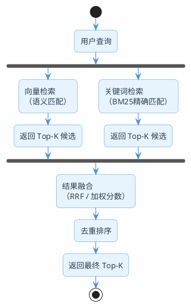

# 当向量检索也会翻车

向量检索是RAG的核心，但它不是万能的。

来看一个真实场景：你搭了一个技术文档问答系统，知识库里存了几百篇Spring相关的文档。用户问"SpringBoot 3.2.1的启动流程有什么变化"，向量检索返回了什么？大概率是一堆关于"SpringBoot启动流程"的通用文档，但版本号"3.2.1"这个关键信息被忽略了。

为什么？因为向量检索的工作方式是把文本转成一串数字（向量），然后比较数字之间的距离。它理解的是"语义"——知道"启动流程"和"启动过程"是一回事。但它对精确的关键词不敏感，"3.2.1"和"3.1.0"在向量空间里的距离可能很近，因为它们都是版本号。

这不是个例。以下几类查询，纯向量检索都容易翻车：

| 查询类型 | 示例 | 翻车原因 |
|---------|------|---------|
| 精确版本号/编号 | "JDK 21的虚拟线程" | 版本号在向量空间中区分度低 |
| 专有名词和缩写 | "GraalVM Native Image" | 专有名词的embedding质量不稳定 |
| 包含数字的查询 | "配置最大连接数为200" | 数字在语义空间中几乎没有区分度 |
| 中英文混合 | "Kafka的consumer group机制" | 中英混合的embedding效果打折 |

## 关键词检索：老技术但没过时

在向量检索出现之前，搜索引擎用的都是关键词检索。最经典的算法就是BM25。

### BM25到底在算什么

BM25的核心思想用一句话概括：**一个词在某篇文档里出现得越多、在整个文档库里出现得越少、这篇文档又不是特别长，那这篇文档就越可能是你要找的。**

拆开来看三个因素：

**词频（TF）——出现越多越相关，但有上限**

一个词在文档里出现了10次，比出现1次更可能相关。但出现100次不会比出现10次相关10倍——BM25用了一个饱和函数，让词频的贡献有上限。这防止了某些文档因为疯狂重复某个词而霸占排名。

**逆文档频率（IDF）——越稀有越有价值**

"的""是""在"这些词几乎每篇文档都有，搜索价值为零。而"GraalVM""虚拟线程"这些词只在少数文档中出现，搜索价值很高。IDF就是用来衡量一个词的稀有程度的。

**文档长度归一化——长文档不能占便宜**

一篇10000字的文档，某个词出现5次很正常。但一篇100字的文档里出现5次，说明这篇文档和这个词高度相关。BM25会根据文档长度做归一化，防止长文档仅仅因为"字多"而排名靠前。

### 向量检索 vs 关键词检索

两种检索方式各有所长，谁也替代不了谁：

| 维度 | 向量检索 | 关键词检索（BM25） |
|------|---------|-----------------|
| 核心能力 | 语义理解 | 精确匹配 |
| "汽车"能匹配"轿车"吗 | 能，语义相近 | 不能，词不一样 |
| "JDK 21"能精确匹配吗 | 不太行，版本号区分度低 | 能，精确匹配 |
| 对拼写错误的容忍度 | 较高 | 很低 |
| 对专有名词的处理 | 取决于embedding质量 | 精确匹配，很稳定 |
| 计算成本 | 高（需要embedding模型） | 低（倒排索引） |
| 适合的场景 | 概念性问题、语义搜索 | 精确查找、关键词定位 |

看出来了吧？它们是互补关系。向量检索擅长的，关键词检索不行；关键词检索擅长的，向量检索也不行。

**那为什么不两个都用呢？这就是混合检索的思路。**

## 混合检索：两条腿走路

混合检索的核心思想很直接：**同一个查询，同时走向量检索和关键词检索两条路，然后把两边的结果合并起来。**



两条检索路径并行执行，互不干扰。向量检索负责捕捉语义相关的文档，关键词检索负责捕捉精确匹配的文档。最后通过融合算法把两边的结果合在一起。

### 融合的难题：分数不可比

两条路各自返回了一批结果，每个结果都有一个分数。但问题是：**向量检索的分数和关键词检索的分数没法直接比较。**

向量检索的分数是余弦相似度，范围通常在0-1之间。BM25的分数是一个无界的正数，可能是0.5，也可能是15.8。两个分数的量纲完全不同，直接加权平均没有意义。

举个具体的例子感受一下。用户搜"Redis 6.0多线程模型"，两路检索各自返回了结果：

| 文档 | 向量检索分数（余弦相似度） | BM25分数 |
|------|----------------------|---------|
| 文档A：Redis 6.0多线程IO详解 | 0.87 | 14.2 |
| 文档B：Redis线程模型演进史 | 0.91 | 6.8 |
| 文档C：Redis 6.0新特性汇总 | 0.72 | 11.5 |

向量检索觉得文档B最好（0.91），BM25觉得文档A最好（14.2）。如果直接把分数加起来，文档A得分0.87+14.2=15.07，文档B得分0.91+6.8=7.71——BM25的分数量级碾压了向量分数，结果完全被BM25主导，向量检索的语义判断等于白做了。

你可能会想到做归一化——把两种分数都映射到0-1之间再相加。但归一化也有坑：如果某一路检索的分数分布很集中（比如都在0.85-0.91之间），归一化后会把微小的差异放大；如果分布很分散，归一化后又会把大的差异压缩。归一化方式选得不好，效果可能还不如只用一路检索。

所以实际工程中，最常用的融合策略不是基于分数，而是基于排名——这就是RRF。

怎么办？两种主流方案：

**方案一：分数归一化后加权**

把两边的分数都归一化到0-1范围，然后加权求和：

```
final_score = alpha * normalize(vector_score) + (1 - alpha) * normalize(bm25_score)
```

alpha一般设0.5-0.7（偏向语义检索）。这个方案简单直观，但归一化方式的选择会影响效果，需要调参。

**方案二：RRF（倒数排名融合）——推荐**

RRF完全不看分数，只看排名。思路是：一个文档在两个列表中排名都靠前，那它大概率是好结果。


## RRF算法详解

RRF的公式非常简单：

```
RRF_score(d) = Σ 1 / (K + rank_i(d))
```

其中K是一个常数（通常取60），rank_i(d)是文档d在第i个检索列表中的排名（从1开始）。

### 用一个例子算一遍

假设向量检索和关键词检索各返回了5个结果：

| 排名 | 向量检索结果 | 关键词检索结果 |
|------|------------|-------------|
| 1 | 文档A | 文档C |
| 2 | 文档B | 文档A |
| 3 | 文档C | 文档E |
| 4 | 文档D | 文档B |
| 5 | 文档E | 文档F |

用K=60来算每个文档的RRF分数：

**文档A**：向量排名1，关键词排名2
- RRF = 1/(60+1) + 1/(60+2) = 0.01639 + 0.01613 = **0.03252**

**文档C**：向量排名3，关键词排名1
- RRF = 1/(60+3) + 1/(60+1) = 0.01587 + 0.01639 = **0.03226**

**文档B**：向量排名2，关键词排名4
- RRF = 1/(60+2) + 1/(60+4) = 0.01613 + 0.01563 = **0.03176**

**文档E**：向量排名5，关键词排名3
- RRF = 1/(60+5) + 1/(60+3) = 0.01538 + 0.01587 = **0.03125**

**文档D**：只在向量检索中出现，排名4
- RRF = 1/(60+4) = **0.01563**

**文档F**：只在关键词检索中出现，排名5
- RRF = 1/(60+5) = **0.01538**

最终排序：A > C > B > E > D > F

注意看：文档A在两个列表中都排名靠前（1和2），所以RRF分数最高。文档D和F只在一个列表中出现，分数就低很多。**RRF天然偏好那些在多个检索通道中都被召回的文档**，这正是我们想要的。

### 为什么RRF比加权分数好

1. **不需要归一化**：只用排名，不用分数，天然解决了量纲不同的问题
2. **对异常值不敏感**：某个检索通道给了一个离谱的高分，不会影响最终结果
3. **简单高效**：没有需要调的超参数（K=60几乎是万能的）
4. **效果经过验证**：在TREC等信息检索评测中表现稳定

## 两种架构方案

混合检索需要同时支持向量检索和关键词检索，架构上有两种主流方案。

### 方案一：Milvus 2.5+ 原生混合检索

Milvus从2.5版本开始原生支持混合检索，一个系统搞定两种检索。

核心思路：在同一个Collection中同时存储Dense向量（用于语义检索）和Sparse向量（用于BM25检索），查询时两路并行，内置RRF融合。

```java
// Milvus混合检索的Schema定义
public class MilvusHybridDemo {

    public void createCollection(MilvusClientV2 client) {
        // 定义4个字段
        CreateCollectionReq.FieldSchema idField = CreateCollectionReq.FieldSchema.builder()
                .name("id").dataType(DataType.Int64).isPrimaryKey(true).autoID(true)
                .build();

        CreateCollectionReq.FieldSchema textField = CreateCollectionReq.FieldSchema.builder()
                .name("text").dataType(DataType.VarChar).maxLength(65535)
                .enableAnalyzer(true)  // 开启文本分析，BM25需要
                .build();

        CreateCollectionReq.FieldSchema denseField = CreateCollectionReq.FieldSchema.builder()
                .name("dense_vector").dataType(DataType.FloatVector).dimension(1024)
                .build();

        CreateCollectionReq.FieldSchema sparseField = CreateCollectionReq.FieldSchema.builder()
                .name("sparse_vector").dataType(DataType.SparseFloatVector)
                .build();

        // 注册BM25函数：自动从text字段生成sparse_vector
        CreateCollectionReq.Function bm25Function = CreateCollectionReq.Function.builder()
                .functionType(FunctionType.BM25)
                .name("text_bm25")
                .inputFieldNames(Collections.singletonList("text"))
                .outputFieldNames(Collections.singletonList("sparse_vector"))
                .build();

        CreateCollectionReq.CollectionSchema schema = CreateCollectionReq.CollectionSchema.builder()
                .fieldSchemaList(List.of(idField, textField, denseField, sparseField))
                .functionList(Collections.singletonList(bm25Function))
                .build();

        // 创建索引
        IndexParam denseIndex = IndexParam.builder()
                .fieldName("dense_vector")
                .indexType(IndexParam.IndexType.AUTOINDEX)
                .metricType(IndexParam.MetricType.COSINE)
                .build();

        IndexParam sparseIndex = IndexParam.builder()
                .fieldName("sparse_vector")
                .indexType(IndexParam.IndexType.AUTOINDEX)
                .metricType(IndexParam.MetricType.BM25)
                .build();

        client.createCollection(CreateCollectionReq.builder()
                .collectionName("hybrid_docs")
                .collectionSchema(schema)
                .indexParams(List.of(denseIndex, sparseIndex))
                .build());
    }
}
```

查询时，两路检索并行执行，用RRFRanker融合：

```java
public List<SearchResp.SearchResult> hybridSearch(MilvusClientV2 client,
                                                   String query,
                                                   float[] queryEmbedding) {
    // 路径1：向量检索
    AnnSearchReq denseReq = AnnSearchReq.builder()
            .vectorFieldName("dense_vector")
            .vectors(Collections.singletonList(new FloatVec(queryEmbedding)))
            .topK(20)
            .params("{\"nprobe\": 10}")
            .build();

    // 路径2：BM25关键词检索
    AnnSearchReq sparseReq = AnnSearchReq.builder()
            .vectorFieldName("sparse_vector")
            .vectors(Collections.singletonList(new EmbeddedText(query)))
            .topK(20)
            .build();

    // RRF融合
    HybridSearchReq hybridReq = HybridSearchReq.builder()
            .collectionName("hybrid_docs")
            .searchRequests(List.of(denseReq, sparseReq))
            .ranker(new RRFRanker(60))  // K=60
            .topK(5)
            .outFields(List.of("text"))
            .build();

    return client.hybridSearch(hybridReq).getSearchResults().get(0);
}
```

优点：单系统，运维简单，数据一致性有保障，原生RRF支持。
缺点：Milvus的中文分词能力一般，不如Elasticsearch的IK分词器。

### 方案二：Elasticsearch + 向量数据库 双系统

用Elasticsearch做关键词检索（BM25），用PGVector/Milvus/Qdrant做向量检索，应用层做融合。

这是Spring AI生态中比较常见的方案：PGVector存向量，Elasticsearch存原文做关键词检索。

```java
@Service
public class HybridSearchService {

    private final VectorStore vectorStore;          // PGVector
    private final ElasticsearchService esService;   // Elasticsearch

    /**
     * 混合检索：向量 + 关键词，RRF融合
     */
    public List<String> hybridSearch(String query, int topK) {
        // 路径1：向量检索
        List<Document> vectorResults = vectorStore.similaritySearch(
                SearchRequest.builder()
                        .query(query)
                        .topK(20)
                        .similarityThreshold(0.3)
                        .build());

        // 路径2：ES关键词检索
        List<EsDocument> esResults = esService.searchByKeyword(query, 20);

        // RRF融合
        return rrfFusion(vectorResults, esResults, topK);
    }

    /**
     * RRF融合算法实现
     */
    private List<String> rrfFusion(List<Document> vectorDocs,
                                    List<EsDocument> esDocs,
                                    int topK) {
        int K = 60;
        Map<String, Double> scores = new LinkedHashMap<>();
        Map<String, String> contentMap = new HashMap<>();

        // 向量检索结果的RRF分数
        for (int i = 0; i < vectorDocs.size(); i++) {
            Document doc = vectorDocs.get(i);
            String id = doc.getId();
            scores.merge(id, 1.0 / (K + i + 1), Double::sum);
            contentMap.put(id, doc.getText());
        }

        // 关键词检索结果的RRF分数
        for (int i = 0; i < esDocs.size(); i++) {
            EsDocument doc = esDocs.get(i);
            String id = doc.getChunkId();
            scores.merge(id, 1.0 / (K + i + 1), Double::sum);
            contentMap.putIfAbsent(id, doc.getContent());
        }

        // 按RRF分数降序排列，取TopK
        return scores.entrySet().stream()
                .sorted(Map.Entry.<String, Double>comparingByValue().reversed())
                .limit(topK)
                .map(e -> contentMap.get(e.getKey()))
                .collect(Collectors.toList());
    }
}
```

优点：ES的中文分词（IK分词器）效果好，全文检索能力强，生态成熟。
缺点：两套系统要维护，数据要双写，一致性需要额外保障。

### 怎么选

| 考虑因素 | Milvus原生方案 | ES + 向量库方案 |
|---------|-------------|--------------|
| 运维复杂度 | 低（单系统） | 高（双系统） |
| 中文分词质量 | 一般 | 好（IK分词器） |
| 数据一致性 | 天然一致 | 需要双写保障 |
| 适合场景 | 中小规模、快速上线 | 大规模、对中文检索要求高 |
| Spring AI集成 | 需要自己写 | 有现成的VectorStore实现 |

:::info 选型建议
如果你的项目已经在用Elasticsearch，推荐方案二，充分利用ES的全文检索能力。如果是新项目且规模不大，Milvus原生方案更省事。
:::

## Spring AI完整混合检索端点

把上面的内容串起来，看一个完整的混合检索问答接口：

```java
@RestController
@RequestMapping("/api/rag")
public class HybridRagController {

    private final ChatClient chatClient;
    private final HybridSearchService hybridSearchService;

    private static final String RAG_PROMPT = """
        你是一个技术文档助手。根据以下参考资料回答用户的问题。

        要求：
        1. 只基于参考资料回答，不要编造信息
        2. 如果参考资料中没有相关内容，如实告知
        3. 回答要准确、简洁

        参考资料：
        {context}
        """;

    public HybridRagController(ChatClient.Builder builder,
                                HybridSearchService hybridSearchService) {
        this.chatClient = builder.build();
        this.hybridSearchService = hybridSearchService;
    }

    /**
     * 混合检索 + RAG问答
     */
    @GetMapping("/hybrid-chat")
    public Flux<String> hybridChat(@RequestParam String question) {
        // 1. 混合检索
        List<String> docs = hybridSearchService.hybridSearch(question, 5);

        if (docs.isEmpty()) {
            return Flux.just("抱歉，没有找到相关的参考资料。");
        }

        // 2. 拼接上下文
        String context = String.join("\n---\n", docs);
        log.info("混合检索召回 {} 个文档块", docs.size());

        // 3. 大模型生成
        return chatClient.prompt()
                .system(s -> s.text(RAG_PROMPT).param("context", context))
                .user(question)
                .stream()
                .content();
    }

    /**
     * 对比接口：纯向量检索
     */
    @GetMapping("/vector-chat")
    public Flux<String> vectorChat(@RequestParam String question,
                                    VectorStore vectorStore) {
        List<Document> docs = vectorStore.similaritySearch(
                SearchRequest.builder()
                        .query(question).topK(5)
                        .similarityThreshold(0.3)
                        .build());

        if (docs.isEmpty()) {
            return Flux.just("抱歉，没有找到相关的参考资料。");
        }

        String context = docs.stream()
                .map(Document::getText)
                .collect(Collectors.joining("\n---\n"));

        return chatClient.prompt()
                .system(s -> s.text(RAG_PROMPT).param("context", context))
                .user(question)
                .stream()
                .content();
    }
}
```

可以同时部署两个接口，用相同的问题分别调用，对比混合检索和纯向量检索的效果差异。特别是那些包含精确关键词的查询（版本号、错误码、配置项名称），差异会非常明显。

## 检索参数怎么调

混合检索涉及的参数不少，调参顺序很重要。

### 先调召回量，再调精度

很多人上来就调相似度阈值，这是错的。正确的顺序：

1. **先保证召回**：把两路检索的topK都设大一点（比如各20），相似度阈值设低一点（0.3甚至更低），确保相关文档能被召回
2. **再调融合**：RRF的K值一般不用动（60就行），主要看融合后的排序是否合理
3. **最后调精度**：通过重排序（下一篇会讲）来提升排序精度，或者适当提高相似度阈值过滤噪音

### 推荐的起始参数

| 参数 | 推荐值 | 说明 |
|------|-------|------|
| 向量检索 topK | 20 | 初始召回量，宁多勿少 |
| 关键词检索 topK | 20 | 和向量检索保持一致 |
| 相似度阈值 | 0.3 | 先设低，保证召回 |
| RRF K值 | 60 | 几乎不需要调 |
| 最终返回 topK | 5 | 融合后取前5个 |

### 观测什么指标

上线后需要关注的核心指标：

- **Recall@20**：前20个结果中包含正确答案的比例。这是最重要的指标，召回不了就什么都白搭
- **MRR（Mean Reciprocal Rank）**：正确答案的平均排名倒数。衡量排序质量
- **混合检索 vs 纯向量检索的对比**：定期抽样对比，确认混合检索确实带来了提升

```java
// 简单的检索效果日志
log.info("HybridSearch | query={} | vectorHits={} | esHits={} | "
        + "fusedTotal={} | topDoc={}",
        query, vectorResults.size(), esResults.size(),
        fusedResults.size(),
        fusedResults.isEmpty() ? "none" : fusedResults.get(0).substring(0, 50));
```

## 混合检索不是银弹

虽然混合检索比纯向量检索效果好很多，但它也有局限：

1. **延迟增加**：两路检索并行，总延迟取决于较慢的那一路。如果ES响应慢，整体延迟就上去了
2. **运维成本**：双系统方案需要维护两套存储，数据双写要保证一致性
3. **不能解决所有问题**：如果文档切片质量差、embedding模型不行，混合检索也救不了

混合检索解决的是"召回"问题——确保相关文档能被找到。但找到之后排序准不准，还需要重排序来进一步优化。这就是下一篇要讲的内容。

:::tip 小结
纯向量检索在精确关键词、版本号、专有名词等场景下容易翻车。混合检索同时走向量和关键词两条路，用RRF算法融合结果，让语义匹配和精确匹配互补。架构上推荐Milvus原生方案（简单）或ES+向量库方案（中文分词好）。调参顺序：先保召回，再调精度。
:::
