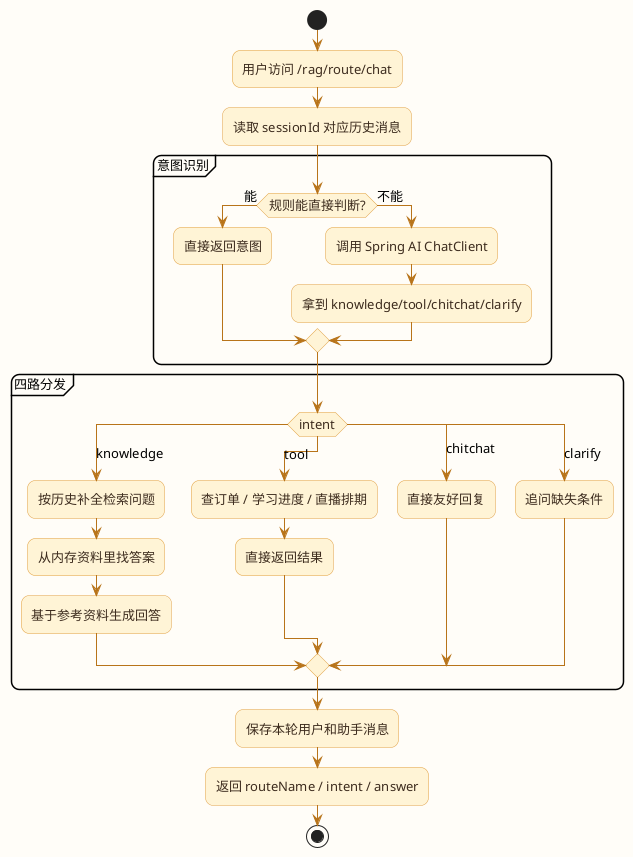
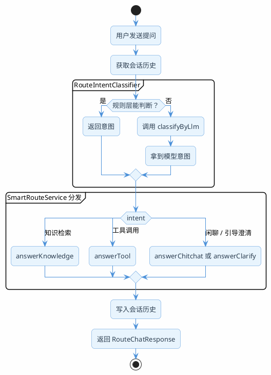

# 查询的路由是必不可少的

你有没有想过一个问题：用户发了一句"你好"，你的RAG系统会怎么处理？

如果没做任何分流，它会老老实实地把"你好"丢进向量库做相似度检索，然后可能匹配到"你好，欢迎使用XX产品"之类的文档片段，最后大模型基于这个片段生成一段莫名其妙的回复。

再比如用户问"我的订单到哪了"——这个问题的答案根本不在知识库里，它需要调用物流API查实时数据。但如果系统不区分，照样去知识库里搜，搜出来的可能是"物流配送说明"之类的通用文档，答非所问。

这就好比去医院看病，不管你是感冒还是骨折，都直接塞进同一个科室——效率低不说，还容易误诊。

**意图识别就是RAG系统的"分诊台"**：先判断用户想干什么，再决定走哪条处理通道。

## 四条通道，各司其职

根据实际项目经验，用户的提问基本可以归为四类意图，每类对应不同的处理方式。

### 通道一：知识检索

用户问的是通用性、知识性的问题，答案存在于你的文档库中。

典型场景：
- "Spring Boot的自动配置原理是什么？"
- "退货政策是怎样的？"
- "MySQL索引失效的常见原因有哪些？"

处理方式：走完整的RAG流程——问题改写 → 向量检索 → 重排序 → 大模型生成。

### 通道二：工具调用

用户需要的是实时数据或个人数据，这些信息不在静态知识库里，需要调用外部接口获取。

典型场景：
- "我的订单2026031500123到哪了？"（调物流API）
- "帮我查一下研发部有多少人"（查数据库）
- "今天北京天气怎么样？"（调天气API）

处理方式：识别出需要调用的工具/API，提取参数，执行调用，返回结果。这里面又分两种情况：
- 直接调API（Function Call / MCP）
- 先把自然语言转成SQL再查数据库（Text2SQL，后面会详细讲）

### 通道三：闲聊寒暄

用户只是打个招呼、说声谢谢、聊几句无关的话。

典型场景：
- "你好"
- "谢谢你的帮助"
- "今天心情不错"
- "你是谁？"

处理方式：直接让大模型回复，不需要检索任何知识库。这类问题如果走检索，反而会因为匹配到不相关的文档而让回答变得奇怪。

### 通道四：引导澄清

用户的问题太模糊、太宽泛，系统没法直接给出有价值的回答，需要反问用户获取更多信息。

典型场景：
- "帮我推荐一个课程"（什么方向？什么水平？预算多少？）
- "数据库有问题"（什么数据库？什么问题？报错信息？）
- "部署"（部署什么？部署到哪里？）

处理方式：不急着回答，而是生成一个引导性的追问，帮用户把需求说清楚。

:::info 四条通道的判断标准
- 答案在文档里 → 知识检索
- 答案需要实时查询 → 工具调用
- 不需要答案，只是社交互动 → 闲聊
- 问题本身不完整，无法给出有效回答 → 引导澄清
:::

## Spring AI 完整的流程示例

### 示例中项目地址

- 项目地址：[https://gitee.com/shining-stars-l/super-ai-hub](https://gitee.com/shining-stars-l/super-ai-hub)
- 项目模块：`ai-example-spring-ai-rag`
- 所属的包：`route`

这套代码主要是做了这几件事：

- 用 **RouteIntentClassifier** 先做规则判断，然后再让大模型来做兜底。
- 用 **SmartRouteService** 把知识检索、工具查询、闲聊、澄清四条通道都包含了进去。
- 用**会话历史**解决“那这个呢”“继续查吧”这种上下文相关的问题。
- 用**内存模拟知识资料和业务数据**，让示例不用接数据库、不用去连真实的向量库也可以跑通。

### 示例代码的完整流程



### 对应到代码里，关键类就是这几个

- `RouteChatController`：统一入口，提供 `/rag/route/chat` 和 `/rag/route/reset`。
- `SmartRouteService`：主流程都在这里，负责“读历史 -> 判意图 -> switch 分流 -> 记历史”。
- `RouteIntentClassifier`：混合分类器，规则优先，规则兜不住再交给大模型。
- `RouteIntent`：四种意图枚举，避免到处散落字符串。
- `RouteChatResponse`：对外返回结果。

#### 入口处：

```java
@AllArgsConstructor
@RestController
@RequestMapping("/rag/route")
public class RouteChatController {

    private final SmartRouteService smartRouteService;

    /**
     * 对外统一入口。
     * sessionId 相同表示同一轮对话线程，系统会自动复用历史消息。
     */
    @GetMapping("/chat")
    public RouteChatResponse chat(
        @RequestParam("question") String question,
        @RequestParam(value = "sessionId", required = false) String sessionId) {
        return smartRouteService.chat(sessionId, question);
    }

    /**
     * 清空指定会话，方便重复演示“第一轮 / 第二轮”效果。
     */
    @GetMapping("/reset")
    public Map<String, Object> reset(@RequestParam(value = "sessionId", required = false) String sessionId) {
        smartRouteService.reset(sessionId);
        Map<String, Object> result = new LinkedHashMap<>();
        result.put("sessionId", sessionId == null ? "route-demo-session" : sessionId);
        result.put("reset", true);
        return result;
    }
}
```

```java
@Service
public class SmartRouteService {

    /**
     * 一次完整对话主流程：
     * 1. 拿历史
     * 2. 判意图
     * 3. 按意图调用对应方法
     * 4. 记录本轮问答
     */
    public RouteChatResponse chat(String sessionId, String question) {
        String normalizedSessionId = normalizeSessionId(sessionId);
        List<String> history = new ArrayList<>(sessionStore.getOrDefault(normalizedSessionId, List.of()));
        String historyText = formatHistory(history);

        RouteIntent intent = routeIntentClassifier.classify(question, historyText);
        String answer = switch (intent) {
            case KNOWLEDGE -> answerKnowledge(question, historyText);
            case TOOL -> answerTool(question);
            case CHITCHAT -> answerChitchat(question, historyText);
            case CLARIFY -> answerClarify(question);
        };

        appendHistory(normalizedSessionId, "用户：" + question);
        appendHistory(normalizedSessionId, "助手：" + answer);

        log.info("RouteChat | sessionId={} | question={} | intent={}",
            normalizedSessionId, question, intent.getCode());

        return new RouteChatResponse(
            normalizedSessionId,
            question,
            intent,
            intent.getLabel(),
            answer
        );
    }
}
```

这只是个示例项目，所以直接使用 `switch` 来做路由分发了，它就是实现“不要什么问题都往知识库里查”的核心路由了。

### 规则层和大模型层是怎么配合的

完整示例里，意图识别不是每次都调模型，而是先走一轮规则过滤：

```java
private RouteIntent classifyByRule(String question, String historyText) {
    String normalized = normalize(question);
    if (!StringUtils.hasText(normalized)) {
        return RouteIntent.CLARIFY;
    }

    if (GREETING_WORDS.stream().anyMatch(normalized::contains)) {
        return RouteIntent.CHITCHAT;
    }

    if (hasToolWord(normalized) || hasOrderId(normalized)) {
        return RouteIntent.TOOL;
    }

    if ((normalized.contains("继续") || normalized.contains("好的")) && historyText.contains("订单")) {
        return RouteIntent.TOOL;
    }

    if (normalized.length() <= 4 || AMBIGUOUS_WORDS.contains(normalized)) {
        return RouteIntent.CLARIFY;
    }

    return null;
}
```

这里只会拦截最明显的几种情况：

- “你好”“谢谢”这种，一看就是闲聊。
- 带订单号、带“进度”“排期”这种，一看就更像工具查询。
- “推荐一下”“这个呢”这种，一看就信息不够，先澄清更稳。
- “继续”“好的”这种，如果上一轮在聊订单，就顺着当成工具查询。

规则层的价值不在于把所有消息都判定准，而在于先把最容易判断的那一批消息快速拿下，不能什么都丢给模型的。

### 发送测试请求

**先在`application.yaml`中配置好ApiKey**：[参考硅基流动章节中apiKey的设置](/super-agent/llm-intro-qoder/dev-environment)

然后就可以直接用下面这些请求试四条通道了

#### 1. 闲聊通道

```bash
curl "http://localhost:7092/rag/route/chat?sessionId=route-doc-demo&question=你好"
```

这类问题就不该去查知识库，直接自然回复就行。

**结果：**
```json
{
    "sessionId": "route-doc-demo",
    "question": "你好",
    "intent": "CHITCHAT",
    "routeName": "闲聊寒暄",
    "answer": "你好呀，我这边可以帮你判断该查知识库、查工具，还是先把问题问清楚。"
}
```

#### 2. 知识检索通道

```bash
curl "http://localhost:7092/rag/route/chat?sessionId=route-doc-demo&question=训练营发票怎么开"
```

这个问题答案在平台规则里，系统会走知识通道，命中“发票开具规则”那组资料。

**结果：**
```json
{
    "sessionId": "route-doc-demo",
    "question": "训练营发票怎么开",
    "intent": "KNOWLEDGE",
    "routeName": "知识检索",
    "answer": "要开具训练营发票，您可以按照以下步骤操作：\n\n1. 确认支付成功：确保您已成功支付训练营费用。\n2. 登录平台：访问提供训练营服务的平台或网站，并登录您的账户。\n3. 进入订单管理：导航至“我的订单”或类似的功能区域。\n4. 申请发票：在“我的订单”页面找到相应的训练营订单，点击“发票申请”或类似的按钮。\n5. 填写发票信息：按照提示填写发票抬头、纳税人识别号等信息。\n6. 提交申请：确认无误后提交发票申请。\n7. 等待审核：发票申请提交后，等待平台审核。审核通过后，发票将发送至您提供的邮箱或通过其他方式获取。\n\n请注意，发票申请应在支付成功后30天内完成。如果有任何疑问，建议联系平台客服进行咨询。"
}
```

#### 3. 工具调用通道

```bash
curl "http://localhost:7092/rag/route/chat?sessionId=route-doc-demo&question=帮我查一下订单 JU-20260318-1001 现在什么状态"
```

这个问题就不是知识库该回答的了。它需要查具体订单，所以会走工具通道。

**结果：**
```json
{
    "sessionId": "route-doc-demo",
    "question": "帮我查一下订单 JU-20260318-1001 现在什么状态",
    "intent": "TOOL",
    "routeName": "工具调用",
    "answer": "订单 JU-20260318-1001 已支付，课程权限已经开通。"
}
```

#### 4. 引导澄清通道

```bash
curl "http://localhost:7092/rag/route/chat?sessionId=route-doc-demo&question=推荐一下"
```

这时候最稳的做法不是瞎猜，而是先追问用户想推荐什么。

**结果：**
```json
{
    "sessionId": "route-doc-demo",
    "question": "推荐一下",
    "intent": "CLARIFY",
    "routeName": "引导澄清",
    "answer": "可以呀，你是想让我推荐课程方向、具体训练营，还是学习路线？你随便补一句，我就能继续往下接。"
}
```

#### 5. 看一下多轮上下文

先问第一句：

```bash
curl "http://localhost:7092/rag/route/chat?sessionId=route-context-demo&question=结课证书怎么拿"
```

再追问第二句：

```bash
curl "http://localhost:7092/rag/route/chat?sessionId=route-context-demo&question=那如果作业没交够呢"
```

第二句如果不带历史，系统就容易懵；带上同一个 `sessionId` 之后，知识通道里的问题补全逻辑就能把“作业没交够”补回“结课证书条件”这个上下文里。

**结果：**
```json
{
    "sessionId": "route-context-demo",
    "question": "那如果作业没交够呢",
    "intent": "TOOL",
    "routeName": "工具调用",
    "answer": "这个问题应该走工具通道，不过示例里需要更具体一点，比如给订单号，或者直接问学习进度、直播排期。"
}
```

:::warning 示例里内置了哪些测试数据
- 订单号可以先用 `JU-20260318-1001`、`JU-20260318-1002`
- 学习进度默认会查 `DEMO-USER`
- 班级排期默认会查 `CAMP-RAG-03`

用这几个值访问示例，可以直接出结果，不用额外造数据了。
:::

## 怎么判断用户意图？三种方案

知道了有哪些通道，接下来的问题是：怎么判断一句话该走哪条通道？

```text
org.javaup.route.service.RouteIntentClassifier
```

把下面三种方案都放在了 `RouteIntentClassifier` 里：

- `classifyByRule(...)` 对应规则匹配
- `classifyByLlm(...)` 对应大模型分类
- `classify(...)` 对应生产里更常用的混合方案

### 方案一：规则匹配——最快但是匹配的粒度也是最粗的

最简单的方式，用关键词和正则表达式做匹配。

```java
private RouteIntent classifyByRule(String question, String historyText) {
    String normalized = normalize(question);
    if (!StringUtils.hasText(normalized)) {
        return RouteIntent.CLARIFY;
    }

    if (GREETING_WORDS.stream().anyMatch(normalized::contains)) {
        return RouteIntent.CHITCHAT;
    }

    if (hasToolWord(normalized) || hasOrderId(normalized)) {
        return RouteIntent.TOOL;
    }

    if ((normalized.contains("继续") || normalized.contains("好的")) && historyText.contains("订单")) {
        return RouteIntent.TOOL;
    }

    if (normalized.length() <= 4 || AMBIGUOUS_WORDS.contains(normalized)) {
        return RouteIntent.CLARIFY;
    }

    return null;
}
```

这里判断的不只是“你好”“谢谢”这种固定词，还保留了一点上下文判断：

- **确认型消息识别**：比如用户前一轮已经在聊“要不要继续查订单”，下一句说“好的，继续吧”，这时候单看当前问题是看不出来的，必须结合历史。
- **业务编号识别**：像 `JU-20260318-1001` 这种订单号，一旦命中，基本就可以高置信度判成工具通道。

### 方案二：大模型分类——最准确但也是最慢的

让大模型来判断意图，准确率能到90%以上。

```java
private static final String INTENT_PROMPT = """
    你是一个路由分类助手。
    请根据历史对话和当前问题，只返回下面四个词里的一个：
    knowledge
    tool
    chitchat
    clarify

    历史对话：
    {history}

    当前问题：
    {question}
    """;

private RouteIntent classifyByLlm(String question, String historyText) {
    try {
        String content = chatClient.prompt()
            .user(user -> user.text(INTENT_PROMPT)
                .param("history", StringUtils.hasText(historyText) ? historyText : "无历史对话")
                .param("question", question))
            .call()
            .content();
        return RouteIntent.from(cleanIntent(content));
    }
    catch (Exception exception) {
        log.warn("意图识别失败，默认回到知识检索: {}", exception.getMessage());
        return RouteIntent.KNOWLEDGE;
    }
}
```

#### 优点：

- 能理解语义，不会只盯着那些关键词。
- 能对话历史也能理解，像“那就继续查吧”这种问题也能判。
- 扩展新意图时，很多时候改 Prompt 就够了。

#### 缺点：

- 每次都调模型，延迟会上来。
- 会有 API 的调用成本。
- 模型偶尔会答得不规矩，所以示例里直接“包含哪个词就认哪个词”，再不行就回知识检索。

### 方案三：混合方案——推荐

把规则和大模型结合起来：规则层处理高置信度的简单情况，再让大模型来处理剩下的。

```java
public RouteIntent classify(String question, String historyText) {
    RouteIntent ruleIntent = classifyByRule(question, historyText);
    if (ruleIntent != null) {
        return ruleIntent;
    }
    return classifyByLlm(question, historyText);
}
```

- **先试规则层**，能判断就立刻返回。
- **规则兜不住**，再调大模型。
- **模型出异常**，就回知识检索。

## 路由器：根据意图分发到不同通道

意图识别完成后，需要一个路由器把请求分发到对应的处理逻辑。

```java
@Service
public class SmartRouteService {

    public RouteChatResponse chat(String sessionId, String question) {
        String normalizedSessionId = normalizeSessionId(sessionId);
        List<String> history = new ArrayList<>(sessionStore.getOrDefault(normalizedSessionId, List.of()));
        String historyText = formatHistory(history);

        RouteIntent intent = routeIntentClassifier.classify(question, historyText);
        String answer = switch (intent) {
            case KNOWLEDGE -> answerKnowledge(question, historyText);
            case TOOL -> answerTool(question);
            case CHITCHAT -> answerChitchat(question, historyText);
            case CLARIFY -> answerClarify(question);
        };

        appendHistory(normalizedSessionId, "用户：" + question);
        appendHistory(normalizedSessionId, "助手：" + answer);

        return new RouteChatResponse(
            normalizedSessionId,
            question,
            intent,
            intent.getLabel(),
            answer
        );
    }
}
```

- `answerKnowledge(...)`：必要时补全问题，再从内存资料里找答案
- `answerTool(...)`：查订单、学习进度、直播排期
- `answerChitchat(...)`：打招呼、感谢，或者简单闲聊
- `answerClarify(...)`：问题太糊，就追问一句



## 工具调用通道之Text2SQL

当用户的问题需要查数据库时，不能直接把自然语言丢给数据库。需要先把自然语言转成SQL，这就是Text2SQL。

### 思路很简单

1. 把表结构信息告诉大模型
2. 把用户的问题告诉大模型
3. 让大模型生成SQL
4. 执行SQL，返回结果

关键在于：**表结构的描述要足够清晰**，字段注释要用业务语言写，不能只写技术名称。

### 完整实现

```java
@Service
public class Text2SqlService {

    private final ChatClient chatClient;
    private final JdbcTemplate jdbcTemplate;

    private static final String TEXT2SQL_PROMPT = """
        你是一个SQL专家。根据用户的自然语言问题，生成对应的SQL查询语句。

        数据库表结构：
        {table_schemas}

        规则：
        1. 只生成SELECT查询，禁止生成INSERT、UPDATE、DELETE等修改语句
        2. 只输出SQL语句本身，不要加任何解释或markdown格式
        3. 如果用户问题涉及时间（如"最近""今天""上个月"），当前日期是 {today}
        4. 如果无法根据表结构回答用户问题，输出空字符串

        用户问题：{question}
        """;

    // 表结构定义——注释用业务语言，这很关键
    private static final String TABLE_SCHEMAS = """
        CREATE TABLE course_info (
            id BIGINT PRIMARY KEY COMMENT '课程ID',
            title VARCHAR(200) COMMENT '课程标题，如Java实战营、Python入门课',
            category VARCHAR(50) COMMENT '课程分类：编程语言/框架/数据库/运维/AI',
            price DECIMAL(10,2) COMMENT '课程售价，单位元',
            teacher VARCHAR(50) COMMENT '讲师姓名',
            student_count INT COMMENT '已报名学生数',
            rating DECIMAL(2,1) COMMENT '课程评分，1.0-5.0',
            status VARCHAR(20) COMMENT '课程状态：上架/下架/预售',
            created_at DATETIME COMMENT '课程创建时间',
            updated_at DATETIME COMMENT '最后更新时间'
        );

        CREATE TABLE order_info (
            id BIGINT PRIMARY KEY COMMENT '订单ID',
            user_id BIGINT COMMENT '用户ID',
            course_id BIGINT COMMENT '课程ID，关联course_info.id',
            amount DECIMAL(10,2) COMMENT '实付金额，单位元',
            status VARCHAR(20) COMMENT '订单状态：待支付/已支付/已退款/已取消',
            created_at DATETIME COMMENT '下单时间',
            paid_at DATETIME COMMENT '支付时间'
        );
        """;

    public Text2SqlService(ChatClient.Builder builder, JdbcTemplate jdbcTemplate) {
        this.chatClient = builder.build();
        this.jdbcTemplate = jdbcTemplate;
    }

    /**
     * 自然语言 → SQL
     */
    public String toSql(String question) {
        String today = LocalDate.now().toString();
        return chatClient.prompt()
                .user(u -> u.text(TEXT2SQL_PROMPT)
                        .param("table_schemas", TABLE_SCHEMAS)
                        .param("today", today)
                        .param("question", question))
                .call()
                .content()
                .trim();
    }

    /**
     * 自然语言 → SQL → 执行 → 返回结果
     */
    public String query(String question) {
        String sql = toSql(question);
        if (sql == null || sql.isBlank()) {
            return "抱歉，这个问题我没法通过数据库查询来回答。";
        }

        // 安全校验：确保只有SELECT
        if (!sql.toUpperCase().startsWith("SELECT")) {
            log.warn("Text2SQL生成了非SELECT语句: {}", sql);
            return "抱歉，查询生成异常，请稍后重试。";
        }

        log.info("Text2SQL | question={} | sql={}", question, sql);

        try {
            List<Map<String, Object>> results = jdbcTemplate.queryForList(sql);
            return formatResults(results);
        } catch (Exception e) {
            log.error("SQL执行失败: {}", sql, e);
            return "查询执行出错，请换个方式描述您的问题。";
        }
    }

    private String formatResults(List<Map<String, Object>> results) {
        if (results.isEmpty()) return "没有查到相关数据。";
        // 简单格式化，实际项目中可以让大模型来组织语言
        StringBuilder sb = new StringBuilder();
        for (Map<String, Object> row : results) {
            sb.append(row.toString()).append("\n");
        }
        return sb.toString();
    }
}
```

:::warning Text2SQL的安全红线
1. 生成的SQL必须校验，只允许SELECT，绝对不能执行写操作
2. 建议用只读数据库账号连接
3. 加上查询超时限制，防止生成的SQL导致慢查询
4. 表结构信息不要暴露敏感字段（如密码、密钥等）
:::

### 用LangChain4j实现数据源路由

如果你的项目用的是LangChain4j，可以用`@AiService`注解更优雅地实现路由。

```java
public interface DataSourceRouter {

    @SystemMessage("""
        你是一个查询路由器。根据用户的问题，判断应该从哪个数据源获取答案。

        可选的数据源：
        - VECTOR：适合知识性问题、概念解释、操作指南等，从文档库中检索
        - RELATIONAL：适合数据统计、精确查询、涉及具体数字的问题，从关系数据库查询
        - GRAPH：适合关系查询、关联分析、路径查找等，从图数据库查询

        只输出数据源名称，不要解释。如果不确定，输出VECTOR。
        """)
    String route(@UserMessage String question);
}
```

```java
@RestController
public class MultiSourceController {

    private final DataSourceRouter router;
    private final VectorSearchService vectorService;
    private final Text2SqlService sqlService;
    private final GraphService graphService;

    @GetMapping("/smart-query")
    public String query(@RequestParam String question) {
        String source = router.route(question).trim().toUpperCase();
        log.info("路由决策 | question={} | source={}", question, source);

        return switch (source) {
            case "RELATIONAL" -> sqlService.query(question);
            case "GRAPH"      -> graphService.query(question);
            default           -> vectorService.search(question);
        };
    }
}
```

## Prompt路由：同一个数据源，不同的回答风格

除了数据源路由，还有一种场景：数据源是同一个，但需要根据用户意图选择不同的系统提示词。

举个例子，一个健康咨询系统，用户可能问的是症状相关的问题，也可能问的是用药相关的问题。虽然都是从同一个医学知识库检索，但回答的角色和风格应该不同：

```java
public interface HealthConsultRouter {

    @SystemMessage("""
        判断用户的健康咨询属于哪个类别：
        - SYMPTOM：症状描述、疾病咨询、诊断相关
        - MEDICATION：用药咨询、药物副作用、剂量相关
        - LIFESTYLE：饮食建议、运动方案、生活习惯
        只输出类别名称。
        """)
    String classify(@UserMessage String question);
}
```

```java
private static final Map<String, String> SYSTEM_PROMPTS = Map.of(
    "SYMPTOM", """
        你是一位经验丰富的全科医生。请根据参考资料，用专业但易懂的语言
        分析用户描述的症状，给出可能的原因和建议。
        注意：始终建议用户就医确认，不要做最终诊断。
        """,
    "MEDICATION", """
        你是一位临床药师。请根据参考资料，准确回答用户的用药问题。
        重点关注：适应症、用法用量、常见副作用、药物相互作用。
        注意：提醒用户遵医嘱用药。
        """,
    "LIFESTYLE", """
        你是一位健康管理师。请根据参考资料，给出实用的生活方式建议。
        风格要亲切、鼓励性的，给出具体可执行的方案。
        """
);
```

这样同一个检索结果，经过不同的系统提示词，生成的回答风格和侧重点完全不同。

## 引导澄清：问题太模糊时主动追问

有些问题不是改写能解决的——用户自己都没想清楚要什么。这时候最好的策略不是硬答，而是引导用户把需求说清楚。

### 什么时候该澄清

- 问题只有1-3个字，没有具体指向："缓存""部署""优化"
- 缺少关键约束条件："帮我推荐一个课程"（什么方向？什么水平？）
- 存在多种理解方式："数据库连接问题"（连不上？连接池满了？超时？）

### 实现思路

澄清不是简单地回一句"请说详细点"，而是要根据问题的领域，给出有针对性的追问。

```java
@Service
public class ClarifyService {

    private final ChatClient chatClient;

    private static final String CLARIFY_PROMPT = """
        用户提了一个比较模糊的问题，你需要通过追问来帮助用户明确需求。

        追问原则：
        1. 一次只问1-2个问题，不要连珠炮式提问
        2. 给出选项或示例，降低用户的回答成本
        3. 语气友好自然，不要让用户觉得被审问
        4. 追问的内容要和用户的问题领域相关

        用户的问题：{question}

        对话历史：
        {history}

        请生成一段友好的追问回复：
        """;

    public ClarifyService(ChatClient.Builder builder) {
        this.chatClient = builder.build();
    }

    public String guide(String question, List<Message> history) {
        String historyText = history.isEmpty() ? "无" :
                history.stream()
                    .map(m -> (m instanceof UserMessage ? "用户" : "助手")
                            + "：" + m.getText())
                    .collect(Collectors.joining("\n"));

        return chatClient.prompt()
                .user(u -> u.text(CLARIFY_PROMPT)
                        .param("question", question)
                        .param("history", historyText))
                .call()
                .content();
    }
}
```

实际效果：

| 用户说 | 系统追问 |
|-------|---------|
| 帮我推荐一个课程 | 好的，我来帮你挑选。你目前对哪个方向比较感兴趣？比如Java后端、Python数据分析、前端开发？另外你是零基础还是有一定经验了？ |
| 数据库有问题 | 能具体说说是什么情况吗？比如是连接不上、查询很慢、还是数据出现了异常？用的是MySQL还是其他数据库？ |
| 部署 | 你是想了解怎么部署应用吗？可以告诉我一些细节：部署什么类型的应用（Spring Boot、前端项目）？部署到哪里（服务器、Docker、K8s）？ |

## 意图识别放在RAG链路的哪个位置

意图识别应该在**获取会话历史之后、问题改写之前**。

为什么要在问题改写之前？因为不是所有意图都需要改写：
- 闲聊不需要改写
- 工具调用不需要改写（需要的是参数提取）
- 只有知识检索通道才需要问题改写

为什么要在获取会话历史之后？因为有些意图需要结合上下文才能判断。比如用户说"好的，帮我退了吧"——单看这句话可能是闲聊，但如果上文在讨论退货，这就是一个工具调用。

## 生产环境踩坑经验

### 兜底策略：分类失败就走知识检索

大模型分类可能失败，比如接口超时、模型没回内容、或者回得乱七八糟。在示例的处理方式比较直接：**失败时默认走知识检索通道** ：
- 知识检索是最安全的通道，最坏情况就是"没找到相关信息"
- 闲聊走知识检索虽然不完美，但不会出大问题
- 工具调用走知识检索会答非所问，但不会造成数据修改等副作用

```java
private RouteIntent classifyByLlm(String question, String historyText) {
    try {
        String content = chatClient.prompt()
            .user(user -> user.text(INTENT_PROMPT)
                .param("history", StringUtils.hasText(historyText) ? historyText : "无历史对话")
                .param("question", question))
            .call()
            .content();
        return RouteIntent.from(cleanIntent(content));
    }
    catch (Exception exception) {
        log.warn("意图识别失败，默认回到知识检索: {}", exception.getMessage());
        return RouteIntent.KNOWLEDGE;
    }
}
```

### 分类结果要记日志

上线后一定要记录每次分类的结果，方便后续分析和优化。

```java
log.info("RouteChat | sessionId={} | question={} | intent={}",
    normalizedSessionId, question, intent.getCode());
```

先记录三个最关键的信息：

- 会话是谁
- 用户问了什么
- 最终分到了哪个意图

如果真要做线上分析的话，可以再加 `source=rule/llm`、耗时、命中资料数这些字段。

### 新意图的扩展

业务发展后可能需要新增意图类型（比如"投诉"通道）。建议把意图定义给做成配置化的会更好：

```java
@Data
public class IntentDefinition {
    private String name;        // 意图名称
    private String description; // 意图描述（给大模型看的）
    private List<String> examples; // 示例问题
    private String handler;     // 处理器bean名称
}
```

新增意图时只需要加配置和对应的处理器，不需要改分类逻辑的代码。

## 小结
- 意图识别是RAG系统从"能用"到"好用"的关键一步。不做意图识别，所有问题一股脑走检索，闲聊会匹配到无关文档，工具类问题会答非所问。
- 推荐用混合方案（规则+大模型），规则处理简单case省成本，大模型处理复杂case保准确率。
- 四条通道各司其职：知识检索走RAG全流程，工具调用走API/Text2SQL，闲聊直接回复，模糊问题主动追问。
