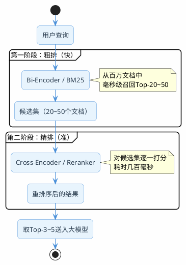

# 重排序的好处是什么

上一篇讲了混合检索，通过向量+关键词两条路并行召回，再用RRF融合，大幅提升了召回率。但有个问题还没解决：**召回的文档排序准吗？**

打个比方，你去图书馆找关于"分布式锁"的资料。管理员帮你从书架上抱了20本相关的书过来（这是召回）。但这20本书摞在一起，哪本最值得先看？管理员只是按书架位置随手拿的，并没有帮你按"和你需求的匹配度"排好序。

重排序就是干这个事的：**对召回的候选集做一次精细化的相关性打分，把最匹配的排到最前面。**

为什么这很重要？因为大模型的上下文窗口是有限的，你不可能把20个文档块全塞进去。通常只取前3-5个。如果排序不准，真正相关的文档排在第8位，而前5个都是"沾点边但不太对"的内容，最终生成的回答质量就会打折扣。

## 初始检索为什么排不准

不管是向量检索还是BM25，它们在做排序时都有一个共同的局限：**查询和文档是分开编码的。**

向量检索的工作方式是：先把查询编码成一个向量，再把每个文档编码成一个向量，然后比较两个向量的距离。这种方式叫Bi-Encoder（双编码器）。

```
Bi-Encoder的工作方式：
查询 → [编码器A] → 查询向量 ─┐
                              ├→ 计算距离 → 相似度分数
文档 → [编码器B] → 文档向量 ─┘
```

Bi-Encoder的优势是快——文档向量可以提前算好存起来，查询时只需要算一次查询向量，然后做向量距离计算。百万级文档也能在毫秒级返回结果。

但它的劣势也很明显：查询和文档是独立编码的，**编码器看不到两者之间的交互关系**。

举个例子，查询是"Spring Boot如何配置多数据源"，候选文档有两个：
- 文档A："Spring Boot多数据源配置需要自定义DataSource Bean……"
- 文档B："Spring Boot配置文件支持多种格式，包括yml和properties……"

两个文档都包含"Spring Boot"和"配置"这些关键词，向量距离可能很接近。但人一看就知道文档A才是真正相关的。Bi-Encoder因为没有让查询和文档"面对面交流"，很难捕捉到这种细粒度的差异。

## Cross-Encoder：让查询和文档面对面

重排序用的是Cross-Encoder（交叉编码器），工作方式完全不同：

```
Cross-Encoder的工作方式：
[查询 + 文档] → [编码器] → 相关性分数
```

它把查询和文档拼在一起，作为一个整体输入到模型中。模型内部通过Attention机制，让查询中的每个词都能"看到"文档中的每个词，充分捕捉两者之间的语义交互。

回到刚才的例子：
- Cross-Encoder处理"Spring Boot如何配置多数据源" + 文档A时，能发现"多数据源"和"自定义DataSource Bean"之间的强关联
- 处理同样的查询 + 文档B时，发现"配置"指的是"配置文件格式"而不是"配置多数据源"，关联度低

所以Cross-Encoder的排序精度远高于Bi-Encoder。

### 那为什么不直接用Cross-Encoder做检索？

因为太慢了。

Cross-Encoder需要把查询和每个候选文档拼在一起过一遍模型。如果知识库有100万个文档块，就要跑100万次模型推理。这个计算量完全不可接受。

所以实际架构是两阶段的：



- 第一阶段（粗排）：用Bi-Encoder或BM25从百万文档中快速召回20-50个候选。速度快，精度一般
- 第二阶段（精排）：用Cross-Encoder对这20-50个候选逐一打分重排。速度慢，但精度高

两阶段配合，既保证了速度，又保证了精度。


## 主流Reranker模型选型

目前常用的重排序模型有这几个：

| 模型 | 特点 | 中文支持 | 调用方式 |
|------|------|---------|---------|
| BAAI/bge-reranker-v2-m3 | 多语言，效果稳定，社区活跃 | 好 | API / 本地部署 |
| Qwen3-Reranker-8B | 阿里出品，支持自定义instruction | 好 | DashScope API |
| Cohere rerank-v4.0 | 商业模型，效果顶尖 | 一般 | Cohere API |
| jina-reranker-v2-base-multilingual | 轻量级，适合本地部署 | 较好 | API / 本地部署 |

对于中文场景，推荐bge-reranker-v2-m3或Qwen3-Reranker-8B。前者社区生态好，后者支持通过instruction参数针对特定领域优化排序。

## Java实战：调用Reranker API

### 方案一：调用SiliconFlow的Reranker API

SiliconFlow提供了bge-reranker-v2-m3的在线API，接入简单。

```java
@Service
public class RerankerService {

    private final RestTemplate restTemplate;

    private static final String RERANK_URL = "https://api.siliconflow.cn/v1/rerank";
    private static final String API_KEY = "${siliconflow.api-key}";
    private static final String MODEL = "BAAI/bge-reranker-v2-m3";

    public RerankerService() {
        this.restTemplate = new RestTemplate();
        // 设置超时：rerank通常比较快，但要防止异常情况
        var factory = new SimpleClientHttpRequestFactory();
        factory.setConnectTimeout(5000);
        factory.setReadTimeout(10000);
        this.restTemplate = new RestTemplate(factory);
    }

    /**
     * 对候选文档做重排序
     * @param query 用户查询
     * @param documents 候选文档列表
     * @param topK 返回前K个
     * @return 重排序后的文档内容列表
     */
    public List<String> rerank(String query, List<String> documents, int topK) {
        HttpHeaders headers = new HttpHeaders();
        headers.setContentType(MediaType.APPLICATION_JSON);
        headers.setBearerAuth(API_KEY);

        Map<String, Object> body = Map.of(
                "model", MODEL,
                "query", query,
                "documents", documents,
                "top_n", topK,
                "return_documents", true
        );

        HttpEntity<Map<String, Object>> request = new HttpEntity<>(body, headers);

        try {
            ResponseEntity<Map> response = restTemplate.postForEntity(
                    RERANK_URL, request, Map.class);

            List<Map<String, Object>> results =
                    (List<Map<String, Object>>) response.getBody().get("results");

            return results.stream()
                    .sorted(Comparator.comparingDouble(
                            r -> -((Number) r.get("relevance_score")).doubleValue()))
                    .map(r -> {
                        Map<String, String> doc = (Map<String, String>) r.get("document");
                        double score = ((Number) r.get("relevance_score")).doubleValue();
                        log.info("Rerank | score={} | text={}...",
                                String.format("%.4f", score),
                                doc.get("text").substring(0, Math.min(50, doc.get("text").length())));
                        return doc.get("text");
                    })
                    .collect(Collectors.toList());
        } catch (Exception e) {
            log.error("Reranker调用失败，返回原始顺序", e);
            return documents.stream().limit(topK).collect(Collectors.toList());
        }
    }
}
```

### 方案二：调用DashScope的Qwen3-Reranker

Qwen3-Reranker有个独特的功能：支持通过instruction参数告诉模型你的排序偏好，适合特定领域的场景。

```java
public List<String> rerankWithQwen(String query, List<String> documents,
                                    int topK, String instruction) {
    HttpHeaders headers = new HttpHeaders();
    headers.setContentType(MediaType.APPLICATION_JSON);
    headers.set("Authorization", "Bearer " + dashscopeApiKey);

    // Qwen3-Reranker支持自定义instruction
    Map<String, Object> input = new HashMap<>();
    input.put("query", query);
    input.put("documents", documents);
    if (instruction != null && !instruction.isBlank()) {
        // 比如："请优先排序包含具体代码示例的文档"
        input.put("instruction", instruction);
    }

    Map<String, Object> body = Map.of(
            "model", "qwen3-reranker-8b",
            "input", input,
            "parameters", Map.of("top_n", topK)
    );

    HttpEntity<Map<String, Object>> request = new HttpEntity<>(body, headers);
    ResponseEntity<Map> response = restTemplate.postForEntity(
            "https://dashscope.aliyuncs.com/api/v1/services/rerank/text-rerank/text-rerank",
            request, Map.class);

    // 解析返回结果（结构和SiliconFlow类似）
    Map<String, Object> output = (Map<String, Object>) response.getBody().get("output");
    List<Map<String, Object>> results = (List<Map<String, Object>>) output.get("results");

    return results.stream()
            .sorted(Comparator.comparingDouble(
                    r -> -((Number) r.get("relevance_score")).doubleValue()))
            .map(r -> {
                int index = ((Number) r.get("index")).intValue();
                return documents.get(index);
            })
            .limit(topK)
            .collect(Collectors.toList());
}
```

instruction的用法举例：
- 技术文档场景：`"请优先排序包含代码示例和具体配置的文档"`
- 法律文档场景：`"请优先排序包含法条引用和判例的文档"`
- 医学文档场景：`"请优先排序包含临床数据和循证医学证据的文档"`

## 把重排序嵌入完整的RAG链路

重排序不是单独用的，它是混合检索之后、大模型生成之前的一个环节。

```java
@RestController
@RequestMapping("/api/rag")
public class FullRagController {

    private final ChatClient chatClient;
    private final HybridSearchService hybridSearch;
    private final RerankerService reranker;

    @GetMapping("/smart-chat")
    public Flux<String> smartChat(@RequestParam String question) {
        // 第一阶段：混合检索（粗排）
        List<String> candidates = hybridSearch.hybridSearch(question, 20);
        log.info("混合检索召回 {} 个候选", candidates.size());

        if (candidates.isEmpty()) {
            return Flux.just("抱歉，没有找到相关资料。");
        }

        // 第二阶段：重排序（精排）
        List<String> reranked = reranker.rerank(question, candidates, 5);
        log.info("重排序后取Top-5");

        // 第三阶段：大模型生成
        String context = String.join("\n---\n", reranked);

        return chatClient.prompt()
                .system(s -> s.text("""
                    你是一个技术文档助手。根据参考资料回答问题。
                    只基于参考资料回答，不要编造。如果资料不足，如实告知。

                    参考资料：
                    {context}
                    """).param("context", context))
                .user(question)
                .stream()
                .content();
    }
}
```

整个流程：混合检索召回20个 → 重排序精选5个 → 大模型基于5个文档生成回答。

## Reranker的一个隐藏陷阱

Reranker模型本质上是语义匹配模型，它天然偏好语义表达丰富的文档。这在大多数场景下是好事，但有一个例外：**关键词检索召回的文档，如果语义表达比较"干巴巴"，可能会被Reranker压低排名。**

举个例子，用户查"错误码 E10042 的含义"：
- 文档A（关键词检索召回）："E10042：数据库连接超时。请检查数据库服务是否正常运行。"
- 文档B（向量检索召回）："当系统出现数据库相关错误时，通常是因为连接池配置不当或数据库服务不可用，建议从以下几个方面排查……"

文档A是精确答案，但表达很简短。文档B语义丰富但不够精确。Reranker可能给文档B打更高的分。

怎么应对？

1. **观察日志**：上线后对比重排序前后的顺序变化，如果发现精确匹配的文档被压低了，说明存在这个问题
2. **混合策略**：对于包含明确编号/错误码的查询，可以跳过Reranker，直接用RRF的结果
3. **调整候选数量**：Reranker的输入候选不要太多（20-30个就够），太多会增加延迟且引入更多噪音

## 重排序前后效果对比

用一个实际的例子感受一下重排序的效果。

查询："Spring Boot项目中如何优雅地处理全局异常"

**混合检索（RRF融合后）的排序：**

| 排名 | 文档摘要 | 相关度 |
|------|---------|-------|
| 1 | Spring Boot异常处理概述，包括checked和unchecked异常的区别… | 中 |
| 2 | @ControllerAdvice + @ExceptionHandler实现全局异常处理的完整代码… | 高 |
| 3 | Spring MVC的异常处理机制，HandlerExceptionResolver接口… | 中 |
| 4 | Spring Boot项目结构最佳实践，包括controller、service、dao分层… | 低 |
| 5 | 使用@RestControllerAdvice统一返回格式和异常处理，附带自定义错误码… | 高 |

**Reranker重排序后：**

| 排名 | 文档摘要 | 相关度 |
|------|---------|-------|
| 1 | @ControllerAdvice + @ExceptionHandler实现全局异常处理的完整代码… | 高 |
| 2 | 使用@RestControllerAdvice统一返回格式和异常处理，附带自定义错误码… | 高 |
| 3 | Spring MVC的异常处理机制，HandlerExceptionResolver接口… | 中 |
| 4 | Spring Boot异常处理概述，包括checked和unchecked异常的区别… | 中 |
| 5 | Spring Boot项目结构最佳实践，包括controller、service、dao分层… | 低 |

重排序后，两个高相关度的文档被推到了前两位。如果只取Top-3，重排序前会包含一个"中"相关度的文档，重排序后则包含两个"高"和一个"中"，送入大模型的上下文质量明显提升。

## 性能与成本考量

| 指标 | 不用重排序 | 用重排序 |
|------|----------|---------|
| 检索延迟 | 50-200ms | 200-500ms（多了Reranker调用） |
| API成本 | 只有embedding | embedding + reranker |
| 回答质量 | 取决于初始排序运气 | 稳定提升 |
| 适合场景 | 对延迟敏感、成本敏感 | 对回答质量要求高 |

:::info 什么时候可以不用重排序
1. 知识库规模小（几百个文档块），初始检索就很准
2. 对延迟极度敏感（要求100ms内返回）
3. 查询类型单一，向量检索已经够用
:::

:::tip 小结
重排序是RAG检索链路的最后一道精细化工序。初始检索（Bi-Encoder/BM25）负责从海量文档中快速召回候选集，重排序（Cross-Encoder/Reranker）负责对候选集精细打分。两阶段配合，速度和精度兼得。推荐使用bge-reranker-v2-m3或Qwen3-Reranker-8B，后者支持instruction参数可以针对特定领域优化。注意Reranker的语义偏好可能压低精确匹配的结果，上线后要观察日志。
:::
