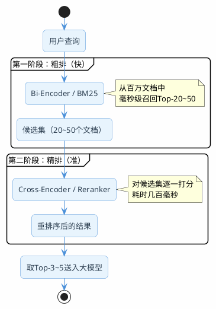

# 重排序的好处是什么

上一篇讲了混合检索，通过向量+关键词两条路并行召回，再用RRF融合，大幅提升了召回率。但有个问题还没解决：**召回的文档排序准吗？**

打个比方，你是技术主管，要招一个"精通Redis且有分布式系统经验"的后端开发。HR帮你从简历库里筛了20份相关简历过来（这是召回）。但这20份简历摞在一起，哪个候选人最匹配你的要求？HR只是按关键词命中了"Redis"或"分布式"就捞出来的，并没有帮你按"和岗位需求的匹配度"排好序。

重排序就是干这个事的：**对召回的候选集做一次精细化的相关性打分，把最匹配的排到最前面。**

为什么这很重要？因为大模型的上下文窗口是有限的，你不可能把20个文档块全塞进去。通常只取前3-5个。如果排序不准，真正相关的文档排在第8位，而前5个都是"沾点边但不太对"的内容，最终生成的回答质量就会打折扣。

## 初始检索为什么排不准

不管是向量检索还是BM25，它们在做排序时都有一个共同的局限：**查询和文档是分开编码的。**

向量检索的工作方式是：先把查询编码成一个向量，再把每个文档编码成一个向量，然后比较两个向量的距离。这种方式叫Bi-Encoder（双编码器）。

```
Bi-Encoder的工作方式：
查询 → [编码器A] → 查询向量 ─┐
                              ├→ 计算距离 → 相似度分数
文档 → [编码器B] → 文档向量 ─┘
```

Bi-Encoder的优势是快——文档向量可以提前算好存起来，查询时只需要算一次查询向量，然后做向量距离计算。百万级文档也能在毫秒级返回结果。

但它的劣势也很明显：查询和文档是独立编码的，**编码器看不到两者之间的交互关系**。

举个例子，查询是"Spring Boot如何配置多数据源"，候选文档有两个：
- 文档A："Spring Boot多数据源配置需要自定义DataSource Bean……"
- 文档B："Spring Boot配置文件支持多种格式，包括yml和properties……"

两个文档都包含"Spring Boot"和"配置"这些关键词，向量距离可能很接近。但人一看就知道文档A才是真正相关的。Bi-Encoder因为没有让查询和文档"面对面交流"，很难捕捉到这种细粒度的差异。

## Cross-Encoder：让查询和文档面对面

重排序用的是Cross-Encoder（交叉编码器），工作方式完全不同：

```
Cross-Encoder的工作方式：
[查询 + 文档] → [编码器] → 相关性分数
```

它把查询和文档拼在一起，作为一个整体输入到模型中。模型内部通过Attention机制，让查询中的每个词都能"看到"文档中的每个词，充分捕捉两者之间的语义交互。

回到刚才的例子：
- Cross-Encoder处理"Spring Boot如何配置多数据源" + 文档A时，能发现"多数据源"和"自定义DataSource Bean"之间的强关联
- 处理同样的查询 + 文档B时，发现"配置"指的是"配置文件格式"而不是"配置多数据源"，关联度低

所以Cross-Encoder的排序精度远高于Bi-Encoder。

### 那为什么不直接用Cross-Encoder做检索？

因为太慢了。

Cross-Encoder需要把查询和每个候选文档拼在一起过一遍模型。如果知识库有100万个文档块，就要跑100万次模型推理。这个计算量完全不可接受。

所以实际架构是两阶段的：



- 第一阶段（粗排）：用Bi-Encoder或BM25从百万文档中快速召回20-50个候选。速度快，精度一般
- 第二阶段（精排）：用Cross-Encoder对这20-50个候选逐一打分重排。速度慢，但精度高

两阶段配合，既保证了速度，又保证了精度。


## 主流Reranker模型选型

目前常用的重排序模型有这几个：

| 模型 | 特点 | 中文支持 | 调用方式 |
|------|------|---------|---------|
| BAAI/bge-reranker-v2-m3 | 多语言，效果稳定，社区活跃 | 好 | API / 本地部署 |
| Qwen3-Reranker-8B | 阿里出品，支持自定义instruction，另有0.6B和4B可选 | 好 | DashScope API |
| Cohere rerank-v4.0 | 商业模型，效果顶尖，分pro和fast两个版本，支持100+语言 | 好 | Cohere API |
| jina-reranker-v3 | 0.6B参数，基于Qwen3-0.6B，支持131K上下文，BEIR榜单SOTA | 较好 | API / 本地部署 |

对于中文场景，推荐bge-reranker-v2-m3或Qwen3-Reranker-8B。前者社区生态好，后者支持通过instruction参数针对特定领域优化排序。

## Java实战：用Spring AI实现重排序

### 示例中项目地址

- 项目地址：[https://gitee.com/shining-stars-l/super-ai-hub](https://gitee.com/shining-stars-l/super-ai-hub)
- 项目模块：`ai-example-spring-ai-rag`
- 所属的包：`org.javaup.rerank`

Spring AI提供了一个`DocumentPostProcessor`接口，专门用于检索后的文档处理，重排序就是它最典型的应用场景。我们只要实现这个接口，就能把Reranker无缝嵌入Spring AI的RAG链路。

### DocumentPostProcessor是什么

先看一下这个接口的定义：

```java
public interface DocumentPostProcessor
        extends BiFunction<Query, List<Document>, List<Document>> {

    // 对检索结果做后处理：重排序、过滤、压缩等
    List<Document> process(Query query, List<Document> documents);
}
```

输入是查询 + 候选文档列表，输出是处理后的文档列表。接口很简单，核心逻辑就是：拿到候选文档 → 调Reranker API打分 → 按分数重新排序返回。

### 实现一个Reranker后处理器

下面基于SiliconFlow的Rerank API来实现。SiliconFlow兼容多种Reranker模型（bge-reranker-v2-m3、Qwen3-Reranker-8B等），接口统一，换模型只要改配置。

```java
/**
 * 基于SiliconFlow Rerank API实现Spring AI的DocumentPostProcessor
 *
 * 为什么要实现DocumentPostProcessor而不是自己写一个独立的Service？
 * 因为DocumentPostProcessor是Spring AI RAG模块的标准接口，
 * 实现它之后可以直接嵌入RetrievalAugmentationAdvisor的流水线，
 * 也可以单独注入后手动调用，两种用法都兼容。
 *
 * SiliconFlow的 /v1/rerank 接口兼容多种Reranker模型，
 * 通过配置 rerank.model 即可切换，不用改代码。
 */
@Slf4j
@Component
public class SiliconFlowRerankPostProcessor implements DocumentPostProcessor {

    /**
     * SiliconFlow的Rerank API地址
     * 这个接口兼容OpenAI的rerank协议，请求体和返回体格式是通用的
     */
    private static final String RERANK_URL = "https://api.siliconflow.cn/v1/rerank";

    private final RestTemplate restTemplate = new RestTemplate();

    /** SiliconFlow的API Key，复用spring.ai.openai.api-key配置，不用额外配 */
    private final String apiKey;

    /** Reranker模型名称，默认bge-reranker-v2-m3，也可以换成Qwen/Qwen3-Reranker-8B */
    private final String model;

    /** 重排序后返回前N个文档，通常取3-5个送入大模型 */
    private final int topN;

    public SiliconFlowRerankPostProcessor(
            @Value("${spring.ai.openai.api-key:}") String apiKey,
            @Value("${rerank.model:BAAI/bge-reranker-v2-m3}") String model,
            @Value("${rerank.top-n:3}") int topN) {
        this.apiKey = apiKey;
        this.model = model;
        this.topN = topN;
    }

    /**
     * 核心方法：对候选文档做重排序
     *
     * 流程：
     * 1. 从Spring AI的Document对象中提取纯文本，组装成API需要的字符串列表
     * 2. 调用SiliconFlow的 /v1/rerank 接口，把查询和所有候选文档一起发过去
     * 3. API返回每个文档的index和relevance_score
     * 4. 按score降序排列，取前topN个，把score写入Document的metadata
     * 5. 如果API调用失败，降级返回原始顺序的前topN个（不影响主流程）
     *
     * @param query     Spring AI的Query对象，包含用户的查询文本
     * @param documents 候选文档列表，通常是向量检索或混合检索的结果
     * @return 重排序后的文档列表（最多topN个），metadata中包含rerank_score
     */
    @Override
    @SuppressWarnings("unchecked")
    public List<Document> process(Query query, List<Document> documents) {
        if (documents == null || documents.isEmpty()) {
            return documents;
        }

        // 第一步：把Document对象转成纯文本列表，这是Rerank API需要的输入格式
        List<String> texts = documents.stream()
                .map(Document::getText)
                .collect(Collectors.toList());

        // 第二步：构造HTTP请求
        HttpHeaders headers = new HttpHeaders();
        headers.setContentType(MediaType.APPLICATION_JSON);
        headers.setBearerAuth(apiKey);

        /*
         * 请求体说明：
         * - model：使用哪个Reranker模型
         * - query：用户的查询文本
         * - documents：候选文档的文本列表
         * - top_n：只返回得分最高的N个结果（减少返回数据量）
         * - return_documents：false表示不要在响应中返回文档原文
         *   （因为文档内容我们本地已经有了，只需要拿到index和score就够了，省带宽）
         */
        Map<String, Object> body = Map.of(
                "model", model,
                "query", query.text(),
                "documents", texts,
                "top_n", Math.min(topN, documents.size()),
                "return_documents", false
        );

        try {
            // 第三步：调用Rerank API
            ResponseEntity<Map> response = restTemplate.postForEntity(
                    RERANK_URL, new HttpEntity<>(body, headers), Map.class);

            /*
             * 响应体结构：
             * {
             *   "results": [
             *     {"index": 3, "relevance_score": 0.9876},
             *     {"index": 1, "relevance_score": 0.8234},
             *     ...
             *   ]
             * }
             * index 是文档在原始列表中的位置，relevance_score 是相关性得分（0~1）
             */
            List<Map<String, Object>> results =
                    (List<Map<String, Object>>) response.getBody().get("results");

            // 第四步：按score降序排列，通过index找回原始Document对象，把score写入metadata
            return results.stream()
                    .sorted(Comparator.comparingDouble(
                            r -> -((Number) r.get("relevance_score")).doubleValue()))
                    .map(r -> {
                        int index = ((Number) r.get("index")).intValue();
                        double score = ((Number) r.get("relevance_score")).doubleValue();
                        // 通过index从原始列表中找到对应的Document
                        Document doc = documents.get(index);
                        // 把rerank分数写入metadata，后续可以用来排查或展示
                        doc.getMetadata().put("rerank_score", score);
                        log.info("Rerank | score={} | text={}...",
                                String.format("%.4f", score),
                                doc.getText().substring(0, Math.min(50, doc.getText().length())));
                        return doc;
                    })
                    .collect(Collectors.toList());
        } catch (Exception e) {
            // 降级策略：Reranker挂了不能影响主流程，直接按原始顺序截取前topN个返回
            log.error("Reranker调用失败，返回原始顺序", e);
            return documents.stream().limit(topN).collect(Collectors.toList());
        }
    }
}
```

几个关键设计：

- **复用Spring AI的API Key**：`spring.ai.openai.api-key`本来就配的SiliconFlow的Key，Reranker直接复用，不用额外配
- **`return_documents: false`**：只让API返回index和score，文档内容本地已经有了，省带宽
- **降级兜底**：Reranker调用失败时不影响主流程，直接返回前topN个文档

`application.yaml`中加两行配置即可：

```yaml
rerank:
  model: BAAI/bge-reranker-v2-m3   # 也可以换成 Qwen/Qwen3-Reranker-8B
  top-n: 3
```

:::tip 关于Qwen3-Reranker的instruction参数
Qwen3-Reranker支持通过`instruction`参数告诉模型你的排序偏好，比如"请优先排序包含代码示例和具体配置的文档"。如果有这类需求，可以在请求body中加上`instruction`字段，在特定行业场景下很实用。
:::

## 验证重排序效果的入口处

可以直接调用接口，来看看重排序前后的顺序变化。这里不依赖向量库，直接用模拟的候选文档来演示——重点是看Reranker怎么把相关文档推到前面。

```java
/**
 * 重排序演示 Controller —— 自包含的Reranker效果对比Demo
 *
 * 设计思路：
 * 这个Controller不依赖向量库、不依赖其他包的任何Bean，
 * 内置一组模拟的候选文档（假设是混合检索召回的结果），
 * 直接调用SiliconFlowRerankPostProcessor做重排序，
 * 返回重排序前后的对比结果，一目了然地展示Reranker的效果。
 */
@Slf4j
@RestController
@RequestMapping("/rag/rerank")
public class RerankDemoController {

    /** 注入Reranker后处理器，它实现了Spring AI的DocumentPostProcessor接口 */
    private final SiliconFlowRerankPostProcessor reranker;

    public RerankDemoController(SiliconFlowRerankPostProcessor reranker) {
        this.reranker = reranker;
    }

    /**
     * 模拟的候选文档 —— 假设这些是混合检索（向量+BM25+RRF融合）召回的结果
     *
     * 场景设计：用户问"Spring事务失效的常见原因"
     * - 文档1：讲Bean生命周期，和事务无关，属于"完全不搭"的噪音
     * - 文档2：讲自调用导致事务失效，高度相关
     * - 文档3：讲Spring AOP代理机制，沾点边但不直接回答问题
     * - 文档4：讲private方法和异常吞掉导致事务失效，高度相关
     * - 文档5：讲自动配置原理，和事务无关，又一个噪音
     * - 文档6：讲传播行为和引擎不支持事务，高度相关
     *
     * 混合检索只是按关键词命中和向量距离随机排的，顺序不代表相关度。
     * Reranker的作用就是把文档2、4、6推到最前面。
     */
    private static final List<Document> MOCK_CANDIDATES = List.of(
            // 噪音文档：和"事务失效"毫无关系，只是同属Spring知识体系被召回了
            new Document("Spring Bean的生命周期包括实例化、属性注入、初始化、销毁四个阶段，"
                    + "其中初始化阶段会调用@PostConstruct标注的方法和InitializingBean接口的afterPropertiesSet方法。"),

            // 高相关：自调用导致事务失效，这是最经典的事务失效场景之一
            new Document("@Transactional注解的方法如果被同类中的其他方法直接调用（即自调用），"
                    + "由于绕过了AOP代理，事务不会生效。解决方案是通过注入自身Bean或使用AopContext.currentProxy()。"),

            // 沾点边：AOP代理机制和事务有关联，但并不直接回答"事务失效原因"
            new Document("Spring AOP默认使用JDK动态代理（针对接口）或CGLIB代理（针对类），"
                    + "代理对象会拦截方法调用并在前后插入横切逻辑，如事务管理、日志记录等。"),

            // 高相关：访问修饰符和异常吞掉导致事务失效
            new Document("当@Transactional标注在private、protected或default方法上时，"
                    + "CGLIB代理无法拦截这些非public方法，导致事务注解不生效。"
                    + "此外，如果方法内部catch了异常没有重新抛出，事务也不会回滚。"),

            // 噪音文档：自动配置和事务失效没关系
            new Document("Spring Boot自动配置的核心原理是通过@EnableAutoConfiguration注解，"
                    + "加载META-INF/spring/org.springframework.boot.autoconfigure.AutoConfiguration.imports中声明的配置类。"),

            // 高相关：传播行为设置和数据库引擎导致事务失效
            new Document("@Transactional的propagation属性设为NOT_SUPPORTED或NEVER时，"
                    + "方法将不在事务中执行。另外，数据库引擎不支持事务（如MyISAM）也会导致事务失效。")
    );

    /**
     * 重排序演示接口 —— 展示同一批文档重排序前后的顺序变化
     *
     * 返回的JSON包含：
     * - before_rerank：重排序前的文档顺序（混合检索返回的原始顺序）
     * - after_rerank：重排序后的文档顺序（Reranker按相关性打分后的顺序），每个文档附带score
     * - latencyMs：整个重排序耗时（毫秒），通常在200-500ms
     *
     * 预期效果：
     * 重排序前，6个文档是随机顺序；
     * 重排序后，3个和"事务失效"高度相关的文档排在最前面，
     * "Bean生命周期"和"自动配置"这两个噪音文档被截掉。
     */
    @GetMapping("/demo")
    public Map<String, Object> demo(
            @RequestParam(value = "question",
                    defaultValue = "Spring事务失效的常见原因") String question) {

        long start = System.currentTimeMillis();

        // ========== 第一步：记录重排序前的文档顺序（作为对比基准） ==========
        List<Map<String, String>> beforeList = new ArrayList<>();
        for (int i = 0; i < MOCK_CANDIDATES.size(); i++) {
            beforeList.add(Map.of(
                    "rank", String.valueOf(i + 1),
                    "text", MOCK_CANDIDATES.get(i).getText()));
        }

        // ========== 第二步：调用Reranker做重排序 ==========
        // Query是Spring AI的查询封装，这里只用最简单的单参数构造
        // reranker.process()内部会调SiliconFlow API，返回按相关性排好序的文档
        List<Document> reranked = reranker.process(
                new Query(question), MOCK_CANDIDATES);

        // ========== 第三步：记录重排序后的文档顺序（附带Reranker打的分数） ==========
        List<Map<String, Object>> afterList = new ArrayList<>();
        for (int i = 0; i < reranked.size(); i++) {
            afterList.add(Map.of(
                    "rank", i + 1,
                    // score是Reranker打的相关性分数（0~1），越高越相关
                    "score", reranked.get(i).getMetadata().get("rerank_score"),
                    "text", reranked.get(i).getText()));
        }

        long latency = System.currentTimeMillis() - start;

        // ========== 第四步：组装返回结果，方便前后对比 ==========
        Map<String, Object> result = new HashMap<>();
        result.put("question", question);
        result.put("candidateCount", MOCK_CANDIDATES.size());
        result.put("before_rerank", beforeList);
        result.put("after_rerank", afterList);
        result.put("latencyMs", latency);
        return result;
    }
}
```

**调用接口：** 

```bash
curl "http://localhost:7092/rag/rerank/demo?question=Spring事务失效的常见原因"
```

返回的`before_rerank`和`after_rerank`一对比，就能看到事务相关的3个文档被推到了前面，而"Bean生命周期"和"自动配置"被甩到了后面

**结果：**
```json
{
    "question": "Spring事务失效的常见原因",
    "after_rerank": [
        {
            "score": 0.4046455919742584,
            "rank": 1,
            "text": "@Transactional的propagation属性设为NOT_SUPPORTED或NEVER时，方法将不在事务中执行。另外，数据库引擎不支持事务（如MyISAM）也会导致事务失效。"
        },
        {
            "score": 0.062296267598867416,
            "rank": 2,
            "text": "当@Transactional标注在private、protected或default方法上时，CGLIB代理无法拦截这些非public方法，导致事务注解不生效。此外，如果方法内部catch了异常没有重新抛出，事务也不会回滚。"
        },
        {
            "score": 0.013345688581466675,
            "rank": 3,
            "text": "Spring AOP默认使用JDK动态代理（针对接口）或CGLIB代理（针对类），代理对象会拦截方法调用并在前后插入横切逻辑，如事务管理、日志记录等。"
        }
    ],
    "before_rerank": [
        {
            "rank": "1",
            "text": "Spring Bean的生命周期包括实例化、属性注入、初始化、销毁四个阶段，其中初始化阶段会调用@PostConstruct标注的方法和InitializingBean接口的afterPropertiesSet方法。"
        },
        {
            "rank": "2",
            "text": "@Transactional注解的方法如果被同类中的其他方法直接调用（即自调用），由于绕过了AOP代理，事务不会生效。解决方案是通过注入自身Bean或使用AopContext.currentProxy()。"
        },
        {
            "rank": "3",
            "text": "Spring AOP默认使用JDK动态代理（针对接口）或CGLIB代理（针对类），代理对象会拦截方法调用并在前后插入横切逻辑，如事务管理、日志记录等。"
        },
        {
            "rank": "4",
            "text": "当@Transactional标注在private、protected或default方法上时，CGLIB代理无法拦截这些非public方法，导致事务注解不生效。此外，如果方法内部catch了异常没有重新抛出，事务也不会回滚。"
        },
        {
            "rank": "5",
            "text": "Spring Boot自动配置的核心原理是通过@EnableAutoConfiguration注解，加载META-INF/spring/org.springframework.boot.autoconfigure.AutoConfiguration.imports中声明的配置类。"
        },
        {
            "rank": "6",
            "text": "@Transactional的propagation属性设为NOT_SUPPORTED或NEVER时，方法将不在事务中执行。另外，数据库引擎不支持事务（如MyISAM）也会导致事务失效。"
        }
    ],
    "candidateCount": 6,
    "latencyMs": 589
}
```

:::info 在真实RAG链路中怎么用
因为`SiliconFlowRerankPostProcessor`实现了Spring AI的`DocumentPostProcessor`接口，可以直接配到`RetrievalAugmentationAdvisor`中，检索完自动做重排序：
```java
var advisor = RetrievalAugmentationAdvisor.builder()
        .documentRetriever(...)
        .documentPostProcessors(reranker)  // 检索后自动重排序
        .build();
```
也可以手动调用：`reranker.process(new Query(question), candidateDocs)`，灵活度更高。
:::

## Reranker的一个隐藏陷阱

Reranker模型本质上是语义匹配模型，它天然偏好语义表达丰富的文档。这在大多数场景下是好事，但有一个例外：**关键词检索召回的文档，如果语义表达比较"干巴巴"，可能会被Reranker压低排名。**

举个例子，用户查"错误码 E10042 的含义"：
- 文档A（关键词检索召回）："E10042：数据库连接超时。请检查数据库服务是否正常运行。"
- 文档B（向量检索召回）："当系统出现数据库相关错误时，通常是因为连接池配置不当或数据库服务不可用，建议从以下几个方面排查……"

文档A是精确答案，但表达很简短。文档B语义丰富但不够精确。Reranker可能给文档B打更高的分。

怎么应对？

1. **观察日志**：上线后对比重排序前后的顺序变化，如果发现精确匹配的文档被压低了，说明存在这个问题
2. **混合策略**：对于包含明确编号/错误码的查询，可以跳过Reranker，直接用RRF的结果
3. **调整候选数量**：Reranker的输入候选不要太多（20-30个就够），太多会增加延迟且引入更多噪音

## 性能与成本考量

| 指标 | 不用重排序 | 用重排序 |
|------|----------|---------|
| 检索延迟 | 50-200ms | 200-500ms（多了Reranker调用） |
| API成本 | 只有embedding | embedding + reranker |
| 回答质量 | 取决于初始排序运气 | 稳定提升 |
| 适合场景 | 对延迟敏感、成本敏感 | 对回答质量要求高 |

:::info 什么时候可以不用重排序
1. 知识库规模小（几百个文档块），初始检索就很准
2. 对延迟极度敏感（要求100ms内返回）
3. 查询类型单一，向量检索已经够用
:::

:::tip 小结
重排序是RAG检索链路的最后一道精细化工序。初始检索（Bi-Encoder/BM25）负责从海量文档中快速召回候选集，重排序（Cross-Encoder/Reranker）负责对候选集精细打分。两阶段配合，速度和精度兼得。推荐使用bge-reranker-v2-m3或Qwen3-Reranker-8B，后者支持instruction参数可以针对特定领域优化。注意Reranker的语义偏好可能压低精确匹配的结果，上线后要观察日志。
:::
