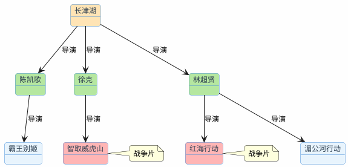

# 图结构：Graph RAG

传统RAG的套路是：用户问一个问题，去知识库里找到最相关的几段文字，交给大模型生成回答。这个模式处理"单跳"问题很在行——答案就在某一段文档里，找到就行。

但有些问题不是这样的。

比如用户问："《长津湖》的导演还拍过哪些战争片？"

要回答这个问题，需要三步推理：
1. 先找到《长津湖》的导演是谁（陈凯歌、徐克、林超贤）
2. 再找到这几位导演各自拍过哪些电影
3. 从中筛选出战争题材的

这三步信息可能分散在不同的文档里。传统RAG用"长津湖的导演还拍过哪些战争片"去做向量检索，大概率只能找到关于《长津湖》本身的介绍，很难把导演的其他作品也召回来。

这就是传统RAG的天花板：**它擅长"找到"，但不擅长"推理"。**

## 传统RAG在哪些场景下会碰壁

除了多跳推理，还有几类问题是传统RAG处理不好的：

**关系查询**："张三的直属领导是谁？他领导的团队有多少人？"——需要沿着组织架构的关系链条走。

**路径发现**："从北京到拉萨，经停西安的航班有哪些？"——需要在航线网络中找路径。

**聚合统计**："和刘德华合作过的导演里，谁的票房总额最高？"——需要遍历合作关系并做聚合计算。

这些问题的共同特点：**答案不在某一段文字里，而是藏在实体之间的关系网络中。**

## 知识图谱：把信息织成网

知识图谱的核心思想很简单：用"实体-关系-实体"的三元组来表示知识。

```
(长津湖) --[导演]--> (陈凯歌)
(长津湖) --[导演]--> (徐克)
(长津湖) --[导演]--> (林超贤)
(陈凯歌) --[导演]--> (霸王别姬)
(陈凯歌) --[导演]--> (无极)
(徐克)   --[导演]--> (智取威虎山)
(徐克)   --[导演]--> (狄仁杰之通天帝国)
(林超贤) --[导演]--> (红海行动)
(林超贤) --[导演]--> (湄公河行动)
(红海行动) --[类型]--> (战争片)
(湄公河行动) --[类型]--> (动作片)
(智取威虎山) --[类型]--> (战争片)
```

有了这张图，"长津湖的导演还拍过哪些战争片"就变成了一个图遍历问题：从"长津湖"节点出发，沿着"导演"关系找到导演节点，再沿着"导演"关系的反方向找到其他电影节点，最后过滤出类型为"战争片"的。



答案一目了然：智取威虎山（徐克）和红海行动（林超贤）。

## 图数据库：存储和查询知识图谱

知识图谱需要一个专门的数据库来存储和查询，这就是图数据库。最主流的选择是Neo4j。

### Neo4j的核心概念

- **Node（节点）**：代表一个实体，比如一部电影、一个导演
- **Relationship（关系）**：连接两个节点，有方向和类型，比如"导演了"
- **Property（属性）**：节点或关系上的键值对，比如电影的上映年份
- **Label（标签）**：节点的分类，比如"Movie""Director"

### Cypher查询语言

Neo4j用Cypher语言做查询，语法很直观，像在画图：

```cypher
// 查找长津湖的导演
MATCH (m:Movie {title: '长津湖'}) <-[:DIRECTED]- (d:Director)
RETURN d.name

// 查找导演的其他电影
MATCH (m:Movie {title: '长津湖'}) <-[:DIRECTED]- (d:Director) -[:DIRECTED]-> (other:Movie)
RETURN d.name, other.title

// 加上类型过滤：只要战争片
MATCH (m:Movie {title: '长津湖'}) <-[:DIRECTED]- (d:Director) -[:DIRECTED]-> (other:Movie)
WHERE other.genre = '战争片'
RETURN d.name, other.title
```

`(m:Movie)` 表示一个Movie类型的节点，`-[:DIRECTED]->` 表示一条DIRECTED类型的关系，箭头表示方向。整个MATCH语句就像在图上画一条路径。

### Docker部署Neo4j

```bash
docker run -d \
  --name neo4j \
  -p 7474:7474 \
  -p 7687:7687 \
  -e NEO4J_AUTH=neo4j/your_password \
  -e NEO4J_PLUGINS='["apoc"]' \
  -v neo4j_data:/data \
  neo4j:5.22-community
```

启动后访问 `http://localhost:7474` 可以打开Neo4j的Web管理界面，直接在里面写Cypher查询。


## Spring Boot集成Neo4j实战

下面用一个完整的例子演示：搭建一个电影知识图谱，然后通过Graph RAG回答多跳问题。

### 引入依赖

```xml
<dependency>
    <groupId>org.springframework.boot</groupId>
    <artifactId>spring-boot-starter-data-neo4j</artifactId>
</dependency>
```

### 配置连接

```yaml
spring:
  neo4j:
    uri: bolt://localhost:7687
    authentication:
      username: neo4j
      password: your_password
```

### 定义实体

```java
@Node("Movie")
public class Movie {
    @Id
    private String title;
    private Integer year;
    private String genre;

    // 构造器、getter、setter省略
    public Movie(String title, Integer year, String genre) {
        this.title = title;
        this.year = year;
        this.genre = genre;
    }
}

@Node("Director")
public class Director {
    @Id
    private String name;

    public Director(String name) {
        this.name = name;
    }
}
```

### 定义Repository

```java
public interface MovieGraphRepository extends Neo4jRepository<Movie, String> {

    /**
     * 多跳查询：给定一部电影，找到它的导演执导的其他电影
     */
    @Query("""
        MATCH (m:Movie {title: $title}) <-[:DIRECTED]- (d:Director) -[:DIRECTED]-> (other:Movie)
        WHERE other.title <> $title
        RETURN d.name AS director, collect(other.title) AS otherMovies
        """)
    List<DirectorMoviesDto> findOtherMoviesByDirectors(String title);

    /**
     * 带类型过滤的多跳查询
     */
    @Query("""
        MATCH (m:Movie {title: $title}) <-[:DIRECTED]- (d:Director) -[:DIRECTED]-> (other:Movie)
        WHERE other.title <> $title AND other.genre = $genre
        RETURN d.name AS director, collect(other.title) AS otherMovies
        """)
    List<DirectorMoviesDto> findOtherMoviesByGenre(String title, String genre);
}
```

```java
public record DirectorMoviesDto(String director, List<String> otherMovies) {}
```

### 初始化测试数据

```java
@RestController
@RequestMapping("/graph-rag")
public class GraphRagController {

    private final Neo4jTemplate neo4jTemplate;
    private final Neo4jClient neo4jClient;
    private final MovieGraphRepository movieRepo;
    private final ChatClient chatClient;

    /**
     * 初始化电影知识图谱数据
     */
    @PostMapping("/init")
    public String initData() {
        // 创建导演节点
        Director linChaoXian = neo4jTemplate.save(new Director("林超贤"));
        Director xuKe = neo4jTemplate.save(new Director("徐克"));
        Director chenKaiGe = neo4jTemplate.save(new Director("陈凯歌"));
        Director wuJing = neo4jTemplate.save(new Director("吴京"));

        // 创建电影节点
        neo4jTemplate.save(new Movie("长津湖", 2021, "战争片"));
        neo4jTemplate.save(new Movie("红海行动", 2018, "战争片"));
        neo4jTemplate.save(new Movie("湄公河行动", 2016, "动作片"));
        neo4jTemplate.save(new Movie("智取威虎山", 2014, "战争片"));
        neo4jTemplate.save(new Movie("狄仁杰之通天帝国", 2010, "悬疑片"));
        neo4jTemplate.save(new Movie("霸王别姬", 1993, "剧情片"));
        neo4jTemplate.save(new Movie("战狼2", 2017, "战争片"));

        // 创建导演关系
        createDirectedRelation("林超贤", "长津湖");
        createDirectedRelation("林超贤", "红海行动");
        createDirectedRelation("林超贤", "湄公河行动");
        createDirectedRelation("徐克", "长津湖");
        createDirectedRelation("徐克", "智取威虎山");
        createDirectedRelation("徐克", "狄仁杰之通天帝国");
        createDirectedRelation("陈凯歌", "长津湖");
        createDirectedRelation("陈凯歌", "霸王别姬");
        createDirectedRelation("吴京", "战狼2");

        return "知识图谱初始化完成";
    }

    private void createDirectedRelation(String directorName, String movieTitle) {
        neo4jClient.query("""
            MATCH (d:Director {name: $director})
            MATCH (m:Movie {title: $movie})
            MERGE (d)-[:DIRECTED]->(m)
            """)
            .bind(directorName).to("director")
            .bind(movieTitle).to("movie")
            .run();
    }
}
```

### Graph RAG问答接口

关键步骤：先从图数据库查出结构化的关系数据，再把这些数据作为上下文交给大模型生成自然语言回答。

```java
@GetMapping("/ask")
public String ask(@RequestParam String question) {
    // 1. 从问题中提取电影名（简单实现，生产环境用LLM提取）
    String movieTitle = extractMovieTitle(question);

    // 2. 从知识图谱中查询关系数据
    String graphContext = queryGraphContext(movieTitle);

    if (graphContext.isBlank()) {
        return "抱歉，知识图谱中没有找到相关信息。";
    }

    // 3. 把图谱数据作为上下文，让大模型生成回答
    String answer = chatClient.prompt()
            .system("""
                你是一个电影知识助手。根据以下知识图谱数据回答用户的问题。
                只基于提供的数据回答，不要编造信息。
                用自然流畅的语言组织回答。

                知识图谱数据：
                """ + graphContext)
            .user(question)
            .call()
            .content();

    return answer;
}

private String queryGraphContext(String movieTitle) {
    List<DirectorMoviesDto> results = movieRepo.findOtherMoviesByDirectors(movieTitle);

    if (results.isEmpty()) return "";

    StringBuilder sb = new StringBuilder();
    for (DirectorMoviesDto dto : results) {
        sb.append(String.format("导演 %s 还执导了：%s\n",
                dto.director(),
                String.join("、", dto.otherMovies())));
    }
    return sb.toString();
}

private String extractMovieTitle(String question) {
    // 简单实现：用大模型提取电影名
    return chatClient.prompt()
            .user("从以下问题中提取电影名称，只输出电影名，不要其他内容：" + question)
            .call()
            .content()
            .trim();
}
```

实际效果：

> 用户：长津湖的导演还拍过哪些电影？
>
> 系统回答：《长津湖》由三位导演联合执导。林超贤还执导了《红海行动》和《湄公河行动》，徐克还执导了《智取威虎山》和《狄仁杰之通天帝国》，陈凯歌还执导了《霸王别姬》。

## Graph RAG vs 传统RAG：什么时候该用哪个

Graph RAG不是传统RAG的替代品，而是补充。两者适合的场景不同：

| 维度 | 传统RAG（向量检索） | Graph RAG（知识图谱） |
|------|------------------|-------------------|
| 擅长的问题 | 单跳问答、概念解释、操作指南 | 多跳推理、关系查询、路径发现 |
| 数据形态 | 非结构化文本（文档、网页） | 结构化关系（实体+关系） |
| 构建成本 | 低（文档切片+embedding） | 高（需要抽取实体和关系） |
| 维护成本 | 低（更新文档即可） | 中（需要维护图谱一致性） |
| 回答风格 | 基于原文生成 | 基于结构化数据生成 |

:::info 实际项目中的建议
大多数RAG项目不需要一开始就上Graph RAG。先用传统RAG跑通，如果发现有大量多跳推理类的问题回答不好，再考虑引入知识图谱作为补充数据源。可以通过前面讲的"查询路由"机制，把关系类问题路由到图数据库，知识类问题继续走向量检索。
:::

## 知识图谱的构建：最难的一步

Graph RAG的技术实现不难，难的是知识图谱的构建。你需要从非结构化文本中抽取出实体和关系，这本身就是一个NLP难题。

几种构建方式：

**手动构建**：准确率最高，但成本极高，只适合小规模、高价值的领域知识（如医学知识图谱、法律条文关系）。

**LLM辅助抽取**：用大模型从文本中抽取三元组。效果取决于Prompt设计和文本质量。

```java
private static final String EXTRACT_PROMPT = """
    从以下文本中抽取实体和关系，输出为三元组列表。
    格式：(实体1, 关系, 实体2)

    文本：{text}

    要求：
    1. 实体要具体，不要太泛化
    2. 关系要简洁明确
    3. 只抽取文本中明确提到的关系，不要推测
    """;
```

**结构化数据导入**：如果你已经有结构化的数据（数据库表、Excel、API），直接转换成图谱是最高效的方式。比如上面的电影例子，数据来源可以是一个电影数据库的表。

**混合方式**：先从结构化数据构建骨架，再用LLM从非结构化文本中补充细节。这是目前最实用的方案。

## 和查询路由结合使用

回顾前面讲的意图识别和查询路由，Graph RAG天然适合作为路由的一个目标通道：

```java
// 在路由器中加入图数据库通道
return switch (source) {
    case "RELATIONAL" -> sqlService.query(question);
    case "GRAPH"      -> graphRagService.ask(question);  // Graph RAG
    default           -> vectorService.search(question);  // 传统RAG
};
```

路由器判断用户问的是关系类问题（"谁和谁有什么关系""A的B是谁"），就走Graph RAG通道；判断是知识类问题，就走传统向量检索通道。两者各司其职。

:::tip 小结
Graph RAG用知识图谱解决传统RAG处理不了的多跳推理问题。核心思路：把散落在文档中的实体和关系抽取出来，存入图数据库（推荐Neo4j），用Cypher查询做图遍历，再把结构化结果交给大模型生成自然语言回答。Graph RAG不是替代传统RAG，而是补充——通过查询路由让两者各司其职。知识图谱的构建是最大的挑战，推荐从结构化数据入手，LLM辅助补充。
:::
