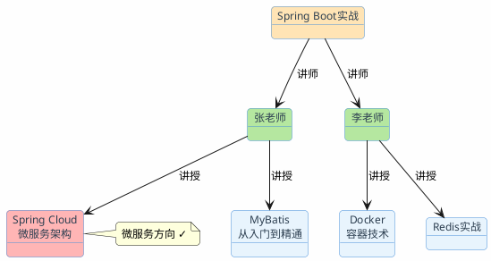
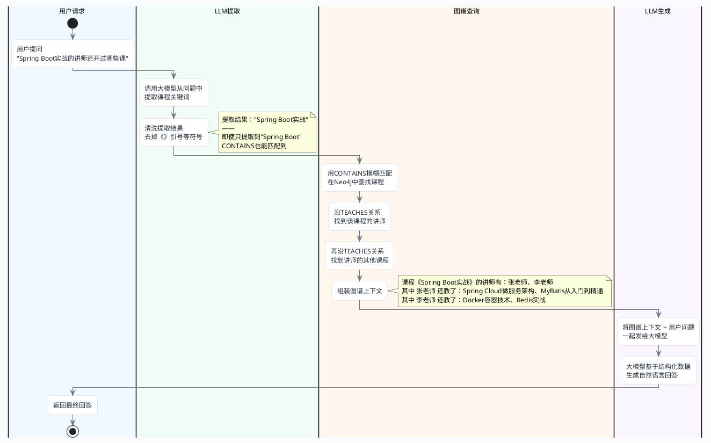

# 图结构：Graph RAG

传统RAG的套路是：用户问一个问题，去知识库里找到最相关的几段文字，交给大模型生成回答。这个模式处理"单跳"问题很在行——答案就在某一段文档里，找到就行。

但有些问题不是这样的。

比如用户问："教《Spring Boot实战》的讲师还开过哪些微服务方向的课？"

要回答这个问题，需要三步推理：
1. 先找到《Spring Boot实战》这门课有哪些讲师（张老师、李老师）
2. 再找到这几位讲师各自还教了哪些课程
3. 从中筛选出微服务方向的

这三步信息可能分散在不同的文档里。传统RAG用"Spring Boot实战的讲师还开过哪些微服务方向的课"去做向量检索，大概率只能找到关于《Spring Boot实战》本身的课程介绍，很难把讲师的其他课程也召回来。

这就是传统RAG的天花板：**它擅长"找到"，但不擅长"推理"。**

## 传统RAG在哪些场景下会碰壁

除了多跳推理，还有几类问题是传统RAG处理不好的：

**关系查询**："张三的直属领导是谁？他领导的团队有多少人？"——需要沿着组织架构的关系链条走。

**路径发现**："从北京到拉萨，经停西安的航班有哪些？"——需要在航线网络中找路径。

**聚合统计**："和张老师一起教过课的讲师里，谁的课程平均评分最高？"——需要遍历合作关系并做聚合计算。

这些问题的共同特点：**答案不在某一段文字里，而是藏在实体之间的关系网络中。**

## 知识图谱：把信息织成网

知识图谱的核心思想很简单：用"实体-关系-实体"的三元组来表示知识。

```
(Spring Boot实战) --[讲师]--> (张老师)
(Spring Boot实战) --[讲师]--> (李老师)
(张老师) --[讲授]--> (Spring Cloud微服务架构)
(张老师) --[讲授]--> (MyBatis从入门到精通)
(李老师) --[讲授]--> (Docker容器技术)
(李老师) --[讲授]--> (Redis实战)
(Spring Cloud微服务架构) --[方向]--> (微服务)
(Docker容器技术) --[方向]--> (DevOps)
(MyBatis从入门到精通) --[方向]--> (持久层)
(Redis实战) --[方向]--> (中间件)
```

有了这张图，"Spring Boot实战的讲师还开过哪些微服务方向的课"就变成了一个图遍历问题：从"Spring Boot实战"节点出发，沿着"讲师"关系找到讲师节点，再沿着"讲授"关系找到其他课程节点，最后过滤出方向为"微服务"的。



答案一目了然：张老师还教了《Spring Cloud微服务架构》，属于微服务方向。

## 图数据库：存储和查询知识图谱

知识图谱需要一个专门的数据库来存储和查询，这就是图数据库。最主流的选择是Neo4j。

### Neo4j的核心概念

- **Node（节点）**：代表一个实体，比如一门课程、一位讲师
- **Relationship（关系）**：连接两个节点，有方向和类型，比如"讲授"
- **Property（属性）**：节点或关系上的键值对，比如课程的开设年份
- **Label（标签）**：节点的分类，比如"Course""Instructor"

### Cypher查询语言

Neo4j用Cypher语言做查询，语法很直观，像在画图：

```cypher
// 查找Spring Boot实战的讲师
MATCH (c:Course {courseName: 'Spring Boot实战'}) <-[:TEACHES]- (i:Instructor)
RETURN i.name

// 查找讲师的其他课程
MATCH (c:Course {courseName: 'Spring Boot实战'}) <-[:TEACHES]- (i:Instructor) -[:TEACHES]-> (other:Course)
RETURN i.name, other.courseName

// 加上方向过滤：只要微服务方向
MATCH (c:Course {courseName: 'Spring Boot实战'}) <-[:TEACHES]- (i:Instructor) -[:TEACHES]-> (other:Course)
WHERE other.category = '微服务'
RETURN i.name, other.courseName
```

`(c:Course)` 表示一个Course类型的节点，`-[:TEACHES]->` 表示一条TEACHES类型的关系，箭头表示方向。整个MATCH语句就像在图上画一条路径。

### Docker部署Neo4j

先拉取Neo4j镜像：

```bash
docker pull neo4j:5.22-community
```

然后启动容器：

```bash
docker run -d \
  --name neo4j \
  -p 7474:7474 \
  -p 7687:7687 \
  -e NEO4J_AUTH=neo4j/your_password \
  -e NEO4J_PLUGINS='["apoc"]' \
  -v neo4j_data:/data \
  neo4j:5.22-community
```

启动后访问 `http://localhost:7474` 可以打开Neo4j的Web管理界面，直接在里面写Cypher查询。


## Spring Boot集成Neo4j实战

下面用一个完整的例子演示：搭建一个课程知识图谱，然后通过Graph RAG回答多跳问题。

### 示例中项目地址

- 项目地址：[https://gitee.com/shining-stars-l/super-ai-hub](https://gitee.com/shining-stars-l/super-ai-hub)
- 项目模块：`ai-example-spring-ai-rag-neo4j`

### 引入依赖

```xml
<dependency>
    <groupId>org.springframework.boot</groupId>
    <artifactId>spring-boot-starter-data-neo4j</artifactId>
</dependency>
```

### 配置连接

```yaml
spring:
  neo4j:
    uri: bolt://localhost:7687
    authentication:
      username: neo4j
      password: your_password
```

### 定义实体

```java
@Node("Course")
public class Course {
    @Id
    private String courseName;
    private Integer year;
    private String category;

    // 构造器、getter、setter省略
    public Course(String courseName, Integer year, String category) {
        this.courseName = courseName;
        this.year = year;
        this.category = category;
    }
}

@Node("Instructor")
public class Instructor {
    @Id
    private String name;

    public Instructor(String name) {
        this.name = name;
    }
}
```

### 定义Repository

```java
public interface CourseGraphRepository extends Neo4jRepository<Course, String> {

    /**
     * 多跳查询：用CONTAINS模糊匹配课程名，找到它的讲师教授的其他课程
     */
    @Query("""
        MATCH (c:Course) WHERE c.courseName CONTAINS $courseName
        WITH c
        MATCH (c) <-[:TEACHES]- (i:Instructor) -[:TEACHES]-> (other:Course)
        WHERE other.courseName <> c.courseName
        RETURN i.name AS instructor, collect(other.courseName) AS otherCourses
        """)
    List<InstructorCoursesDto> findOtherCoursesByInstructors(@Param("courseName") String courseName);

    /**
     * 带方向过滤的多跳查询
     */
    @Query("""
        MATCH (c:Course) WHERE c.courseName CONTAINS $courseName
        WITH c
        MATCH (c) <-[:TEACHES]- (i:Instructor) -[:TEACHES]-> (other:Course)
        WHERE other.courseName <> c.courseName AND other.category = $category
        RETURN i.name AS instructor, collect(other.courseName) AS otherCourses
        """)
    List<InstructorCoursesDto> findOtherCoursesByCategory(@Param("courseName") String courseName, @Param("category") String category);
}
```

:::tip 为什么用CONTAINS而不是精确匹配？
用户问"Spring Boot的讲师还教了啥？"，LLM提取出的可能是"Spring Boot"而不是完整的"Spring Boot实战"。CONTAINS模糊匹配能兜住这种偏差，对Demo来说更稳健。生产环境可以结合全文索引做更精细的匹配。
:::

```java
public record InstructorCoursesDto(String instructor, List<String> otherCourses) {}
```

### 启动时自动初始化数据

作为示例项目，我们用 `@EventListener(ApplicationReadyEvent.class)` 让项目启动后自动把测试数据灌入Neo4j，不需要手动调接口。每次启动先清空旧数据，避免重复。

```java
@Slf4j
@RestController
@RequestMapping("/graph-rag")
public class GraphRagController {

    private final Neo4jTemplate neo4jTemplate;
    private final Neo4jClient neo4jClient;
    private final CourseGraphRepository courseRepo;
    private final ChatClient chatClient;

    /**
     * 项目启动时自动初始化课程知识图谱数据
     */
    @EventListener(ApplicationReadyEvent.class)
    public void initData() {
        log.info("开始初始化课程知识图谱数据...");

        // 先清空旧数据，避免重复
        neo4jClient.query("MATCH (n) DETACH DELETE n").run();

        // 创建讲师节点
        neo4jTemplate.save(new Instructor("张老师"));
        neo4jTemplate.save(new Instructor("李老师"));
        neo4jTemplate.save(new Instructor("王老师"));

        // 创建课程节点
        neo4jTemplate.save(new Course("Spring Boot实战", 2023, "微服务"));
        neo4jTemplate.save(new Course("Spring Cloud微服务架构", 2023, "微服务"));
        neo4jTemplate.save(new Course("Docker容器技术", 2022, "DevOps"));
        neo4jTemplate.save(new Course("MyBatis从入门到精通", 2021, "持久层"));
        neo4jTemplate.save(new Course("Redis实战", 2022, "中间件"));
        neo4jTemplate.save(new Course("Kafka消息队列", 2023, "中间件"));
        neo4jTemplate.save(new Course("JVM调优实战", 2022, "性能优化"));

        // 创建讲授关系
        createTeachesRelation("张老师", "Spring Boot实战");
        createTeachesRelation("张老师", "Spring Cloud微服务架构");
        createTeachesRelation("张老师", "MyBatis从入门到精通");
        createTeachesRelation("李老师", "Spring Boot实战");
        createTeachesRelation("李老师", "Docker容器技术");
        createTeachesRelation("李老师", "Redis实战");
        createTeachesRelation("王老师", "JVM调优实战");
        createTeachesRelation("王老师", "Kafka消息队列");

        log.info("课程知识图谱初始化完成，共3位讲师、7门课程");
    }

    private void createTeachesRelation(String instructorName, String courseName) {
        neo4jClient.query("""
            MATCH (i:Instructor {name: $instructor})
            MATCH (c:Course {courseName: $course})
            MERGE (i)-[:TEACHES]->(c)
            """)
            .bind(instructorName).to("instructor")
            .bind(courseName).to("course")
            .run();
    }
}
```

启动日志里会看到这两行，说明数据已经就绪：

```
开始初始化课程知识图谱数据...
课程知识图谱初始化完成，共3位讲师、7门课程
```

### Graph RAG问答接口

关键步骤：先从图数据库查出结构化的关系数据，再把这些数据作为上下文交给大模型生成自然语言回答。

整个执行链路如下：



```java
@GetMapping("/ask")
public String ask(@RequestParam("question") String question) {
    // 1. 从问题中提取课程名
    String courseName = extractCourseName(question);
    log.info("提取到课程名：{}", courseName);

    // 2. 从知识图谱中查询关系数据
    String graphContext = queryGraphContext(courseName);
    log.info("图谱查询结果：{}", graphContext);

    if (graphContext.isBlank()) {
        return "抱歉，知识图谱中没有找到相关信息。";
    }

    // 3. 把图谱数据作为上下文，让大模型生成回答
    return chatClient.prompt()
            .system("""
                你是一个技术课程知识助手。根据以下知识图谱数据回答用户的问题。
                只基于提供的数据回答，不要编造信息。
                用自然流畅的语言组织回答。

                知识图谱数据：
                """ + graphContext)
            .user(question)
            .call()
            .content();
}

private String queryGraphContext(String courseName) {
    List<InstructorCoursesDto> results = courseRepo.findOtherCoursesByInstructors(courseName);

    if (results.isEmpty()) return "";

    StringBuilder sb = new StringBuilder();
    sb.append(String.format("课程《%s》的讲师有：%s\n", courseName,
            results.stream().map(InstructorCoursesDto::instructor)
                    .collect(Collectors.joining("、"))));
    for (InstructorCoursesDto dto : results) {
        sb.append(String.format("其中 %s 还教了：%s\n",
                dto.instructor(),
                String.join("、", dto.otherCourses())));
    }
    return sb.toString();
}

private String extractCourseName(String question) {
    String raw = chatClient.prompt()
            .user("从以下问题中提取课程名称，只输出课程名本身，不要书名号、引号或任何多余的字符：" + question)
            .call()
            .content()
            .trim();
    // 去掉LLM可能加上的《》("")等包裹符号（用Unicode避免编译器误解中文引号）
    return raw.replaceAll("[\u300a\u300b\u201c\u201d\u2018\u2019\"']", "");
}
```

### 接口调用示例

项目启动后（默认端口7096），直接GET请求就能体验Graph RAG的效果：

```bash
# 多跳查询：找讲师的其他课程
curl "http://localhost:7096/graph-rag/ask?question=Spring Boot实战的讲师还开过哪些课"

# 带条件过滤：只看微服务方向
curl "http://localhost:7096/graph-rag/ask?question=教Spring Boot实战的老师还开过哪些微服务方向的课"

# 换个角度问：某位讲师的全部课程
curl "http://localhost:7096/graph-rag/ask?question=李老师都教了哪些课程"
```

以"带条件过滤"为例，实际返回结果：

```text
教Spring Boot实战的老师有李老师和张老师。其中李老师还教了Redis实战和Docker容器技术，但这两门课程不属于微服务方向。

张老师则教了Spring Cloud微服务架构，这是一门微服务方向的课程。

因此，根据提供的信息，教Spring Boot实战的老师中，只有张老师开过Spring Cloud微服务架构这门微服务方向的课程。
```

## Graph RAG vs 传统RAG：什么时候该用哪个

Graph RAG不是传统RAG的替代品，而是补充。两者适合的场景不同：

| 维度 | 传统RAG（向量检索） | Graph RAG（知识图谱） |
|------|------------------|-------------------|
| 擅长的问题 | 单跳问答、概念解释、操作指南 | 多跳推理、关系查询、路径发现 |
| 数据形态 | 非结构化文本（文档、网页） | 结构化关系（实体+关系） |
| 构建成本 | 低（文档切片+embedding） | 高（需要抽取实体和关系） |
| 维护成本 | 低（更新文档即可） | 中（需要维护图谱一致性） |
| 回答风格 | 基于原文生成 | 基于结构化数据生成 |

:::info 实际项目中的建议
大多数RAG项目不需要一开始就上Graph RAG。先用传统RAG跑通，如果发现有大量多跳推理类的问题回答不好，再考虑引入知识图谱作为补充数据源。可以通过前面讲的"查询路由"机制，把关系类问题路由到图数据库，知识类问题继续走向量检索。
:::

## 知识图谱的构建：最难的一步

Graph RAG的技术实现不难，难的是知识图谱的构建。你需要从非结构化文本中抽取出实体和关系，这本身就是一个NLP难题。

几种构建方式：

**手动构建**：准确率最高，但成本极高，只适合小规模、高价值的领域知识（如医学知识图谱、法律条文关系）。

**LLM辅助抽取**：用大模型从文本中抽取三元组。效果取决于Prompt设计和文本质量。

```java
private static final String EXTRACT_PROMPT = """
    从以下文本中抽取实体和关系，输出为三元组列表。
    格式：(实体1, 关系, 实体2)

    文本：{text}

    要求：
    1. 实体要具体，不要太泛化
    2. 关系要简洁明确
    3. 只抽取文本中明确提到的关系，不要推测
    """;
```

**结构化数据导入**：如果你已经有结构化的数据（数据库表、Excel、API），直接转换成图谱是最高效的方式。比如上面的课程例子，数据来源可以是一个教务管理系统的课程表和排课表。

**混合方式**：先从结构化数据构建骨架，再用LLM从非结构化文本中补充细节。这是目前最实用的方案。

## 和查询路由结合使用

回顾前面讲的意图识别和查询路由，Graph RAG天然适合作为路由的一个目标通道：

```java
// 在路由器中加入图数据库通道
return switch (source) {
    case "RELATIONAL" -> sqlService.query(question);
    case "GRAPH"      -> graphRagService.ask(question);  // Graph RAG
    default           -> vectorService.search(question);  // 传统RAG
};
```

路由器判断用户问的是关系类问题（"谁和谁有什么关系""A的B是谁"），就走Graph RAG通道；判断是知识类问题，就走传统向量检索通道。两者各司其职。

:::tip 小结
Graph RAG用知识图谱解决传统RAG处理不了的多跳推理问题。核心思路：把散落在文档中的实体和关系抽取出来，存入图数据库（推荐Neo4j），用Cypher查询做图遍历，再把结构化结果交给大模型生成自然语言回答。Graph RAG不是替代传统RAG，而是补充——通过查询路由让两者各司其职。知识图谱的构建是最大的挑战，推荐从结构化数据入手，LLM辅助补充。
:::
