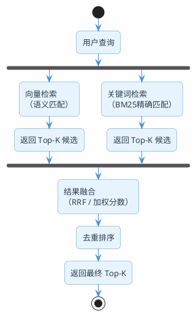

# 混合检索的详细剖析

向量检索是RAG的核心，但它不是万能的。

来看一个真实场景：你搭了一个技术文档问答系统，知识库里存了几百篇Spring相关的文档。用户问"SpringBoot 3.2.1的启动流程有什么变化"，向量检索返回了什么？大概率是一堆关于"SpringBoot启动流程"的通用文档，但版本号"3.2.1"这个关键信息被忽略了。

为什么？因为向量检索的工作方式是把文本转成一串数字（向量），然后比较数字之间的距离。它理解的是"语义"——知道"启动流程"和"启动过程"是一回事。但它对精确的关键词不敏感，"3.2.1"和"3.1.0"在向量空间里的距离可能很近，因为它们都是版本号。

这不是个例。以下几类查询，纯向量检索都容易翻车：

| 查询类型 | 示例 | 翻车原因 |
|---------|------|---------|
| 精确版本号/编号 | "JDK 21的虚拟线程" | 版本号在向量空间中区分度低 |
| 专有名词和缩写 | "GraalVM Native Image" | 专有名词的embedding质量不稳定 |
| 包含数字的查询 | "配置最大连接数为200" | 数字在语义空间中几乎没有区分度 |
| 中英文混合 | "Kafka的consumer group机制" | 中英混合的embedding效果打折 |

## 关键词检索：老技术但没过时

在向量检索出现之前，搜索引擎用的都是关键词检索。最经典的算法就是BM25。

### BM25到底在算什么

BM25的核心思想用一句话概括：**一个词在某篇文档里出现得越多、在整个文档库里出现得越少、这篇文档又不是特别长，那这篇文档就越可能是你要找的。**

拆开来看三个因素：

**词频（TF）——出现越多越相关，但有上限**

一个词在文档里出现了10次，比出现1次更可能相关。但出现100次不会比出现10次相关10倍——BM25用了一个饱和函数，让词频的贡献有上限。这防止了某些文档因为疯狂重复某个词而霸占排名。

**逆文档频率（IDF）——越稀有越有价值**

"的""是""在"这些词几乎每篇文档都有，搜索价值为零。而"GraalVM""虚拟线程"这些词只在少数文档中出现，搜索价值很高。IDF就是用来衡量一个词的稀有程度的。

**文档长度归一化——长文档不能占便宜**

一篇10000字的文档，某个词出现5次很正常。但一篇100字的文档里出现5次，说明这篇文档和这个词高度相关。BM25会根据文档长度做归一化，防止长文档仅仅因为"字多"而排名靠前。

### 向量检索 vs 关键词检索

两种检索方式各有所长，谁也替代不了谁：

| 维度 | 向量检索 | 关键词检索（BM25） |
|------|---------|-----------------|
| 核心能力 | 语义理解 | 精确匹配 |
| "汽车"能匹配"轿车"吗 | 能，语义相近 | 不能，词不一样 |
| "JDK 21"能精确匹配吗 | 不太行，版本号区分度低 | 能，精确匹配 |
| 对拼写错误的容忍度 | 较高 | 很低 |
| 对专有名词的处理 | 取决于embedding质量 | 精确匹配，很稳定 |
| 计算成本 | 高（需要embedding模型） | 低（倒排索引） |
| 适合的场景 | 概念性问题、语义搜索 | 精确查找、关键词定位 |

看出来了吧？它们是互补关系。向量检索擅长的，关键词检索不行；关键词检索擅长的，向量检索也不行。

**那为什么不两个都用呢？这就是混合检索的思路。**

## 混合检索：两条腿走路

混合检索的核心思想很直接：**同一个查询，同时走向量检索和关键词检索两条路，然后把两边的结果合并起来。**



两条检索路径并行执行，互不干扰。向量检索负责捕捉语义相关的文档，关键词检索负责捕捉精确匹配的文档。最后通过融合算法把两边的结果合在一起。

### 融合的难题：分数不可比

两条路各自返回了一批结果，每个结果都有一个分数。但问题是：**向量检索的分数和关键词检索的分数没法直接比较。**

向量检索的分数是余弦相似度，范围通常在0-1之间。BM25的分数是一个无界的正数，可能是0.5，也可能是15.8。两个分数的量纲完全不同，直接加权平均没有意义。

举个具体的例子感受一下。用户搜"Redis 6.0多线程模型"，两路检索各自返回了结果：

| 文档 | 向量检索分数（余弦相似度） | BM25分数 |
|------|----------------------|---------|
| 文档A：Redis 6.0多线程IO详解 | 0.87 | 14.2 |
| 文档B：Redis线程模型演进史 | 0.91 | 6.8 |
| 文档C：Redis 6.0新特性汇总 | 0.72 | 11.5 |

向量检索觉得文档B最好（0.91），BM25觉得文档A最好（14.2）。如果直接把分数加起来，文档A得分0.87+14.2=15.07，文档B得分0.91+6.8=7.71——BM25的分数量级碾压了向量分数，结果完全被BM25主导，向量检索的语义判断等于白做了。

你可能会想到做归一化——把两种分数都映射到0-1之间再相加。但归一化也有坑：如果某一路检索的分数分布很集中（比如都在0.85-0.91之间），归一化后会把微小的差异放大；如果分布很分散，归一化后又会把大的差异压缩。归一化方式选得不好，效果可能还不如只用一路检索。

所以实际工程中，最常用的融合策略不是基于分数，而是基于排名——这就是RRF。

怎么办？两种主流方案：

**方案一：分数归一化后加权**

把两边的分数都归一化到0-1范围，然后加权求和：

```
final_score = alpha * normalize(vector_score) + (1 - alpha) * normalize(bm25_score)
```

alpha一般设0.5-0.7（偏向语义检索）。这个方案简单直观，但归一化方式的选择会影响效果，需要调参。

**方案二：RRF（倒数排名融合）——推荐**

RRF完全不看分数，只看排名。思路是：一个文档在两个列表中排名都靠前，那它大概率是好结果。


## RRF算法详解

RRF的公式非常简单：

```
RRF_score(d) = Σ 1 / (K + rank_i(d))
```

其中K是一个常数（通常取60），rank_i(d)是文档d在第i个检索列表中的排名（从1开始）。

### 用一个例子算一遍

假设向量检索和关键词检索各返回了5个结果：

| 排名 | 向量检索结果 | 关键词检索结果 |
|------|------------|-------------|
| 1 | 文档A | 文档C |
| 2 | 文档B | 文档A |
| 3 | 文档C | 文档E |
| 4 | 文档D | 文档B |
| 5 | 文档E | 文档F |

用K=60来算每个文档的RRF分数：

**文档A**：向量排名1，关键词排名2
- RRF = 1/(60+1) + 1/(60+2) = 0.01639 + 0.01613 = **0.03252**

**文档C**：向量排名3，关键词排名1
- RRF = 1/(60+3) + 1/(60+1) = 0.01587 + 0.01639 = **0.03226**

**文档B**：向量排名2，关键词排名4
- RRF = 1/(60+2) + 1/(60+4) = 0.01613 + 0.01563 = **0.03176**

**文档E**：向量排名5，关键词排名3
- RRF = 1/(60+5) + 1/(60+3) = 0.01538 + 0.01587 = **0.03125**

**文档D**：只在向量检索中出现，排名4
- RRF = 1/(60+4) = **0.01563**

**文档F**：只在关键词检索中出现，排名5
- RRF = 1/(60+5) = **0.01538**

最终排序：A > C > B > E > D > F

注意看：文档A在两个列表中都排名靠前（1和2），所以RRF分数最高。文档D和F只在一个列表中出现，分数就低很多。**RRF天然偏好那些在多个检索通道中都被召回的文档**，这正是我们想要的。

### 为什么RRF比加权分数好

1. **不需要归一化**：只用排名，不用分数，天然解决了量纲不同的问题
2. **对异常值不敏感**：某个检索通道给了一个离谱的高分，不会影响最终结果
3. **简单高效**：没有需要调的超参数（K=60几乎是万能的）
4. **效果经过验证**：在TREC等信息检索评测中表现稳定

## 两种架构方案

混合检索需要同时支持向量检索和关键词检索，架构上有两种主流方案。

### 方案一：Milvus 2.5+ 原生混合检索

Milvus从2.5版本开始原生支持混合检索，一个系统搞定两种检索。

核心思路：在同一个Collection中同时存储Dense向量（用于语义检索）和Sparse向量（用于BM25检索），查询时两路并行，内置RRF融合。

**示例中项目地址**

- 项目地址：[https://github.com/java-up-up/super-agent](https://github.com/java-up-up/super-agent)
- 项目模块：`ai-example-spring-ai-rag-milvus`
- 所属的包：`hybrid`

下面结合示例中项目 Spring AI + Milvus SDK V2 给出完整的工程实现

#### Collection 创建：Dense + Sparse 双向量 Schema

**Schema 包含 4 个字段：**
- `id`（Int64，自增主键）Milvus 自动生成，不需要手动传入
- `text`（VarChar，开启 analyzer 供 BM25 分词）
- `text_dense`（FloatVector，存 Embedding 模型输出的稠密向量）
- `text_sparse`（SparseFloatVector，由 BM25 Function 从 text 字段自动生成，不需要手动写入）

```java
/**
 * 创建支持混合检索的 Collection。
 * text_sparse 字段不需要手动写入，Milvus 的 BM25 Function 会在数据插入时自动生成。
 * <p>
 * 整个过程分三步：
 * 1) 定义 Schema（4 个字段 + 1 个 BM25 Function）
 * 2) 创建 Collection
 * 3) 为 Dense 和 Sparse 字段分别创建索引
 * <p>
 */
public void createCollection() {
    // ========== 第一步：定义 Schema ==========
    CreateCollectionReq.CollectionSchema schema = milvusClient.createSchema();

    // 主键字段：自增 ID
    // autoID=true 表示 Milvus 自动分配主键，插入数据时不需要传 id
    schema.addField(AddFieldReq.builder()
            .fieldName("id")
            .dataType(DataType.Int64)
            .isPrimaryKey(true)
            .autoID(true)
            .build());

    // 文本字段：存储原始文本内容
    // enableAnalyzer=true 是关键！它告诉 Milvus 对这个字段开启文本分析器，
    // 这样 BM25 Function 才能对文本做分词，生成稀疏向量
    schema.addField(AddFieldReq.builder()
            .fieldName("text")
            .dataType(DataType.VarChar)
            .maxLength(properties.getMaxTextLength())
            .enableAnalyzer(true)
            .build());

    // 稠密向量字段：存放 Embedding 模型输出的浮点向量
    // dimension 必须和 Embedding 模型的输出维度一致（当前是 4096）
    // 插入数据时需要手动调用 EmbeddingModel 生成向量并填入这个字段
    schema.addField(AddFieldReq.builder()
            .fieldName("text_dense")
            .dataType(DataType.FloatVector)
            .dimension(properties.getDenseDimension())
            .build());

    // 稀疏向量字段：由 BM25 Function 自动填充
    // SparseFloatVector 不需要指定维度，因为稀疏向量的维度是动态的
    // 插入数据时不需要传这个字段的值，Milvus 会自动通过 BM25 Function 计算
    schema.addField(AddFieldReq.builder()
            .fieldName("text_sparse")
            .dataType(DataType.SparseFloatVector)
            .build());

    // 注册 BM25 Function：这是 Milvus 2.5+ 的新特性
    // 它告诉 Milvus：每当有数据写入 text 字段时，
    // 自动对文本做分词，计算 BM25 权重，生成稀疏向量写入 text_sparse 字段
    // 这样插入数据时只需要提供 text 和 text_dense，text_sparse 自动搞定
    schema.addFunction(CreateCollectionReq.Function.builder()
            .functionType(FunctionType.BM25)
            .name("text_bm25_fn")
            .inputFieldNames(List.of("text"))
            .outputFieldNames(List.of("text_sparse"))
            .build());

    // ========== 第二步：创建 Collection ==========
    milvusClient.createCollection(CreateCollectionReq.builder()
            .collectionName(properties.getCollectionName())
            .collectionSchema(schema)
            .build());

    // ========== 第三步：创建索引 ==========
    // Dense 字段用 HNSW 索引 + COSINE 相似度
    // HNSW 是一种基于图的近似最近邻索引，检索速度快、召回率高
    // M=16：每个节点最多保留 16 条边，值越大索引越占内存但召回越好
    // efConstruction=256：建索引时的搜索宽度，值越大索引质量越高但建索引越慢
    IndexParam denseIndex = IndexParam.builder()
            .fieldName("text_dense")
            .indexType(IndexParam.IndexType.HNSW)
            .metricType(IndexParam.MetricType.COSINE)
            .extraParams(java.util.Map.of(
                    "M", properties.getDenseIndexM(),
                    "efConstruction", properties.getDenseIndexEfConstruction()
            ))
            .build();

    // Sparse 字段用 AUTOINDEX + BM25 度量
    // AUTOINDEX 让 Milvus 自动选择最合适的稀疏索引类型
    // BM25 度量类型表示用 BM25 算法来计算稀疏向量之间的相似度
    IndexParam sparseIndex = IndexParam.builder()
            .fieldName("text_sparse")
            .indexType(IndexParam.IndexType.AUTOINDEX)
            .metricType(IndexParam.MetricType.BM25)
            .build();

    // 一次性为两个字段创建索引
    milvusClient.createIndex(CreateIndexReq.builder()
            .collectionName(properties.getCollectionName())
            .indexParams(List.of(denseIndex, sparseIndex))
            .build());

    log.info("Hybrid Collection 已创建: {}", properties.getCollectionName());
}
```

#### 数据写入：Spring AI EmbeddingModel 生成 Dense 向量

写入时只需要提供 `text` 和 `text_dense` 两个字段，`text_sparse` 由 Milvus BM25 Function 自动计算：

```java
/**
 * 构建一行待插入 Milvus 的数据。
 * <p>
 * Milvus SDK V2 的 insert 接口要求数据是 JsonObject 格式，每个字段对应一个 key。
 * 这里只需要填两个字段：
 * - text：原始文本字符串
 * - text_dense：调用 Spring AI EmbeddingModel 生成的浮点向量数组
 * <p>
 * text_sparse 不需要填！因为我们在 Schema 里注册了 BM25 Function，
 * Milvus 会在数据写入时自动读取 text 字段的内容，做分词，计算 BM25 权重，
 * 然后把生成的稀疏向量写入 text_sparse 字段。
 */
private JsonObject buildRow(String text) {
    // 调用 Spring AI 的 EmbeddingModel 生成稠密向量
    // 内部会自动调用配置好的 Embedding API（当前是硅基流动的 Qwen3-Embedding-8B）
    // 返回一个 float[]，长度就是配置的 dimensions（4096）
    float[] embedding = embeddingModel.embed(text);

    JsonObject row = new JsonObject();
    // 写入原始文本
    row.addProperty("text", text);

    // 把 float[] 转成 JsonArray，写入 text_dense 字段
    // Milvus 要求向量字段的值是一个数字数组
    JsonArray denseArray = new JsonArray();
    for (float v : embedding) {
        denseArray.add(v);
    }
    row.add("text_dense", denseArray);

    // 注意：这里没有写 text_sparse 字段！
    // 它会由 Milvus 的 BM25 Function 自动生成
    return row;
}
```

#### 混合检索：Dense + Sparse 双路并行，RRF 融合

查询时两路检索并行执行，Dense 路通过 EmbeddingModel 生成查询向量做 ANN 检索，Sparse 路直接把原始文本传给 Milvus 做 BM25 匹配，最后用 RRFRanker 融合排序：

```java
/**
 * Dense + Sparse 混合检索，RRF 融合排序（推荐使用的模式）。
 * <p>
 * 整体流程：
 * 1. Dense 分支：EmbeddingModel 生成查询向量 → 在 text_dense 上做 HNSW ANN 检索 → 召回 12 条
 * 2. Sparse 分支：原始文本 → 在 text_sparse 上做 BM25 关键词匹配 → 召回 12 条
 * 3. RRF 融合：把两路结果按排名融合（不看分数，只看排名），最终返回 5 条
 * <p>
 * 为什么用 RRF 而不是直接把分数加起来？
 * 因为 Dense 的分数是余弦相似度（0~1），BM25 的分数是无界正数（可能是 0.5 也可能是 15.8），
 * 两种分数量纲完全不同，直接相加会让 BM25 的分数碾压 Dense 的分数。
 * RRF 只看排名不看分数，天然解决了这个问题。
 */
private SearchResp hybridSearch(String queryText) {
    // ===== 第一路：Dense 语义检索 =====
    // 把查询文本转成 4096 维向量
    float[] queryVector = embeddingModel.embed(queryText);
    List<Float> vectorList = toFloatList(queryVector);

    // 构建 Dense 分支的 ANN 检索请求
    AnnSearchReq denseReq = AnnSearchReq.builder()
            // 在 text_dense 字段上检索
            .vectorFieldName("text_dense")
            // 传入查询向量
            .vectors(Collections.singletonList(new FloatVec(vectorList)))
            // HNSW 检索参数：ef 越大，搜索越广，召回越准，但越慢
            .params("{\"ef\": " + properties.getDenseSearchEf() + "}")
            // Dense 分支的召回数量（不是最终返回数量！最终由 RRF 融合后再截断）
            .topK(properties.getDenseRecallTopK())
            .build();

    // ===== 第二路：Sparse（BM25）关键词检索 =====
    AnnSearchReq sparseReq = AnnSearchReq.builder()
            // 在 text_sparse 字段上检索
            .vectorFieldName("text_sparse")
            // 传入原始文本，Milvus 会自动用 BM25 analyzer 分词
            .vectors(Collections.singletonList(new EmbeddedText(queryText)))
            // drop_ratio_search：丢弃 BM25 得分最低的部分匹配，减少噪音
            .params("{\"drop_ratio_search\": " + properties.getDropRatioSearch() + "}")
            // Sparse 分支的召回数量
            .topK(properties.getSparseRecallTopK())
            .build();

    // ===== 第三步：RRF 融合两路结果 =====
    HybridSearchReq hybridReq = HybridSearchReq.builder()
            .collectionName(properties.getCollectionName())
            // 把两个分支的检索请求放在一起，Milvus 会并行执行
            .searchRequests(List.of(denseReq, sparseReq))
            // RRFRanker：倒数排名融合算法
            // 公式：RRF_score(d) = Σ 1/(K + rank_i(d))
            // K=60 是经验值，几乎不需要调。一个文档在两路中排名都靠前，融合分数就高
            .ranker(new RRFRanker(properties.getRrfK()))
            // 融合后最终返回的文档数量
            .topK(properties.getFinalTopK())
            .consistencyLevel(ConsistencyLevel.BOUNDED)
            // 返回 text 字段的原始内容
            .outFields(List.of("text"))
            .build();

    // Milvus 内部会：并行跑两路检索 → 收集结果 → RRF 融合排序 → 截断到 topK
    return milvusClient.hybridSearch(hybridReq);
}
```

:::info 完整代码
上面的代码片段摘自项目中的 `org.javaup.hybrid` 包，完整实现包括：
- `HybridMilvusProperties`：所有参数集中配置，对应 `application.yaml` 中的 `app.hybrid.milvus` 前缀
- `HybridCollectionManager`：Collection 生命周期管理（创建 Schema、建索引、插入数据）
- `HybridSearchService`：支持 DENSE_ONLY / SPARSE_ONLY / HYBRID 三种检索模式
- `HybridSearchController`：REST 接口，包含 `/hybrid/search` 和 `/hybrid/compare`（同时跑三种模式对比效果）
:::

**调用接口：同一个查询同时跑三种模式，返回一个 Map，key 是模式名，value 是结果列表**
```bash
curl "http://localhost:7094/hybrid/compare?query=CPR 胸外按压频率"
```
**结果：**
```json
{
    "SPARSE_ONLY": [
        {
            "id": "465039717045334137",
            "content": "心肺复苏 CPR 操作要点：确认环境安全后判断意识和呼吸，立即拨打120，胸外按压位置在胸骨下半段，频率100-120次/分钟，深度5-6厘米，每30次按压配合2次人工呼吸。",
            "score": 1.3434247,
            "mode": "SPARSE_ONLY"
        }
    ],
    "DENSE_ONLY": [
        {
            "id": "465039717045334137",
            "content": "心肺复苏 CPR 操作要点：确认环境安全后判断意识和呼吸，立即拨打120，胸外按压位置在胸骨下半段，频率100-120次/分钟，深度5-6厘米，每30次按压配合2次人工呼吸。",
            "score": 0.6707796,
            "mode": "DENSE_ONLY"
        },
        {
            "id": "465039717045334139",
            "content": "骨折急救处理：不要随意搬动伤者，用夹板或硬纸板固定骨折部位上下两个关节，开放性骨折用干净纱布覆盖伤口但不要试图将骨头推回，尽快送医处理。",
            "score": 0.36595196,
            "mode": "DENSE_ONLY"
        },
        {
            "id": "465039717045334134",
            "content": "高血压患者日常管理：建议每天早晚各测一次血压并记录，低盐饮食每日钠摄入不超过5克，规律服药不可自行停药，每周至少进行150分钟中等强度有氧运动。",
            "score": 0.28495392,
            "mode": "DENSE_ONLY"
        },
        {
            "id": "465039717045334138",
            "content": "孕期产检时间表：孕12周前完成建档和NT检查，孕16-20周做唐氏筛查或无创DNA，孕24-28周做糖耐量试验（OGTT），孕36周后每周产检一次直至分娩。",
            "score": 0.23926768,
            "mode": "DENSE_ONLY"
        },
        {
            "id": "465039717045334136",
            "content": "儿童发热处理流程：体温38.5°C以下优先物理降温（温水擦浴、退热贴），超过38.5°C可口服布洛芬混悬液（剂量按体重10mg/kg），持续高热超过3天需就医排查感染源。",
            "score": 0.19753152,
            "mode": "DENSE_ONLY"
        }
    ],
    "HYBRID": [
        {
            "id": "465039717045334137",
            "content": "心肺复苏 CPR 操作要点：确认环境安全后判断意识和呼吸，立即拨打120，胸外按压位置在胸骨下半段，频率100-120次/分钟，深度5-6厘米，每30次按压配合2次人工呼吸。",
            "score": 0.032786883,
            "mode": "HYBRID"
        },
        {
            "id": "465039717045334139",
            "content": "骨折急救处理：不要随意搬动伤者，用夹板或硬纸板固定骨折部位上下两个关节，开放性骨折用干净纱布覆盖伤口但不要试图将骨头推回，尽快送医处理。",
            "score": 0.016129032,
            "mode": "HYBRID"
        },
        {
            "id": "465039717045334134",
            "content": "高血压患者日常管理：建议每天早晚各测一次血压并记录，低盐饮食每日钠摄入不超过5克，规律服药不可自行停药，每周至少进行150分钟中等强度有氧运动。",
            "score": 0.015873017,
            "mode": "HYBRID"
        },
        {
            "id": "465039717045334138",
            "content": "孕期产检时间表：孕12周前完成建档和NT检查，孕16-20周做唐氏筛查或无创DNA，孕24-28周做糖耐量试验（OGTT），孕36周后每周产检一次直至分娩。",
            "score": 0.015625,
            "mode": "HYBRID"
        },
        {
            "id": "465039717045334136",
            "content": "儿童发热处理流程：体温38.5°C以下优先物理降温（温水擦浴、退热贴），超过38.5°C可口服布洛芬混悬液（剂量按体重10mg/kg），持续高热超过3天需就医排查感染源。",
            "score": 0.015384615,
            "mode": "HYBRID"
        }
    ]
}
```

优点：单系统，运维简单，数据一致性有保障，原生RRF支持。

缺点：Milvus的中文分词能力一般，不如Elasticsearch的IK分词器。

### 方案二：Elasticsearch + 向量数据库 双系统

用Elasticsearch做关键词检索（BM25），用PGVector/Milvus/Qdrant做向量检索，应用层做融合。

这是Spring AI生态里非常常见的一种落地方式：**PGVector 存向量，Elasticsearch 存原文，应用层负责统一入口和 RRF 融合。**

**示例中项目地址**

- 项目地址：[https://github.com/java-up-up/super-agent](https://github.com/java-up-up/super-agent)
- 项目模块：`ai-example-spring-ai-rag-pg-es`


#### 示例项目的执行流程

```plantuml title="PGVector + Elasticsearch 双系统混合检索流程" width="100%" align="left"
@startuml
skinparam backgroundColor #FBFAF6
skinparam shadowing false
skinparam roundcorner 18
skinparam defaultFontName "Microsoft YaHei"
skinparam defaultFontSize 13
skinparam ArrowColor #355C7D
skinparam activity {
  StartColor #355C7D
  EndColor #355C7D
  BarColor #355C7D
  DiamondBackgroundColor #FFF4D6
  DiamondBorderColor #E09F3E
  BackgroundColor #FDFDFD
  BorderColor #355C7D
  FontColor #2D3A45
}
skinparam note {
  BackgroundColor #FFF9E8
  BorderColor #E7B75F
  FontColor #5C4A1F
}

start
:用户请求 /hybrid/search;
:统一入口接收\nquery + mode + category;

if (mode?) then (HYBRID)
  fork
    :PGVector 语义检索;\nEmbedding -> similaritySearch;
  fork again
    :Elasticsearch 关键词检索;\nIK/BM25 -> TopK;
  end fork
  :应用层执行 RRF 融合;
  :按分数排序并截断 TopK;
elseif (DENSE_ONLY)
  :只走 PGVector 语义检索;
elseif (SPARSE_ONLY)
  :只走 Elasticsearch BM25 检索;
endif

:返回统一的 SearchResultItem 列表;
stop
@enduml
```

你会发现，这里最关键的不是“两个系统一起查”这句话，而是下面这几个核心点有没有处理好。

#### 真正的模式分发放在 `HybridSearchService` 里：

```java
public List<SearchResultItem> search(String queryText, String mode, String category) {
    return switch (normalizeMode(mode)) {
        case MODE_DENSE_ONLY -> vectorOnlySearch(queryText, category);
        case MODE_SPARSE_ONLY -> keywordOnlySearch(queryText, category);
        default -> hybridSearch(queryText, category);
    };
}
```

#### 双写时必须保证两个系统里的主键一致

示例里导入知识库时，先统一生成 `docId`，再同时写入 PGVector 和 Elasticsearch：

```java
public String importArticle(TechArticle article) {
    String docId = resolveDocumentId(article);

    String fullText = buildFullText(article);
    Map<String, Object> metadata = buildMetadata(article);

    Document document = new Document(docId, fullText, metadata);
    vectorSearchService.addDocuments(List.of(document));

    esKeywordService.indexDocument(toEsDocument(article, docId));
    return docId;
}
```

这里的 `resolveDocumentId(article)` 不只是“生成个 id”那么简单，它还顺手处理了一个很隐蔽的问题：**PGVector 这一套要求文档主键最终能转成 UUID**。

:::warning 为什么这里一定要统一主键
如果 PGVector 用一套 id，Elasticsearch 又用另一套 id，RRF 融合时就没法判断“两路命中的到底是不是同一篇文档”，最后只能把结果当成两篇不同文档处理，排序会乱掉。
:::

#### 混合检索的核心代码，其实就这几步

下面这段就是现在示例项目里真正的混合检索主流程，核心就是“向量召回一批，BM25 召回一批，然后用 RRF 合并”：

```java
/**
 * 带可选分类过滤的混合检索。
 */
public List<SearchResultItem> hybridSearch(String queryText, String category) {
    int vectorTopK = properties.getVectorTopK();
    int keywordTopK = properties.getKeywordTopK();
    int finalTopK = properties.getFinalTopK();
    boolean filterByCategory = StringUtils.hasText(category);

    // ===== 第一路：向量语义检索 =====
    // 通过 Spring AI VectorStore，查询文本会自动被 EmbeddingModel 转成向量
    // 然后在 PGVector 中按余弦相似度找最近的 vectorTopK 个文档
    List<Document> vectorDocs = filterByCategory
            ? vectorSearchService.searchRawDocumentsWithCategory(queryText, category, vectorTopK)
            : vectorSearchService.searchRawDocuments(queryText, vectorTopK);

    // ===== 第二路：ES 关键词检索 =====
    // 查询文本经过 IK 分词后，用 BM25 算法在 ES 倒排索引中匹配
    // 返回 BM25 得分最高的 keywordTopK 个文档
    List<SearchResultItem> keywordResults = filterByCategory
            ? esKeywordService.searchByKeywordWithCategory(queryText, category, keywordTopK)
            : esKeywordService.searchByKeyword(queryText, keywordTopK);

    // ===== 第三步：RRF 融合 =====
    List<SearchResultItem> fusedResults = rrfFusion(vectorDocs, keywordResults, finalTopK);

    log.info("混合检索完成: query={}, category={}, 向量召回={}, 关键词召回={}, 融合后={}",
            queryText, category, vectorDocs.size(), keywordResults.size(), fusedResults.size());

    return fusedResults;
}
```

`rrfFusion(...)` 的实现和前面讲的原理是完全对应的：不直接比较“向量相似度”和“BM25分数”，而是只看排名，然后做倒数排名融合。

```java
private List<SearchResultItem> rrfFusion(List<Document> vectorDocs,
                                          List<SearchResultItem> keywordResults,
                                          int topK) {
    int K = properties.getRrfK();

    // rrfScores：文档 ID → 累加的 RRF 分数
    Map<String, Double> rrfScores = new LinkedHashMap<>();
    // contentMap：文档 ID → 文档内容（用于构建最终结果）
    Map<String, SearchResultItem> contentMap = new HashMap<>();

    // ===== 计算向量检索结果的 RRF 分数 =====
    // vectorDocs 已经按余弦相似度降序排列，第 0 个是最相似的
    for (int rank = 0; rank < vectorDocs.size(); rank++) {
        Document doc = vectorDocs.get(rank);
        String docId = doc.getId();

        // RRF 分数 = 1 / (K + rank + 1)
        // rank 从 0 开始，但 RRF 公式里排名从 1 开始，所以要 +1
        double rrfScore = 1.0 / (K + rank + 1);
        rrfScores.merge(docId, rrfScore, Double::sum);

        // 记录文档内容，后面构建结果时用
        Map<String, Object> metadata = doc.getMetadata();
        contentMap.putIfAbsent(docId, SearchResultItem.builder()
                .id(docId)
                .title(metadata != null ? (String) metadata.get("title") : "")
                .content(doc.getText())
                .category(metadata != null ? (String) metadata.get("category") : "")
                .mode("HYBRID")
                .build());
    }

    // ===== 计算关键词检索结果的 RRF 分数 =====
    // keywordResults 已经按 BM25 分数降序排列
    for (int rank = 0; rank < keywordResults.size(); rank++) {
        SearchResultItem item = keywordResults.get(rank);
        String docId = item.getId();

        double rrfScore = 1.0 / (K + rank + 1);
        // merge：如果这个文档已经在 rrfScores 中（说明向量检索也命中了），
        // 就把两路的 RRF 分数加起来。这正是 RRF 的精髓——在两路中都排名靠前的文档分数最高
        rrfScores.merge(docId, rrfScore, Double::sum);

        // putIfAbsent：如果向量检索已经记录了这个文档的内容，就不覆盖
        contentMap.putIfAbsent(docId, SearchResultItem.builder()
                .id(docId)
                .title(item.getTitle())
                .content(item.getContent())
                .category(item.getCategory())
                .mode("HYBRID")
                .build());
    }

    // ===== 按 RRF 分数降序排列，取 Top-K =====
    return rrfScores.entrySet().stream()
            // 按 RRF 分数从高到低排序
            .sorted(Map.Entry.<String, Double>comparingByValue().reversed())
            // 只取前 topK 个
            .limit(topK)
            .map(entry -> {
                SearchResultItem item = contentMap.get(entry.getKey());
                // 把 RRF 融合分数设置到结果中
                item.setScore(entry.getValue());
                return item;
            })
            .collect(Collectors.toList());
}
```

这里可以重点记一句话：**混合检索这一步最重要的不是分数，而是排名。**

:::info 完整代码
上面的代码片段摘自项目中的 `org.javaup.ai` 包，完整实现包括：
- `HybridSearchProperties`：混合检索相关参数统一配置，对应 `application.yaml` 中的 `hybrid.search` 前缀
- `ElasticsearchIndexInitializer`：Elasticsearch 索引初始化，负责建索引、字段映射和分词器兜底
- `VectorSearchService`：PGVector 语义检索封装，负责向量写入、相似度检索和分类过滤
- `ElasticsearchKeywordService`：BM25 关键词检索封装，负责 ES 写入、全文检索和分类过滤
- `KnowledgeImportService`：双写导入服务，保证 PGVector 和 Elasticsearch 使用同一个文档主键
- `KnowledgeBaseAdminService`：演示数据管理，负责初始化、重建和状态查看
- `HybridSearchService`：统一检索入口，支持 `DENSE_ONLY / SPARSE_ONLY / HYBRID` 三种模式，并在应用层做 RRF 融合
- `HybridSearchController`：REST 接口，包含 `/hybrid/search`、`/hybrid/compare`、`/hybrid/chat`、`/hybrid/init`
:::

**调用接口：同一个查询同时跑三种模式，返回一个 Map，key 是模式名，value 是结果列表**
```bash
curl "http://localhost:7095/hybrid/compare?query=K8s 1.28 Sidecar容器"
```
**结果：**
```json
{
    "DENSE_ONLY": [
        {
            "id": "90ae710b-0a4a-3344-846c-2a2cb481e128",
            "title": "Kubernetes 1.28 Sidecar 容器机制和探针配置",
            "content": "Kubernetes 1.28 Sidecar 容器机制和探针配置\n\nKubernetes 1.28 对 Sidecar 容器场景的支持更清晰，典型用法是把日志采集、代理转发这类辅助能力和主业务容器绑定在一起。\n在健康检查设计上，startupProbe 适合给慢启动应用争取初始化时间，readinessProbe 决定流量是否进入，livenessProbe 则负责发现僵死进程。\n如果用户的问题不是直说“探针”，而是说“容器一直启动不起来怎么排查”，向量检索更容易把这篇内容召回出来。\n但当用户明确输入“K8s 1.28 Sidecar”时，关键词检索对版本号和专有词的命中会更稳。\n",
            "category": "container",
            "score": 0.7610893249511719,
            "mode": "DENSE_ONLY"
        },
        {
            "id": "1911f1e3-1227-3286-be9d-5c2b33169d28",
            "title": "Nacos 2.3 客户端 gRPC 长连接机制说明",
            "content": "Nacos 2.3 客户端 gRPC 长连接机制说明\n\nNacos 2.x 一个明显变化是客户端和服务端之间大量通信改成了 gRPC 长连接，不再完全依赖旧的 HTTP 轮询方式。\n这意味着在排查注册失败、配置推送延迟时，除了看 namespace 和 group，也要看 gRPC 端口、连接复用以及心跳状态。\n“Nacos 2.3 gRPC 长连接”这种问题里，gRPC 和 2.3 都是非常强的关键词，纯 BM25 往往能一下命中。\n",
            "category": "middleware",
            "score": 0.41700559854507446,
            "mode": "DENSE_ONLY"
        },
        {
            "id": "9afd02df-d638-3294-8019-5aeee2ec0e20",
            "title": "Elasticsearch IK 分词器在中文技术文档里的用法",
            "content": "Elasticsearch IK 分词器在中文技术文档里的用法\n\nElasticsearch 默认 standard analyzer 对中文支持比较有限，所以做中文技术知识库时，通常会装 IK 分词器。\n常见组合是索引阶段用 ik_max_word 提高召回，搜索阶段用 ik_smart 控制噪音。\n当查询里出现“连接池泄漏”“线程上下文传播”这种中文技术词组时，IK 分词通常比默认分词效果更稳定。\n这也是 ES + 向量库双系统方案在中文场景里依然很常见的原因。\n",
            "category": "search",
            "score": 0.38941431045532227,
            "mode": "DENSE_ONLY"
        },
        {
            "id": "db9fa33c-dd2d-340c-a301-4189159cac7c",
            "title": "PGVector 使用 HNSW 和余弦距离做语义检索",
            "content": "PGVector 使用 HNSW 和余弦距离做语义检索\n\n在 Spring AI 里接 PGVector 时，常见配置是 HNSW 索引加余弦距离，这样更适合 embedding 语义检索。\n文档写入时，VectorStore 会先调用 embedding 模型生成向量，再把原文、metadata 和向量一起落到 PostgreSQL。\n如果查询像“怎么根据语义找相似知识片段”，哪怕用户没有明确说出 PGVector，也有机会通过向量检索把这篇文档召回。\n",
            "category": "database",
            "score": 0.37594693899154663,
            "mode": "DENSE_ONLY"
        },
        {
            "id": "04821e83-eea6-38f5-a6ca-a29329be0fbb",
            "title": "Spring Boot 3.2 启动阶段里的观测点和自动配置排查",
            "content": "Spring Boot 3.2 启动阶段里的观测点和自动配置排查\n\nSpring Boot 3.2 的启动过程依然围绕环境准备、容器创建、自动配置装配和应用就绪几个阶段展开。\n如果你要排查启动慢，建议先看 AutoConfigurationImportSelector 相关日志、条件装配结果以及应用事件时间线。\n对于“启动流程有什么变化”这种表达，向量检索容易抓到主题；\n但如果问题里带了“3.2”这种精确版本号，混合检索会更保险。\n",
            "category": "framework",
            "score": 0.33160167932510376,
            "mode": "DENSE_ONLY"
        }
    ],
    "SPARSE_ONLY": [
        {
            "id": "90ae710b-0a4a-3344-846c-2a2cb481e128",
            "title": "Kubernetes 1.28 Sidecar 容器机制和探针配置",
            "content": "Kubernetes 1.28 对 Sidecar 容器场景的支持更清晰，典型用法是把日志采集、代理转发这类辅助能力和主业务容器绑定在一起。\n在健康检查设计上，startupProbe 适合给慢启动应用争取初始化时间，readinessProbe 决定流量是否进入，livenessProbe 则负责发现僵死进程。\n如果用户的问题不是直说“探针”，而是说“容器一直启动不起来怎么排查”，向量检索更容易把这篇内容召回出来。\n但当用户明确输入“K8s 1.28 Sidecar”时，关键词检索对版本号和专有词的命中会更稳。\n",
            "category": "container",
            "score": 11.048244,
            "mode": "SPARSE_ONLY"
        },
        {
            "id": "04821e83-eea6-38f5-a6ca-a29329be0fbb",
            "title": "Spring Boot 3.2 启动阶段里的观测点和自动配置排查",
            "content": "Spring Boot 3.2 的启动过程依然围绕环境准备、容器创建、自动配置装配和应用就绪几个阶段展开。\n如果你要排查启动慢，建议先看 AutoConfigurationImportSelector 相关日志、条件装配结果以及应用事件时间线。\n对于“启动流程有什么变化”这种表达，向量检索容易抓到主题；\n但如果问题里带了“3.2”这种精确版本号，混合检索会更保险。\n",
            "category": "framework",
            "score": 1.2660805,
            "mode": "SPARSE_ONLY"
        }
    ],
    "HYBRID": [
        {
            "id": "90ae710b-0a4a-3344-846c-2a2cb481e128",
            "title": "Kubernetes 1.28 Sidecar 容器机制和探针配置",
            "content": "Kubernetes 1.28 Sidecar 容器机制和探针配置\n\nKubernetes 1.28 对 Sidecar 容器场景的支持更清晰，典型用法是把日志采集、代理转发这类辅助能力和主业务容器绑定在一起。\n在健康检查设计上，startupProbe 适合给慢启动应用争取初始化时间，readinessProbe 决定流量是否进入，livenessProbe 则负责发现僵死进程。\n如果用户的问题不是直说“探针”，而是说“容器一直启动不起来怎么排查”，向量检索更容易把这篇内容召回出来。\n但当用户明确输入“K8s 1.28 Sidecar”时，关键词检索对版本号和专有词的命中会更稳。\n",
            "category": "container",
            "score": 0.03278688524590164,
            "mode": "HYBRID"
        },
        {
            "id": "04821e83-eea6-38f5-a6ca-a29329be0fbb",
            "title": "Spring Boot 3.2 启动阶段里的观测点和自动配置排查",
            "content": "Spring Boot 3.2 启动阶段里的观测点和自动配置排查\n\nSpring Boot 3.2 的启动过程依然围绕环境准备、容器创建、自动配置装配和应用就绪几个阶段展开。\n如果你要排查启动慢，建议先看 AutoConfigurationImportSelector 相关日志、条件装配结果以及应用事件时间线。\n对于“启动流程有什么变化”这种表达，向量检索容易抓到主题；\n但如果问题里带了“3.2”这种精确版本号，混合检索会更保险。\n",
            "category": "framework",
            "score": 0.0315136476426799,
            "mode": "HYBRID"
        },
        {
            "id": "1911f1e3-1227-3286-be9d-5c2b33169d28",
            "title": "Nacos 2.3 客户端 gRPC 长连接机制说明",
            "content": "Nacos 2.3 客户端 gRPC 长连接机制说明\n\nNacos 2.x 一个明显变化是客户端和服务端之间大量通信改成了 gRPC 长连接，不再完全依赖旧的 HTTP 轮询方式。\n这意味着在排查注册失败、配置推送延迟时，除了看 namespace 和 group，也要看 gRPC 端口、连接复用以及心跳状态。\n“Nacos 2.3 gRPC 长连接”这种问题里，gRPC 和 2.3 都是非常强的关键词，纯 BM25 往往能一下命中。\n",
            "category": "middleware",
            "score": 0.016129032258064516,
            "mode": "HYBRID"
        },
        {
            "id": "9afd02df-d638-3294-8019-5aeee2ec0e20",
            "title": "Elasticsearch IK 分词器在中文技术文档里的用法",
            "content": "Elasticsearch IK 分词器在中文技术文档里的用法\n\nElasticsearch 默认 standard analyzer 对中文支持比较有限，所以做中文技术知识库时，通常会装 IK 分词器。\n常见组合是索引阶段用 ik_max_word 提高召回，搜索阶段用 ik_smart 控制噪音。\n当查询里出现“连接池泄漏”“线程上下文传播”这种中文技术词组时，IK 分词通常比默认分词效果更稳定。\n这也是 ES + 向量库双系统方案在中文场景里依然很常见的原因。\n",
            "category": "search",
            "score": 0.015873015873015872,
            "mode": "HYBRID"
        },
        {
            "id": "db9fa33c-dd2d-340c-a301-4189159cac7c",
            "title": "PGVector 使用 HNSW 和余弦距离做语义检索",
            "content": "PGVector 使用 HNSW 和余弦距离做语义检索\n\n在 Spring AI 里接 PGVector 时，常见配置是 HNSW 索引加余弦距离，这样更适合 embedding 语义检索。\n文档写入时，VectorStore 会先调用 embedding 模型生成向量，再把原文、metadata 和向量一起落到 PostgreSQL。\n如果查询像“怎么根据语义找相似知识片段”，哪怕用户没有明确说出 PGVector，也有机会通过向量检索把这篇文档召回。\n",
            "category": "database",
            "score": 0.015625,
            "mode": "HYBRID"
        }
    ]
}
```

## 两种混合检索的方案要怎么选

| 考虑因素 | Milvus原生方案 | ES + 向量库方案 |
|---------|-------------|--------------|
| 运维复杂度 | 低（单系统） | 高（双系统） |
| 中文分词质量 | 一般 | 好（IK分词器） |
| 数据一致性 | 天然一致 | 需要双写保障 |
| 适合场景 | 中小规模、快速上线 | 大规模、对中文检索要求高 |
| Spring AI集成 | 需要自己写 | 有现成的VectorStore实现 |

:::info 选型建议
如果你的项目已经在用Elasticsearch，推荐方案二，充分利用ES的全文检索能力。如果是新项目且规模不大，Milvus原生方案更省事。
:::

## 检索参数怎么调

混合检索涉及的参数不少，调参顺序很重要。

### 先调召回量，再调精度

很多人上来就调相似度阈值，这是错的。正确的顺序：

1. **先保证召回**：把两路检索的topK都设大一点（比如各20），相似度阈值设低一点（0.3甚至更低），确保相关文档能被召回
2. **再调融合**：RRF的K值一般不用动（60就行），主要看融合后的排序是否合理
3. **最后调精度**：通过重排序（下一篇会讲）来提升排序精度，或者适当提高相似度阈值过滤噪音

### 推荐的起始参数

| 参数 | 推荐值 | 说明 |
|------|-------|------|
| 向量检索 topK | 20 | 初始召回量，宁多勿少 |
| 关键词检索 topK | 20 | 和向量检索保持一致 |
| 相似度阈值 | 0.3 | 先设低，保证召回 |
| RRF K值 | 60 | 几乎不需要调 |
| 最终返回 topK | 5 | 融合后取前5个 |

### 观测什么指标

上线后需要关注的核心指标：

- **Recall@20**：前20个结果中包含正确答案的比例。这是最重要的指标，召回不了就什么都白搭
- **MRR（Mean Reciprocal Rank）**：正确答案的平均排名倒数。衡量排序质量
- **混合检索 vs 纯向量检索的对比**：定期抽样对比，确认混合检索确实带来了提升

```java
// 简单的检索效果日志
log.info("HybridSearch | query={} | vectorHits={} | esHits={} | "
        + "fusedTotal={} | topDoc={}",
        query, vectorResults.size(), esResults.size(),
        fusedResults.size(),
        fusedResults.isEmpty() ? "none" : fusedResults.get(0).substring(0, 50));
```

## 混合检索不是银弹

虽然混合检索比纯向量检索效果好很多，但它也有局限：

1. **延迟增加**：两路检索并行，总延迟取决于较慢的那一路。如果ES响应慢，整体延迟就上去了
2. **运维成本**：双系统方案需要维护两套存储，数据双写要保证一致性
3. **不能解决所有问题**：如果文档切片质量差、embedding模型不行，混合检索也救不了

混合检索解决的是"召回"问题——确保相关文档能被找到。但找到之后排序准不准，还需要重排序来进一步优化。这就是下一篇要讲的内容。

:::tip 小结
纯向量检索在精确关键词、版本号、专有名词等场景下容易翻车。混合检索同时走向量和关键词两条路，用RRF算法融合结果，让语义匹配和精确匹配互补。架构上推荐Milvus原生方案（简单）或ES+向量库方案（中文分词好）。调参顺序：先保召回，再调精度。
:::
