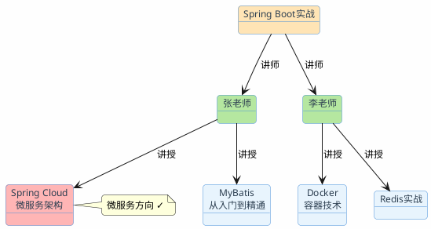

import VipInline from '@site/src/components/VipInline';

# 图结构：Graph RAG

传统RAG的套路是：用户问一个问题，去知识库里找到最相关的几段文字，交给大模型生成回答。这个模式处理"单跳"问题很在行——答案就在某一段文档里，找到就行。

但有些问题不是这样的。

比如用户问："教《Spring Boot实战》的讲师还开过哪些微服务方向的课？"

要回答这个问题，需要三步推理：
1. 先找到《Spring Boot实战》这门课有哪些讲师（张老师、李老师）
2. 再找到这几位讲师各自还教了哪些课程
3. 从中筛选出微服务方向的

这三步信息可能分散在不同的文档里。传统RAG用"Spring Boot实战的讲师还开过哪些微服务方向的课"去做向量检索，大概率只能找到关于《Spring Boot实战》本身的课程介绍，很难把讲师的其他课程也召回来。

这就是传统RAG的天花板：**它擅长"找到"，但不擅长"推理"。**

## 传统RAG在哪些场景下会碰壁

除了多跳推理，还有几类问题是传统RAG处理不好的：

**关系查询**："张三的直属领导是谁？他领导的团队有多少人？"——需要沿着组织架构的关系链条走。

**路径发现**："从北京到拉萨，经停西安的航班有哪些？"——需要在航线网络中找路径。

**聚合统计**："和张老师一起教过课的讲师里，谁的课程平均评分最高？"——需要遍历合作关系并做聚合计算。

这些问题的共同特点：**答案不在某一段文字里，而是藏在实体之间的关系网络中。**

## 知识图谱：把信息织成网

知识图谱的核心思想很简单：用"实体-关系-实体"的三元组来表示知识。

```
(Spring Boot实战) --[讲师]--> (张老师)
(Spring Boot实战) --[讲师]--> (李老师)
(张老师) --[讲授]--> (Spring Cloud微服务架构)
(张老师) --[讲授]--> (MyBatis从入门到精通)
(李老师) --[讲授]--> (Docker容器技术)
(李老师) --[讲授]--> (Redis实战)
(Spring Cloud微服务架构) --[方向]--> (微服务)
(Docker容器技术) --[方向]--> (DevOps)
(MyBatis从入门到精通) --[方向]--> (持久层)
(Redis实战) --[方向]--> (中间件)
```

有了这张图，"Spring Boot实战的讲师还开过哪些微服务方向的课"就变成了一个图遍历问题：从"Spring Boot实战"节点出发，沿着"讲师"关系找到讲师节点，再沿着"讲授"关系找到其他课程节点，最后过滤出方向为"微服务"的。



答案一目了然：张老师还教了《Spring Cloud微服务架构》，属于微服务方向。

## 图数据库：存储和查询知识图谱

知识图谱需要一个专门的数据库来存储和查询，这就是图数据库。最主流的选择是Neo4j。

### Neo4j的核心概念

- **Node（节点）**：代表一个实体，比如一门课程、一位讲师
- **Relationship（关系）**：连接两个节点，有方向和类型，比如"讲授"
- **Property（属性）**：节点或关系上的键值对，比如课程的开设年份
- **Label（标签）**：节点的分类，比如"Course""Instructor"

### Cypher查询语言

Neo4j用Cypher语言做查询，语法很直观，像在画图：

```cypher
// 查找Spring Boot实战的讲师
MATCH (c:Course {courseName: 'Spring Boot实战'}) <-[:TEACHES]- (i:Instructor)
RETURN i.name

// 查找讲师的其他课程
MATCH (c:Course {courseName: 'Spring Boot实战'}) <-[:TEACHES]- (i:Instructor) -[:TEACHES]-> (other:Course)
RETURN i.name, other.courseName

// 加上方向过滤：只要微服务方向
MATCH (c:Course {courseName: 'Spring Boot实战'}) <-[:TEACHES]- (i:Instructor) -[:TEACHES]-> (other:Course)
WHERE other.category = '微服务'
RETURN i.name, other.courseName
```

`(c:Course)` 表示一个Course类型的节点，`-[:TEACHES]->` 表示一条TEACHES类型的关系，箭头表示方向。整个MATCH语句就像在图上画一条路径。

### Docker部署Neo4j

先拉取Neo4j镜像：

```bash
docker pull neo4j:5.22-community
```

然后启动容器：

```bash
docker run -d \
  --name neo4j \
  -p 7474:7474 \
  -p 7687:7687 \
  -e NEO4J_AUTH=neo4j/your_password \
  -e NEO4J_PLUGINS='["apoc"]' \
  -v neo4j_data:/data \
  neo4j:5.22-community
```

启动后访问 `http://localhost:7474` 可以打开Neo4j的Web管理界面，直接在里面写Cypher查询。


<VipInline />
