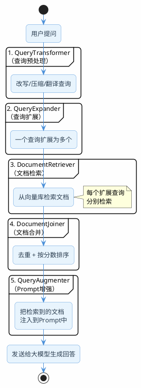

import VipInline from '@site/src/components/VipInline';

# RAG的组件拼接成流水线

前面几篇文章，我们逐个拆解了RAG的各个环节：问题改写、意图识别、混合检索、重排序、元数据过滤。每个环节都是独立的模块，各自解决一个具体问题。

但在实际项目中，这些模块需要串起来形成一条完整的流水线。手动串联当然可以（前面的代码示例就是这么做的），但如果框架能提供一个标准化的编排机制，开发效率会高很多。

Spring AI的`RetrievalAugmentationAdvisor`就是干这个事的——它定义了一套Modular RAG的标准流水线，把查询预处理、文档检索、后处理、Prompt增强这些步骤用插件化的方式组织起来。

:::info 先说实话
Spring AI的Modular RAG支持目前还比较基础，组件不多，灵活性也有限。但作为一个开箱即用的起点，它能帮你快速搭建一个标准的RAG流程，后续再根据需要替换或扩展其中的组件。
:::

## 流水线长什么样

`RetrievalAugmentationAdvisor`内部的处理流程是这样的：

五个组件，每个都是可插拔的。你可以只用其中几个，也可以全部用上。

这些组件背后的原理，在前面的文章中都有详细展开，下面这张表方便你快速跳转到对应的讲解：

| 组件 | 对应详细文档 |
|------|------------|
| CompressionQueryTransformer（多轮对话压缩） | [为什么要问题重写](/super-agent/rag/query-rewrite) |
| RewriteQueryTransformer（查询优化） | [为什么要问题重写](/super-agent/rag/query-rewrite) |
| TranslationQueryTransformer（查询翻译） | 本文首次介绍 |
| MultiQueryExpander（查询扩展） | [为什么要问题重写](/super-agent/rag/query-rewrite) |
| VectorStoreDocumentRetriever（文档检索） | [向量检索核心算法深度剖析](/super-agent/rag/vector-search-algorithms)、[元数据的过滤场景](/super-agent/rag/metadata-filtering)、[混合检索的详细剖析](/super-agent/rag/hybrid-search) |
| ConcatenationDocumentJoiner（文档合并） | 本文首次介绍 |
| ContextualQueryAugmenter（Prompt增强） | 本文首次介绍 |

<VipInline />
