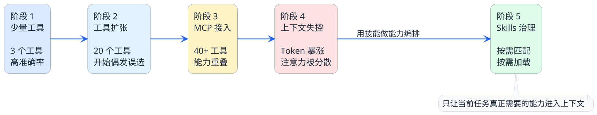
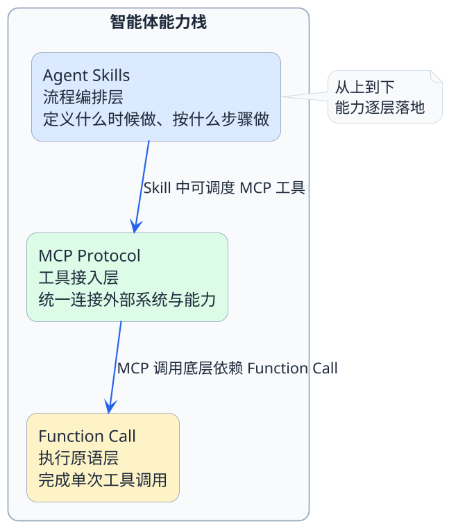

# 智能体为什么需要技能包

你有没有过这样的经历——入职第一天，公司一口气甩给你十几份文档：员工手册、报销流程、代码规范、部署指南、安全须知、会议制度......你坐在工位上翻了一整天，最后真正记住的可能连一半都不到。

更糟糕的是，当你第二天想报销一笔差旅费时，你发现自己需要从那十几份文档里翻来翻去找对应的规则，效率极低。

其实今天的AI智能体面临的困境，跟这个新员工遇到的情况也差不多。

## 智能体的"信息过载"到底有多严重

我们都知道，大模型有一个"上下文窗口"的限制。你可以把它理解成大模型的"工作记忆"——它一次能记住的信息量是有上限的。

随着智能体要处理的任务越来越复杂，需要集成的工具越来越多，一个很现实的问题就冒出来了：

:::warning 核心矛盾
**智能体要干的事情越来越多，但它能记住的东西就那么多。**

塞给它的信息越多，它反而越容易"犯迷糊"——选错工具、漏掉步骤、输出质量下降，甚至开始编造内容。
:::

这不是什么理论问题，而是我们在实际开发中经常遇到的。

### 一个真实的演变过程

来看一个典型的"恶化"路径：

**阶段一：只有几个工具的时候**

一开始你给智能体接了3个工具：查天气、查日程、发邮件。Prompt里写清楚每个工具的描述和参数，模型每次都能准确选对，用起来很顺畅。

**阶段二：工具数量开始膨胀**

项目做大了，你陆续接入了文件读取、数据库查询、代码生成、知识库检索、消息推送......工具数量从3个涨到了20个。这时候你会发现，模型偶尔会选错工具，或者参数传得不太对。

**阶段三：MCP让工具爆炸式增长**

上了MCP之后，一个MCP Server就能暴露十几个工具。你接入3个MCP Server，工具列表一下子变成了40多个。更麻烦的是，不同MCP Server提供的工具可能功能相似——比如A Server有个`search_files`，B Server也有个`find_documents`，模型根本分不清该用哪个。

**结果**：上下文里塞满了工具定义，模型的注意力被严重分散，任务执行的准确率急剧下降。

### 可以用数据对比一下

| 维度 | 工具少的时候 | 工具膨胀之后 |
|------|-------------|-------------|
| 工具数量 | 3-5个 | 30-50个 |
| 工具描述占用Token | 约500 | 约5000-8000 |
| 模型选对工具的概率 | 95%+ | 可能降到60-70% |
| 执行一轮任务的总Token消耗 | 低 | 翻了好几倍 |
| 结果可控性 | 高 | 明显下降 |

## 那在Skills出现之前，大家是怎么解决的

面对上下文膨胀，行业里尝试过不少方案。我们逐个来看看它们各自的问题。

### 方案一：全部写进Prompt里

这是最直观的做法——把所有的工作规则、操作流程、注意事项统统写进系统Prompt。

:::note 举个例子
你在做一个代码审查助手，Prompt里可能要写：
- 审查Java代码时需要关注哪些规范
- 审查Python代码时又要注意什么
- 发现安全漏洞怎么处理
- 性能问题怎么标记
- 输出格式是什么样的
- ......
:::

刚开始还好，但随着覆盖的场景越来越多，Prompt会膨胀到几千甚至上万Token。这会带来两个问题：
1. **Token浪费严重**：每次对话都要带上全部Prompt，哪怕用户只是问了一个简单问题
2. **模型注意力稀释**：信息太多，模型反而抓不住重点，"淹没在细节里"

### 方案二：硬编码在Workflow里

有些团队选择把执行逻辑固化成代码流程：`if 用户要做A → 调工具1 → 处理结果 → 调工具2 → 返回`。

这种方式确实稳定，但问题也很明显：
- **灵活性差**：每加一个新场景就要改代码、重新部署
- **无法跨项目复用**：每个项目的Workflow都是定制的，换个项目就得重写
- **维护成本高**：流程一旦变复杂，代码就变成意大利面条

### 方案三：拆成多个小Agent

把一个大Agent拆成多个专项Agent，每个只负责一小块功能，再搞个"调度Agent"在上面做路由。

思路不错，但实际落地会发现：
- 调度Agent本身的决策质量很难保证
- 多Agent之间的上下文传递和状态同步很复杂
- 整体延迟和成本都会上升

### 小结：这些方案缺的是什么

| 方案 | 核心问题 |
|------|---------|
| 全塞Prompt | 无法按需加载，每次都全量消耗Token |
| 硬编码Workflow | 能力无法复用，修改成本高 |
| 多Agent拆分 | 架构复杂度高，调度不可控 |

你会发现，**缺的不是具体的技术手段，而是一种统一的、结构化的能力组织方式**。

## Agent Skills：给智能体一套"按需取用的操作手册"

2025年，Anthropic提出了Agent Skills这个概念。说白了，它其实要解决的就是上面说的那些问题。

:::info 核心定义
Agent Skills 既不是新的模型，也不是新的算法，而是**一种把经过验证的工作方法封装成独立模块的工程机制**。

智能体在接到任务时，先看看有哪些现成的技能模块能用，找到匹配的再把对应的指令加载进来——而不是一开始就把所有东西都塞进上下文。
:::

用回刚才"新员工"的例子来理解：

> 以前的做法：入职第一天，把公司所有文档一口气全印出来摞你桌上。不管你今天要干嘛，反正文档先全给你。
>
> Skills的做法：入职第一天，给你一份**目录索引**——列出了公司有哪些文档、每份文档解决什么问题。当你需要报销时，你翻目录找到"报销流程"这份文档，只把这一份拿出来看。看完还回去，桌面始终保持清爽。

这就是Agent Skills的核心理念：**不是减少能力，而是优化能力的加载方式**。

## Skills到底解决了哪些具体问题

我们从工程实践的角度，把Skills解决的问题拆得再细一些：

### 问题一：上下文Token大量浪费

**以前**：所有工具描述、操作规则、参考文档一股脑塞进去，每轮对话都要消耗。

**现在**：Skills采用分层加载——先只加载一句话描述（几十个Token），确认需要使用后再加载完整指令（几百个Token），具体的参考文档和脚本只在真正执行时才按需读取。

### 问题二：做事方法没办法复用

**以前**：你在项目A里写了一套代码审查的规则和流程，换到项目B想用，得把Prompt复制过去，手动改一堆东西。

**现在**：把代码审查封装成一个Skill，任何项目的智能体只要把这个Skill目录放进去就能直接用。就像手机装App一样简单。

### 问题三：执行过程不稳定

**以前**：所有逻辑都靠模型自由发挥，同一个任务执行三次，可能得到三个不同结果。

**现在**：Skills可以包含确定性执行脚本，关键步骤由脚本保证结果一致性，模型只负责理解意图和组织输出。

### 问题四：工具多了模型选不对

**以前**：40个工具平铺在上下文里，模型每次都要从中选择，选错概率很高。

**现在**：技能匹配发生在加载阶段——只有与当前任务相关的Skill才会被激活，激活后只有该Skill关联的工具才进入上下文，大大收窄了模型的选择范围。

## Skills、MCP、Function Call，它们什么关系

这三个概念经常被放在一起讨论，但它们其实解决的是不同层面的问题：

简单来说：
- **Function Call** 解决的是"怎么调一个工具"——这是最底层的能力
- **MCP** 解决的是"怎么统一管理和接入工具"——这是中间的连接层
- **Agent Skills** 解决的是"怎么把做事的完整流程封装成可复用的模块"——这是最上层的能力编排

它们不是替代关系，而是**互补关系**。一个完整的智能体，可以同时使用这三者。

## 这一篇的重点回顾

我们从一个"信息过载的新员工"场景出发，聊到了智能体在实际开发中面临的上下文膨胀困境，分析了以前常见的几种解决方案各自的短板，最后引出了Agent Skills的核心理念。

关键要记住的几个点：
1. **上下文窗口是有限的**，工具和信息越多，模型表现反而越差
2. **传统方案要么全量加载，要么过度定制**，缺少弹性
3. **Agent Skills的核心是"按需加载"**——先给目录，用到再取详情
4. **Skills和MCP、Function Call不是竞争关系**，而是各管一层

下一篇，我们来看看一个Skill在物理层面到底长什么样——它的目录结构和每个组件分别承担什么角色。
