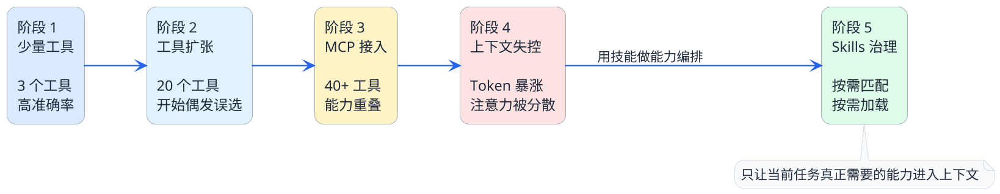

import VipInline from '@site/src/components/VipInline';

# 智能体为什么需要技能包

你有没有过这样的经历——入职第一天，公司一口气甩给你十几份文档：员工手册、报销流程、代码规范、部署指南、安全须知、会议制度......你坐在工位上翻了一整天，最后真正记住的可能连一半都不到。

更糟糕的是，当你第二天想报销一笔差旅费时，你发现自己需要从那十几份文档里翻来翻去找对应的规则，效率极低。

其实今天的AI智能体面临的困境，跟这个新员工遇到的情况也差不多。

## 智能体的"信息过载"到底有多严重

我们都知道，大模型有一个"上下文窗口"的限制。你可以把它理解成大模型的"工作记忆"——它一次能记住的信息量是有上限的。

随着智能体要处理的任务越来越复杂，需要集成的工具越来越多，一个很现实的问题就冒出来了：

:::warning 核心矛盾
**智能体要干的事情越来越多，但它能记住的东西就那么多。**

塞给它的信息越多，它反而越容易"犯迷糊"——选错工具、漏掉步骤、输出质量下降，甚至开始编造内容。
:::

这不是什么理论问题，而是我们在实际开发中经常遇到的。

### 一个真实的演变过程

来看一个典型的"恶化"路径：

**阶段一：只有几个工具的时候**

一开始你给智能体接了3个工具：查天气、查日程、发邮件。Prompt里写清楚每个工具的描述和参数，模型每次都能准确选对，用起来很顺畅。

**阶段二：工具数量开始膨胀**

项目做大了，你陆续接入了文件读取、数据库查询、代码生成、知识库检索、消息推送......工具数量从3个涨到了20个。这时候你会发现，模型偶尔会选错工具，或者参数传得不太对。

**阶段三：MCP让工具爆炸式增长**

上了MCP之后，一个MCP Server就能暴露十几个工具。你接入3个MCP Server，工具列表一下子变成了40多个。更麻烦的是，不同MCP Server提供的工具可能功能相似——比如A Server有个`search_files`，B Server也有个`find_documents`，模型根本分不清该用哪个。

**结果**：上下文里塞满了工具定义，模型的注意力被严重分散，任务执行的准确率急剧下降。

### 可以用数据对比一下

| 维度 | 工具少的时候 | 工具膨胀之后 |
|------|-------------|-------------|
| 工具数量 | 3-5个 | 30-50个 |
| 工具描述占用Token | 约500 | 约5000-8000 |
| 模型选对工具的概率 | 95%+ | 可能降到60-70% |
| 执行一轮任务的总Token消耗 | 低 | 翻了好几倍 |
| 结果可控性 | 高 | 明显下降 |

<VipInline />
