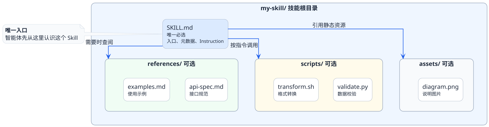
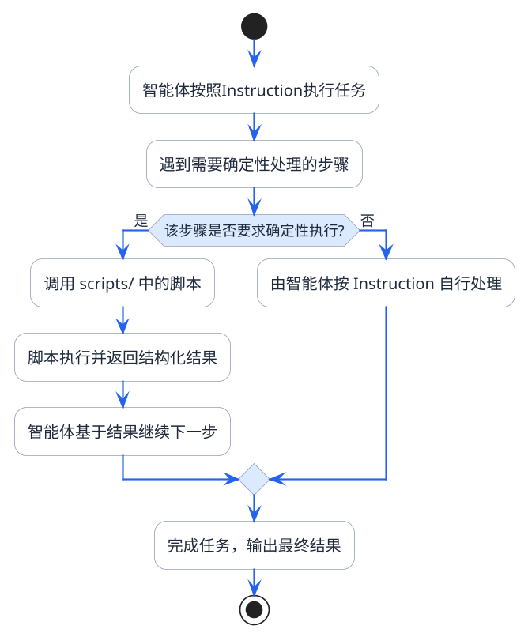
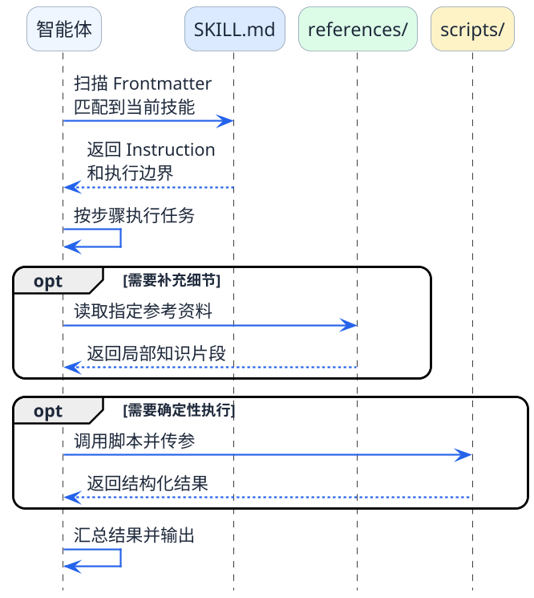

# Skills目录结构全景图

上一篇我们聊到，Agent Skills本质上是一种"按需取用的能力模块"。那这个模块在物理层面到底长什么样呢？

答案可能会让你有点意外——**它就是一个文件夹**。

没有复杂的配置中心，没有什么注册发现服务，也不需要额外的运行时框架。一个Skill就是一个符合约定结构的目录，放到指定位置，智能体就能识别和使用它。

为什么要用这么"朴素"的方式？原因其实也很简单了：

- **零依赖**：不需要安装任何额外的工具链，任何编辑器都能创建和修改
- **版本友好**：文件夹天然适合Git管理，团队协作和版本追踪毫无阻碍
- **可移植性强**：复制粘贴就能把一个技能从项目A搬到项目B
- **透明可审计**：所有内容都是纯文本，打开就能看到技能里写了什么

:::info 设计哲学
Agent Skills选择文件夹作为载体，背后的理念是：**让能力管理回归到最简单的形式，降低使用门槛，同时保持最大的灵活性。**
:::

## 一个完整Skill长什么样

直接上结构，一个典型的Skill目录是这样的：



用一句话概括每个部分：

| 组件 | 是否必选 | 一句话说明 |
|------|---------|-----------|
| **SKILL.md** | 必选 | 技能的身份证+操作手册，是整个Skill的灵魂 |
| **references/** | 可选 | 补充性的参考资料库，需要时才打开翻阅 |
| **scripts/** | 可选 | 确定性执行的脚本工具箱，关键步骤靠代码保底 |
| **assets/** | 可选 | 图片、配置模板等静态资源文件 |

接下来我们逐个拆开看。

## SKILL.md：整个技能的灵魂文件

一个Skill可以没有scripts、没有references，但**绝对不能没有SKILL.md**。这是智能体认识和使用技能的唯一入口。

SKILL.md由两个部分组成：

### 第一部分：Frontmatter（元数据区）

这是文件最顶部、被三个短横线`---`包裹的区域。你可以把它理解成这个技能的**一句话简历**。

```yaml
---
name: code-review
description: Review code changes for bugs, security issues, and style violations.
---
```

这几行字有多重要？非常重要。因为**智能体在决定要不要用某个技能之前，只会看这几行字**。

来看它的工作流程：

1. 智能体收到用户任务后，扫描所有可用的Skill目录
2. 只读取每个SKILL.md最顶部的`name`和`description`
3. 根据这些简短的描述，判断哪个技能与当前任务匹配
4. 只有确定要用的技能，才会继续读取后面的完整内容

:::warning 写好description至关重要
description写得好不好，直接决定了智能体能不能在正确的时机找到这个技能。

写得太笼统（比如"处理各种任务"），智能体什么时候都想用它；写得太狭窄（比如"仅处理Java 17的switch表达式审查"），又会在很多该用的时候被忽略。

好的description要做到：**清楚说明能做什么，隐含什么时候该用**。
:::

### 第二部分：Instruction（指令正文区）

`---`之后的所有内容就是指令正文。当智能体决定要使用这个技能后，才会把这部分内容加载进来。

指令正文就是一份**给智能体看的操作手册**，通常会包含：

- **什么时候该用这个技能**（使用边界）
- **具体执行步骤是什么**（操作流程）
- **有哪些需要注意的约束**（行为限制）
- **怎么调用关联的脚本和参考资料**（组件调度）

一个简化的例子：

```markdown
---
name: code-review
description: Review code changes for bugs, security issues, and style violations.
---

# Code Review

## When to use
Use this skill when the user asks to review code, check for bugs,
or audit code quality.

## Review process
1. Read the target file using the read_file tool
2. Check against the style guide in references/style-guide.md
3. Run the lint script: scripts/lint_check.py
4. Summarize findings in a structured report

## Output format
- Group issues by severity: Critical / Warning / Suggestion
- Each issue must include file path, line number, and fix recommendation
```

注意看这个例子的结构——它不是在"教大模型学知识"，而是在**给大模型一套标准化的执行步骤**。这跟我们写给新员工的操作手册是一个思路：不要考验他的临场发挥能力，而是给他一个清晰的SOP让他按步骤走。

## references/：需要时才翻开的参考书

references目录存放的是各种参考资料——可以是详细的API文档、具体的规则说明、实际的样例模板等等。

关键点在于：**这些文件不会自动加载到上下文里**。

只有当两种情况发生时，智能体才会去读取reference文件：
1. SKILL.md的指令正文里明确指示了"去读某个reference文件"
2. 智能体在执行过程中判断自己需要补充某些细节信息

:::note 理解这个设计的好处
假设你在做一个API集成的Skill，reference里放了一份200行的接口文档。如果每次使用这个技能都把200行全加载进来，Token消耗会非常大。

但实际上，可能80%的情况下，智能体只需要查其中某个接口的参数定义。reference的按需加载机制，让它只在需要的时候读取需要的那一小部分，剩下的不动。
:::

reference里通常会放什么：

- 详细的字段定义和数据格式说明
- 具体的编码规范和风格指南
- 成功案例和失败案例的对比样本
- 第三方服务的API参考文档

## scripts/：用代码兜底的确定性执行器

scripts目录存放的是可以被智能体调用执行的脚本文件，通常是Python或Shell脚本。

为什么需要脚本？因为有些事情**不应该交给大模型自由发挥**。

举两个典型场景：

**场景一：数据格式转换**

把用户上传的CSV文件转换成特定格式的JSON。这种操作步骤完全确定，用脚本处理又快又准。如果让大模型来做，它可能每次转换出来的格式都有细微差别。

**场景二：从大文件中检索信息**

reference里有一份5000行的配置规范。让大模型直接读这5000行？那上下文直接爆炸。更合理的做法是：写一个Python脚本，接收搜索关键词，在配置规范里查找匹配的内容，只把结果返回给大模型。

scripts的工作方式：



:::info Script和MCP的区别
很多人第一次看到script会问：这不就是MCP吗？

区别其实很清晰：
- **MCP** 是一个通用的工具协议，关注的是"如何让智能体连接和调用外部系统的能力"
- **Script** 是某个特定Skill内部的执行脚本，关注的是"在这个技能的流程中，哪些步骤要用代码来保底"

MCP是全局共享的工具基础设施，Script是某个技能的私有执行逻辑。
:::

## assets/：静态资源的存放处

assets目录比较简单，就是存放一些辅助性的静态文件，比如说明图片、配置模板、样例数据等。这个目录在实际使用中出现频率不高，了解一下就行。

## 三个组件的协作关系

最后我们把SKILL.md、references、scripts放在一起，看看它们是怎么配合工作的：

| 角色 | 类比 | 核心职责 |
|------|------|---------|
| **SKILL.md** | 项目经理 | 定义做什么、怎么做、什么时候做 |
| **references/** | 资料室 | 提供执行过程中需要查阅的详细资料 |
| **scripts/** | 专业工人 | 负责那些必须精确执行的具体操作 |

整个协作流程：

1. **SKILL.md** 先通过元数据被智能体发现和匹配
2. 匹配成功后，**Instruction** 部分被加载，告诉智能体具体的执行方案
3. 执行过程中，如果需要补充信息，智能体去 **references** 里按需查阅
4. 遇到需要确定性执行的步骤，智能体调用 **scripts** 里的脚本

如果把这段协作过程画出来，大概是这样：


### Anthropic官方的Skill结构示意图


## 总结一下

这一篇我们把Agent Skills的目录结构拆开看了一遍。最重要的结论是：

1. **一个Skill本质上就是一个约定好结构的文件夹**，简单但有效
2. **SKILL.md是唯一的必选件**，包含元数据（身份信息）和指令正文（操作手册）
3. **references和scripts都是可选的**，用来给技能增加深度和确定性
4. **整套设计追求的核心目标是"按需加载"**——不用的信息绝不提前加载

下一篇我们会深入到SKILL.md内部，手把手拆解Frontmatter和Instruction该怎么写才能让智能体发挥最佳表现。
