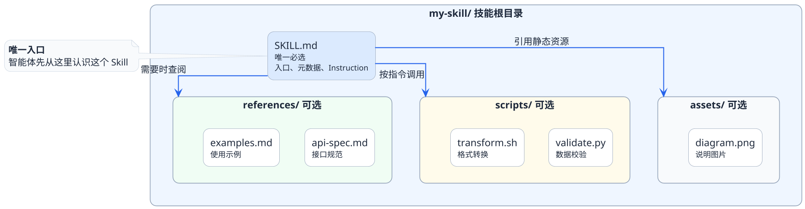

import VipInline from '@site/src/components/VipInline';

# Skills目录结构全景图

上一篇我们聊到，Agent Skills本质上是一种"按需取用的能力模块"。那这个模块在物理层面到底长什么样呢？

答案可能会让你有点意外——**它就是一个文件夹**。

没有复杂的配置中心，没有什么注册发现服务，也不需要额外的运行时框架。一个Skill就是一个符合约定结构的目录，放到指定位置，智能体就能识别和使用它。

为什么要用这么"朴素"的方式？原因其实也很简单了：

- **零依赖**：不需要安装任何额外的工具链，任何编辑器都能创建和修改
- **版本友好**：文件夹天然适合Git管理，团队协作和版本追踪毫无阻碍
- **可移植性强**：复制粘贴就能把一个技能从项目A搬到项目B
- **透明可审计**：所有内容都是纯文本，打开就能看到技能里写了什么

:::info 设计哲学
Agent Skills选择文件夹作为载体，背后的理念是：**让能力管理回归到最简单的形式，降低使用门槛，同时保持最大的灵活性。**
:::

## 一个完整Skill长什么样

直接上结构，一个典型的Skill目录是这样的：

用一句话概括每个部分：

| 组件 | 是否必选 | 一句话说明 |
|------|---------|-----------|
| **SKILL.md** | 必选 | 技能的身份证+操作手册，是整个Skill的灵魂 |
| **references/** | 可选 | 补充性的参考资料库，需要时才打开翻阅 |
| **scripts/** | 可选 | 确定性执行的脚本工具箱，关键步骤靠代码保底 |
| **assets/** | 可选 | 图片、配置模板等静态资源文件 |

接下来我们逐个拆开看。

<VipInline />
