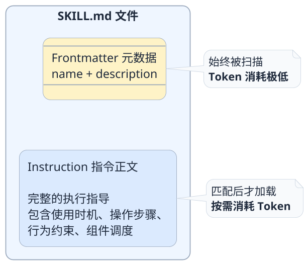

import VipInline from '@site/src/components/VipInline';

# SKILL.md核心配置深度剖析

上一篇我们看了整个Skill的目录结构，知道了SKILL.md是唯一的必选文件。但"必选"这两个字背后的分量远不止于此——**一个Skill好不好用，90%取决于SKILL.md写得怎么样**。

你可以把references、scripts想象成一个战士的装备和武器，而SKILL.md就是这个战士的大脑和经验。武器再好，如果脑子不清楚什么时候用什么武器、该用什么战术，战斗力一样上不去。

所以这一篇，我们把SKILL.md掰开揉碎，从结构到写法到踩坑经验，全面覆盖地来梳理一下。

## SKILL.md的两层结构

一个SKILL.md文件，从上到下分成两个截然不同的区域：

这两层之间的分界线就是三个短横线`---`。上面是门面，下面是内功。我们分别来讲。

<VipInline />
