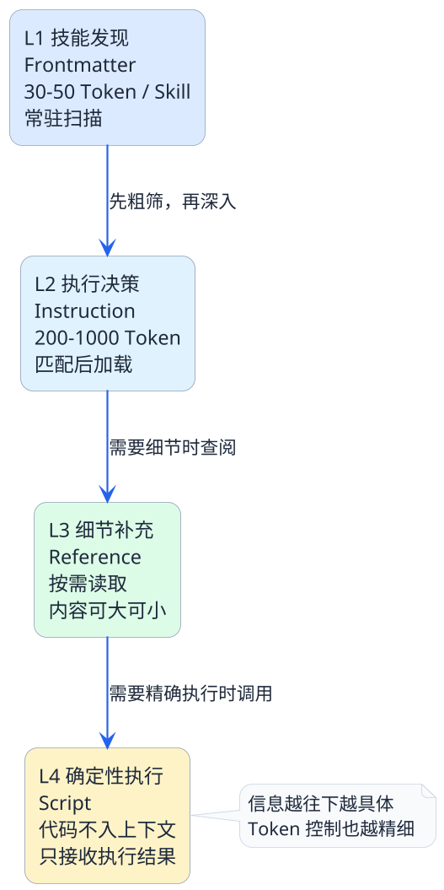

import VipInline from '@site/src/components/VipInline';

# 四层渐进式加载机制揭秘

去图书馆借书的时候，你不会一进门就把所有书搬到桌上。正常的流程是这样的：

1. **先翻目录卡片**：扫一眼每本书的标题和简介，看哪些跟你今天要查的主题相关
2. **把相关的书借出来**：拿到桌上翻开，按照目录和章节结构去读你需要的部分
3. **遇到不懂的术语再查工具书**：从参考书架上拿来某本字典或百科全书，查到了就放回去
4. **需要复印的交给自助复印机**：你不用理解复印机的工作原理，按个按钮等结果就行

你看，整个过程是**逐步深入、按需获取**的。你不会一口气把图书馆搬空，也不会在查资料之前先通读所有字典。

Agent Skills的四层渐进式加载，就是这个逻辑。

## 什么是渐进式加载

渐进式加载（Progressive Disclosure）这个概念最早来自UI设计领域——不要一开始就把所有选项和功能全摆出来，而是根据用户当前的操作阶段，逐步展示更多细节。

在Agent Skills里，渐进式加载解决的是一个非常具体的工程问题：

:::info 核心问题
**怎么让智能体在需要的时候得到足够的信息，同时在不需要的时候不被多余信息干扰？**

这个问题的本质就是上下文Token的精细化管理。
:::

Agent Skills把信息按照"被需要的迫切程度"划分成四层，每层对应一个独立的加载阶段。我们来一层一层看。

<VipInline />
