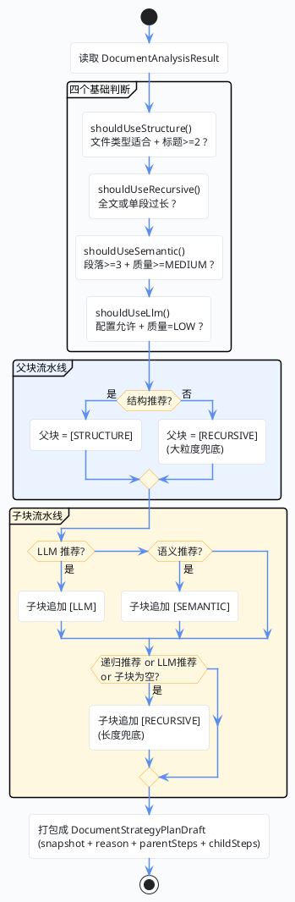

import VipInline from '@site/src/components/VipInline';

# 策略推荐与方案持久化

上一篇走完了解析结果统计和异步收尾工作，任务阶段已经推进到了 `STRATEGY_ROUTE`。现在进入 `handleParseRoute` 的最后一段：拿到解析结果和结构节点之后，系统要自动推荐一套切块策略，然后把方案写进数据库。

## 策略推荐决策流程

先看一张决策流程图，理解整个推荐逻辑的走向：



## recommendStrategy：策略推荐核心方法

这个方法在 `DocumentStrategyServiceImpl` 里，它不执行切块，而是回答一个更上游的问题：**"对于这份文档，后续索引构建时应该采用怎样的 Parent/Child 切块流水线？"**

### 四个基础判断

```java
@Override
public DocumentStrategyPlanDraft recommendStrategy(SuperAgentDocument document,
                                                   DocumentAnalysisResult analysisResult) {

    List<String> reasonList = new ArrayList<>();
    // fileType 会参与结构切块判断，因为并不是所有文件格式都天然适合结构识别。
    DocumentFileTypeEnum fileType = DocumentFileTypeEnum.getRc(document.getFileType());

    // 这四个布尔判断是后续整套推荐的"基础事实层"。
    // 它们并不直接生成步骤，而是回答"这份文档在切块上有哪些客观特征和风险"。
    boolean structureRecommended = shouldUseStructure(fileType, analysisResult);
    boolean recursiveRecommended = shouldUseRecursive(analysisResult);
    boolean semanticRecommended = shouldUseSemantic(analysisResult);
    boolean llmRecommended = shouldUseLlm(analysisResult);
```

我们逐个看这四个判断方法：

<VipInline />
