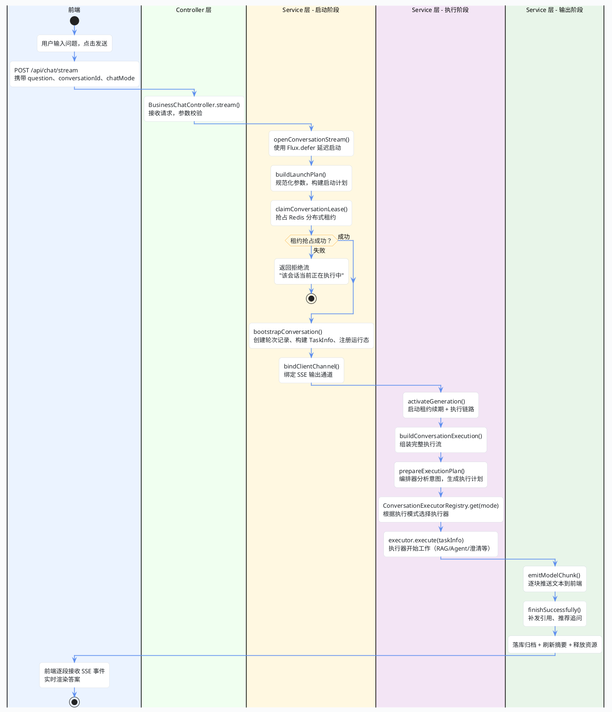

import VipInline from '@site/src/components/VipInline';

# 从用户提问到答案返回的总流程

这篇文档会把 Super Agent 聊天系统后端的完整链路拆开来讲，从用户点击"发送"的那一刻开始，一直到答案流式输出到前端、最后落库收尾为止。每个关键步骤都会贴出对应的源码，加上注释说明它在整条链路里的作用。

看完这篇，你会对"一个问题是怎么从 Controller 一路走到模型输出再回到前端"有一个完整的认知。

## 总流程概览

先看一张全局流程图，对整条链路有个直观印象：

接下来我们按照这张图的顺序，逐步拆解每个阶段的源码。

## 入口：Controller 接收请求

一切从前端的 POST 请求开始。前端把用户的问题、会话 ID、聊天模式等信息打包成 `ChatRequestDto`，发到 `/api/chat/stream` 接口。

<VipInline />
