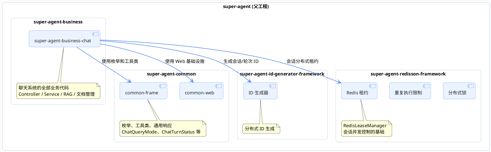
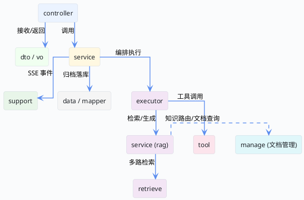

import VipInline from '@site/src/components/VipInline';

# 前后端模块划分与调用关系

这篇文档聚焦后端部分，把 Super Agent 的 Maven 模块划分、聊天业务的包结构、各层核心类的职责和调用关系都理清楚。看完之后，你拿到任何一个类名，都能快速定位它在整个架构中的位置和作用。

## Maven 模块总览

Super Agent 后端采用多模块 Maven 结构，每个模块有明确的职责边界：



| 模块 | 职责 |
| :--- | :--- |
| `super-agent-common` | 通用基础设施：枚举定义（`ChatQueryMode`、`ChatTurnStatus`）、工具类、统一响应封装 |
| `super-agent-id-generator-framework` | 分布式 ID 生成，为会话和轮次提供全局唯一标识 |
| `super-agent-redisson-framework` | Redis 相关能力：分布式锁、重复执行限制、**会话租约管理**（`RedisLeaseManager`） |
| `super-agent-business-chat` | 聊天系统的全部业务代码，是最核心的模块 |

## 聊天业务包结构

`super-agent-business-chat` 是整个聊天系统的核心，内部按职责划分成多个包。下面这张图展示了包之间的层次关系：



### 各包职责详解

下面逐个说明每个包里装了什么、负责什么：

**controller —— 请求入口**

只有一个类 `BusinessChatController`，负责接收前端 HTTP 请求、参数校验，然后转交给 Service 层。这一层不做任何业务逻辑。

```java
// 控制器只做两件事：接参数、转交 Service
@RestController
@RequestMapping("/api/chat")
public class BusinessChatController {
    private final BusinessChatService businessChatService;

    @PostMapping(value = "/stream", produces = "text/event-stream;charset=UTF-8")
    public Flux<String> stream(@Valid @RequestBody ChatRequestDto dto) {
        return businessChatService.openConversationStream(dto);
    }
    // 还有 stop、reset、session 等接口...
}
```

**dto / vo —— 数据传输**

- `dto` 包：前端传入的请求参数，比如 `ChatRequestDto`（问题、会话 ID、聊天模式）
- `vo` 包：返回给前端的响应结果，比如 `ConversationStopVo`、`ConversationResetVo`

**service —— 业务核心**

这是整个聊天系统最重要的包

<VipInline />
