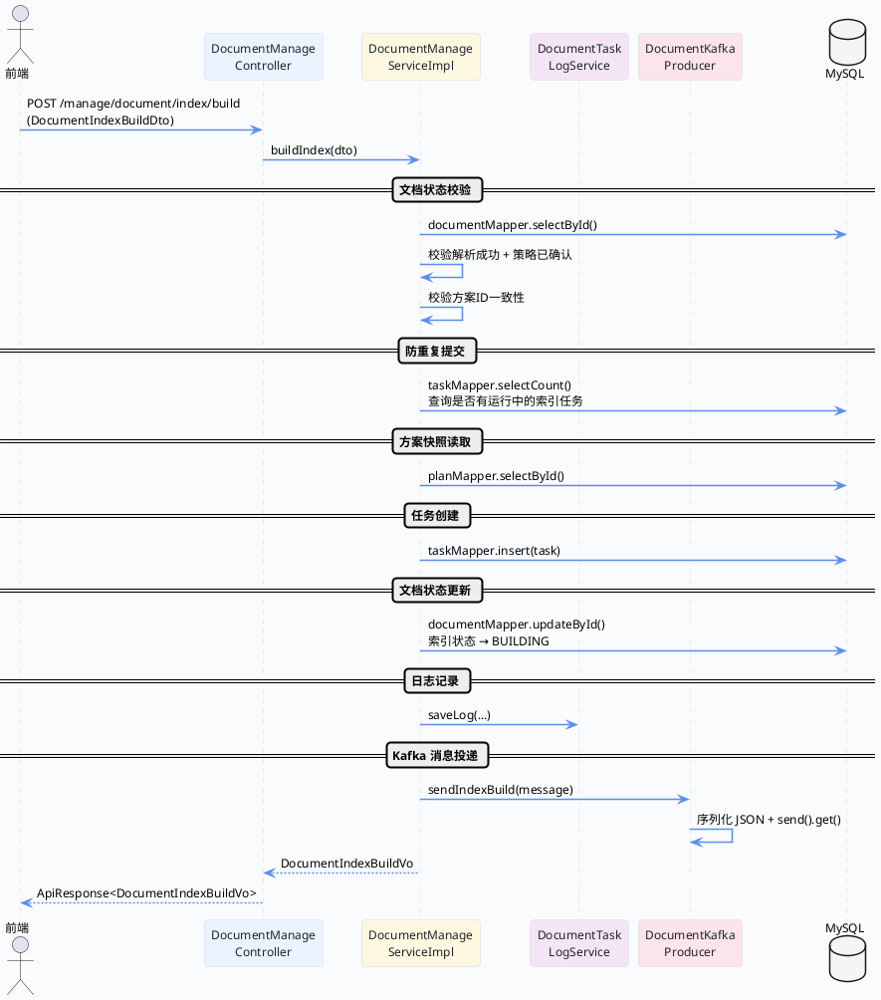

import VipInline from '@site/src/components/VipInline';

# 索引构建入口与Kafka消息投递

这篇文档讲的是：用户在页面上点击"构建索引"之后，后端同步做了哪些事情？从 Controller 接到请求开始，一直到把消息丢进 Kafka 队列，整条同步链路我们一步步拆开来看。


先上一张总览流程图，有个整体印象之后再逐段看源码。

## 同步链路总览



## Controller 层：接收构建请求

入口非常简单，就是一个标准的 POST 接口，接收前端传过来的 `DocumentIndexBuildDto`，然后直接委托给 Service 层处理。

```java
//DocumentManageController.java
@Operation(summary = "执行文档索引构建")
@PostMapping("/index/build")
public ApiResponse<DocumentIndexBuildVo> buildIndex(@Valid @RequestBody DocumentIndexBuildDto dto) {
    return ApiResponse.ok(documentManageService.buildIndex(dto));
}
```

请求参数也很简洁，就三个字段：

```java
//DocumentIndexBuildDto.java
@Data
public class DocumentIndexBuildDto {

    @NotNull(message = "文档id不能为空")
    private Long documentId;

    @NotNull(message = "方案id不能为空")
    private Long planId;

    private Long operatorId;
}
```

- `documentId`：要构建索引的文档 ID
- `planId`：当前生效的策略方案 ID
- `operatorId`：操作人 ID，可以为空（为空表示系统自动触发）

## Service 层：校验 + 建任务 + 投递消息

<VipInline />