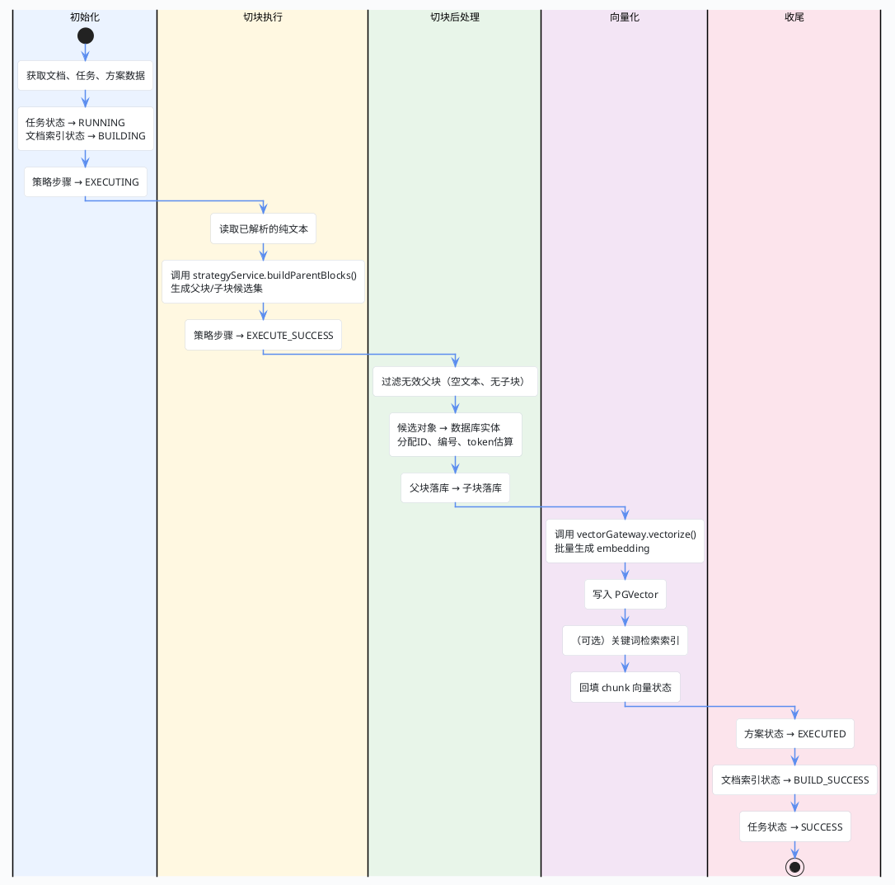

import VipInline from '@site/src/components/VipInline';

# 异步索引构建：初始化与切块执行

上一篇我们看到，同步链路最后把消息丢进了 Kafka。这篇我们来看消费端拿到消息之后，到底做了什么——这才是索引构建的真正核心。

`handleIndexBuild()` 方法是整个异步链路的主控方法，它会串行推进多个阶段。这篇先讲前两个阶段：初始化和切块执行。先看一张全景图：

## 异步执行全景图



## 阶段一：初始化

方法一进来，先把三个核心数据拿到手：文档、任务、策略方案。任何一个缺失都直接退出。同时还会预先读取并排序策略步骤：

**DocumentAsyncProcessServiceImpl.java — handleIndexBuild()**

```java
// 先取出索引构建链路必需的三类核心数据：文档、任务、策略方案。
// 任意一个缺失都说明这条异步消息已经失去执行基础，直接记录告警并退出。
SuperAgentDocument document = documentMapper.selectById(documentId);
SuperAgentDocumentTask task = taskMapper.selectById(taskId);
SuperAgentDocumentStrategyPlan plan = planMapper.selectById(planId);
if (document == null || task == null || plan == null) {
    log.warn("索引任务对应的数据不存在，documentId={}, taskId={}, planId={}",
        documentId, taskId, planId);
    return;
}
```

然后把任务推进到运行态，同时更新文档和策略步骤的状态：

**DocumentAsyncProcessServiceImpl.java — listSteps()**

```java
private List<SuperAgentDocumentStrategyStep> listSteps(Long planId) {
    List<SuperAgentDocumentStrategyStep> stepList = stepMapper.selectList(
        new LambdaQueryWrapper<SuperAgentDocumentStrategyStep>()
            .eq(SuperAgentDocumentStrategyStep::getPlanId, planId)
            .eq(SuperAgentDocumentStrategyStep::getStatus, BusinessStatus.YES.getCode()));
    return stepList.stream()
        .sorted(Comparator
            .comparingInt((SuperAgentDocumentStrategyStep step) -> pipelineOrder(step.getPipelineType()))
            .thenComparing(SuperAgentDocumentStrategyStep::getStepNo)
            .thenComparing(SuperAgentDocumentStrategyStep::getId))
        .toList();
}
```

排序规则是：先父流水线、再子流水线；同一流水线内按 stepNo 升序，最后再按主键兜底。这样保证后续切块执行时步骤顺序是稳定的。

<VipInline />