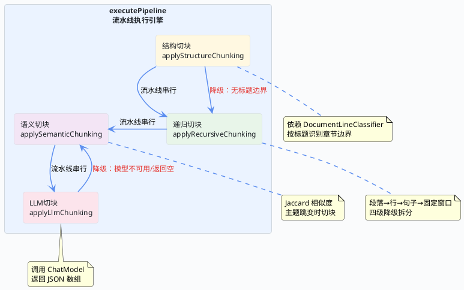

import VipInline from '@site/src/components/VipInline';

# 四种切块策略详解

上一篇我们看到，不管是父块还是子块，最终都会走到 `executePipeline()` 这个流水线执行引擎。这篇我们就深入这个引擎内部，逐个拆解结构切块、递归切块、语义切块、LLM 切块四种策略的完整实现。

先上一张四种策略的全景关系图：

## 策略全景与降级关系



:::info 流水线串行 vs 降级
这张图里有两种说明。

串行：方案里配了哪些步骤，就按顺序依次执行，前一步的输出是后一步的输入。

降级：某种策略在执行过程中发现自己无法产出有效结果时，会自动退回到另一种策略兜底。这两种机制是独立的，降级发生在单个策略内部，不影响流水线的整体推进。
:::

## executePipeline：流水线执行引擎

这是所有切块策略的调度中心。它接收一组候选块和一组有序的策略步骤，然后按顺序逐步执行，每一步的输出作为下一步的输入。

**DocumentStrategyServiceImpl.java — executePipeline()**

```java
private List<ChunkCandidate> executePipeline(List<ChunkCandidate> sourceList,
                                             List<SuperAgentDocumentStrategyStep> orderedSteps,
                                             DocumentStrategyPipelineTypeEnum pipelineType) {
    // 进入流水线前先清洗一次输入，保证每一步面对的都是可用候选块。
    List<ChunkCandidate> currentChunks = cleanupChunkList(sourceList);
    for (SuperAgentDocumentStrategyStep step : orderedSteps) {
        DocumentStrategyTypeEnum strategyType = DocumentStrategyTypeEnum.getRc(step.getStrategyType());
        if (strategyType == null) {
            continue;
        }
        // 根据策略类型分派到对应切块器：结构、递归、语义、LLM。
        currentChunks = switch (strategyType) {
            case STRUCTURE -> applyStructureChunking(currentChunks, pipelineType);
            case RECURSIVE -> applyRecursiveChunking(currentChunks, pipelineType);
            case SEMANTIC -> applySemanticChunking(currentChunks, pipelineType);
            case LLM -> applyLlmChunking(currentChunks, pipelineType);
        };
        // 每一步执行完立刻清洗，保证下游步骤不会处理无效或重复块。
        currentChunks = cleanupChunkList(currentChunks);
    }
    return cleanupChunkList(currentChunks);
}
```

这个方法的设计非常简洁，但有几个关键点：

1. **三次清洗**：进入前清洗一次、每步执行后清洗一次、最终返回前再清洗一次。`cleanupChunkList()` 会去掉空文本块和重复块，保证每一步拿到的都是干净数据
2. **switch 分派**：用 Java 17 的 switch 表达式按策略类型分派，四种策略各自独立实现，互不耦合
3. **流水线语义**：前一步的输出就是后一步的输入。比如方案配了"结构切块 → 递归切块"，那结构切块产出的章节块会作为递归切块的输入，递归切块再把超长的章节块切成更小的片段
4. **pipelineType 透传**：父块流水线和子块流水线共用同一个引擎，通过 `pipelineType` 参数区分，各策略内部会根据这个参数选择不同的阈值（比如父块的 maxChars 通常比子块大）

<VipInline />