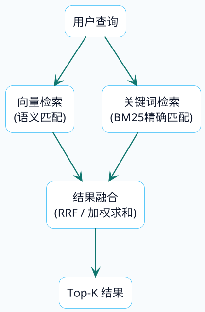

# 混合检索：语义+关键词双保险

## 向量检索翻车现场

前面几篇一直在说向量检索有多好——能理解语义、能处理同义词、能跨语言匹配。但真正跑起来，有些场景会让你怀疑人生。

假设你在维护一个运维知识库，工程师问：`ERROR-50032 连接池耗尽怎么处理？`

向量检索返回的结果：

- 数据库连接池配置最佳实践
- 连接泄漏排查思路
- HikariCP参数调优指南
- 数据库高可用架构设计
- 连接超时问题处理

看起来都和"连接池"相关，但没有一个直接包含错误码`ERROR-50032`。向量检索把问题理解成了"连接池相关的东西"，完美避开了那个最关键的错误码。

如果知识库里恰好有一条："ERROR-50032：连接池耗尽，通常由慢SQL导致连接未及时释放引起，解决方案是..."——关键词检索能直接命中，向量检索却可能把它排到很后面。

再来一个。用户问：`2026年Q1的OKR模板在哪下载？`

向量检索返回一堆OKR相关的通用文档，但不一定优先返回包含"2026年Q1"这个精确时间的那条。数字、日期、编号这类精确信息，向量检索天然不敏感。

:::warning 向量检索的系统性盲区
向量检索对精确关键词不敏感不是配置问题，而是设计上的取舍。错误码、工单编号、版本号、产品型号、人名等精确标识符，向量检索往往无法准确命中。在运维日志、客服工单、技术文档等场景，纯向量检索会有明显的召回缺失。
:::

## 两种检索的互补关系

把向量检索和关键词检索放在一起看，它们的优劣刚好互补：

| 维度 | 向量检索（语义检索） | 关键词检索（BM25） |
| :--- | :--- | :--- |
| 擅长 | 语义理解、同义词、意图匹配 | 精确关键词、专有名词、数字编号 |
| 典型query | "数据库连接老是断怎么办"（同义词） | "ERROR-50032"（精确匹配） |
| 短板 | 对精确关键词不敏感 | 无法理解语义，同义词匹配不上 |
| 底层原理 | 文本转向量，计算语义距离 | 统计词频和文档频率，计算关键词权重 |
| 计算成本 | 高（需要调用Embedding模型） | 低（纯统计计算） |

它们不是谁替代谁的关系，而是互补的。混合检索就是把两者结合起来——用向量检索理解语义，用关键词检索补充精确匹配。

## BM25：关键词检索的核心算法

BM25（Best Matching 25）是搜索引擎的默认排序算法，Elasticsearch、Milvus 2.5+都在用。理解它的原理有助于你调优混合检索的效果。

### 三个核心因素

BM25在给文档打分时考虑三件事：

**词频（TF）：出现越多越相关，但有天花板**

如果一个文档里"连接池"出现了8次，另一个只出现1次，前者大概率更相关。但BM25对词频做了饱和处理——从1次到5次，分数涨得快；从5次到50次，分数涨得慢。这样可以防止某些文档靠堆砌关键词刷分。

**逆文档频率（IDF）：越稀有的词越有区分度**

"的"、"是"、"在"这些词到处都有，出现了也说明不了什么。但"ERROR-50032"、"HikariCP"这种词很稀有，出现在哪个文档里，哪个文档就很可能是你要找的。BM25会给稀有词更高的权重。

**文档长度归一化：长文档不能占便宜**

一个5000字的文档里出现"连接池"的概率天然比500字的文档高，但这不代表它更相关。BM25会根据文档长度做归一化，让长短文档站在同一起跑线上。

### BM25 vs 向量检索的典型差异

用一个具体例子感受一下。假设知识库里有这些文档：

```
文档A：ERROR-50032 连接池耗尽处理方案：检查慢SQL、调整maxPoolSize...
文档B：数据库连接池是应用和数据库之间的桥梁，合理配置连接池参数...
文档C：HikariCP是目前性能最好的Java连接池实现，推荐配置...
```

用户问：`ERROR-50032 连接池耗尽`

- BM25会把文档A排第一（精确匹配了"ERROR-50032"这个稀有词）
- 向量检索可能把文档B或C排前面（语义上都和"连接池"相关）

用户问：`数据库连接老是断开怎么办`

- 向量检索能理解"老是断开"和"连接池耗尽"语义相近，可能命中文档A
- BM25匹配不上，因为"老是断开"和文档里的用词完全不同

这就是为什么需要混合检索——两种检索各有擅长的场景，结合起来才能覆盖更多情况。

## 混合检索的架构方案

混合检索的基本思路很简单：同一个查询同时走向量检索和关键词检索两条路，然后把两路结果融合成一个最终排序。



关键词检索部分有两种实现方式：

### 方案一：Milvus 2.5+ 原生混合检索（推荐）

Milvus从2.5版本开始内置了BM25全文检索能力，一个系统同时搞定向量检索和关键词检索。

优点：架构简单，数据不用双写，原生支持RRF融合，运维成本低。

缺点：全文检索能力相比ES偏基础，中文分词能力有限。

### 方案二：Elasticsearch + 向量数据库双系统

ES负责关键词检索，Milvus/PGVector负责向量检索，应用层做结果融合。

优点：ES的全文检索能力成熟强大，中文分词生态好（IK分词器等）。

缺点：需要维护两套系统，数据双写有一致性问题，融合逻辑需要自己实现。

**怎么选**：大多数RAG场景用Milvus原生方案就够了。如果对中文分词有高要求，或者已有ES基础设施，再考虑双系统方案。

## RRF：最简单有效的融合策略

两路检索的结果怎么合并？最大的难题是分数不在同一个尺度上——向量检索返回的是余弦相似度（0 - 1），BM25返回的是相关性分数（0 - 正无穷），直接相加没有意义。

RRF（Reciprocal Rank Fusion，倒数排名融合）巧妙地绕过了这个问题——它不看分数，只看排名。

### RRF的计算方式

对于某个文档d，它的RRF分数是：

```
RRF(d) = Σ 1 / (k + rank_i(d))
```

- `rank_i(d)` 是文档d在第i路检索中的排名（从1开始）
- `k` 是平滑常数，通常取60
- 对所有检索路求和

**走一个具体例子**。假设向量检索返回 [A, B, C, D]，关键词检索返回 [C, A, E, B]：

| 文档 | 向量排名 | 关键词排名 | RRF分数（k=60） | 说明 |
| :--- | :--- | :--- | :--- | :--- |
| A | 1 | 2 | 1/61 + 1/62 = 0.0325 | 两路都靠前 |
| C | 3 | 1 | 1/63 + 1/61 = 0.0323 | 两路都靠前 |
| B | 2 | 4 | 1/62 + 1/64 = 0.0317 | 两路都有 |
| D | 4 | - | 1/64 = 0.0156 | 只在向量检索中 |
| E | - | 3 | 1/63 = 0.0159 | 只在关键词检索中 |

最终排序：A > C > B > E > D

A和C排到最前面，因为它们在两路检索中都排名靠前——这正是混合检索想要的效果。

### 为什么RRF效果好

- 不需要做分数归一化，避免了归一化带来的偏差
- 对异常高分不敏感，鲁棒性强
- 实现简单，好调试好解释
- 学术界和工业界都验证过效果，是混合检索的事实标准

## Milvus原生混合检索实战

下面用Java代码演示Milvus 2.5+的原生混合检索，包含Schema创建、数据插入、三种检索模式对比。

### Schema设计

混合检索需要两个向量字段：一个存密集向量（Embedding），一个存稀疏向量（BM25自动生成）。

```java
// 创建Schema
CreateCollectionReq.CollectionSchema schema = client.createSchema();

// 主键
schema.addField(AddFieldReq.builder()
        .fieldName("id").dataType(DataType.Int64)
        .isPrimaryKey(true).autoID(true).build());

// 原始文本（开启分词器，用于BM25）
schema.addField(AddFieldReq.builder()
        .fieldName("text").dataType(DataType.VarChar)
        .maxLength(8192).enableAnalyzer(true).build());

// 密集向量（Embedding模型生成）
schema.addField(AddFieldReq.builder()
        .fieldName("text_dense").dataType(DataType.FloatVector)
        .dimension(4096).build());

// 稀疏向量（BM25 Function自动生成）
schema.addField(AddFieldReq.builder()
        .fieldName("text_sparse").dataType(DataType.SparseFloatVector)
        .build());

// 注册BM25函数：输入text字段，自动生成text_sparse
schema.addFunction(Function.builder()
        .functionType(FunctionType.BM25)
        .name("text_bm25_emb")
        .inputFieldNames(List.of("text"))
        .outputFieldNames(List.of("text_sparse"))
        .build());
```

关键点：`text`字段开启了`enableAnalyzer(true)`，Milvus会自动对它做分词；`text_sparse`字段通过BM25 Function自动从`text`生成，不需要手动计算。

### 三种检索模式

```java
/** 纯向量检索 */
private SearchResp denseSearch(MilvusClientV2 client, String query)
        throws IOException {
    List<Float> queryVec = getEmbedding(query);
    return client.search(SearchReq.builder()
            .collectionName(COLLECTION)
            .annsField("text_dense")
            .data(Collections.singletonList(new FloatVec(queryVec)))
            .topK(8)
            .outputFields(List.of("text"))
            .build());
}

/** 纯BM25检索 */
private SearchResp sparseSearch(MilvusClientV2 client, String query) {
    return client.search(SearchReq.builder()
            .collectionName(COLLECTION)
            .annsField("text_sparse")
            .data(Collections.singletonList(new EmbeddedText(query)))
            .topK(8)
            .outputFields(List.of("text"))
            .build());
}

/** 混合检索：Dense + Sparse，RRF融合 */
private SearchResp hybridSearch(MilvusClientV2 client, String query)
        throws IOException {
    List<Float> queryVec = getEmbedding(query);

    // 向量检索请求
    AnnSearchReq denseReq = AnnSearchReq.builder()
            .vectorFieldName("text_dense")
            .vectors(Collections.singletonList(new FloatVec(queryVec)))
            .topK(20)
            .build();

    // BM25检索请求（直接传原文，Milvus自动分词）
    AnnSearchReq sparseReq = AnnSearchReq.builder()
            .vectorFieldName("text_sparse")
            .vectors(Collections.singletonList(new EmbeddedText(query)))
            .topK(20)
            .build();

    // RRF融合
    return client.hybridSearch(HybridSearchReq.builder()
            .collectionName(COLLECTION)
            .searchRequests(List.of(denseReq, sparseReq))
            .ranker(new RRFRanker(60))  // k=60
            .topK(8)
            .outFields(List.of("text"))
            .build());
}
```

注意`EmbeddedText`——直接传原始文本，Milvus会自动分词并计算BM25分数，不需要你手动处理。

### 效果对比

用query "ERROR-50032 连接池耗尽"测试三种模式：

**纯向量检索**：返回了所有和"连接池"语义相关的文档，但包含ERROR-50032的那条排在第3位。

**纯BM25检索**：只返回了1条结果——精确包含"ERROR-50032"的那条。其他文档因为词汇重叠太少被过滤了。

**混合检索**：Top-1精确命中了包含ERROR-50032的文档（BM25的贡献），Top-2到Top-5保留了向量检索的语义排序。Top-1的RRF分数显著高于Top-2，因为它在两路检索中都排名靠前。

:::info 混合检索的优势在大数据量下更明显
小数据集下三种模式的Top-1可能一样。但当数据量达到数万甚至数百万条时，纯向量检索容易把语义相近但不相关的结果排到前面，纯BM25容易漏掉措辞不同但语义相关的结果，混合检索的互补优势会更加显著。
:::

## Spring AI + Elasticsearch实现混合检索

如果你选择ES + 向量数据库的双系统方案，需要自己实现融合逻辑。下面是基于Spring AI的实现思路。

### 核心流程

```java
@GetMapping("/hybridChat")
public String hybridChat(@RequestParam String query) throws Exception {
    // 1. 向量检索
    List<Document> vectorDocs = vectorStore.similaritySearch(
        SearchRequest.builder().query(query).topK(5).build()
    );

    // 2. ES关键词检索
    List<EsDocumentChunk> keywordDocs =
        esService.searchByKeyword(query, 5, true);

    // 3. RRF融合
    List<String> merged = rrfFusion(vectorDocs, keywordDocs, 5);

    // 4. 构建Prompt，调用大模型
    String context = String.join("\n\n---\n\n", merged);
    String prompt = """
        基于以下参考文档回答用户问题。
        如果没有相关信息，请说明。

        参考文档：
        %s

        用户问题：%s
        """.formatted(context, query);

    return chatClient.prompt(prompt).call().content();
}
```

### RRF融合实现

```java
private List<String> rrfFusion(List<Document> vectorDocs,
        List<EsDocumentChunk> keywordDocs, int topK) {
    final int K = 60;
    Map<String, Double> scores = new HashMap<>();
    Map<String, String> idToContent = new HashMap<>();

    // 向量检索结果打分
    for (int i = 0; i < vectorDocs.size(); i++) {
        Document doc = vectorDocs.get(i);
        String id = doc.getId();
        idToContent.putIfAbsent(id, doc.getText());
        scores.merge(id, 1.0 / (K + i + 1), Double::sum);
    }

    // 关键词检索结果打分
    for (int i = 0; i < keywordDocs.size(); i++) {
        EsDocumentChunk doc = keywordDocs.get(i);
        String id = doc.getId();
        idToContent.putIfAbsent(id, doc.getContent());
        scores.merge(id, 1.0 / (K + i + 1), Double::sum);
    }

    // 按RRF分数降序排序，取topK
    return scores.entrySet().stream()
            .sorted(Map.Entry.<String, Double>comparingByValue().reversed())
            .limit(topK)
            .map(e -> idToContent.get(e.getKey()))
            .filter(Objects::nonNull)
            .collect(Collectors.toList());
}
```

## 检索策略选型建议

| 场景 | 推荐方案 | 理由 |
| :--- | :--- | :--- |
| 数据量小，query都是自然语言 | 纯向量检索 | 简单够用，成本低 |
| query经常包含编号、型号、专有名词 | 混合检索 | 关键词检索补充精确匹配 |
| 对中文分词要求高 | ES + 向量数据库 | ES的IK分词器更成熟 |
| 想要架构简单、快速上线 | Milvus 2.5+原生方案 | 一个系统搞定，运维成本低 |
| 已有ES基础设施 | ES + 向量数据库 | 利用现有基础设施 |

## 小结

混合检索通过向量检索和关键词检索的双路并行，解决了单一检索模式的结构性短板：

- 向量检索负责语义理解，处理同义词、模糊表达
- 关键词检索负责精确匹配，处理编号、型号、专有名词
- RRF融合把两路结果按排名合并，不需要复杂的分数归一化

在实际项目中，混合检索是生产环境的推荐方案。它的实现成本不高（Milvus 2.5+原生支持），但对检索质量的提升很明显，特别是在query包含精确关键词的场景。

下一篇讲重排序——召回了一堆候选结果，怎么把最相关的几个挑出来排到最前面。
