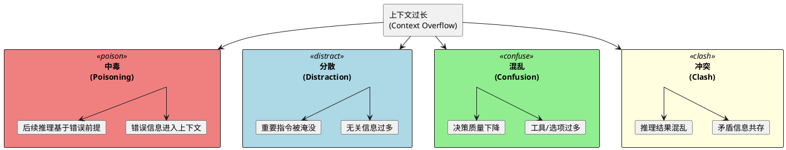
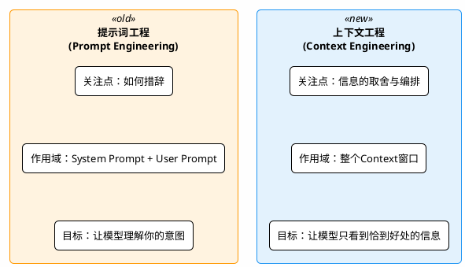
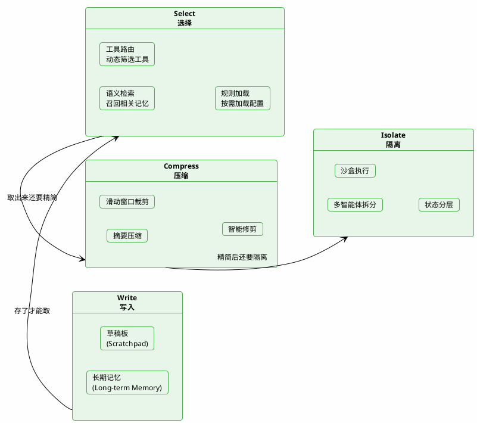

# 上下文爆炸与工程方法

前面聊了AI记忆的真相和核心概念。但有个问题一直没展开说——**上下文太长，真的只是费钱的问题吗？**

答案是：远不止于此。

上下文过长不仅会导致Token爆炸、超出窗口限制，更棘手的是会让模型的输出质量**显著下降**。今天就来聊聊上下文膨胀带来的四大隐患，以及一套系统性的解决方案：上下文工程。

## 从一次"离谱"的推荐说起

假设你搭建了一个智能旅行助手，接入了RAG知识库，还挂了天气查询、机票搜索等十几个工具。测试的时候一切正常，上线后用户反馈：

> "我问它杭州三日游怎么安排，它给我推荐了一个南极探险行程……而且信誓旦旦地说杭州西湖冬天会结冰可以滑冰。"

你一查日志，发现：RAG召回了一篇关于"冰雪旅游"的文章（因为用户提到了"冬天"），模型把这篇内容当真了，还和十几个不相关的工具描述搅在一起，彻底跑偏了。

这就是典型的**上下文过载**问题——塞给模型的信息太多、太杂，模型反而"翻车"了。

## 一个重要的研究发现：Lost in the Middle

早在2023年，就有研究团队发现了一个有趣的现象。

论文标题叫《Lost in the Middle: How Language Models Use Long Contexts》，翻译过来就是"迷失在中间：语言模型如何使用长上下文"。

研究人员通过一系列实验发现：**当前的语言模型在长上下文中对信息的位置非常敏感，往往更关注开头和结尾的内容，而忽略中间部分的信息**。

主要结论：

| 结论 | 说明 |
|------|------|
| 位置偏差显著 | 几乎所有模型在关键信息位于开头或结尾时表现最好，中间位置时性能急剧下降 |
| 更长≠更好 | 即使模型声称支持超长上下文（如32K Token），实际有效利用信息的能力并未线性提升 |
| 微调效果有限 | 尽管一些模型经过专门的长上下文微调，仍未完全克服位置偏差 |

简单说就是：你把重要信息塞在上下文中间，模型很可能会"忽略"它。

## 上下文过载的四种"翻车"模式

在实际的Agent开发中，上下文过长带来的问题远不止"记不住中间"，至少有四种典型的"翻车"模式。

### 翻车模式一：上下文中毒（Context Poisoning）

**什么情况？** 一条错误信息混进了上下文，模型把它当成事实，后续所有推理都跟着错。

就像喝了毒水还以为是矿泉水，一口下去，后面全完蛋。

这种情况在多轮对话中特别容易出现：模型在第3轮生成了一个"幻觉"（比如编造了一个不存在的景点），这条回复被存入对话历史。到了第7轮，模型回头看历史时，会把自己之前编的内容当成已确认的事实继续引用。

**举个例子**：

用户问"昆明有什么冷门但值得去的古镇"，模型编了一个"翠云古镇"（实际不存在）。几轮之后用户问"翠云古镇的门票多少钱"，模型不会承认这是自己编的，反而会继续编造一个票价——因为在它的上下文里，"翠云古镇"已经是一个"已知事实"了。

:::warning 警惕
错误信息一旦进入上下文就会"自我强化"——模型不但不会纠正，还会基于错误前提继续推理，让错误像滚雪球一样越来越大。
:::

### 翻车模式二：上下文分散（Context Distraction）

**什么情况？** 上下文里信息量太大、太杂，模型的注意力被无关内容分散，反而忽略了真正重要的指令。

Gemini 2.5的技术报告提到过一个实验结论：**当上下文超过32K Token后，模型效果开始下降。超过100K Token后，Agent不再对当前情况做独立推理，而是去历史记录中找类似的模式照搬，导致表现严重退化。**

**举个例子**：

你让旅行助手推荐一个"安静的度假地点"，但Context里同时塞了：上一轮聊的美食清单、RAG召回的三篇长文、8个工具的详细描述、一段关于签证政策的补充说明……模型处理完这一大堆内容后，可能会跑去聊美食或者签证，把"推荐安静的度假地"这个核心诉求丢到一边。

**形象类比**：就像你在图书馆复习考试，桌上堆了二十本书、手机还在放视频——你不是不会做题，而是根本集中不了注意力。

### 翻车模式三：上下文混乱（Context Confusion）

**什么情况？** 上下文里的工具、选项太多，模型选择困难，要么犹豫不决，要么选错。

这个问题在MCP工具集成场景中特别突出。当你给Agent挂了几十个工具，即使大部分和当前任务无关，它们的描述文本都会占据上下文空间，干扰模型的决策。

**有研究表明：把可用工具从46个缩减到19个，Agent的任务成功率显著提升。**

**举个例子**：

用户问"明天北京天气怎么样"，理论上应该调用天气查询工具。但如果上下文里同时列了天气查询、航班搜索、酒店预订、汇率换算、新闻搜索、地图导航等30多个工具，模型可能会犹豫——要不要也搜一下航班？要不要顺便推荐酒店？最后要么调错工具，要么什么都调一遍，效率极低。

**形象类比**：让一个厨师在100把刀具中选一把来切菜——工具太多，选择成本反而压过了执行成本。

### 翻车模式四：上下文冲突（Context Clash）

**什么情况？** 上下文里同时存在相互矛盾的信息，模型不知道该信哪个，输出结果自相矛盾。

多轮对话中这种情况很常见：用户一开始说"预算3000以内"，聊了十几轮之后说"预算可以放宽到8000"。如果两条信息同时存在于上下文中，模型可能一会儿按3000推荐经济型酒店，一会儿又按8000推荐豪华型——因为它在两个矛盾的"事实"之间反复横跳。

更麻烦的是Agent执行任务时的状态冲突：第5步的工具调用返回"航班已取消"，但第2步的规划中写着"乘坐该航班出发"。如果Agent没有正确处理这个冲突，它可能会忽略取消信息，继续按原计划执行。

### 四大隐患的关系

这四个问题有时会**叠加出现**：
- 上下文分散导致模型注意力不集中，更容易忽略冲突信息
- 上下文中毒产生的错误信息，可能与后来的正确信息形成冲突
- 工具太多导致混乱，同时工具描述之间可能存在冲突

## 从"提示词工程"到"上下文工程"

看完上面四种翻车模式，你会发现：光靠写好Prompt已经远远不够了。因为这些问题的根源不在Prompt本身，而在**模型看到的全部信息**。

有人说，大语言模型就像一种新型操作系统，而它的上下文窗口就是RAM（工作内存）。

按这个类比，**上下文工程就是操作系统的内存管理器**——决定哪些数据该加载进RAM，哪些该移除或压缩，哪些该存到硬盘上。

如果说**提示词工程关注的是"跟大模型说什么"**，那么**上下文工程关注的是"让大模型看到什么"**。

LangChain把上下文工程的方法归纳为四个动作：**Write（写入）、Select（选择）、Compress（压缩）、Isolate（隔离）**。

## 上下文工程四板斧

### 第一步：Write——把重要信息存到"外部硬盘"

上下文窗口就那么大，不可能把所有信息都塞进去。Write的思路是：**把信息先存到上下文窗口之外的地方**，需要的时候再取出来。

存储的方式分两种：

**草稿板（Scratchpad）—— 当前任务的工作笔记**

Agent在执行多步骤任务时，可以把中间结果、执行计划、关键发现写到一个"草稿板"里。这些内容不需要每次都塞进Context，但需要在关键节点被回顾。

在LangGraph中，这种机制叫Checkpoint——每完成一轮计算，自动保存当前状态，开发者也可以主动往状态里写入信息。Spring AI中的conversation_id机制也是类似的思路。

**长期记忆（Long Term Memory）—— 跨会话的用户档案**

用户的偏好、历史行为、关键事实等信息，存到向量数据库或关系数据库中，持久化保留。下次对话时，根据当前话题检索相关记忆注入Context。

### 第二步：Select——精准"取货"，只拿需要的

有了外部存储之后，关键问题变成了：怎么从海量存储中**只取出当前最相关的信息**？

这一步的核心是"精准检索"，常见手段包括：

- **从长期记忆中召回语义最相关的事实**（而不是全量加载）
- **动态选择最匹配的工具子集**（而不是把全部工具描述都塞进Context）
- **按需加载规则文件**（类似Claude Code的CLAUDE.md、Cursor的.cursor/rules，根据当前任务选择性加载）

:::tip 实战建议
如果你的Agent挂了很多工具，强烈建议做一层"工具路由"——根据用户意图先筛选出3~5个相关工具，只把这些工具的描述放进Context。研究表明这能显著提升任务成功率。
:::

### 第三步：Compress——给上下文"瘦身"

即便做了Write和Select，随着对话轮次增加，Context里的内容还是会越来越多。Compress的目标是**在不丢失关键信息的前提下，减少Token占用**。

主要有三种压缩策略：

| 策略 | 做法 | 适用场景 |
|-----|------|---------|
| **摘要（Summarization）** | 用LLM把长段对话压缩成简短摘要 | 对话历史过长时 |
| **裁剪（Trimming）** | 按规则删除旧消息（如只保留最近N轮） | 大多数场景 |
| **智能修剪（Pruning）** | 用模型识别并移除对当前任务无用的内容 | 高精度要求场景 |

Claude Code就用了这个思路：当上下文占用达到92%时，自动触发auto-compact，把整段对话压缩成简明摘要。

### 第四步：Isolate——拆开来各管各的

当单个Context窗口实在装不下所有信息时，一个有效的思路是**把任务拆开，每个子任务用独立的上下文窗口**。

常见的隔离方式：

**多智能体架构（Multi-Agent）**

把一个复杂任务拆给多个专注的子Agent，每个子Agent有自己独立的上下文窗口。比如旅行规划可以拆成：行程规划Agent、酒店推荐Agent、交通方案Agent，各自只需要关注自己领域的信息，不会被其他领域的内容干扰。

Anthropic的实验发现：多智能体系统在复杂任务上优于单智能体，核心原因就是上下文更聚焦。

**沙盒环境（Sandbox）**

让代码在隔离环境中执行，只把关键结果返回给LLM。避免执行日志、调试信息等大段文本污染上下文。

**结构化状态（State Schema）**

在LangGraph中，可以通过定义state字段来控制哪些数据暴露给LLM、哪些仅在内部流转。不是所有中间状态都需要模型看到。

## 渐进式披露：一种值得关注的新思路

除了上面的四步法，还有一个越来越被关注的策略叫**渐进式披露（Progressive Disclosure）**。

核心思想是：**不要一次性把所有信息都塞给Agent，而是随着任务推进，逐步"解锁"新的上下文**。

Anthropic推出的Agent Skill就是这个思路的一个典型实现——Agent一开始只看到有限的技能描述，当用户的需求触发某个技能时，才把该技能的详细上下文加载进来。

这就像玩游戏的新手引导——不是开局就把所有技能树全展开，而是随着关卡推进逐步解锁。这样既不会信息过载，又能在需要时获取足够的上下文。

## 四板斧的协同使用

这四个方法不是互斥的，而是**协同使用**的。

以一个复杂的客服Agent为例：

| 阶段 | 使用的方法 | 具体操作 |
|------|-----------|---------|
| 对话开始 | Select | 检索该用户的历史偏好和最近订单 |
| 对话进行中 | Write | 将重要事实写入Scratchpad |
| 上下文快满了 | Compress | 将早期对话摘要压缩 |
| 需要调用工具 | Select | 动态选择3个最相关的工具 |
| 执行代码/查询 | Isolate | 在沙盒中执行，只返回关键结果 |
| 问题复杂时 | Isolate | 拆成多个子智能体并行处理 |
| 对话结束 | Write | 将关键信息存入长期记忆 |

## 本章小结

| 问题 | 表现 | 对应方案 |
|------|------|---------|
| **上下文中毒** | 错误信息被当成事实，越推理越离谱 | 加强输出校验，避免幻觉回流到历史 |
| **上下文分散** | 信息太杂导致注意力分散，答非所问 | Select + Compress 精简上下文 |
| **上下文混乱** | 工具/选项太多导致选择困难或选错 | 工具路由 + Isolate 隔离 |
| **上下文冲突** | 矛盾信息共存导致输出自相矛盾 | 状态管理 + 冲突检测机制 |

上下文工程的核心理念可以用一句话概括：**Garbage in, Garbage out——喂给模型什么质量的上下文，它就给你什么质量的输出。**

| 方法 | 核心目标 | 典型手段 |
|------|---------|---------|
| **Write** | 把信息存到外面 | Scratchpad、长期记忆 |
| **Select** | 精准检索需要的 | 记忆检索、动态工具选择 |
| **Compress** | 减少Token数量 | 摘要、裁剪、智能修剪 |
| **Isolate** | 拆分避免混杂 | 多智能体、沙盒、结构化状态 |

**核心认知：提示词工程关注"说什么"，上下文工程关注"看到什么"。让模型只看到恰到好处的信息，是构建高质量AI应用的关键。**

下一节，我们就进入实操环节——详解五种会话记忆策略，以及如何用Java代码实现它们。
