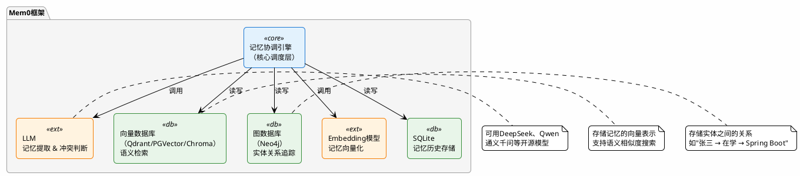
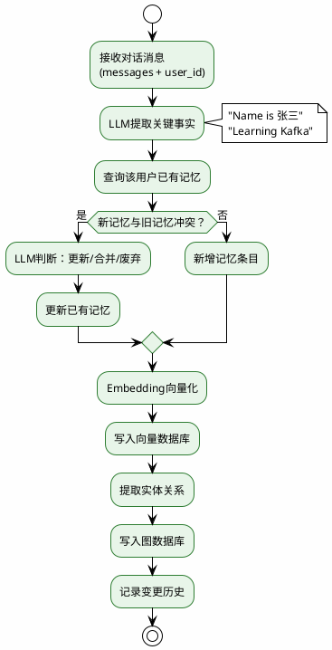
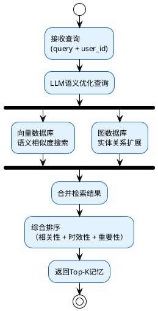

# 长期记忆与Mem0框架详解

前面聊了很多会话记忆的策略，但细心的你可能发现了一个问题：不管是滑动窗口还是摘要压缩，都是在**当前会话内**做文章。

会话一结束，这些记忆就没了。

但现实场景中，很多时候我们需要AI"记住"跨会话的信息。今天就来聊聊从短期记忆到长期记忆的进化之路，以及如何用Mem0框架实现真正的长期记忆。

## 短期记忆的天花板

### 一个让人抓狂的场景

假设你是一个在线编程学习平台的用户。半年前你告诉AI导师"我是后端开发，主要用Java，目前在学微服务架构"。半年后你再来问问题，你希望导师还记得你的技术栈，而不是从头问你"请问您用什么编程语言？"。

短期记忆做不到这一点——会话结束后，对话历史要么被清理，要么被压缩成短摘要。而且就算你用Redis做了持久化，那也只是"把这次会话的记录存下来了"，并不代表下次新会话时能自动关联到这些信息。

更别提：半年下来你可能跟导师聊了几百轮，就算把所有对话都存下来，全部塞进Context里？几百K的Token？那不是记忆，那是"背诵全文"——既不现实，效果也很差。

### 短期记忆的三大限制

| 限制 | 说明 |
|------|------|
| Token上限 | 上下文窗口就那么大，塞不下太多历史 |
| 注意力衰减 | 上下文太长，模型会"迷失在中间" |
| 会话边界 | 会话一结束，记忆就没了 |

对于"记住用户半年前说过喜欢学分布式"这种需求，短期记忆根本无能为力——因为那是**跨会话**的信息。

## 持久化记忆 ≠ 长期记忆

这里要澄清一个容易混淆的概念。

Spring AI提供了很多记忆持久化方案——`JdbcChatMemoryRepository`、`CassandraChatMemoryRepository`等等。这些组件把对话消息存到了MySQL、Cassandra这些持久化数据库里，服务重启了数据不丢。

但是，**这些方案本质上还是短期记忆**。

为什么？因为它们做的事情是"把当前会话的messages列表持久化"，方便分布式部署或服务重启后恢复上下文。它们的作用域仍然是单次会话。

:::warning 核心区分
**长期记忆一定是持久化的，但持久化的记忆不一定是长期记忆。**

判断标准只有一个：**能不能跨会话使用。**
:::

### 关键区别

| 维度 | 持久化记忆 | 长期记忆 |
|------|-----------|---------|
| 核心特征 | 数据存在磁盘/数据库，不会丢失 | 能够跨会话使用，有提取能力 |
| 跨会话 | 不一定（可能只是会话内持久化） | 必须支持 |
| 检索能力 | 不一定有 | 必须有（能从海量记忆中找到相关的） |
| 典型用途 | 服务重启后恢复上下文 | 用户画像、个性化服务 |

## 长期记忆的三个核心特征

| 特征 | 说明 | 对比短期记忆 |
|------|------|------------|
| **跨会话持久** | 信息保留跨越多次独立会话 | 短期记忆随会话结束消失 |
| **结构化提炼** | 不是存原始对话，而是提取关键事实和偏好 | 短期记忆存的是原始messages |
| **按需检索** | 根据当前对话主题，智能召回相关记忆 | 短期记忆是全量加载到Context |

举个例子来理解"结构化提炼"：

- **短期记忆存的是**："用户说'我最近在用JDK 21做一个Spring Boot 3.2的项目，部署在K8s上'"
- **长期记忆存的是**：`{用户名: "张三", 技术栈: "Java/JDK 21", 框架: "Spring Boot 3.2", 部署: "Kubernetes"}`

前者是原始对话文本，后者是从对话中提炼出来的结构化事实。长期记忆不需要知道用户是在哪次对话的第几轮说的这些，只需要记住"这个用户的技术栈是什么"。

### 长期记忆能做什么

1. **个性化服务**：记住用户的偏好、水平、习惯，提供量身定制的回答
2. **知识积累**：存储跨会话学到的经验和事实
3. **上下文补充**：短期记忆装不下的信息，通过长期记忆检索补充
4. **持续进化**：AI在多次交互中不断了解用户，服务质量越来越好

:::tip 两种记忆的关系
- 短期记忆 = 你正在打的这通电话里聊过的内容
- 长期记忆 = 你的通讯录备注（"这个人怕辣""上次来买过蓝色款"）
- 两者不冲突，生产级系统通常**同时需要**
:::

## 长期记忆的主流实现方案

| 方式 | 思路 | 适用场景 |
|------|------|---------|
| **向量化存储 + 语义检索** | 将对话片段或提炼后的记忆嵌入为向量，存入向量数据库，按语义相似度检索 | 通用场景，最主流 |
| **结构化数据库** | 用SQL/NoSQL存储用户档案、偏好、行为日志等结构化数据 | 精确查询场景 |
| **混合架构** | 向量库（语义记忆）+ 关系库（事实记忆）+ 图数据库（关系记忆） | 复杂的个性化系统 |
| **配置文件** | 用户显式定义偏好（如.cursor/rules） | 开发工具场景 |
| **模型微调** | 用用户历史数据微调专属模型 | 成本极高，极少使用 |

这些方式中，**向量化存储 + 语义检索**是当前最主流的方案。而把这套方案做成开箱即用的框架，做得最好的就是**Mem0**。

## Mem0：给AI装上长期记忆的框架

### Mem0是什么

[Mem0](https://github.com/mem0ai/mem0)是一个开源项目，目标是为AI Agent提供**个性化、可持久化的长期记忆能力**。

注意，Mem0不是一个存储系统——它是一个**协调者**，把LLM、向量数据库、Embedding模型、图数据库、SQLite等多个组件编排在一起，形成一套完整的"记忆中间件"。



各组件的职责：

- **LLM**：负责从对话中提取关键信息（记忆提取），以及判断新记忆是否和旧记忆冲突
- **Embedding模型**：将文本记忆转换为向量，用于后续的语义检索
- **向量数据库**：存储记忆的向量表示，支持按语义相似度快速检索
- **图数据库**：追踪实体之间的关系，支持复杂的关系推理
- **SQLite**：Mem0内置的本地存储，记录记忆的变更历史

:::info
除了SQLite是Mem0内置的，其他组件都需要你自己部署。这也是为什么Mem0的定位是"框架/中间件"而不是"存储系统"。
:::

## 记忆的生命周期：添加与检索

Mem0的记忆操作就两个核心动作：**往里存（add）** 和 **往外取（search）**。但这两个动作背后的流程远比看起来复杂。

### 添加记忆（Add）流程

当你调用`m.add(messages, user_id="xxx")`时，Mem0内部会执行以下流程：

**第一步：信息提取**

LLM分析对话内容，从中抽取关键事实。比如对话是"我叫张三，最近在学Kafka，之前一直做Spring Boot开发"，LLM会提取出：
- `Name is 张三`
- `Learning Kafka`
- `Has experience with Spring Boot`

**第二步：冲突检测与合并**

新提取的记忆会和该用户已有的记忆做对比。如果有冲突，LLM会判断应该更新还是保留。

比如旧记忆是"用户在学Spring Cloud"，新对话中说"最近转向学Kafka了"，Mem0会把旧记忆更新为"之前学Spring Cloud，目前转向Kafka"。

**第三步：结构化存储**

- 提取出的信息被Embedding模型转为向量，存入向量数据库
- 实体和关系被提取并存入图数据库（如"张三 → 正在学习 → Kafka"）
- 附加元数据（时间戳、来源会话ID等）用于后续的过滤和排序



### 检索记忆（Search）流程

当你调用`m.search(query, user_id="xxx")`时：

**第一步：查询理解**

LLM对用户当前的问题做语义优化，理解真正的查询意图。

**第二步：多路检索**

同时从两个渠道召回相关记忆：
- **向量搜索**：根据语义相似度从向量数据库中召回匹配的记忆
- **图查询**：根据实体关系从图数据库中扩展上下文

比如用户问"我之前学过什么技术"，向量搜索会召回"Learning Kafka""Has experience with Spring Boot"等记忆；图查询会通过"张三"这个实体，扩展出所有关联的技术栈节点。

**第三步：结果排序**

综合相关性、时效性、重要性等维度，对召回的记忆做排序，返回最匹配的结果。



### Mem0的记忆去重与演化

Mem0有一个很聪明的设计：**记忆不是只增不减的**，它会自动维护记忆的一致性。

| 场景 | Mem0的处理 |
|------|-----------|
| 新记忆和旧记忆**重复** | 自动去重，不会产生冗余 |
| 新记忆和旧记忆**矛盾** | LLM判断后更新旧记忆（如"住在北京" → "搬到上海"） |
| 记忆**过时** | 可以通过时间衰减降低过时记忆的权重 |
| 记忆**细化** | 新信息可以补充旧记忆的细节（如"学Java" → "学Java，专攻并发编程"） |

这种机制保证了长期记忆不会随着时间推移变得混乱——旧信息会被更新而不是堆积。

## 用Python快速体验Mem0

在讲Java集成之前，先用Python快速跑一下Mem0，直观感受它的效果。

### 环境准备

1. **安装PGVector**（PostgreSQL的向量扩展）：安装后创建数据库`mem0_memory`
2. **安装Ollama**：拉取对话模型`qwen3:1.7b`和嵌入模型`nomic-embed-text:v1.5`
3. **创建Python项目**：

```bash
uv init hello_mem0
cd hello_mem0
uv venv
source .venv/bin/activate
uv add mem0ai ollama psycopg2-binary
```

### 编写测试脚本

创建`hello.py`：

```python
from mem0 import Memory

config = {
    "vector_store": {
        "provider": "pgvector",
        "config": {
            "user": "pgvector",
            "password": "pgvector",
            "host": "127.0.0.1",
            "port": "5433",
            "embedding_model_dims": 768,
            "dbname": "mem0_memory"
        }
    },
    "llm": {
        "provider": "ollama",
        "config": {
            "model": "qwen3:1.7b",
            "temperature": 0,
            "max_tokens": 2000,
            "ollama_base_url": "http://localhost:11434",
        },
    },
    "embedder": {
        "provider": "ollama",
        "config": {
            "model": "nomic-embed-text:v1.5",
            "ollama_base_url": "http://localhost:11434",
            "embedding_dims": 768
        },
    },
}

print("初始化Memory...")
m = Memory.from_config(config)

print("添加记忆...")
messages = [
    {"role": "user", "content": "Hi, I'm Zhang San. I'm learning Kafka and Spring Boot."},
    {"role": "assistant", "content": "Hey Zhang San! I'll remember your interests."}
]
result = m.add(messages, user_id="zhangsan001")
print("Add result:", result)

print("检索记忆...")
results = m.search("What does this user study?", user_id="zhangsan001")
print(results)
```

:::warning 注意两个容易踩的坑
1. 查询记忆时要用`m.search(query, user_id="xxx")`的写法，不要用官网文档中`filters={"user_id": "xxx"}`的写法，后者会报错
2. 配置中必须指定`embedding_model_dims: 768`和`embedding_dims: 768`，否则会报维度不匹配的错误（expected 1536 dimensions, not 768）
:::

### 运行结果

```bash
uv run hello.py

初始化Memory...
添加Memory...
Add result: {'results': [
  {'id': 'xxx', 'memory': 'Name is Zhang San', 'event': 'ADD'},
  {'id': 'yyy', 'memory': 'Learning Kafka and Spring Boot', 'event': 'ADD'}
]}

查询Memory...
{'results': [
  {'id': 'xxx', 'memory': 'Name is Zhang San', 'score': 0.57, 'user_id': 'zhangsan001'},
  {'id': 'yyy', 'memory': 'Learning Kafka and Spring Boot', 'score': 0.67, 'user_id': 'zhangsan001'}
]}
```

可以看到Mem0自动完成了：
1. 从对话中**提取**出两条关键记忆："名字是张三""在学Kafka和Spring Boot"
2. 向量化后**存储**到了PGVector
3. **检索**时根据语义匹配返回了相关记忆和相似度分数

这就是Mem0的核心价值——你只需要把对话丢给它，它自动完成提取→存储→检索的全套流程。

## 短期记忆 vs Mem0长期记忆

| 对比维度 | 短期记忆 | Mem0长期记忆 |
|---------|---------|-------------|
| 生命周期 | 随会话结束清除 | 跨会话持久化 |
| 存储内容 | 原始messages | 提炼后的关键事实 |
| 检索方式 | 全量加载到Context | 按语义相似度召回 |
| Token开销 | 随对话轮数线性增长 | 只注入相关记忆，开销可控 |
| 冲突处理 | 无（旧信息要么保留要么丢弃） | LLM自动判断更新/合并 |

## 本章小结

一句话概括：**Mem0是一个由LLM驱动、向量+图双引擎支撑的AI记忆中间件。**

它让AI智能体具备了"记住用户、理解用户、持续为用户服务"的能力，是构建个性化AI应用的关键基础设施。

| 类型 | 生命周期 | 检索能力 | 典型用途 |
|------|---------|---------|---------|
| 短期记忆 | 当前会话 | 无（全量带上） | 多轮对话上下文 |
| 持久化记忆 | 持久 | 不一定 | 重启恢复、分布式 |
| 长期记忆 | 持久且跨会话 | 必须有 | 个性化、用户画像 |

**核心区别**：长期记忆 = 持久存储 + 智能检索 + 跨会话使用

下一节进入实战——怎么把Mem0部署成REST API服务，然后在Spring AI应用中集成它，让你的Java项目也能用上长期记忆。
