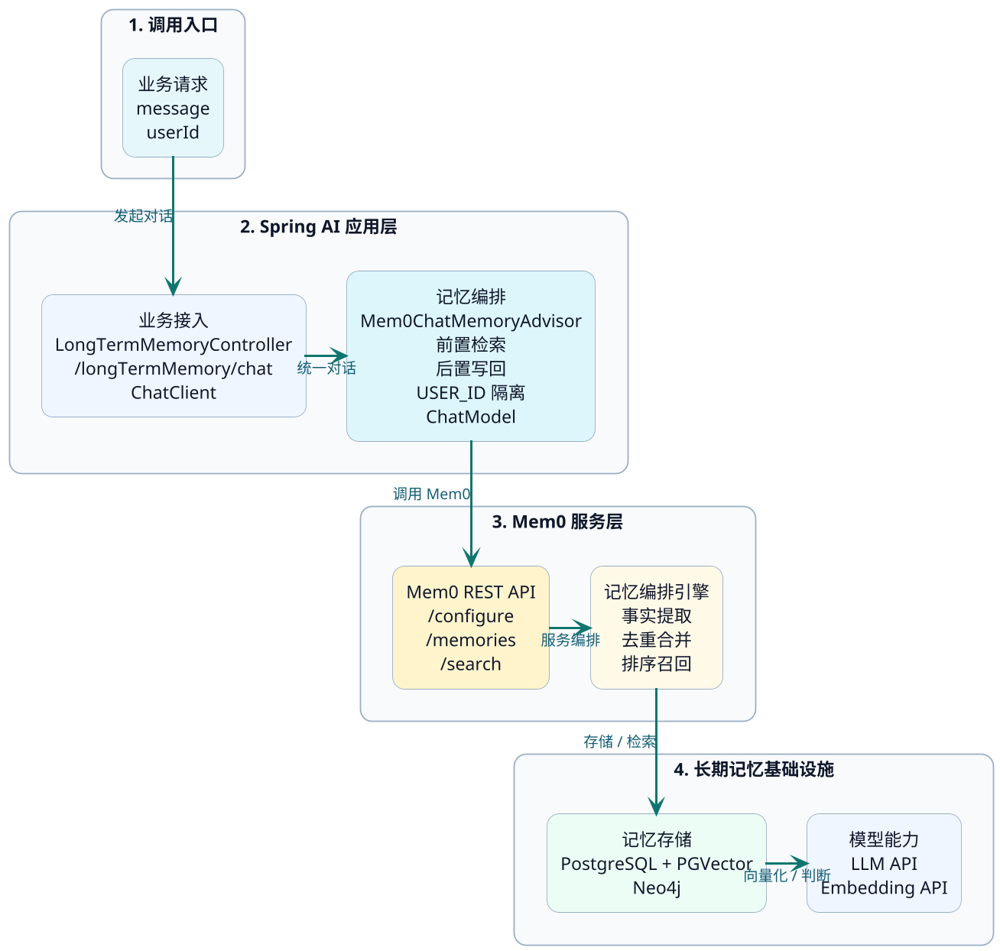
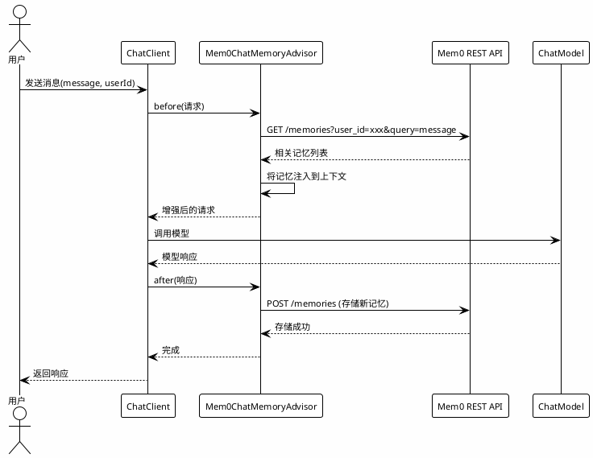

# Spring AI集成Mem0长期记忆实战

上一节讲了Mem0的原理，这一节来实战。我们的目标是：**在Spring AI应用中接入Mem0，让智能体具备跨会话的长期记忆能力**。

## 整体思路

整体方案分三步：

1. **部署Mem0 REST API Server**——把Mem0的Python能力暴露成HTTP接口
2. **验证Mem0接口**——通过curl确认记忆的增删改查都能正常工作
3. **Spring AI Alibaba集成**——在Java代码中通过Advisor机制接入Mem0



## 第一步：部署Mem0 REST API Server

### 为什么需要一个REST API Server

Mem0本身是一个Python框架，直接在Java项目里调用不太方便。Mem0官方提供了一个基于FastAPI的REST API Server，可以把Mem0的所有能力通过HTTP接口暴露出来。

有了它之后，Java代码只需要发HTTP请求就能操作记忆——增删改查全走REST接口，和调用任何其他微服务没有区别。

### 用Docker Compose一键启动

Mem0官方提供了docker-compose文件来快速部署整套服务（包括PostgreSQL、PGVector、Neo4j等依赖）。但官方默认配置用的是OpenAI的模型，我们需要调整成国内可用的模型。

:::info 提示
项目资料中提供了调整后的部署文件包，里面的`main.py`中定义了`DEFAULT_CONFIG`，支持自定义模型配置，可以直接对接百炼等国内模型服务。
:::

<!-- 截图提示：这里可以放一张部署文件目录结构的截图，展示main.py、docker-compose.yml、.env.example等文件 -->

**部署步骤**：

**1. 复制环境配置文件**

```bash
cp ./.env.example .env
```

**2. 修改.env文件**

```bash
OPENAI_API_KEY=<你的百炼API Key>
# 其他配置保持默认即可
```

**3. 启动服务**

```bash
docker compose up
```

启动后会自动拉起Mem0需要的所有依赖（PostgreSQL + PGVector、Neo4j等），并暴露HTTP服务。

<!-- 截图提示：这里可以放一张docker compose up成功运行的终端截图 -->

启动成功后，访问`http://localhost:8888/docs`可以看到Swagger文档页面。

<!-- 截图提示：这里可以放一张Mem0 REST API的Swagger文档页面截图 -->

### Mem0 REST API提供了哪些接口

| 接口 | 方法 | 功能 |
|------|------|------|
| `/configure` | POST | 初始化Mem0（必须在其他操作之前调用一次） |
| `/memories` | POST | 添加记忆 |
| `/memories` | GET | 查询记忆（按user_id） |
| `/memories/{id}` | PUT | 更新指定记忆 |
| `/memories/{id}` | DELETE | 删除指定记忆 |
| `/memories?user_id=xxx` | DELETE | 清空用户的所有记忆 |

## 第二步：验证Mem0接口

部署好之后，先用curl跑一遍，确保接口正常。

### 初始化Mem0

:::warning 必须先初始化
在做任何记忆操作之前，需要先调一次`/configure`接口做初始化。如果跳过这一步，后续调用add接口会报错：`AttributeError: 'NoneType' object has no attribute 'add'`
:::

```bash
curl -X 'POST' \
  'http://localhost:8888/configure' \
  -H 'accept: application/json' \
  -H 'Content-Type: application/json' \
  -d '{}'
```

<!-- 截图提示：这里可以放一张调用/configure接口成功的截图 -->

### 添加记忆

```bash
curl -X 'POST' \
  'http://localhost:8888/memories' \
  -H 'accept: application/json' \
  -H 'Content-Type: application/json' \
  -d '{
  "messages": [
    {
      "role": "user",
      "content": "我叫张三，最近在学Kafka消息队列，之前主要做Spring Boot后端开发"
    },
    {
      "role": "assistant",
      "content": "你好张三！我记住了你的技术方向。"
    }
  ],
  "user_id": "zhangsan001"
}'
```

返回结果类似：

```json
{
  "results": [
    {"id": "abc123", "memory": "Name is 张三", "event": "ADD"},
    {"id": "def456", "memory": "Learning Kafka", "event": "ADD"},
    {"id": "ghi789", "memory": "Has Spring Boot backend experience", "event": "ADD"}
  ]
}
```

<!-- 截图提示：这里可以放一张记忆添加成功的响应截图 -->

### 查询记忆

```bash
curl -X 'GET' \
  'http://localhost:8888/memories?user_id=zhangsan001' \
  -H 'accept: application/json'
```

会返回该用户的所有记忆条目及其元数据。

<!-- 截图提示：这里可以放一张查询结果的截图 -->

其他操作（更新、删除、重置）也都是标准的RESTful接口，可以在Swagger文档页面直接测试。

## 第三步：Spring AI Alibaba集成Mem0

### Spring AI对长期记忆的支持现状

Spring AI本身（截止目前）对长期记忆的支持还不够完善。它提供的MySQL、Redis等持久化方案，本质上是会话级别的上下文持久化，不算真正的长期记忆。

而**Spring AI Alibaba**在官方扩展中提供了对Mem0的支持，通过starter可以快速集成。

### 添加依赖

Spring AI Alibaba提供了一个starter，封装了和Mem0 REST API交互的所有HTTP细节：

```xml
<dependency>
    <groupId>com.alibaba.cloud.ai</groupId>
    <artifactId>spring-ai-alibaba-starter-memory-long</artifactId>
    <version>1.1.0.0-M5</version>
</dependency>
```

这个starter里面主要包含两部分：

- **Mem0ServiceClient**：封装了和Mem0 REST API的HTTP交互（add、search、delete等）
- **Mem0ChatMemoryAdvisor**：继承了Spring AI的BaseAdvisor，可以直接注册到ChatClient中

:::info 关于starter的内部实现
如果你去看`Mem0ServiceClient`的源码，会发现它的`addMemory`方法其实就是用WebClient发了一个POST请求到Mem0 Server的`/memories`接口。所以这个starter的核心价值是把HTTP调用包装得更方便，让你在Java代码中可以用面向对象的方式操作记忆。
:::

### 配置项

**最小化配置**（使用Mem0 Server的默认设置）：

```yaml
spring:
  ai:
    alibaba:
      mem0:
        client:
          base-url: http://127.0.0.1:8888
          timeout-seconds: 120
        server:
          version: v1.0.0
```

**自定义配置**（覆盖Mem0 Server的默认模型和数据库设置）：

```yaml
spring:
  ai:
    alibaba:
      mem0:
        client:
          base-url: http://127.0.0.1:8888
          timeout-seconds: 120
        server:
          version: v1.0.0
          vector-store:
            provider: pgvector
            config:
              host: postgres
              port: 5432
              dbname: postgres
              user: postgres
              password: postgres
              collection-name: memories
          graph-store:
            provider: neo4j
            config:
              url: bolt://neo4j:7687
              username: neo4j
              password: mem0graph
          llm:
            provider: openai
            config:
              api-key: <你的百炼API Key>
              temperature: 0.2
              model: deepseek-v3
              openai-base-url: https://dashscope.aliyuncs.com/compatible-mode/v1
          embedder:
            provider: openai
            config:
              api-key: <你的百炼API Key>
              model: text-embedding-v4
              openai-base-url: https://dashscope.aliyuncs.com/compatible-mode/v1
```

:::tip 配置覆盖原理
这些YAML配置会通过Spring AI Alibaba的自动配置类读取，然后传给Mem0 Server的`/configure`接口。在Mem0的`main.py`中，逻辑是"优先用传入的配置，没有的话再用默认值"。所以如果你在.env里已经配好了，这里就可以用最小化配置。
:::

### 编写业务代码

关键代码就三步：创建Advisor → 注册到ChatClient → 对话时传入user_id。

```java
import com.alibaba.cloud.ai.memory.mem0.advisor.Mem0ChatMemoryAdvisor;
import org.springframework.ai.chat.client.ChatClient;
import org.springframework.ai.openai.OpenAiChatModel;
import org.springframework.ai.vectorstore.VectorStore;
import org.springframework.beans.factory.InitializingBean;
import org.springframework.beans.factory.annotation.Autowired;
import org.springframework.web.bind.annotation.RequestMapping;
import org.springframework.web.bind.annotation.RestController;

import java.util.Map;

import static com.alibaba.cloud.ai.memory.mem0.advisor.Mem0ChatMemoryAdvisor.USER_ID;

@RestController
@RequestMapping("/longTermMemory")
public class LongTermMemoryController implements InitializingBean {

    @Autowired
    private OpenAiChatModel chatModel;

    @Autowired
    private VectorStore mem0MemoryStore;

    private ChatClient chatClient;

    @RequestMapping("/chat")
    public String chat(String message, String userId) {
        return chatClient.prompt(message)
                .advisors(
                    req -> req.params(Map.of(USER_ID, userId))
                )
                .call().content();
    }

    @Override
    public void afterPropertiesSet() throws Exception {
        // 1. 创建Mem0记忆Advisor
        Mem0ChatMemoryAdvisor mem0Advisor =
                Mem0ChatMemoryAdvisor.builder(mem0MemoryStore).build();

        // 2. 注册到ChatClient
        this.chatClient = ChatClient.builder(chatModel)
                .defaultAdvisors(mem0Advisor)
                .build();
    }
}
```

**代码解读**：

1. `Mem0ChatMemoryAdvisor`继承了Spring AI的`BaseAdvisor`，会在每次LLM调用**前**自动查询Mem0中的相关记忆注入上下文，在LLM调用**后**自动将新的对话内容存入Mem0
2. `mem0MemoryStore`是starter自动配置的Bean，封装了和Mem0 Server的交互
3. 对话时通过参数传入`user_id`，Mem0会按用户维度隔离记忆

### 工作流程



## 效果验证

### 第一轮对话：建立记忆

启动应用，发起第一次对话：

```
GET /longTermMemory/chat?userId=zhangsan001&message=我最近在做一个秒杀系统，用的是Spring Boot加Redis
```

AI正常回复秒杀系统相关的建议。

同时在日志中可以看到：Mem0 Advisor先查询了该用户的历史记忆（第一次为空），然后在LLM回复后，将对话内容存入了Mem0。

<!-- 截图提示：这里可以放一张第一轮对话的响应截图 -->
<!-- 截图提示：这里可以放一张日志截图，展示Mem0在LLM调用前后的查询和存储操作 -->

### 重启应用，验证跨会话记忆

把应用停掉，重新启动。因为记忆存在Mem0的向量数据库和图数据库中，重启不影响。

发起第二轮对话：

```
GET /longTermMemory/chat?userId=zhangsan001&message=我之前做的那个项目，库存扣减用什么方案比较好？
```

AI能正确回答："根据你之前提到的秒杀系统项目，库存扣减推荐用Redis + Lua脚本来保证原子性……"

<!-- 截图提示：这里可以放一张重启后第二轮对话的响应截图 -->
<!-- 截图提示：这里可以放一张日志截图，展示Mem0从数据库中成功召回了之前的记忆 -->

这说明什么？应用重启了，新会话了，但AI还"记得"用户之前做的是秒杀系统——这就是长期记忆的效果。

### 继续追加，验证记忆积累

```
GET /longTermMemory/chat?userId=zhangsan001&message=做高并发系统的时候，一般需要考虑哪些技术方案？
```

AI会结合已有的记忆（"用户在做秒杀系统""用的Spring Boot + Redis"），给出更有针对性的建议，而不是泛泛而谈。

<!-- 截图提示：这里可以放一张第三轮对话响应截图，展示AI结合记忆给出的个性化回答 -->

## 生产环境注意事项

### 记忆隔离

一定要正确传入`user_id`，否则所有用户的记忆会混在一起。

```java
// 正确做法：每个用户有独立的userId
.advisors(req -> req.params(Map.of(USER_ID, currentUserId)))

// 错误做法：写死userId，所有用户共享记忆
.advisors(req -> req.params(Map.of(USER_ID, "default")))
```

### 性能考虑

每次对话都会调用Mem0两次（检索 + 存储），会增加延迟。如果对延迟敏感：
- 可以考虑异步存储记忆
- 或者只在特定条件下触发记忆存储（如检测到关键信息时）

### 记忆清理

Mem0会持续累积记忆，需要考虑清理策略：
- 定期清理过期记忆
- 限制每个用户的记忆数量
- 提供用户主动清理记忆的入口

## 本章小结

1. Mem0 REST API Server把Python框架暴露成了HTTP接口，方便Java项目集成
2. Docker Compose可以一键部署Mem0及其依赖（PostgreSQL、PGVector、Neo4j）
3. Spring AI Alibaba的`spring-ai-alibaba-starter-memory-long`封装了和Mem0的交互
4. 集成只需三步：**加依赖 → 写配置 → 注册Advisor**
5. `Mem0ChatMemoryAdvisor`会自动在LLM调用前查询记忆、调用后保存记忆
6. 长期记忆能**跨会话、跨重启**保留用户信息，实现真正的个性化服务

:::tip 回顾整个记忆体系
到这里，我们已经完整地走了一遍AI记忆的全链路：

- **概念层**：搞清楚了Context/Memory/Token/Prompt的区别
- **问题层**：理解了上下文过载的四种翻车模式和上下文工程的应对方法
- **短期记忆**：掌握了五种会话记忆策略，并用Java实现了滑动窗口和摘要压缩
- **长期记忆**：理解了Mem0的架构和原理，并在Spring AI中完成了集成

短期记忆保证单次会话的连贯性，长期记忆保证跨会话的个性化——两者结合，你的AI应用就真正具备了"记住用户"的能力。
:::
