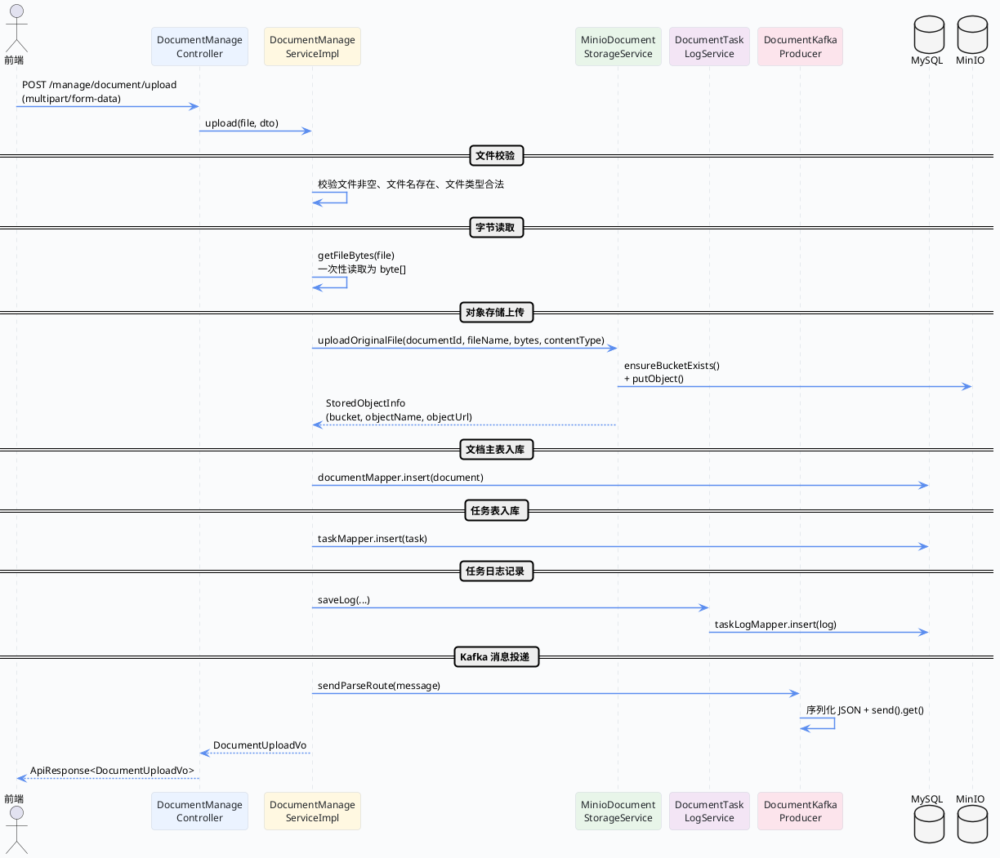

import VipInline from '@site/src/components/VipInline';

# 上传接口与文档主记录创建

这篇文档要讲的是：用户上传一份文档后，后端到底做了哪些事情？从 Controller 接到请求开始，一直到最后把消息丢进 Kafka 队列，整条链路我们一步步拆开来看。

先上一张总览流程图，有个整体印象之后再逐段看源码。

## 上传链路总览



## Controller 层：接收 multipart 请求

上传接口的入口在 `DocumentManageController`，它是一个标准的 Spring MVC 控制器。这个接口比较特殊——不是普通的 JSON 请求，而是 `multipart/form-data`，同时包含二进制文件和文档元信息两部分。

```java
/**
 * 上传文档并投递后续解析任务。
 * <p>
 * 请求体采用 multipart/form-data，通常包含两部分：
 * 1. {@code file}：真实上传的文档二进制内容；
 * 2. {@code meta}：可选的文档元信息，例如展示名称、知识范围、业务分类、操作人等。
 * </p>
 * <p>
 * 控制器本身不直接处理文件落盘、对象存储、文档入库或任务投递，
 * 这里只负责把 multipart 中的两部分正确绑定出来，然后交给服务层统一完成：
 * 文件校验、文件类型识别、对象存储上传、文档主表写入、任务表写入、日志记录和 Kafka 投递。
 * </p>
 *
 * @param file 上传的文档文件，必须通过 multipart 的 {@code file} 字段传入
 * @param dto 上传附带的文档元信息，来自 multipart 的 {@code meta} 字段，可为空
 * @return 上传结果，包含文档 ID、任务 ID 以及当前解析/策略/索引状态
 */
@Operation(summary = "上传文档并投递解析任务")
@PostMapping(value = "/upload", consumes = MediaType.MULTIPART_FORM_DATA_VALUE)
public ApiResponse<DocumentUploadVo> upload(@RequestPart("file") MultipartFile file,
                                            @Valid @RequestPart(value = "meta", required = false) DocumentUploadDto dto) {

    // meta 允许前端不传；这里统一兜底成一个空 DTO，避免服务层重复判空，让后续取字段时更稳定。
    return ApiResponse.ok(documentManageService.upload(file, dto == null ? new DocumentUploadDto() : dto));
}
```

这段代码的要点：

- 用 `@RequestPart("file")` 接收上传的文件二进制内容，用 `@RequestPart("meta")` 接收可选的元信息 JSON
- `meta` 标记了 `required = false`，前端可以不传。Controller 这里做了一个兜底：如果 `dto` 为 null，就 new 一个空的 `DocumentUploadDto`，这样服务层就不用到处判空了
- Controller 本身不做任何业务逻辑，纯粹是参数绑定 + 转发给 Service

:::info 关于 DocumentUploadDto
`DocumentUploadDto` 是上传时可选的元信息，包含以下字段：
- `documentName`：文档展示名称（不传则用原始文件名）
- `operatorId`：操作人 ID（不传则视为系统触发）
- `knowledgeScopeCode` / `knowledgeScopeName`：知识范围编码和名称
- `businessCategory`：业务分类
- `documentTags`：文档标签
:::

## Service 层：upload 方法全流程

接下来就是核心了——`DocumentManageServiceImpl.upload()` 方法。这个方法没有在方法级别加 `@Transactional` 注解，而是通过 `TransactionTemplate` 手动控制事务边界：数据库写入操作（文档主表、任务表、任务日志）放在 `transactionTemplate.execute()` 内部，事务提交成功后再发送 Kafka 消息。这样做的目的是避免"消息已发出但事务还没提交"的时间窗口问题。

我们按执行顺序，一段一段来看。

<VipInline />
