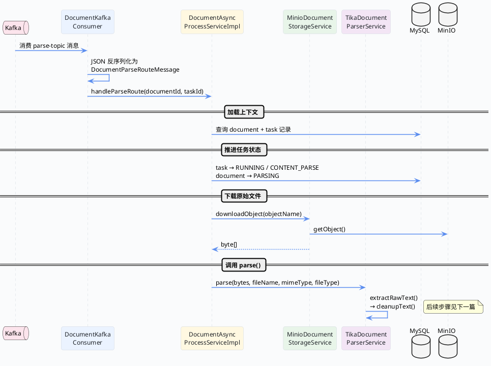

import VipInline from '@site/src/components/VipInline';

# Kafka 消费与文本内容解析

上一篇讲完了文档上传的同步链路——文件校验、MinIO 上传、数据库入库，最后把消息丢进了 Kafka。那 Kafka 消费方拿到消息之后到底做了什么？这篇就来拆这条异步链路的前半段：从消费消息开始，到文本提取与清洗完成为止。

先上总览流程图。

## 异步解析链路总览



## Kafka 消费者：消息入口

消费端的入口在 `DocumentKafkaConsumer`，它的职责很单一——把 JSON 消息反序列化，然后转交给异步处理服务。

```java
/**
 * 消费"解析路由"消息。
 * <p>
 * 这一步是上传完成后的异步链入口：收到消息后，会把 documentId 和 taskId 交给异步处理服务，
 * 继续执行文档下载、正文解析、结构节点生成、策略推荐等步骤。
 * </p>
 */
@KafkaListener(
    topics = SPRING_INJECT_PREFIX_DISTINCTION_NAME + "-" + "${app.manage.kafka.parse-topic}",
    groupId = "${app.manage.kafka.group-id}-parse")
public void consumeParseRoute(String payload) {
    try {
        // 先把 JSON 还原成强类型消息对象，避免后续处理层直接面对原始字符串。
        DocumentParseRouteMessage message = objectMapper.readValue(payload,
            DocumentParseRouteMessage.class);
        // 真正的业务推进放到异步处理服务中，这里只承担"消费并转发"的职责。
        asyncProcessService.handleParseRoute(message.getDocumentId(), message.getTaskId());
    }
    catch (Exception exception) {
        // 消费失败只记录日志，不让异常继续向外冒泡破坏监听线程。
        log.error("消费解析路由消息失败，payload={}", payload, exception);
    }
}
```

几个要点：

- topic 名称是 `环境前缀-配置的parseTopic`，和上传端发送时用的是同一个 topic
- `groupId` 带了 `-parse` 后缀，和索引构建的消费组区分开
- 整个方法用 try-catch 包住，消费失败只打日志不抛异常——这是为了防止一条坏消息把整个消费线程搞挂
- Consumer 本身不做任何业务逻辑，纯粹是"反序列化 + 转发"

<VipInline />

