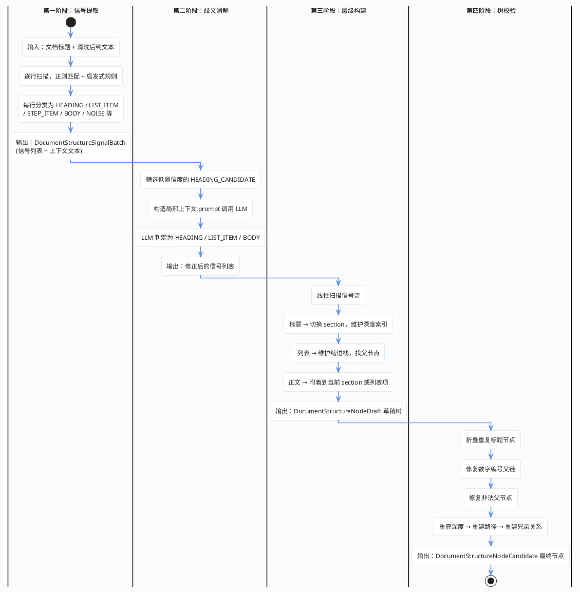

import VipInline from '@site/src/components/VipInline';

# 结构节点提取的四阶段流水线

上一篇讲到 `TikaDocumentParserService.parse()` 完成了文本提取和清洗。按照 `parse()` 的执行顺序，接下来就是 `structureNodeExtractor.extract()`——它负责从清洗后的纯文本中提取出文档的结构节点（标题、列表、步骤等）。这个方法内部是一条相当复杂的四阶段流水线，我们这篇单独拆开来讲。

## 四阶段流水线总览

先看一张总览图：



## 总入口：DocumentStructureNodeExtractor

```java
/**
 * 文档结构节点提取器。
 * <p>
 * 这是整条结构解析流水线的总入口，负责把“文档标题 + 解析后的纯文本”
 * 逐步转换成可落库的结构节点候选列表。
 * </p>
 * <p>
 * 内部固定采用四阶段流水线：
 * 1. 信号提取：逐行识别标题、列表、步骤、正文、噪声等结构信号；
 * 2. 歧义消解：对低置信度候选行做二次判定；
 * 3. 层级构建：把扁平信号组装成带父子关系的 draft 树；
 * 4. 树校验：修复路径、层级和兄弟关系，生成最终节点。
 * </p>
 */
@AllArgsConstructor
@Component
public class DocumentStructureNodeExtractor {

    /** 第一阶段：信号提取器，负责将文本逐行扫描并识别出标题、列表、正文等结构信号 */
    private final DocumentStructureSignalExtractor signalExtractor;
    /** 第二阶段：歧义消解器，对低置信度的信号借助 LLM 进行二次判定 */
    private final DocumentStructureAmbiguityResolver ambiguityResolver;
    /** 第三阶段：层级解析器，将扁平的信号列表组装成带有父子关系的草稿树 */
    private final DocumentStructureHierarchyResolver hierarchyResolver;
    /** 第四阶段：树校验器，修复无效父节点、重算深度、重建路径，输出最终候选节点 */
    private final DocumentStructureTreeValidator treeValidator;

    /**
     * 文档结构提取的总入口方法。
     * <p>
     * 这个方法本身不承载复杂规则判断，它更像一个“编排器”：
     * 负责把标题和正文送入四阶段流水线，并保证每一阶段的输出都成为下一阶段的输入。
     * </p>
     * <p>
     * 其中有两个特别重要的边界语义：
     * 1. 如果正文为空，不进入任何复杂规则，直接返回一个只有 DOCUMENT 根节点的结果；
     * 2. 如果正文非空，哪怕后续没有抽出任何显式标题，也会在树构建阶段保留根节点，
     *    从而保证下游始终面对的是一棵合法结构树，而不是空列表。
     * </p>
     *
     * @param documentTitle 文档标题，可为空；为空时统一兜底为“文档”
     * @param parsedText 解析后的纯文本正文
     * @return 结构化节点候选列表，供后续结构节点落库、导航索引和图谱投影复用
     */
    public List<DocumentStructureNodeCandidate> extract(String documentTitle, String parsedText) {
        // 对标题和文本做空值保护和去除首尾空白
        String normalizedTitle = StrUtil.blankToDefault(documentTitle, "文档").trim();
        String normalizedText = StrUtil.blankToDefault(parsedText, "").trim();

        // 如果正文为空，说明当前文档没有任何可供解析的结构内容；
        // 此时直接返回一个根节点，既能保持数据结构稳定，也能让下游明确知道“文档存在但无结构”。
        if (normalizedText.isBlank()) {
            return List.of(new DocumentStructureNodeCandidate(
                1,
                DocumentStructureNodeTypeEnum.DOCUMENT.getCode(),
                null,
                0,
                0,
                0,
                "",
                normalizedTitle,
                normalizedTitle,
                "/document",
                "",
                "",
                null
            ));
        }

        // 第一阶段：信号提取 —— 逐行扫描文本，识别标题、列表、噪声等结构信号
        DocumentStructureSignalBatch signalBatch = signalExtractor.extract(normalizedTitle, normalizedText);
        // 从信号批次中取出原始信号列表（防御性空值处理）
        List<DocumentStructureSignal> rawSignals = signalBatch == null ? List.of() : signalBatch.signals();
        // 从信号批次中取出所有行的规范化文本，供歧义消解时作为上下文窗口使用
        List<String> allLines = signalBatch == null ? List.of() : signalBatch.contextLines();

        // 第二阶段：歧义消解 —— 对“像标题又像列表”的候选行做二次判定，
        // 目的是减少误把列表当标题、或误把标题当正文的情况。
        List<DocumentStructureSignal> resolvedSignals = ambiguityResolver.resolve(normalizedTitle, allLines, rawSignals);

        // 第三阶段：层级构建 —— 将扁平信号列表组装为带有父子关系的草稿节点树。
        List<DocumentStructureNodeDraft> drafts = hierarchyResolver.resolve(normalizedTitle, resolvedSignals);

        // 第四阶段：树校验与构建 —— 修复层级异常、重算深度、重建路径，输出最终候选节点。
        return treeValidator.validateAndBuild(normalizedTitle, drafts);
    }
}
```

这个类本身不承载复杂逻辑，更像一个"编排器"——把四个阶段串起来，每一阶段的输出作为下一阶段的输入。

## 第一阶段：信号提取（SignalExtractor）

这是整条流水线中代码量最大的一个阶段。`DocumentStructureSignalExtractor` 的职责是：逐行扫描文档纯文本，通过正则模式匹配和启发式规则，把每一行分类为标题、列表项、步骤、表格行、引用、正文、噪声等结构信号。

<VipInline />
