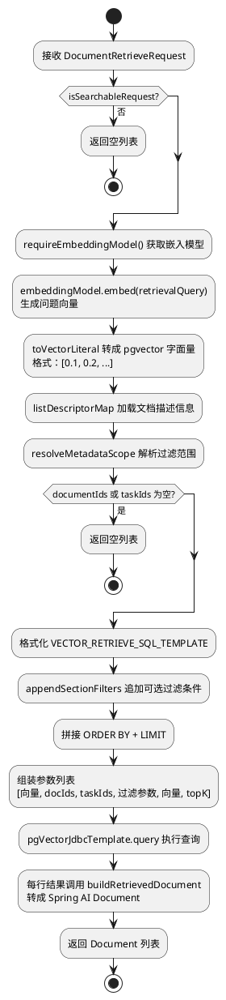

import VipInline from '@site/src/components/VipInline';

# 向量检索通道的执行流程

上一篇讲了检索请求是怎么构建的。这篇来看向量检索通道拿到这个请求之后，具体是怎么执行的。

## VectorRetrievalChannel.retrieve 源码

```java
@Override
public RetrievalChannelResult retrieve(String subQuestion, ConversationExecutionPlan plan) {
    // 调用 DocumentKnowledgeService 的向量检索方法，topK 从配置中读取。
    List<Document> documentList = documentKnowledgeService.vectorSearch(
        documentRetrieveRequestFactory.build(subQuestion, plan, properties.getVectorTopK())
    );
    // 返回通道结果，包含通道名称和检索到的文档列表。
    return new RetrievalChannelResult(channelName(), documentList);
}
```

方法很简洁，就两步：先用工厂构建请求（上一篇已经讲过），再调 `vectorSearch` 执行检索。核心逻辑都在 `vectorSearch` 里。

## vectorSearch 方法完整流程

整体流程用图表示：



<VipInline />