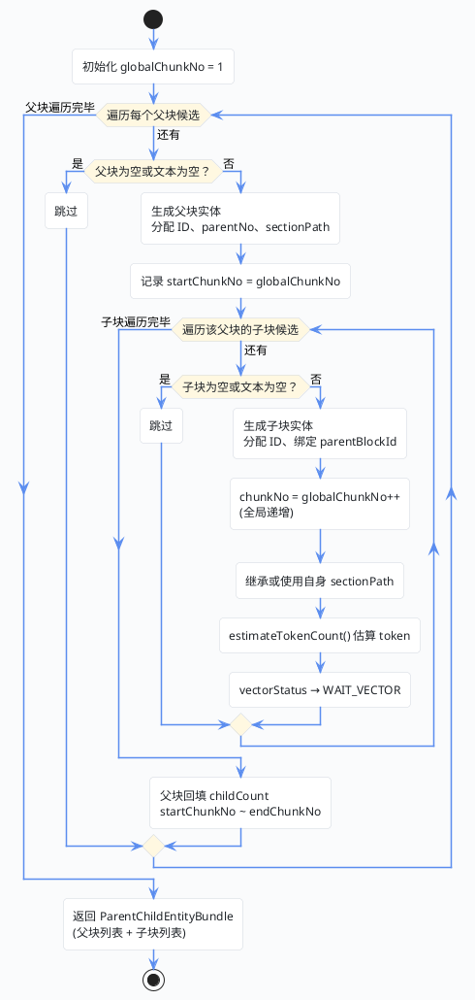

import VipInline from '@site/src/components/VipInline';

# 异步索引构建：落库、向量化与收尾

上一篇我们跟着执行顺序，看完了初始化和切块执行阶段，`buildParentBlocks()` 返回了一批父块/子块候选结果。这篇接着往下走——后处理、落库、向量化，一直到整个任务结束。

## 阶段三：切块后处理

回到 `handleIndexBuild()` 主流程，拿到候选结果后，先做一轮清洗，过滤掉无效的父块：

**DocumentAsyncProcessServiceImpl.java — handleIndexBuild()**

```java
// 过滤掉无效父块：
// 1. 父块本身不能为空；
// 2. 必须存在 child 列表；
// 3. child 列表里至少有一个文本非空的有效子块。
List<ParentBlockCandidate> finalParentBlockList = parentBlockCandidateList.stream()
    .filter(item -> item != null
        && StrUtil.isNotBlank(item.getText())
        && item.getChildChunks() != null
        && item.getChildChunks().stream()
            .anyMatch(child -> StrUtil.isNotBlank(child.getText())))
    .toList();
```

然后把内存中的候选对象转换成真正要落库的数据库实体：

```java
// 将内存中的候选结构转换成真正要落库的 parent_block / chunk 实体，
// 同时完成全局 chunk 编号、父子关系、token 估算等衍生字段填充。
ParentChildEntityBundle entityBundle =
    buildParentChildEntities(documentId, taskId, planId, finalParentBlockList);
List<SuperAgentDocumentParentBlock> parentBlockEntityList = entityBundle.parentBlocks();
List<SuperAgentDocumentChunk> chunkEntityList = entityBundle.childChunks();
```

### buildParentChildEntities：候选对象 → 数据库实体

这个方法做的事情不复杂，但细节不少。核心就是遍历每个父块候选，给它和它的子块分配 ID、编号，然后填充各种衍生字段。

**DocumentAsyncProcessServiceImpl.java — buildParentChildEntities()**

```java
/**
 * 将策略服务产出的父块/子块候选对象转换成数据库实体。
 * <p>
 * 这里会同时完成几件事：
 * 1. 给父块和子块分配全局唯一 ID；
 * 2. 建立 parent_block 与 chunk 的父子关系；
 * 3. 生成全局递增的 chunkNo；
 * 4. 计算字符数、token 估算值、向量初始状态等落库字段。
 * </p>
 *
 * @param documentId 文档 ID
 * @param taskId 当前索引任务 ID
 * @param planId 本次执行所依据的方案 ID
 * @param parentBlockCandidateList 清洗后的父块候选列表
 * @return 父块实体列表与子块实体列表的打包结果
 */
private ParentChildEntityBundle buildParentChildEntities(Long documentId,
                                                         Long taskId,
                                                         Long planId,
                                                         List<ParentBlockCandidate> parentBlockCandidateList) {
    // 分别收集父块实体和子块实体，最后一次性返回给主流程落库。
    List<SuperAgentDocumentParentBlock> parentBlockEntityList = new java.util.ArrayList<>();
    List<SuperAgentDocumentChunk> chunkEntityList = new java.util.ArrayList<>();
    // chunkNo 按整篇文档全局递增，而不是在每个父块内从 1 重新开始。
    int globalChunkNo = 1;

    for (int parentIndex = 0; parentIndex < parentBlockCandidateList.size(); parentIndex++) {
        ParentBlockCandidate parentCandidate = parentBlockCandidateList.get(parentIndex);
        // 父块为空或文本为空时直接跳过，避免生成无意义 parent_block 记录。
        if (parentCandidate == null || StrUtil.isBlank(parentCandidate.getText())) {
            continue;
        }

        // 先构造父块实体，承接 sectionPath、结构节点、规范路径等上游结构化信息。
        SuperAgentDocumentParentBlock parentBlock = new SuperAgentDocumentParentBlock();
        parentBlock.setId(uidGenerator.getUid());
        parentBlock.setDocumentId(documentId);
        parentBlock.setTaskId(taskId);
        parentBlock.setPlanId(planId);
        parentBlock.setParentNo(parentIndex + 1);
        // sourceType 允许上游缺省，缺省时统一按 ORIGINAL 处理。
        parentBlock.setSourceType(parentCandidate.getSourceType() == null
            ? DocumentChunkSourceTypeEnum.ORIGINAL.getCode() : parentCandidate.getSourceType());
        parentBlock.setSectionPath(parentCandidate.getSectionPath());
        parentBlock.setStructureNodeId(parentCandidate.getStructureNodeId());
        parentBlock.setStructureNodeType(parentCandidate.getStructureNodeType());
        parentBlock.setCanonicalPath(parentCandidate.getCanonicalPath());
        parentBlock.setItemIndex(parentCandidate.getItemIndex());
        parentBlock.setParentText(parentCandidate.getText().trim());
        parentBlock.setCharCount(parentCandidate.getText().length());
        // token 数量这里走轻量估算，不依赖真正 tokenizer，主要用于统计和展示。
        parentBlock.setTokenCount(estimateTokenCount(parentCandidate.getText()));
        parentBlock.setStatus(BusinessStatus.YES.getCode());

        // 记录这个父块对应的起始 chunkNo，后面用于回填 startChunkNo / endChunkNo。
        int startChunkNo = globalChunkNo;
        int childCount = 0;
        for (ChunkCandidate childCandidate : parentCandidate.getChildChunks()) {
            // 子块为空或文本为空时不落库，避免无内容 chunk 污染向量索引。
            if (childCandidate == null || StrUtil.isBlank(childCandidate.getText())) {
                continue;
            }
            // 每个 child chunk 都会绑定当前父块 ID，并继承文档/任务/方案三个维度的归属信息。
            SuperAgentDocumentChunk chunk = new SuperAgentDocumentChunk();
            chunk.setId(uidGenerator.getUid());
            chunk.setDocumentId(documentId);
            chunk.setTaskId(taskId);
            chunk.setPlanId(planId);
            chunk.setParentBlockId(parentBlock.getId());
            // chunkNo 在整篇文档内全局递增，便于按原始顺序展示和检索。
            chunk.setChunkNo(globalChunkNo++);
            chunk.setSourceType(childCandidate.getSourceType() == null
                ? DocumentChunkSourceTypeEnum.ORIGINAL.getCode() : childCandidate.getSourceType());
            // 子块若未单独指定 sectionPath，则默认继承父块 sectionPath。
            chunk.setSectionPath(StrUtil.blankToDefault(childCandidate.getSectionPath(), parentCandidate.getSectionPath()));
            chunk.setStructureNodeId(childCandidate.getStructureNodeId());
            chunk.setStructureNodeType(childCandidate.getStructureNodeType());
            chunk.setCanonicalPath(childCandidate.getCanonicalPath());
            chunk.setItemIndex(childCandidate.getItemIndex());
            chunk.setChunkText(childCandidate.getText().trim());
            chunk.setCharCount(childCandidate.getText().length());

            chunk.setTokenCount(estimateTokenCount(childCandidate.getText()));
            // 新生成的 chunk 初始一定处于“待向量化”状态，
            // 真正跑完向量化后再由向量网关回填结果状态。
            chunk.setVectorStatus(DocumentVectorStatusEnum.WAIT_VECTOR.getCode());
            chunk.setVectorStoreType(DocumentVectorStoreTypeEnum.PG_VECTOR.getCode());
            chunk.setStatus(BusinessStatus.YES.getCode());
            chunkEntityList.add(chunk);
            childCount++;
        }

        // 父块回填自己包含的子块数量以及 chunk 编号范围，便于详情页直接展示父子覆盖区间。
        parentBlock.setChildCount(childCount);
        parentBlock.setStartChunkNo(childCount == 0 ? null : startChunkNo);
        parentBlock.setEndChunkNo(childCount == 0 ? null : globalChunkNo - 1);
        parentBlockEntityList.add(parentBlock);
    }

    return new ParentChildEntityBundle(parentBlockEntityList, chunkEntityList);
}
```

用一张流程图来梳理这个方法的执行过程：



<VipInline />