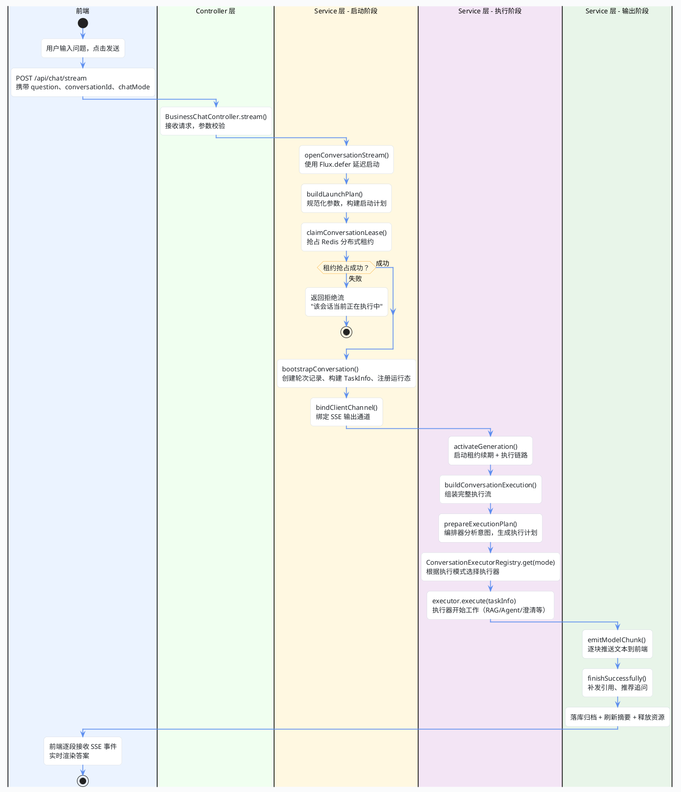

import VipInline from '@site/src/components/VipInline';

# 从用户提问到答案返回的总流程

这篇文档会把 Super Agent 聊天系统后端的完整链路拆开来讲，从用户点击"发送"的那一刻开始，一直到答案流式输出到前端、最后落库收尾为止。每个关键步骤都会贴出对应的源码，加上注释说明它在整条链路里的作用。

看完这篇，你会对"一个问题是怎么从 Controller 一路走到模型输出再回到前端"有一个完整的认知。

## 总流程概览

先看一张全局流程图，对整条链路有个直观印象：



接下来我们按照这张图的顺序，逐步拆解每个阶段的源码。

## 入口：Controller 接收请求

一切从前端的 POST 请求开始。前端把用户的问题、会话 ID、聊天模式等信息打包成 `ChatRequestDto`，发到 `/api/chat/stream` 接口。

先看请求参数长什么样：

```java
public class ChatRequestDto {

    @NotBlank(message = "question 不能为空")
    private String question;          // 用户输入的问题

    private String conversationId;    // 会话 ID，不传则自动生成新会话

    @NotBlank(message = "chatMode 不能为空")
    private String chatMode;          // 聊天模式：OPEN_CHAT / AUTO_DOCUMENT / DOCUMENT

    private String selectedDocumentId; // 当前文档问答模式下，用户选择的文档 ID
}
```

Controller 就做两件事：接参数、转交给 Service：

```java
@AllArgsConstructor
@RestController
@RequestMapping("/api/chat")
public class BusinessChatController {

    private final BusinessChatService businessChatService;

    /**
     * 打开一个流式会话。
     * <p>
     * 该接口返回的是 SSE 文本流，前端可以持续接收“思考中”、“正文增量”、“引用”、“推荐追问”等事件。
     * </p>
     *
     * @param dto 前端提交的聊天请求，包含问题、会话 ID、聊天模式、选中文档等信息
     * @return SSE 字符串流，内容由服务层按事件格式持续输出
     */
    @PostMapping(value = "/stream", produces = "text/event-stream;charset=UTF-8")
    public Flux<String> stream(@Valid @RequestBody ChatRequestDto dto) {
        // 这里不再额外包装 ApiResponse，而是直接把服务层生成的 SSE 事件流返回给前端逐段消费。
        return businessChatService.openConversationStream(dto);
    }
}
```

:::info 为什么返回 Flux 而不是普通 JSON？
因为聊天回答是流式生成的，模型每产出一小段文字就立刻推给前端，用户能看到"边想边写"的效果。这里用的是 Spring WebFlux 的 `Flux<String>`，配合 `text/event-stream` 内容类型，实现了 SSE（Server-Sent Events）协议。
:::

## 延迟启动：Flux.defer 的设计意图

Controller 调用的 `openConversationStream()` 并不会立刻开始干活，而是用 `Flux.defer` 包了一层：

```java
public Flux<String> openConversationStream(ChatRequestDto request) {
    // defer 的作用：把真正的启动逻辑延后到"客户端真正订阅流"的那一刻
    // 避免只是创建 Flux 对象时就提前占用租约、创建轮次
    return Flux.defer(() -> openDeferredConversationStream(request));
}
```

这个设计很关键——如果不用 `defer`，Flux 对象一创建就会执行内部逻辑，但这时候前端可能还没准备好接收数据。用了 `defer` 之后，只有前端真正建立 SSE 连接（订阅 Flux）时，后端才会开始抢租约、创建轮次这些操作。


<VipInline />
