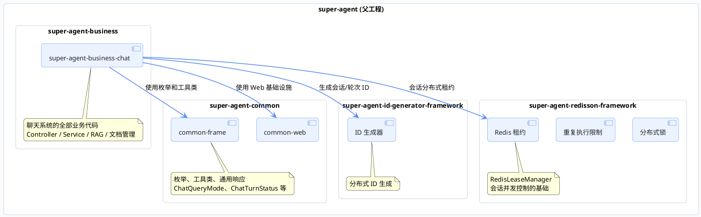

import VipInline from '@site/src/components/VipInline';

# 前后端模块划分与调用关系

这篇文档聚焦后端部分，把 Super Agent 的 Maven 模块划分、聊天业务的包结构、各层核心类的职责和调用关系都理清楚。看完之后，你拿到任何一个类名，都能快速定位它在整个架构中的位置和作用。

## Maven 模块总览

Super Agent 后端采用多模块 Maven 结构，每个模块有明确的职责边界：

| 模块 | 职责 |
| :--- | :--- |
| `super-agent-common` | 通用基础设施：枚举定义（`ChatQueryMode`、`ChatTurnStatus`）、工具类、统一响应封装 |
| `super-agent-id-generator-framework` | 分布式 ID 生成，为会话和轮次提供全局唯一标识 |
| `super-agent-redisson-framework` | Redis 相关能力：分布式锁、重复执行限制、**会话租约管理**（`RedisLeaseManager`） |
| `super-agent-business-chat` | 聊天系统的全部业务代码，是最核心的模块 |

## 聊天业务包结构

`super-agent-business-chat` 是整个聊天系统的核心，内部按职责划分成多个包。下面这张图展示了包之间的层次关系：

<VipInline />
