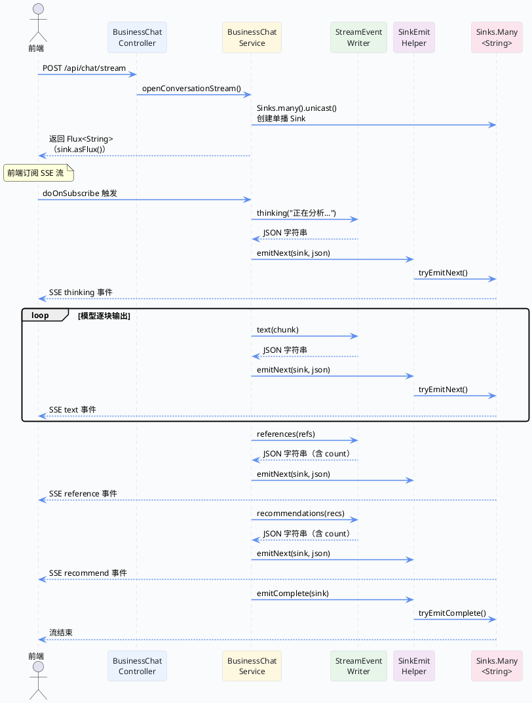

import VipInline from '@site/src/components/VipInline';

# stream 接口与 SSE 事件协议

Super Agent 的聊天回答不是"等模型想完再一次性返回"，而是模型每产出一小段文字就立刻推给前端，用户能看到"边想边写"的效果。这背后靠的就是 SSE（Server-Sent Events）协议。

这篇文档会把 SSE 事件协议的实现细节拆开来讲——后端定义了哪些事件类型、每种事件的 JSON 长什么样、事件是怎么被格式化和推送出去的、流是怎么创建和关闭的。

## SSE 协议概览

先看一张时序图，对整个 SSE 事件流有个直观印象：



:::info 为什么用 SSE 而不是 WebSocket？
SSE 是单向的（服务端 → 客户端），天然适合"模型输出推送"这种场景。它基于 HTTP，不需要额外的协议升级，部署和调试都更简单。WebSocket 是双向的，适合聊天室那种"双方都在发消息"的场景，但对于"用户提问 → 模型回答"这种请求-响应模式来说，SSE 就够了。
:::

## 事件类型与 JSON 格式

Super Agent 定义了 6 种 SSE 事件类型，每种事件都是一个 JSON 字符串，通过 SSE 流逐条推送给前端：

| 事件类型 | type 字段 | 用途 | 触发时机 |
| :--- | :--- | :--- | :--- |
| 文本增量 | `text` | 模型输出的正文片段 | 模型每产出一个 chunk |
| 思考步骤 | `thinking` | 后端正在做什么 | 编排器分析、执行器启动时 |
| 状态通知 | `status` | 会话状态变更 | 用户停止生成时 |
| 错误通知 | `error` | 执行失败的错误信息 | 任何阶段出错时 |
| 引用来源 | `reference` | 回答引用的证据来源 | 正文输出完成后 |
| 推荐追问 | `recommend` | 建议用户接下来问什么 | 引用发送完成后 |

每种事件的 JSON 结构都遵循统一的格式：

```json
{
  "type": "text",
  "content": "这是模型输出的一段文字",
  "timestamp": "2025-03-15T08:30:00.123Z",
  "conversationId": "abc123",
  "exchangeId": 1001
}
```

其中 `type` 和 `content` 是必有字段，`timestamp` 是事件产生的时间戳，`conversationId` 和 `exchangeId` 是可选的会话元信息——有了它们，前端就能知道每条事件归属哪个会话、哪个轮次。

引用和推荐事件会多一个 `count` 字段，告诉前端这批数据一共有多少条：

```json
{
  "type": "reference",
  "content": [
    { "title": "文档A", "sectionPath": "第三章/3.1", "snippet": "..." },
    { "title": "文档B", "sectionPath": "第五章/5.2", "snippet": "..." }
  ],
  "count": 2,
  "timestamp": "2025-03-15T08:30:05.456Z",
  "conversationId": "abc123",
  "exchangeId": 1001
}
```

这些元信息由 `StreamEventMetadata` 这个 record 承载：

```java
// StreamEventMetadata.java —— SSE 事件元数据
public record StreamEventMetadata(
    String conversationId,  // 会话 ID
    Long exchangeId         // 轮次 ID
) {
}
```

<VipInline />
