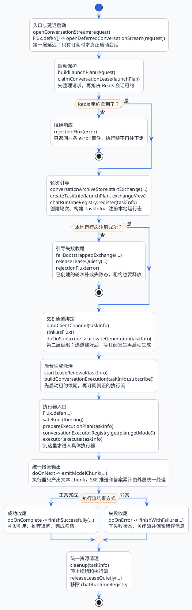

import VipInline from '@site/src/components/VipInline';

# 聊天架构与执行入口

前面两篇文档其实已经把聊天架构讲得比较完整了：

- [从用户提问到答案返回的总流程](/super-agent/chat-system-architecture/end-to-end-flow)：讲的是一条用户问题从入口到答案返回的全局链路。
- [stream接口与SSE事件协议](/super-agent/sse-chat-lifecycle/stream-api-and-sse-protocol)：讲的是 SSE 事件协议、Sink、安全推送和流关闭。

但它们中间还差一个很关键的“收束点”：`BusinessChatService#openConversationStream` 到底是怎么把一次请求启动起来，又是怎么走到 `ConversationExecutor` 入口的？

这篇来专门讲解从请求启动一直到具体执行器的选择。而具体执行器内部逻辑而在后续的章节详细讲解

:::info 阅读边界
这里会提到 `prepareExecutionPlan(taskInfo)`，因为它是 `buildConversationExecution` 里面生成执行计划的关键步骤。但它内部的问题改写、路由识别、历史压缩、检索规划等细节先不展开。
:::

## 后端主流程总图

这张图最重要的是要知道这三件事情：

1. **启动不是立刻发生的**：`Flux.defer` 和 `.doOnSubscribe` 把真正的会话启动动作延后到订阅发生时。
2. **执行前有两道互斥保护**：Redis 分布式租约防止跨实例并发，本地运行态注册表防止当前实例内重复执行。
3. **`buildConversationExecution` 是分水岭**：它前面是会话生命周期管理，它里面开始准备执行计划，再把任务交给具体执行器。

## 第一层延迟：openConversationStream

<VipInline />
