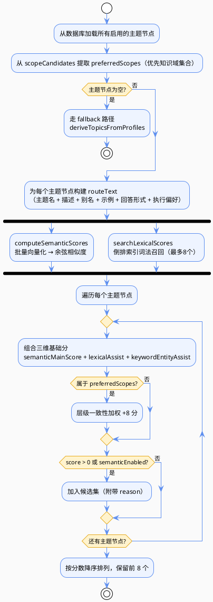

import VipInline from '@site/src/components/VipInline';

# 主题路由和文档路由的详细实现

上一篇讲完了 rankScopes（知识域路由）的详细实现，这一篇我们继续讲解三层路由的后两层：rankTopics（主题路由）和 rankDocuments（文档路由）。

## rankTopics：主题路由

```java
List<TopicRouteCandidate> topicCandidates = rankTopics(queryContext, scopeCandidates);
```

主题路由是三层路由的第二层，在知识域的基础上进一步细化到主题。

### 什么是主题？

**主题（Topic）** 是中等粒度的知识分类，介于知识域和文档之间。比如：

| 知识域 | 主题示例 |
|--------|---------|
| Java开发 | Spring Boot配置、MyBatis使用、JVM调优、多线程编程 |
| 前端技术 | React Hooks、Vue组件、Webpack配置、CSS布局 |
| 数据库 | MySQL索引优化、Redis缓存策略、MongoDB聚合查询 |

主题路由的核心价值在于：它不是孤立计算的，而是**显式利用上一层 scope 的结果**，让"知识域 → 主题"形成逐层收缩的路由链路。如果 topic 层命中较准，后续文档排序会明显更稳定。

### rankTopics 方法的实现

```java
/**
 * 计算主题候选。
 * 这是知识范围路由里的第二层筛选：在 scope 粗筛之后，再继续往下定位更细粒度的 topic。
 *
 * 这一步的核心作用是：
 * 1. 把“问题大概属于哪个知识域”的结果，进一步细化成“更像哪个业务主题 / 子主题”；
 * 2. 为下一层文档路由提供更强的主题信号；
 * 3. 如果 topic 层命中较准，后续文档排序会明显更稳定。
 *
 * 评分思路和 scope 层类似，但会额外叠加“层级一致性加权”：
 * 1. 语义主分：来自 query 与 topic routeText 的向量相似度；
 * 2. 词法辅助分：来自倒排词法召回；
 * 3. 实体词辅助分：来自短词、代号、英文缩写、编号等高指向性词项；
 * 4. scope 一致性加权：如果某个 topic 属于上一步已经命中的优先知识域，则再加一笔分。
 *
 * 这意味着 topic 路由并不是孤立计算的，
 * 而是会显式利用 `scopeCandidates` 的结果，让“知识域 -> 主题”形成逐层收缩的路由链路。
 *
 * @param queryContext 路由查询上下文
 * @param scopeCandidates 已有知识域候选
 * @return 主题候选列表
 */
private List<TopicRouteCandidate> rankTopics(RouteQueryContext queryContext, List<ScopeRouteCandidate> scopeCandidates) {
    List<SuperAgentKnowledgeTopicNode> nodes = topicNodeMapper.selectList(new LambdaQueryWrapper<SuperAgentKnowledgeTopicNode>()
        .eq(SuperAgentKnowledgeTopicNode::getStatus, BusinessStatus.YES.getCode()));

    // 从上一步 scope 候选中提炼出“优先知识域集合”，后续 topic 属于这些 scope 时会得到额外加权。
    Set<String> preferredScopes = scopeCandidates.stream().map(ScopeRouteCandidate::getScopeCode).collect(Collectors.toSet());
    if (nodes.isEmpty()) {
        // 没有显式主题节点时，退回到从文档画像里提炼主题。
        return deriveTopicsFromProfiles(queryContext, preferredScopes);
    }

    // 为每个主题节点构造 routeText，覆盖主题名、别名、示例、回答形态、执行偏好等多种语义线索。
    List<String> routeTexts = nodes.stream()
        .map(node -> join(
            node.getTopicName(),
            node.getDescription(),
            node.getAliases(),
            node.getExamples(),
            node.getAnswerShape(),
            node.getExecutionPreference()
        ))
        .toList();

    // 语义分与词法分都按 topic 节点列表顺序对齐，后面会按相同下标组合出最终 topic 分。
    List<Double> semanticScores = computeSemanticScores(queryContext, routeTexts);
    Map<String, Double> lexicalScores = searchLexicalScores(queryContext.routingText(), "topic", 8).stream()
        .collect(Collectors.toMap(KnowledgeRouteIndexService.RouteLexicalHit::entityCode, KnowledgeRouteIndexService.RouteLexicalHit::score, (left, right) -> left));
    List<TopicRouteCandidate> candidates = new ArrayList<>(nodes.size());
    for (int index = 0; index < nodes.size(); index++) {
        // 当前 index 下的 topic 节点、routeText、semanticScore 必须保持严格对齐。
        SuperAgentKnowledgeTopicNode node = nodes.get(index);
        String routeText = routeTexts.get(index);

        // topic 层最终分由语义主分、词法辅助分和实体词辅助分共同组成。
        double score = semanticMainScore(semanticScores.get(index))
            + lexicalAssist(lexicalScores.get(node.getTopicCode()))
            + keywordEntityAssist(queryContext.queryTerms(), routeText);
        if (!preferredScopes.isEmpty() && preferredScopes.contains(node.getScopeCode())) {
            // 若主题属于已命中的知识域，额外加权，强化层级一致性。
            score += 8D;
        }
        if (score > 0D || queryContext.semanticEnabled()) {
            // 满足保留条件的主题会进入候选集，并附带 reason 供调试和前端展示。
            candidates.add(new TopicRouteCandidate(
                node.getTopicCode(),
                node.getTopicName(),
                node.getScopeCode(),
                scoreToBigDecimal(score),
                buildReason(queryContext.queryTerms(), routeText, semanticScores.get(index))
            ));
        }
    }
    return candidates.stream()
        // topic 层是比 scope 更细的一层，因此这里保留前 8 个候选，给文档层留足可选空间。
        .sorted((left, right) -> right.getScore().compareTo(left.getScore()))
        .limit(8)
        .toList();
}
```

### rankTopics 执行流程



<VipInline />