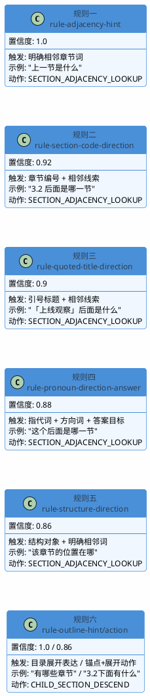

import VipInline from '@site/src/components/VipInline';

# 统一意图识别与本地规则引擎

上一篇讲了 `route` 方法的整体流程和三种执行模式的分支判定。这一篇我们深入 `detectQuestionIntent` 方法内部，看看统一意图识别是怎么工作的。

## detectQuestionIntent 的整体结构

这个方法是整个路由的"大脑"，它要一次性判断出五个维度的意图，然后返回一个统一的结论。整体分为三层：

1. **本地多维度判断**：先用关键词和正则做各维度的初步判断
2. **本地 GRAPH_ONLY 规则引擎**：用组合规则做高置信的结构图直答判定
3. **LLM 兜底分类**：本地规则搞不定的模糊表达，交给模型做最终裁决

先看方法的前半部分——本地多维度判断：

```java
private DocumentQuestionIntentDecision detectQuestionIntent(String routeText,
                                                            String originalQuestion,
                                                            String rewrittenQuestion,
                                                            List<String> subQuestions) {
    // 先把输入规整成单个字符串，后续本地规则和 LLM prompt 都基于同一个判断对象。
    String normalized = safeText(routeText);
    // 空问题没有任何稳定意图，直接返回一份全 false 的保守结果。
    if (normalized.isBlank()) {
        return noQuestionIntent("问题为空，跳过路由意图判断。");
    }

    // 本地先判断 item，因为步骤/条目定位应该优先交给 GRAPH_THEN_EVIDENCE，而不是目录展开。
    boolean itemLookup = looksExplicitItemQuestion(normalized);
    // 本地分析型判断已经区分强分析词和弱关系词，避免"前后关系"误伤成 ANALYTIC。
    boolean analyticQuestion = looksAnalyticQuestion(normalized);
    // 本地目录展开判断要求"结构锚点 + 展开动作 + 非正文诉求"，不再只看"目录/有哪些"。
    boolean outlineQuestion = asksOutline(normalized);
    // 正文诉求用于阻断 GRAPH_ONLY，例如"下面有哪些要求/处理步骤/讲了什么"。
    boolean contentQuestion = looksGraphOnlyExcludedContentQuestion(normalized);
    // 结构软提示用于 RETRIEVAL 分支辅助定位章节，不等价于直接图直答。
    boolean structureHint = mentionsStructure(normalized) || hasGraphOnlyAnchor(normalized) || outlineQuestion;
    // 默认先构造一个未命中的 GRAPH_ONLY 结果，后续规则或 LLM 可以覆盖它。
    GraphOnlyIntentDecision graphOnlyIntent = noGraphOnlyIntent("本地规则未命中结构图直答意图。");
    ...
}
```

这段代码一口气做了五个本地判断，每个判断对应一个维度。注意这里的顺序是有讲究的：**item 判断放在最前面**，因为"第3步"这类问题如果被误判成目录展开就麻烦了。

## 本地辅助判断方法详解

在看规则引擎之前，先了解这些辅助方法各自是怎么判断的。

### looksExplicitItemQuestion：步骤/编号项识别

```java
private boolean looksExplicitItemQuestion(String question) {
    // 先复用现有 item 触发词，覆盖"哪一步/哪一项/第几步"等自然问法。
    if (asksItemLookup(question)) {
        return true;
    }
    // 再复用现有序号解析逻辑，覆盖"第 3 条/第十二项"等显式编号锚点。
    return resolveExplicitItemIndex(question) != null;
}
```

两层判断：先看有没有步骤类触发词，再看能不能解析出具体编号。满足任一就认为是步骤/编号项问题。

来看第一层——`asksItemLookup`：

```java
private static final List<String> ITEM_HINTS = List.of(
    "哪一步", "哪一项", "第几步", "第几项", "具体步骤", "步骤中的"
);

private boolean asksItemLookup(String question) {
    return ITEM_HINTS.stream().anyMatch(question::contains);
}
```

逻辑很简单：只要问题里包含"哪一步/哪一项/第几步/第几项/具体步骤/步骤中的"任意一个，就认为用户在问步骤或条目。

再看第二层——`resolveExplicitItemIndex`：

```java
// 匹配"第几步"，该类问题应交给 GRAPH_THEN_EVIDENCE，而不是 GRAPH_ONLY。
private static final Pattern STEP_REFERENCE_PATTERN = Pattern.compile("第\\s*([0-9一二三四五六七八九十百]+)\\s*步");
// 匹配"第几条/点/项/个"，用于保留原有编号项定位能力。
private static final Pattern ORDINAL_REFERENCE_PATTERN = Pattern.compile("第\\s*([0-9一二三四五六七八九十百]+)\\s*(条|点|项|个)");

private Integer resolveExplicitItemIndex(String question) {
    Matcher stepMatcher = STEP_REFERENCE_PATTERN.matcher(safeText(question));
    if (stepMatcher.find()) {
        return parseChineseNumber(stepMatcher.group(1));
    }
    Matcher ordinalMatcher = ORDINAL_REFERENCE_PATTERN.matcher(safeText(question));
    if (ordinalMatcher.find()) {
        return parseChineseNumber(ordinalMatcher.group(1));
    }
    return null;
}
```

用两个正则提取编号：先匹配"第X步"，再匹配"第X条/点/项/个"。匹配到之后用 `parseChineseNumber` 把中文数字转成整数：

```java
private Integer parseChineseNumber(String text) {
    String normalized = safeText(text);
    if (normalized.isBlank()) {
        return null;
    }
    if (normalized.chars().allMatch(Character::isDigit)) {
        return Integer.parseInt(normalized);
    }
    Map<Character, Integer> digitMap = Map.of(
        '一', 1, '二', 2, '三', 3, '四', 4, '五', 5,
        '六', 6, '七', 7, '八', 8, '九', 9
    );
    if ("十".equals(normalized)) {
        return 10;
    }
    if (normalized.startsWith("十") && normalized.length() == 2) {
        return 10 + digitMap.getOrDefault(normalized.charAt(1), 0);
    }
    if (normalized.endsWith("十") && normalized.length() == 2) {
        return digitMap.getOrDefault(normalized.charAt(0), 0) * 10;
    }
    if (normalized.contains("十") && normalized.length() == 3) {
        return digitMap.getOrDefault(normalized.charAt(0), 0) * 10 + digitMap.getOrDefault(normalized.charAt(2), 0);
    }
    return digitMap.getOrDefault(normalized.charAt(0), null);
}
```

能处理 1~99 范围的中文数字转换：

| 输入 | 输出 | 规则 |
|------|------|------|
| "3" | 3 | 纯阿拉伯数字直接 parseInt |
| "三" | 3 | 单个中文数字查表 |
| "十" | 10 | 特殊处理 |
| "十二" | 12 | 10 + 个位 |
| "二十" | 20 | 十位 × 10 |
| "二十三" | 23 | 十位 × 10 + 个位 |

:::info 两层判断的分工
- `asksItemLookup`：识别"是不是在问步骤/条目"，不一定有具体编号，比如"具体步骤是什么"
- `resolveExplicitItemIndex`：能解析出具体数字，比如"第三步" → 3、"第12项" → 12

两者是"或"的关系，满足其中一个 `looksExplicitItemQuestion` 就返回 true。
:::

### looksAnalyticQuestion：分析型问题识别

```java
private boolean looksAnalyticQuestion(String question) {
    String normalized = safeText(question);
    // 空文本不具备分析型意图。
    if (normalized.isBlank()) {
        return false;
    }
    // 强分析词通常要求解释、原因、影响、对比或推理，直接判定为分析型问题。
    if (containsAny(normalized, ANALYTIC_STRONG_HINTS)) {
        return true;
    }
    // 没有"关系/关联/联系/相关"这类弱分析词时，就不需要继续判断。
    if (!containsAny(normalized, ANALYTIC_WEAK_RELATION_HINTS)) {
        return false;
    }
    // 弱分析词如果描述的是章节前后、上下级、父子等结构关系，不应该挡住结构图查询。
    return !looksStructuralRelationQuestion(normalized);
}
```

这个方法的判断逻辑比较精细，区分了强分析词和弱关系词，避免"前后关系"这类结构查询被误伤成分析型问题。

具体分成了两层：

- **强分析词**（为什么、原因、区别、对比、解释……）：直接判定为分析型，没有歧义
- **弱关系词**（关系、关联、联系、相关）：需要进一步判断是"内容语义关系"还是"章节结构关系"

来看弱关系词的进一步判断——`looksStructuralRelationQuestion`：

```java
private boolean looksStructuralRelationQuestion(String question) {
    String normalized = safeText(question);
    // 直接包含"前后关系/上下级关系/章节关系"等短语时，可以明确认为是结构关系。
    if (containsAny(normalized, STRUCTURAL_RELATION_HINTS)) {
        return true;
    }
    // 没有章节、标题、目录、编号或指代锚点时，"关系"更可能是内容语义关系。
    if (!hasGraphOnlyAnchor(normalized)) {
        return false;
    }
    // 结构关系还需要前后、相邻、顺序、位置、上级、同级等导航或层级线索配合。
    return containsAny(normalized, GRAPH_ONLY_EXPLICIT_ADJACENCY_HINTS)
        || containsAny(normalized, GRAPH_ONLY_DIRECTION_HINTS);
}
```

判断逻辑是三层递进：

1. 直接包含"前后关系/上下级关系/章节关系"这类完整短语 → 一定是结构关系
2. 没有任何结构锚点（章节编号、引号标题、结构对象词） → 一定不是结构关系
3. 有结构锚点，还需要配合方向/层级线索（前后、相邻、位置、上级） → 才是结构关系

:::info 举个例子
- "这两个概念的关系是什么" → 没有结构锚点，判定为内容语义关系 → 分析型问题
- "3.2 和 3.3 的前后关系" → 有章节编号锚点 + 方向线索 → 结构关系 → 不是分析型
- "章节之间的关系" → 包含"章节关系"短语 → 结构关系 → 不是分析型
:::

### asksOutline：目录展开识别

```java
private boolean asksOutline(String question) {
    String normalized = safeText(question);
    // 空文本没有可判断的目录展开意图。
    if (normalized.isBlank()) {
        return false;
    }
    // "下面有哪些处理步骤/有什么要求/讲了什么"问的是正文证据，不是目录展开。
    if (looksGraphOnlyExcludedContentQuestion(normalized)) {
        return false;
    }
    // "有哪些章节/包含哪些小节/展开目录"这类完整短语，是高置信目录展开表达。
    boolean hasExplicitOutlineExpression = containsAny(normalized, OUTLINE_EXPLICIT_HINTS);
    // 结构锚点确保"下面/有哪些"指向章节或目录，而不是普通正文描述。
    boolean hasStructureAnchor = hasGraphOnlyAnchor(normalized);
    // 展开动作覆盖"下面/下级/子章节/列出/包含哪些"等自然表达。
    boolean hasOutlineAction = containsAny(normalized, GRAPH_ONLY_OUTLINE_ACTION_HINTS);
    // 强表达可直接命中；弱表达必须同时有结构锚点和展开动作，降低误判。
    return hasExplicitOutlineExpression || (hasStructureAnchor && hasOutlineAction);
}
```

`asksOutline` 的判断不是简单地看有没有"目录/有哪些章节"，而是加了两道防线来避免误判。比如"下面有哪些处理步骤"问的是正文内容，不是目录结构。

具体的两道防线：

1. **正文诉求排除**：先检查是否包含"内容/要求/流程/步骤/怎么做"等正文诉求词，有的话直接排除
2. **强弱表达区分**：
   - 强表达（"包含哪些章节/展开目录/列出目录"）→ 直接命中
   - 弱表达（"下面/有哪些"）→ 必须同时有结构锚点才能命中

来看里面用到的关键词列表和嵌套方法。

**强目录展开表达列表**（`OUTLINE_EXPLICIT_HINTS`）：

```java
private static final List<String> OUTLINE_EXPLICIT_HINTS = List.of(
    "包含哪些章节", "都包含哪些章节", "有哪些章节", "有哪些小节", "包含哪些小节",
    "章节列表", "小节列表", "子章节", "子小节", "下级章节", "展开目录", "列出目录"
);
```

这些都是完整的短语，语义明确，不会有歧义。

**展开动作列表**（`GRAPH_ONLY_OUTLINE_ACTION_HINTS`）：

```java
private static final List<String> GRAPH_ONLY_OUTLINE_ACTION_HINTS = List.of(
    "下面", "下级", "子章节", "子小节", "子项", "展开", "包含哪些", "包括哪些",
    "有哪些", "列出", "列一下", "组成", "目录"
);
```

这些词单独出现时有歧义（"下面有哪些"可能问正文也可能问目录），所以必须配合结构锚点才能命中。

**`hasGraphOnlyAnchor`——结构锚点检测**：

```java
private boolean hasGraphOnlyAnchor(String question) {
    // "3.2 / 4.1.1"这类章节号是最强锚点。
    if (SECTION_CODE_PATTERN.matcher(question).find()) {
        return true;
    }
    // "第 3 章 / 第 2 节 / 第 4 小节"同样是明确的章节锚点。
    if (CHINESE_SECTION_REFERENCE_PATTERN.matcher(question).find()) {
        return true;
    }
    // "某某章节"用引号包住时，通常是在提供标题锚点。
    if (QUOTED_TEXT_PATTERN.matcher(question).find()) {
        return true;
    }
    // 明确出现章节、标题、目录、部分等结构对象，也足以触发结构意图判断。
    if (containsAny(question, GRAPH_ONLY_STRUCTURE_OBJECT_HINTS)) {
        return true;
    }
    // "这个/该/它/刚才"只有配合方向或层级动作才会进入 LLM，这里只标记它具备指代锚点。
    return containsAny(question, GRAPH_ONLY_PRONOUN_ANCHOR_HINTS);
}
```

这个方法检测五种锚点类型：

| 锚点类型 | 正则/列表 | 示例 |
|----------|-----------|------|
| 阿拉伯数字章节编号 | `SECTION_CODE_PATTERN` | "3.2"、"4.1.1" |
| 中文章节引用 | `CHINESE_SECTION_REFERENCE_PATTERN` | "第3章"、"第二节" |
| 引号标题 | `QUOTED_TEXT_PATTERN` | "「上线观察」"、"'异常处理'" |
| 结构对象词 | `GRAPH_ONLY_STRUCTURE_OBJECT_HINTS` | "章节"、"标题"、"目录" |
| 指代词 | `GRAPH_ONLY_PRONOUN_ANCHOR_HINTS` | "这个"、"该"、"它" |

对应的正则和列表定义：

```java
// 匹配 1.2 / 3.4.5 这类章节编号
private static final Pattern SECTION_CODE_PATTERN = Pattern.compile("(\\d+(?:\\.\\d+)+)");
// 匹配"第 3 章 / 第三节 / 第 4 小节"
private static final Pattern CHINESE_SECTION_REFERENCE_PATTERN = Pattern.compile("第\\s*([0-9一二三四五六七八九十百]+)\\s*(章|节|小节)");
// 匹配用户用引号包住的标题短语
private static final Pattern QUOTED_TEXT_PATTERN = Pattern.compile("["\"']([^"\"']{2,40})["\"']");

private static final List<String> GRAPH_ONLY_STRUCTURE_OBJECT_HINTS = List.of(
    "章节", "小节", "这章", "这节", "这部分", "这一章", "该章", "本章", "标题", "目录", "部分", "模块", "节点", "条目"
);

private static final List<String> GRAPH_ONLY_PRONOUN_ANCHOR_HINTS = List.of(
    "这个", "该", "它", "刚才", "上述", "上面"
);
```

:::info asksOutline 的判定逻辑总结
整个 `asksOutline` 的判定可以用一句话概括：**有正文诉求直接排除；强表达直接命中；弱表达需要锚点配合**。

举几个例子：
- "有哪些章节" → 命中强表达 `OUTLINE_EXPLICIT_HINTS` → 返回 true
- "3.2 下面有哪些" → 有结构锚点（章节编号）+ 展开动作（"下面/有哪些"）→ 返回 true
- "下面有哪些处理步骤" → 命中正文诉求（"步骤"）→ 直接排除 → 返回 false
- "有哪些要求" → 命中正文诉求（"要求"）→ 直接排除 → 返回 false
:::

### looksGraphOnlyExcludedContentQuestion：正文诉求排除

```java
private boolean looksGraphOnlyExcludedContentQuestion(String question) {
    // "有哪些小节/哪些章节"是结构展开；"有哪些要求/内容/步骤"才是正文或编号项问题。
    return containsAny(question, GRAPH_ONLY_CONTENT_HINTS);
}
```

对应的关键词列表：

```java
private static final List<String> GRAPH_ONLY_CONTENT_HINTS = List.of(
    "内容", "要求", "规定", "流程", "步骤", "处理", "执行",
    "怎么做", "讲了什么", "写了什么", "说了什么"
);
```

这些词说明用户想看的是正文证据，而不是目录结构。比如"3.2 下面讲了什么"虽然有章节编号，但用户要的是正文内容，不能只给他一个子章节列表。

### structureHint：结构软提示判断

回到 `detectQuestionIntent` 方法里的这一行：

```java
// 结构软提示用于 RETRIEVAL 分支辅助定位章节，不等价于直接图直答。
boolean structureHint = mentionsStructure(normalized) || hasGraphOnlyAnchor(normalized) || outlineQuestion;
```

`structureHint` 的作用和 GRAPH_ONLY 不同——它不是说"这个问题可以用结构图直接回答"，而是说"这个问题带有结构线索，走混合检索时可以用这个线索辅助定位章节"。

三个条件是"或"的关系，满足任一就标记为有结构线索：

| 条件 | 含义 |
|------|------|
| `mentionsStructure(normalized)` | 问题里提到了章节、小节、步骤、编号等结构词 |
| `hasGraphOnlyAnchor(normalized)` | 问题里有章节编号、引号标题、结构对象词或指代词 |
| `outlineQuestion` | 前面已经判定为目录展开型问题 |

`hasGraphOnlyAnchor` 在上面 `asksOutline` 章节已经讲过了，这里来看 `mentionsStructure`：

```java
private boolean mentionsStructure(String question) {
    String normalized = safeText(question);
    return normalized.contains("章节")
        || normalized.contains("小节")
        || normalized.contains("条目")
        || normalized.contains("步骤")
        || normalized.contains("项")
        || QUOTED_TEXT_PATTERN.matcher(normalized).find()
        || SECTION_CODE_PATTERN.matcher(normalized).find();
}
```

这个方法比 `hasGraphOnlyAnchor` 更宽泛，只要出现以下任意一种情况就返回 true：

- 包含"章节/小节/条目/步骤/项"等结构词
- 包含引号内容（比如 `"开户流程"` 这类显式强调的短语）
- 包含章节编号（比如 `1.2.3`）

:::info structureHint 和 graphOnlyIntent 的区别
这两个经常容易混淆，区别在于：
- **graphOnlyIntent**：判定"这个问题能不能只用结构图回答"，要求很严格，必须是纯结构导航问题
- **structureHint**：判定"这个问题有没有结构线索可以利用"，要求很宽松，只要沾边就行

`structureHint` 为 true 不代表会走 GRAPH_ONLY，它只是告诉 RETRIEVAL 分支："嘿，这个问题带了结构线索，你可以先解析一下章节，作为软提示传给检索引擎，帮它缩小搜索范围。"
:::

## GRAPH_ONLY 规则引擎的准入控制

本地维度判断完成后，接下来要决定是否启动 GRAPH_ONLY 规则引擎：

```java
// 多子问题可能同时包含结构查询和内容查询，直接 GRAPH_ONLY 会过早截断其它问题。
boolean hasMultipleSubQuestions = subQuestions != null && subQuestions.size() > 1;
// 只有单问题、非 item、非正文诉求、非强分析问题时，才允许尝试 GRAPH_ONLY 本地规则。
boolean canTryGraphOnlyRules = !hasMultipleSubQuestions
    && !itemLookup
    && !contentQuestion
    && !(analyticQuestion && looksGraphOnlyBlockingAnalyticQuestion(normalized));
if (canTryGraphOnlyRules) {
    // 第一层仍然用本地规则处理高置信表达，避免每次都调用模型增加延迟和不确定性。
    graphOnlyIntent = detectGraphOnlyIntentByRules(normalized);
}
```

四个排除条件，任何一个命中都不会进入规则引擎：

| 排除条件 | 原因 |
|----------|------|
| 多子问题 | 可能同时包含结构和内容查询，图直答会丢掉其他子问题 |
| item 命中 | 步骤/编号项应该走 GRAPH_THEN_EVIDENCE 取证 |
| 正文诉求 | 用户要看内容，不是看目录结构 |
| 强分析型 | 需要解释/对比/推理，结构图回答不了 |

注意第四个条件用的是 `analyticQuestion && looksGraphOnlyBlockingAnalyticQuestion`，也就是说只有**强分析词**才会阻断，弱关系词（"关系/关联"）不会。因为"章节前后关系"这类问题虽然 `analyticQuestion` 为 true，但它确实可以用结构图回答。

## detectGraphOnlyIntentByRules：本地高置信规则

这是整个意图识别的核心规则引擎，包含六条组合规则，按置信度从高到低排列。每条规则命中后会返回一个 `GraphOnlyIntentDecision` 对象，包含以下字段：

| 字段 | 含义 |
|------|------|
| `matched` | 是否命中，true 表示可以走 GRAPH_ONLY |
| `action` | 导航动作，决定后续图查询执行器做什么操作 |
| `reason` | 命中原因，写入路由摘要方便调试 |
| `confidence` | 置信度 0~1，越高越确定 |
| `source` | 规则来源标识，用于追踪是哪条规则做出的判断 |

方法入口：

```java
private GraphOnlyIntentDecision detectGraphOnlyIntentByRules(String question) {
    // 旧有相邻章节词仍然是最高置信命中，兼容已有"上一节/下一节"问法。
    if (asksAdjacency(question)) {
        return new GraphOnlyIntentDecision(
            true,
            DocumentNavigationAction.SECTION_ADJACENCY_LOOKUP,
            "命中明确相邻章节表达，结构型问题直接走图查询。",
            1.0D,
            "rule-adjacency-hint"
        );
    }
    ...
}
```

六条规则的排列顺序是有讲究的：**越明确的规则越靠前，越模糊的越靠后**。一旦某条规则命中就直接返回，不会继续往下匹配。这样做的好处是：高置信规则优先生效，避免被后面的宽泛规则"抢走"。

### 规则一：明确相邻章节词（置信度 1.0）

```java
if (asksAdjacency(question)) {
    return new GraphOnlyIntentDecision(
        true,
        DocumentNavigationAction.SECTION_ADJACENCY_LOOKUP,
        "命中明确相邻章节表达，结构型问题直接走图查询。",
        1.0D,
        "rule-adjacency-hint"
    );
}
```

`asksAdjacency` 的实现：

```java
private boolean asksAdjacency(String question) {
    return ADJACENCY_HINTS.stream().anyMatch(question::contains);
}
```

触发词列表：

```java
private static final List<String> ADJACENCY_HINTS = List.of(
    "上一节", "下一节", "前一节", "后一节", "上一章", "下一章", "前一章", "后一章",
    "上章", "下章", "上一个章节", "下一个章节", "属于哪个章节", "章节位置"
);
```

这是最简单也最确定的规则：用户直接说了"上一节/下一节"，没有任何歧义，置信度 1.0。这些词本身就完整表达了"查相邻章节"的意图，不需要任何组合判断。

:::info 命中示例
- "下一节是什么" → 包含"下一节" → 命中
- "这个属于哪个章节" → 包含"属于哪个章节" → 命中
- "章节位置在哪里" → 包含"章节位置" → 命中
- "后面讲了什么" → 不包含任何触发词 → 不命中（"后面"不在列表里，因为它有歧义）
:::

### 规则二：章节编号 + 相邻关系线索（置信度 0.92）

```java
// 是否出现 3.2 / 4.1.1 这类阿拉伯数字章节编号。
boolean hasSectionCode = SECTION_CODE_PATTERN.matcher(question).find();
// 是否出现"第 3 章 / 第三节 / 第 4 小节"这类中文章节引用。
boolean hasChineseSectionReference = CHINESE_SECTION_REFERENCE_PATTERN.matcher(question).find();
// 章节编号和中文章节引用都可以作为结构图查询的目标锚点。
boolean hasSectionReference = hasSectionCode || hasChineseSectionReference;
// 是否出现"前一个/后一个/相邻/位置/属于"等明确结构关系词。
boolean hasExplicitAdjacencyCue = containsAny(question, GRAPH_ONLY_EXPLICIT_ADJACENCY_HINTS);
// 是否出现"哪一节/哪个章节/哪个标题"等相邻章节答案目标。
boolean hasAdjacencyAnswerTarget = containsAny(question, GRAPH_ONLY_ADJACENCY_ANSWER_HINTS);
// 结构关系词和答案目标任一存在，都说明用户可能在问章节相邻关系。
boolean hasAdjacencyIntentCue = hasExplicitAdjacencyCue || hasAdjacencyAnswerTarget;
// 本条规则要求同时具备章节锚点和相邻关系线索，避免只凭"后面"这类词误进 GRAPH_ONLY。
boolean sectionReferenceAdjacencyMatched = hasSectionReference && hasAdjacencyIntentCue;
if (sectionReferenceAdjacencyMatched) {
    return new GraphOnlyIntentDecision(
        true,
        DocumentNavigationAction.SECTION_ADJACENCY_LOOKUP,
        "命中章节编号与方向词组合，结构相邻关系问题走图查询。",
        0.92D,
        "rule-section-code-direction"
    );
}
```

这条规则的核心思想是**组合判断**：单独一个章节编号（"3.2"）不能说明是结构查询，单独一个方向词（"后面"）也不能。但两者同时出现（"3.2 后面是哪一节"），就很确定是在问结构关系了。

判断逻辑拆解：

1. **检测章节锚点**（`hasSectionReference`）：用两个正则分别匹配阿拉伯数字编号和中文章节引用
   - `SECTION_CODE_PATTERN`：匹配 `3.2`、`4.1.1` 这类格式
   - `CHINESE_SECTION_REFERENCE_PATTERN`：匹配"第3章"、"第二节"、"第4小节"
2. **检测相邻关系线索**（`hasAdjacencyIntentCue`）：从两个列表里找信号
   - 明确相邻关系词（"前一个/后一个/相邻/位置/属于"）
   - 章节答案目标（"哪一节/哪个章节/哪部分"）——用户期望的答案是一个章节
3. **两者同时存在**才命中

相邻关系线索来自两个列表：

```java
// 明确相邻关系词
private static final List<String> GRAPH_ONLY_EXPLICIT_ADJACENCY_HINTS = List.of(
    "前一个", "后一个", "上一个", "下一个", "前一", "后一", "上一", "下一", "相邻",
    "前后", "顺序", "位置", "属于", "上级", "父章节", "同级"
);

// 相邻章节答案目标
private static final List<String> GRAPH_ONLY_ADJACENCY_ANSWER_HINTS = List.of(
    "哪一节", "哪一章", "哪个章节", "哪个小节", "哪个标题", "哪部分", "哪块"
);
```

:::info 命中示例
- "3.2 后面是哪一节" → 有章节编号 + 有答案目标"哪一节" → 命中
- "第三章的位置" → 有中文章节引用 + 有相邻词"位置" → 命中
- "3.2 讲了什么" → 有章节编号，但没有相邻关系线索 → 不命中
- "后面是哪一节" → 有答案目标，但没有章节锚点 → 不命中
:::

### 规则三：引号标题 + 相邻关系线索（置信度 0.9）

```java
// 是否出现用户用引号包住的章节标题，例如"上线观察"。
boolean hasQuotedTitle = QUOTED_TEXT_PATTERN.matcher(question).find();
// 本条规则要求同时具备标题锚点和相邻关系线索，确保是在问标题节点的兄弟章节。
boolean quotedTitleAdjacencyMatched = hasQuotedTitle && hasAdjacencyIntentCue;
if (quotedTitleAdjacencyMatched) {
    return new GraphOnlyIntentDecision(
        true,
        DocumentNavigationAction.SECTION_ADJACENCY_LOOKUP,
        "命中标题锚点与方向词组合，结构相邻关系问题走图查询。",
        0.9D,
        "rule-quoted-title-direction"
    );
}
```

和规则二类似，只是锚点从章节编号换成了引号标题。比如用户问 `"上线观察"后面是哪一节`，引号里的内容就是标题锚点。

判断逻辑：

1. **检测引号标题**（`hasQuotedTitle`）：用 `QUOTED_TEXT_PATTERN` 正则匹配中英文引号包裹的 2~40 字符短语
2. **检测相邻关系线索**（`hasAdjacencyIntentCue`）：和规则二共用同一个判断，检查明确相邻词或章节答案目标
3. **两者同时存在**才命中

```java
// 匹配用户用引号包住的标题短语，例如"上线观察"
private static final Pattern QUOTED_TEXT_PATTERN = Pattern.compile("["\"']([^"\"']{2,40})["\"']");
```

:::info 命中示例
- `"上线观察"后面是哪一节` → 有引号标题 + 有答案目标 → 命中
- `"异常处理"的前一个章节` → 有引号标题 + 有相邻词"前一个" → 命中
- `"开户流程"怎么做` → 有引号标题，但没有相邻关系线索 → 不命中
:::

### 规则四：指代词 + 方向词 + 章节答案目标（置信度 0.88）

```java
// "这个后面是哪一节"这类指代表达只在答案目标明显是章节/标题时直接命中。
if (containsAny(question, GRAPH_ONLY_PRONOUN_ANCHOR_HINTS)
    && containsAny(question, GRAPH_ONLY_DIRECTION_HINTS)
    && containsAny(question, GRAPH_ONLY_ADJACENCY_ANSWER_HINTS)) {
    return new GraphOnlyIntentDecision(
        true,
        DocumentNavigationAction.SECTION_ADJACENCY_LOOKUP,
        "命中指代锚点、方向词和章节答案目标，结构相邻关系问题走图查询。",
        0.88D,
        "rule-pronoun-direction-answer"
    );
}
```

这条规则处理的是没有明确章节编号或标题，但用指代词引用的情况。需要**三个信号同时出现**才能命中：

- 指代词（"这个/该/它/刚才/上述"）
- 方向词（"前面/后面/之前/之后/往前/往后"）
- 章节答案目标（"哪一节/哪个章节/哪部分"）

为什么要求三个信号同时出现？因为指代词本身太模糊了——"这个"可以指代任何东西，"后面"可以指正文内容也可以指章节结构。只有当答案目标明确是章节/标题时，才能确定用户问的是结构关系。

方向词列表覆盖了各种自然表达：

```java
private static final List<String> GRAPH_ONLY_DIRECTION_HINTS = List.of(
    "前面", "后面", "上面", "下面", "之前", "之后", "此前", "随后", "后续", "接着", "紧接着",
    "往前", "往后",
    "前一个", "后一个", "上一个", "下一个", "上一", "下一", "相邻", "前后",
    "顺序", "位置", "属于", "上级", "父章节", "同级"
);
```

:::info 命中示例
- "这个后面是哪一节" → 指代词"这个" + 方向词"后面" + 答案目标"哪一节" → 命中
- "它之前是哪个章节" → 指代词"它" + 方向词"之前" + 答案目标"哪个章节" → 命中
- "这个后面讲了什么" → 指代词"这个" + 方向词"后面"，但没有章节答案目标 → 不命中
- "上述内容的原因" → 指代词"上述"，但没有方向词也没有答案目标 → 不命中
:::

### 规则五：结构对象 + 明确相邻关系词（置信度 0.86）

```java
// "章节/标题/目录 的前后/顺序/位置"属于结构元数据查询，不需要读正文。
if (containsAny(question, GRAPH_ONLY_STRUCTURE_OBJECT_HINTS)
    && containsAny(question, GRAPH_ONLY_EXPLICIT_ADJACENCY_HINTS)) {
    return new GraphOnlyIntentDecision(
        true,
        DocumentNavigationAction.SECTION_ADJACENCY_LOOKUP,
        "命中结构对象与方向关系组合，结构相邻关系问题走图查询。",
        0.86D,
        "rule-structure-direction"
    );
}
```

结构对象词列表：

```java
private static final List<String> GRAPH_ONLY_STRUCTURE_OBJECT_HINTS = List.of(
    "章节", "小节", "这章", "这节", "这部分", "这一章", "该章", "本章", "标题", "目录", "部分", "模块", "节点", "条目"
);
```

这条规则的逻辑是：当问题的**主语是结构对象**（章节、标题、目录等），**谓语是位置/关系查询**（前后、顺序、位置、属于等），那它问的就是结构元数据，不需要读正文。

和规则二的区别在于：规则二要求有具体的章节编号（"3.2"）或中文章节引用（"第三章"），而规则五只要求出现泛化的结构对象词（"章节/标题/目录"）。所以规则五的置信度（0.86）比规则二（0.92）低一些。

:::info 命中示例
- "这个章节的位置在哪" → 结构对象"章节" + 相邻词"位置" → 命中
- "该标题的前后顺序" → 结构对象"标题" + 相邻词"前后/顺序" → 命中
- "这部分和上一个的关系" → 结构对象"这部分" + 相邻词"上一个" → 命中
- "这个章节讲了什么" → 结构对象"章节"，但没有相邻关系词 → 不命中（已被准入控制的正文诉求排除）
:::

### 规则六：目录展开（置信度 1.0）和锚点 + 展开动作（置信度 0.86）

```java
// 旧有目录展开词同样保持原行为；放在相邻关系规则之后，避免"目录位置"被误判为展开目录。
if (asksOutline(question)) {
    return new GraphOnlyIntentDecision(
        true,
        DocumentNavigationAction.CHILD_SECTION_DESCEND,
        "命中明确章节展开表达，结构型问题直接走图查询。",
        1.0D,
        "rule-outline-hint"
    );
}
// "某章节下面/下级/子章节/展开"是在问直接子章节，仍然属于 GRAPH_ONLY。
if (hasGraphOnlyAnchor(question) && containsAny(question, GRAPH_ONLY_OUTLINE_ACTION_HINTS)) {
    return new GraphOnlyIntentDecision(
        true,
        DocumentNavigationAction.CHILD_SECTION_DESCEND,
        "命中章节锚点与目录展开动作，结构型问题直接走图查询。",
        0.86D,
        "rule-outline-action"
    );
}
```

目录展开有两种命中方式：

- **强命中**：`asksOutline` 返回 true（包含"有哪些章节/展开目录"等完整短语），置信度 1.0
- **弱命中**：有结构锚点 + 展开动作词（"下面/下级/子章节/列出"），置信度 0.86

强命中走的是前面讲过的 `asksOutline` 方法，它内部已经做了正文诉求排除和强弱表达区分。

弱命中用的是 `hasGraphOnlyAnchor`（检测结构锚点）+ `GRAPH_ONLY_OUTLINE_ACTION_HINTS`（展开动作词）的组合。展开动作词列表：

```java
private static final List<String> GRAPH_ONLY_OUTLINE_ACTION_HINTS = List.of(
    "下面", "下级", "子章节", "子小节", "子项", "展开", "包含哪些", "包括哪些",
    "有哪些", "列出", "列一下", "组成", "目录"
);
```

注意这两条规则的导航动作都是 `CHILD_SECTION_DESCEND`（向下展开子章节），和前面五条规则的 `SECTION_ADJACENCY_LOOKUP`（查相邻章节）不同。这决定了后续图查询执行器是"查兄弟节点"还是"查子节点"。

:::info 为什么目录展开规则放在相邻关系之后？
因为"目录位置"这个表达，如果先匹配目录展开，会被误判为"展开目录"。但实际上用户问的是"目录里的位置"，应该走相邻关系查询。把相邻关系规则放前面，就能正确处理这种情况。

同理，"3.2 下面是哪一节"如果先匹配目录展开（"下面"是展开动作词），会被误判为展开子章节。但规则二已经先命中了（章节编号 + 答案目标"哪一节"），所以不会走到规则六。
:::

:::info 命中示例
强命中：
- "有哪些章节" → `asksOutline` 命中强表达 → 置信度 1.0
- "3.2 包含哪些小节" → `asksOutline` 命中强表达 → 置信度 1.0

弱命中：
- "第三章下面有哪些" → 有中文章节引用锚点 + 展开动作"下面/有哪些" → 置信度 0.86
- `"异常处理"展开` → 有引号标题锚点 + 展开动作"展开" → 置信度 0.86
- "下面有哪些" → 没有结构锚点（"下面"不是锚点，是动作词） → 不命中
:::

### 规则未命中时的兜底

```java
// 没有高置信规则命中时，交给上层判断是否需要 LLM 兜底。
return noGraphOnlyIntent("本地规则未命中结构图直答意图。");
```

如果六条规则都没命中，返回一个"未命中"的结果，交给上层决定是否需要调用 LLM 兜底。

## 规则命中后的快速返回

回到 `detectQuestionIntent`，如果本地规则引擎命中了 GRAPH_ONLY：

```java
// 如果本地规则已经明确命中 GRAPH_ONLY，直接把它合并进统一意图结果，不再调用 LLM。
if (graphOnlyIntent.matched()) {
    return buildQuestionIntentDecision(
        graphOnlyIntent,
        analyticQuestion,
        outlineQuestion || graphOnlyIntent.action() == DocumentNavigationAction.CHILD_SECTION_DESCEND,
        itemLookup,
        true,
        contentQuestion,
        graphOnlyIntent.confidence(),
        graphOnlyIntent.reason(),
        graphOnlyIntent.source()
    );
}
```

本地规则命中就直接返回，不再调用 LLM。这是性能优化的关键——大部分明确的结构查询问题都能被本地规则覆盖，只有模糊表达才需要 LLM 介入。

注意这里 `outline` 维度的处理：如果规则命中的动作是 `CHILD_SECTION_DESCEND`（目录展开），即使之前 `asksOutline` 没命中，也会把 `outline` 标记为 true。

## 本地规则未命中时的处理

```java
// 本地结果足够保守时直接返回；只有结构导航线索明显但规则无法覆盖时才进入 LLM 兜底。
DocumentQuestionIntentDecision localDecision = buildQuestionIntentDecision(
    graphOnlyIntent,
    analyticQuestion,
    outlineQuestion,
    itemLookup,
    structureHint,
    contentQuestion,
    0.65D,
    "本地路由意图规则判断完成。",
    "local-rules"
);
// LLM 兜底只服务模糊结构意图，不让普通内容问答都多一次模型调用。
if (!shouldUseLlmQuestionIntent(normalized, subQuestions, localDecision)) {
    return localDecision;
}
// 第二层用 LLM 兜底，覆盖"这一块下面还有什么""和前一部分是什么关系"等规则难穷尽表达。
return classifyQuestionIntentWithModel(originalQuestion, rewrittenQuestion, normalized, localDecision);
```

本地规则没命中时，先构造一个保守的本地结论（置信度 0.65），然后通过 `shouldUseLlmQuestionIntent` 判断是否值得调用 LLM。如果不值得（大部分普通问题都不值得），就直接用本地结论；如果值得，才进入 LLM 兜底分类。

`shouldUseLlmQuestionIntent` 和 `classifyQuestionIntentWithModel` 的详细实现，我们放到下一篇讲。

## 六条规则的置信度与命中策略总结



:::info 设计思路
整个规则引擎的设计遵循一个原则：**宁可漏判，不可误判**。本地规则只处理高置信的组合表达，模糊的留给 LLM。这样做的好处是：
- 大部分明确问题不需要调用模型，响应更快
- 模糊问题交给 LLM 判断，准确率更高
- 规则之间有明确的优先级，不会互相打架
:::

下一篇我们来看 LLM 兜底分类的触发条件和实现细节。

<VipInline />

